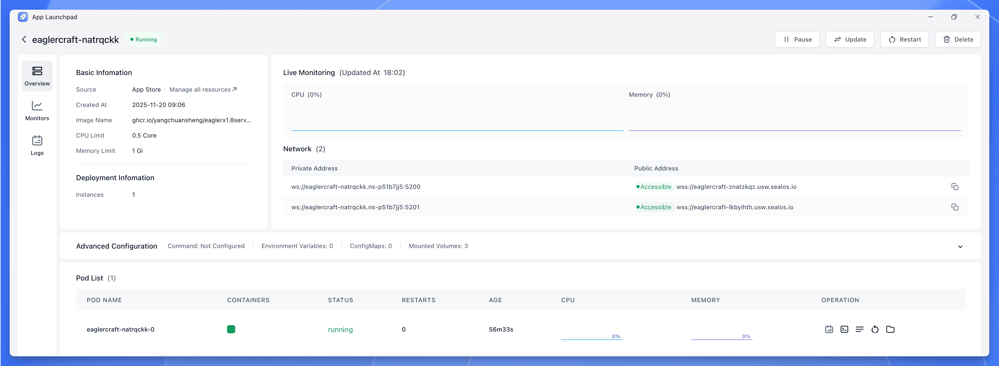
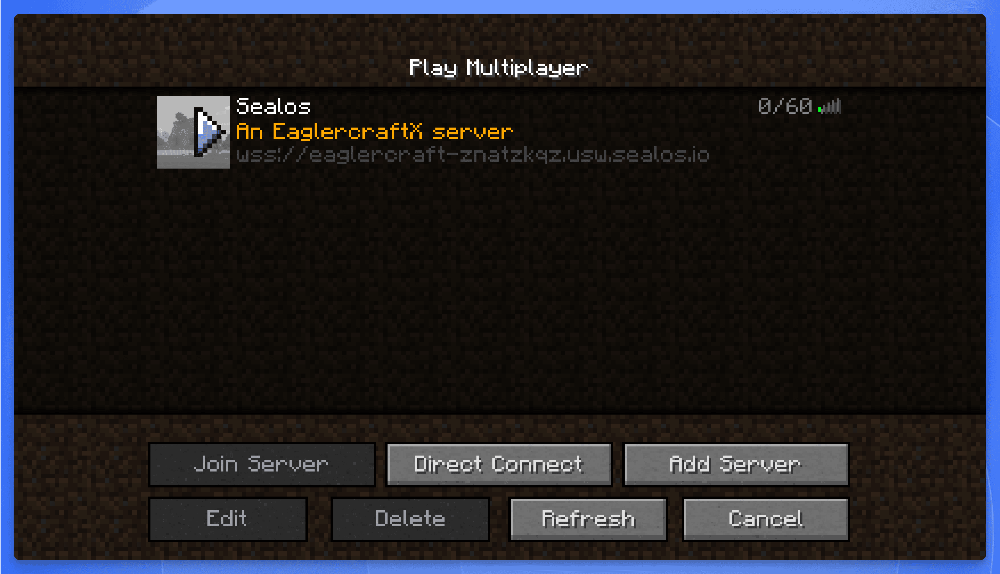

import { DeployButton } from '@/components/ui/button'

Let's be honest. Eaglercraft exists for one reason: to play Minecraft on a device that’s trying to stop you.

It’s a digital rebellion happening in school computer labs. It's the fix for a locked-down Chromebook.

But the real freedom isn't just *playing*—it's creating your *own* world, on your *own* server, with your *own* rules.

You can go the classic, hands-on Docker route—if you like getting your hands dirty—or use a one-click platform like Sealos to get it done in minutes. Here’s how to do both.

## What Exactly is Eaglercraft?

[Eaglercraft](https://eaglercraft.com/) is an open-source project that ports Minecraft 1.5.2 and 1.8.8 to run directly in a web browser. It's a clever and legally messy solution created by a group of developers led by "lax1dude".

It's not a Minecraft-inspired game; it is a direct port of the original Java code, translated into JavaScript (using [TeaVM](https://teavm.org/)) or, more recently, into WebAssembly (WASM). This new WASM version is key: it squeezes way more performance out of the weakest hardware, with some repos claiming "around 50% more FPS".

### The Real "Why": The Cat-and-Mouse Game

Eaglercraft's popularity isn't about being free. It’s about access.

It’s the main weapon in a "cat-and-mouse game" between students and school IT administrators.

1.  **Students** find a link to a client.
2.  **IT Admins** block that specific URL with filters like [GoGuardian](https://www.goguardian.com/) or Securly.
3.  Students just re-host the open-source client on a new, unblocked URL.
4.  Rinse, repeat. It's a "Hydra"; cut off one head, and two more pop up.

But here’s the real secret: Eaglercraft is often a Trojan horse. An IT admin consultant's report found something else: many clients have a hidden, built-in unfiltered web browser. The student isn't just bypassing the filter for a game; they’ve gained a tool to bypass the school's entire content filtering system.

Hosting your *own* server, then, is the whole point. The public Eaglercraft world is a mess of DMCA takedowns, unmoderated chat, and forks loaded with malware.

## The Eaglercraft Server Hosting Challenge

Here's the catch: an Eaglercraft server isn't one piece of software. It’s a fragile "man-in-the-middle" setup.

A client in a browser is stuck in a sandbox; it's forbidden from opening a direct TCP/IP socket to a game server. It can only speak web-standard protocols, primarily WebSockets (`wss://`).

But a standard Minecraft server (like [Spigot](https://www.spigotmc.org/)) *only* speaks the Minecraft TCP protocol. They are speaking different languages.

To make them talk, you need this translation bridge:

1.  The Bouncer (A Proxy like [BungeeCord](https://www.spigotmc.org/wiki/bungeecord/)): This is the front door. It’s the only thing the browser talks to, using `wss://`.
2.  The Translator (EaglerXServer): This is the magic plugin. It sits inside the proxy, grabs the WebSocket traffic, and translates it into the old-school Minecraft TCP protocol the game server expects.
3.  The Game (A Spigot Server): This is the actual game, running in `online-mode=false` (a "cracked" server) waiting for the proxy to hand it a translated player.

## Method 1: The Docker Way

This is the classic, hands-on method for folks who are comfortable with a command line and want full control. This assumes you have a server (like a [Linux VPS](https://www.digitalocean.com/products/droplets)) with [Docker](https://www.docker.com/) and `docker-compose` installed.

### Step 1: Create Necessary Directories

First, create directories on your server to store your world data. This way, even if you update or restart the server, your world is safe.

```bash
mkdir -p ~/eaglercraft-server/{world,world_nether,world_the_end}
cd ~/eaglercraft-server
```

### Step 2: Create `docker-compose.yml` File

Next, create the configuration file that tells Docker how to build your server.

```bash
nano docker-compose.yml
```

Paste the following content into the file. This configuration bundles the proxy, translator, and game server into a single image.

```yaml
version: '3.8'

services:
  eaglercraft:
    image: ghcr.io/yangchuansheng/eaglerx1.8server:1.12.1
    container_name: eaglercraft-server
    ports:
      - "5200:5200" # For adding to the server list
      - "5201:5201" # For direct, stable connections
    volumes:
      - ./world:/world              # Overworld data
      - ./world_nether:/world_nether    # Nether data
      - ./world_the_end:/world_the_end  # The End data
    restart: unless-stopped
```

### Step 3: Start the Server

Save the file and exit the editor. Now, tell Docker to start the server in the background (`-d`).

```bash
docker-compose up -d
```

### Step 4: Check Logs

You can check the server's console logs to make sure it started correctly.

```bash
docker-compose logs -f
```

### Step 5: Connect to Your Docker Server

Once deployed, you have two ways to connect:

  * Method A: Add to Server List (Port 5200)

    1.  Open your Eaglercraft client.
    2.  Go to "Multiplayer" -\> "Add Server".
    3.  Enter the server address: `ws://YOUR_SERVER_IP:5200`
    4.  (A quick heads-up: You only use `wss://`, the secure version, if you've manually set up an SSL reverse proxy like Nginx or Caddy. For this simple setup, stick to `ws://`.)

  * Method B: Direct Connection (Port 5201 - Recommended)

    1.  This port is often more stable for long play sessions.
    2.  Simply visit this URL in your browser: `http://YOUR_SERVER_IP:5201`

-----

## Method 2: The One-Click Way

If the Docker method looks like a headache, this is the one-click way. A platform like [Sealos](https://sealos.io) is built for exactly this kind of thing, letting you skip all the manual setup.

It uses the same container technology, but it handles all the complicated parts for you.

### Step 1: Visit template

The quickest way to get started with deploying eaglercraft server  to Sealos is using the **Deploy on Sealos** button:

<DeployButton deployUrl="https://sealos.io/products/app-store/eaglercraft-server" />

### Step 2: Deploy the App

Click "Deploy Now". You don't need to change any configuration.

### Step 3: Get Your Server URL

After 2-3 minutes, it's done. Sealos sorts out all the networking and gives you a single, public, secure `wss://` address. You'll find it on the application's details page.



That's it. You just copy that one `wss://` URL and paste it into the "Add Server" menu in your Eaglercraft client.



-----

## What About Public Eaglercraft Servers?

If you want to check out the public shadow scene before building your own, there are really only two servers that matter.

| Server Name | WSS Address | Description |
| :--- | :--- | :--- |
| ArchMC | `wss://mc.arch.lol` | The undisputed main and largest Eaglercraft server. It's called "the hypixel of eagler" and has Bedwars, Skywars, etc. |
| Zentic | `wss://zentic.cc` | The other major network, hyper-focused on competitive PvP (Player vs. Player) combat. |

## Your World, Your Rules

Playing on public servers means dealing with someone else's rules, lag, and the chaos of the "shadow" community.

Microsoft is trying to kill Eaglercraft with DMCA takedowns, but it’s a Hydra. The project is unkillable; it just splinters into decentralized, unverified forks. This decentralization flings the door wide open for malware, as many forks are "known to have viruses, malware, and an endless amount of advertisements".

It's not going away. The code is immortal, saved in archives, and every September, a new "customer base" gets their school-issued Chromebooks, and the demand is reborn.

By hosting your own, you stop being a player in someone else's cracked world and become the creator of your own.

You get a clean, stable, private server.

Your world. Your rules.

And this time, no one can block the URL.