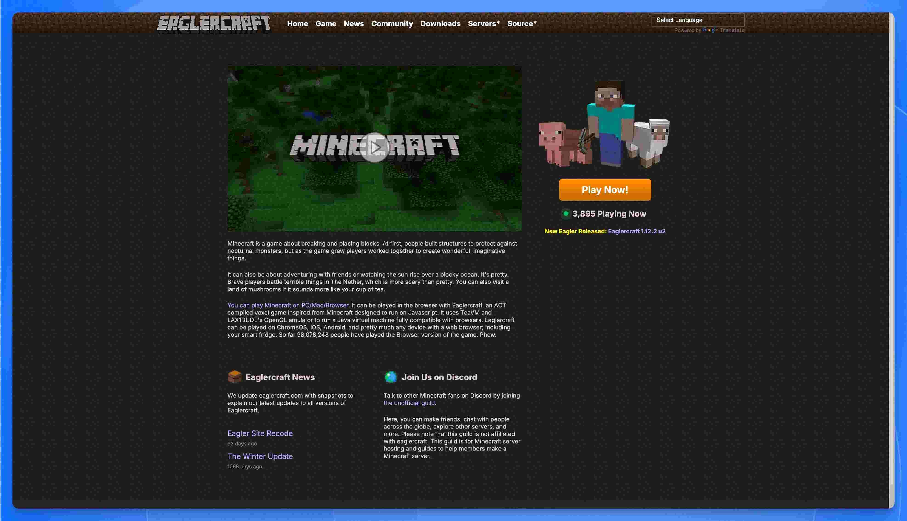

import { DeployButton } from '@/components/ui/button'

**Eaglercraft** is an open-source project that lets you play Minecraft Java Edition (versions 1.5.2, 1.8.8, and 1.12.2) directly in your web browser—no download, no installation, no paid account required. Built using [TeaVM](https://teavm.org/) to compile Java to JavaScript and WebAssembly, it runs on virtually any device with a modern browser, from school Chromebooks to smartphones.

Let's be honest: Eaglercraft exists for one reason—to play Minecraft on a device that's trying to stop you.

It's a digital rebellion happening in school computer labs and library PCs around the world. It's the solution for locked-down Chromebooks, restricted networks, and anyone who wants quick access to the Minecraft experience without the usual barriers.

But here's the real secret: **the true freedom isn't just playing—it's hosting your own server**.

Public Eaglercraft servers come with risks: DMCA takedowns, unmoderated chat, and some forks are known to contain malware. By creating your own private server, you get:

- ✅ **Full control** over who can join
- ✅ **A clean, stable environment** free from malicious code
- ✅ **Your own rules**—no one can block your URL
- ✅ **Persistence**—your world stays online as long as you want

This guide covers two methods to set up your own Eaglercraft server:

1. **The Docker Way** – Full control, hands-on setup for those comfortable with the command line
2. **The One-Click Way (Sealos)** – Automated deployment in minutes, no technical expertise required

Let's get started.

## What Exactly is Eaglercraft?



[Eaglercraft](https://eaglercraft.com/) is an open-source project that ports Minecraft Java Edition to run directly in a web browser. Created by a developer known as "LAX1Dude" in 2021, it allows players to experience full Minecraft gameplay on nearly any device with a modern browser—from school Chromebooks to smartphones, and even smart fridges (as the community jokes).

It's not a Minecraft-inspired clone; it is a **direct port of the original Java code**, translated into browser-compatible formats using sophisticated compilation techniques.

### How Eaglercraft Works Under the Hood

The magic behind Eaglercraft involves several key technologies:

**TeaVM Compilation**

Eaglercraft uses [TeaVM](https://teavm.org/) (Tea Virtual Machine) to perform ahead-of-time (AOT) compilation of Minecraft's Java bytecode into JavaScript. This allows the entire Minecraft game logic—originally written in Java—to execute within a browser's JavaScript engine. The result is a massive JavaScript file that essentially contains the complete game.

**WebAssembly (WASM) for Better Performance**

Recent versions of EaglercraftX offer an experimental **WASM-GC** (WebAssembly with Garbage Collection) build. This newer runtime can deliver:

- **~50% higher FPS** compared to the JavaScript version
- Improved game tick rates (TPS)
- Better performance on low-end hardware

However, WASM-GC requires modern browser support. Chrome users may need to enable origin trials, and Safari currently lacks support as of 2025.

**Custom WebGL Graphics Layer**

Since Minecraft relies on OpenGL for 3D rendering (which browsers can't run natively), LAX1Dude created a custom **OpenGL 1.3 emulator** that maps Minecraft's drawing routines to WebGL operations on an HTML5 `<canvas>`. This allows the game to render graphics with minimal changes to the original source code.

**Browser API Integration**

Eaglercraft provides implementations for keyboard, mouse, audio, and file access using web APIs:
- Keyboard/mouse input via JavaScript event listeners
- Audio through HTML5 Audio or WebAudio (including a bundled OGG Vorbis decoder for iOS Safari compatibility)
- World saves stored in browser storage (IndexedDB/LocalStorage)

### Browser Compatibility

Eaglercraft runs on surprisingly old browsers—tested on Chrome 38 (circa 2014) and even Windows XP machines. Requirements:

| Feature | Minimum Requirement |
|:---|:---|
| Basic gameplay | WebGL 1.0 capable browser |
| Dynamic lighting & shaders | WebGL 2.0 support |
| WASM performance mode | Browser with WASM-GC support |
| Touch controls | Auto-detected on mobile devices |

### The Real "Why": The Cat-and-Mouse Game

Eaglercraft's popularity isn't about being free. It's about **access**.

It's the main weapon in a "cat-and-mouse game" between students and school IT administrators:

1. **Students** find a link to a client
2. **IT Admins** block that specific URL with filters like [GoGuardian](https://www.goguardian.com/) or Securly
3. **Students** re-host the open-source client on a new, unblocked URL
4. Rinse, repeat—it's a "Hydra"; cut off one head, and two more pop up

But here's the real secret: Eaglercraft is often a Trojan horse. An IT admin consultant's report found that many clients have a hidden, built-in unfiltered web browser. Students aren't just bypassing the filter for a game—they've gained a tool to bypass the school's entire content filtering system.

### Why Host Your Own Server?

The public Eaglercraft world is chaotic:
- **DMCA takedowns** constantly remove popular sites
- **Unmoderated chat** with toxic behavior from younger players
- **Malware-laden forks** that can compromise your device
- **Unstable connections** to overloaded public servers

Hosting your own server means a clean, stable, private environment where you control everything.

## Eaglercraft Client Features: What Can You Actually Do?

Eaglercraft isn't just a stripped-down browser port. It's a surprisingly feature-rich client that, in some ways, offers more than vanilla Minecraft 1.8 ever did.

Here's what you get out of the box:

### Singleplayer Mode with World Saving

Unlike earlier versions that were multiplayer-only, **EaglercraftX 1.8** includes full singleplayer support. You can:

- Create new worlds directly in your browser
- Save worlds to your browser's local storage (IndexedDB)
- Export worlds as `.epk` files to back them up or share with friends
- Import existing worlds, including converting vanilla Minecraft saves

This means your builds persist between sessions—even on a school Chromebook. Just don't clear your browser data.

> **Pro tip:** Export your world regularly. Browser storage can be wiped by IT policies or cache cleaners.

### Built-in PBR Shaders

This is where Eaglercraft flexes. The client ships with a **Physically Based Rendering (PBR) shader system** inspired by GTA V's deferred rendering engine—written from scratch by LAX1Dude.

| Feature | Description |
|:--------|:------------|
| Dynamic Lighting | Torches and lava cast realistic, soft light |
| Reflections | Water, glass, and metal blocks reflect the environment |
| PBR Textures | Default textures show glossiness and metallic properties |
| Deferred Rendering | Modern rendering pipeline for better performance |

To enable shaders: **Options → Video Settings → Shaders → Select PBR Pack**

**Requirements:** WebGL 2.0 support. Works on most modern browsers, but skip this on older Chromebooks if you want playable framerates.

### Integrated Voice Chat

EaglercraftX has **built-in voice chat** using WebRTC—no Discord or third-party apps needed. It works in both Shared Worlds and on servers that support it.

How it works:
1. Join a server or open your world to friends
2. Voice chat activates automatically (if enabled)
3. Proximity-based audio in-game

**Privacy warning:** WebRTC can expose your IP address to other players. On public servers, consider this before enabling voice.

Server owners can disable voice chat by adding `allowVoiceClient: false` to their client configuration.

### Shared Worlds (Play with Friends Without a Server)

Don't want to set up a full server? **Shared Worlds** lets you invite friends to your singleplayer world using peer-to-peer connections.

Here's how it works:

1. Open your singleplayer world
2. Press `Esc` → "Open to Shared World"
3. Share the generated **join code** with friends
4. They enter the code in Multiplayer → "Join Shared World"

Behind the scenes, this uses WebRTC with relay servers to punch through NATs. It's essentially "Open to LAN" but works over the internet.

**Limitations:**
- Performance depends on the host's upload speed
- Best for 2-4 players
- Both players need matching relay server URLs configured

### Resource Pack Support

You can import any **Minecraft 1.8-compatible resource pack** directly into Eaglercraft:

1. Go to **Options → Resource Packs**
2. Click "Open Pack Folder" or drag-and-drop a `.zip` file
3. The pack is stored in your browser and persists between sessions

**Missing the music?** Minecraft's soundtrack isn't included by default (file size + copyright). Download a C418 music resource pack and import it for the full nostalgic experience.

### WebAssembly Mode for 50% Better Performance

If your browser supports **WebAssembly with Garbage Collection (WASM-GC)**, Eaglercraft can run significantly faster:

| Runtime | Performance | Browser Support |
|:--------|:------------|:----------------|
| JavaScript | Baseline | All browsers (Chrome 38+, even Windows XP) |
| WASM-GC | ~50% more FPS | Chrome 119+, Firefox 120+, Edge 119+ |

To check: Look for "WASM-GC" in the Eaglercraft loading screen or F3 debug menu.

**Note:** Safari doesn't support WASM-GC as of 2025. Stick to Chrome or Firefox for best performance.

### What About Mods and Hacked Clients?

Because Eaglercraft is open-source, the community has created numerous **modified clients**:

| Client | Focus | Notable Features |
|:-------|:------|:-----------------|
| **Resent Client** | PvP | Keystrokes, FPS boost, click GUI, toggle mods |
| **Astra Client** | Aesthetics | Enhanced shaders, cleaner UI |
| **CyanogenMC** | Quality of Life | Polished experience, bug fixes |
| **Shadow/Pixel** | Performance | Optimized for low-end devices |

**Warning:** Some unofficial clients floating around contain malware or hidden browser exploits. Only download from trusted sources like the official Eaglercraft site or verified GitHub repositories.

### Browser Compatibility at a Glance

Eaglercraft is designed to run on almost anything:

- ✅ Chrome 38+ (2014 and newer)
- ✅ Firefox, Edge, Opera (modern versions)
- ✅ Chromebooks (the primary use case)
- ✅ Touch devices (auto-detects and shows touch controls)
- ✅ Windows XP (yes, really)
- ⚠️ Safari (works, but no WASM-GC, no OGG audio without polyfill)
- ❌ Internet Explorer (WebGL not supported)

The only hard requirement is **WebGL support**. For advanced features like dynamic lighting, you need WebGL 2.0.

## The Eaglercraft Server Hosting Challenge

Here's the catch: an Eaglercraft server isn't one piece of software. It's a **fragile "man-in-the-middle" setup** that bridges two incompatible worlds.

### The Core Problem: Protocol Mismatch

A browser client lives in a **security sandbox**. It's forbidden from opening direct TCP/IP socket connections to game servers. It can only speak web-standard protocols—primarily **WebSockets** (`ws://` or secure `wss://`).

But a standard Minecraft server (like [Spigot](https://www.spigotmc.org/) or [Paper](https://papermc.io/)) *only* speaks the **Minecraft TCP protocol** on port 25565.

They're speaking different languages. To make them communicate, you need a translation bridge.

### The Three-Part Architecture

Every Eaglercraft multiplayer setup requires these three components working together:

```
┌─────────────────┐     WebSocket      ┌─────────────────┐     Minecraft TCP    ┌─────────────────┐
│   Browser       │ ──────────────────▶│   Proxy +       │ ───────────────────▶│   Game Server   │
│   (Eaglercraft) │     (wss://)       │   Translator    │     (Internal)       │   (Spigot)      │
└─────────────────┘                    └─────────────────┘                      └─────────────────┘
```

**1. The Bouncer (Proxy Server)**

This is the front door—the only thing the browser talks to. Common options include:
- [BungeeCord](https://www.spigotmc.org/wiki/bungeecord/) - The traditional choice
- [Velocity](https://velocitypowered.com/) - Modern, higher performance alternative

The proxy listens on a web port (typically 80, 443, or a custom port) and accepts WebSocket connections from browsers.

**2. The Translator (EaglercraftXServer Plugin)**

This is the magic layer. The **EaglercraftXServer** plugin sits inside the proxy and performs real-time protocol translation:

- **Incoming**: Unwraps WebSocket frames → extracts Minecraft packets → forwards to game server
- **Outgoing**: Receives Minecraft packets → wraps in WebSocket frames → sends to browser

The plugin also handles Eaglercraft-specific features:
- **Authentication**: Since Eaglercraft clients can't use Mojang login, the plugin manages alternate auth systems (optional password registration, session cookies, etc.)
- **Skins & Capes**: Offline clients can't use Mojang's skin API, so the plugin serves community-provided skins
- **Compression**: Optional zlib compression on WebSocket streams to reduce bandwidth (critical for school WiFi)
- **Rate Limiting**: Configurable timeouts and connection limits to prevent abuse

**3. The Game Server (Spigot/Paper)**

The actual Minecraft server running your world. Critical requirement:

> ⚠️ **Must run in `online-mode=false`** (offline/cracked mode)

This is necessary because Eaglercraft clients cannot perform official Mojang authentication. The proxy handles any authentication you want to implement, then forwards "pre-authenticated" players to the game server.

### The EaglercraftXServer Plugin

Originally, there were separate plugins for BungeeCord (EaglerXBungee) and Velocity (EaglerXVelocity). In 2025, these were unified into **EaglercraftXServer**—a single plugin that works with:

- BungeeCord
- Velocity
- Direct Spigot/Paper installation (no proxy needed for simple setups)

The unified plugin supports all Eaglercraft versions (1.5.2, 1.8.8, 1.12.2) simultaneously, meaning players on different client versions could potentially connect to the same network (with appropriate backend servers).

**Key Configuration Options:**

| Setting | Purpose |
|:---|:---|
| `websocket_compression` | Enable zlib compression (recommended for WiFi) |
| `connection_timeout` | How long to wait for handshake completion |
| `max_connections` | Limit concurrent WebSocket connections |
| `allow_voice_client` | Enable/disable built-in voice chat |
| `skin_service` | Configure custom skin server URL |

### Shared Worlds: The Serverless Alternative

Don't want to set up all this infrastructure? EaglercraftX 1.8 includes **Shared Worlds**—a peer-to-peer multiplayer system:

1. Start a singleplayer world
2. Open the pause menu and select "Shared World"
3. Share the generated join code with friends
4. Friends enter the code in their multiplayer menu

Behind the scenes, this uses **WebRTC** to establish direct browser-to-browser connections, with community relay servers helping browsers find each other. No dedicated server, no proxy, no configuration—perfect for casual play with friends.

**Limitations:**
- Performance depends on host's device and upload speed
- Works best with small groups (2-5 players)
- Voice chat may expose IP addresses to participants
- All players must have matching relay URLs configured

## Method 1: The Docker Way (Full Control)

This is the classic, hands-on method for folks who are comfortable with a command line and want full control over their Eaglercraft server configuration. This approach is ideal if you:

- Want to customize every aspect of your server
- Already have a Linux VPS or dedicated server
- Need to run multiple game servers on the same machine
- Want to learn how Eaglercraft's architecture actually works

**Prerequisites:** A server (like a [Linux VPS](https://www.digitalocean.com/products/droplets) or home server) with [Docker](https://www.docker.com/) and `docker-compose` installed. Most cloud providers (DigitalOcean, Vultr, Linode) offer $5-10/month VPS options that work perfectly for small Eaglercraft servers.

### Step 1: Create Necessary Directories

First, create directories on your server to store your world data. This way, even if you update or restart the server, your world is safe.

```bash
mkdir -p ~/eaglercraft-server/{world,world_nether,world_the_end}
cd ~/eaglercraft-server
```

### Step 2: Create `docker-compose.yml` File

Next, create the configuration file that tells Docker how to build your server.

```bash
nano docker-compose.yml
```

Paste the following content into the file. This configuration bundles the proxy, translator, and game server into a single image.

```yaml
version: '3.8'

services:
  eaglercraft:
    image: ghcr.io/yangchuansheng/eaglerx1.8server:1.12.1
    container_name: eaglercraft-server
    ports:
      - "5200:5200" # For adding to the server list
      - "5201:5201" # For direct, stable connections
    volumes:
      - ./world:/world              # Overworld data
      - ./world_nether:/world_nether    # Nether data
      - ./world_the_end:/world_the_end  # The End data
    restart: unless-stopped
```

### Step 3: Start the Server

Save the file and exit the editor. Now, tell Docker to start the server in the background (`-d`).

```bash
docker-compose up -d
```

### Step 4: Check Logs

You can check the server's console logs to make sure it started correctly.

```bash
docker-compose logs -f
```

### Step 5: Connect to Your Docker Server

Once deployed, you have two ways to connect:

  * Method A: Add to Server List (Port 5200)

    1.  Open your Eaglercraft client.
    2.  Go to "Multiplayer" -\> "Add Server".
    3.  Enter the server address: `ws://YOUR_SERVER_IP:5200`
    4.  (A quick heads-up: You only use `wss://`, the secure version, if you've manually set up an SSL reverse proxy like Nginx or Caddy. For this simple setup, stick to `ws://`.)

  * Method B: Direct Connection (Port 5201 - Recommended)

    1.  This port is often more stable for long play sessions.
    2.  Simply visit this URL in your browser: `http://YOUR_SERVER_IP:5201`

> **Note on `ws://` vs `wss://`:** Use `ws://` (unsecured WebSocket) for this basic setup. To use `wss://` (secured), you'll need to configure an SSL reverse proxy with Nginx or Caddy—covered in the advanced section below.

### Advanced: Setting Up Secure WSS with SSL

For public servers, especially those shared via links, using `wss://` (WebSocket Secure) is recommended. Here's how to set it up with Nginx:

**1. Install Nginx and Certbot:**
```bash
sudo apt update
sudo apt install nginx certbot python3-certbot-nginx
```

**2. Create Nginx configuration** (`/etc/nginx/sites-available/eaglercraft`):
```nginx
server {
    listen 443 ssl;
    server_name your-domain.com;

    ssl_certificate /etc/letsencrypt/live/your-domain.com/fullchain.pem;
    ssl_certificate_key /etc/letsencrypt/live/your-domain.com/privkey.pem;

    location / {
        proxy_pass http://127.0.0.1:5200;
        proxy_http_version 1.1;
        proxy_set_header Upgrade $http_upgrade;
        proxy_set_header Connection "upgrade";
        proxy_set_header Host $host;
        proxy_read_timeout 86400;
    }
}
```

**3. Enable and get SSL certificate:**
```bash
sudo ln -s /etc/nginx/sites-available/eaglercraft /etc/nginx/sites-enabled/
sudo certbot --nginx -d your-domain.com
sudo systemctl restart nginx
```

Now players can connect via `wss://your-domain.com`.

## Method 2: The One-Click Way

If the Docker method feels like too much work, this is the zero-configuration alternative. [Sealos](/) is a cloud platform built specifically for containerized applications—it handles all the complex infrastructure so you can focus on playing.

### Why Choose Sealos Over Manual Docker?

| Feature | Docker (Self-Hosted) | Sealos (One-Click) |
|:---|:---|:---|
| **Setup Time** | 30-60 minutes | Under 5 minutes |
| **Technical Knowledge** | Linux, Docker, networking | None required |
| **SSL/WSS** | Manual Nginx/Certbot setup | Automatic HTTPS |
| **Server Management** | SSH + command line | Web dashboard |
| **Scaling** | Manual configuration | One-click upgrade |
| **Cost** | VPS ($5-20/month) + your time | Pay-as-you-go (similar pricing) |
| **Maintenance** | You handle updates/security | Platform managed |
| **Best For** | Learning, full customization | Quick setup, reliability |

Sealos uses the same container technology under the hood—it's not a different server; it's the same Docker image with all the hard parts automated.

### Step 1: Deploy from Template

The fastest way to get started is using the pre-configured Eaglercraft template:

<DeployButton deployUrl="https://sealos.io/products/app-store/eaglercraft-server" />

Click the button above.

### Step 2: Configure and Deploy

Click "Deploy Now". You don't need to change any configuration.

### Step 3: Get Your Server URL

After 0~1 minutes, your server is live. Sealos automatically:

- Provisions the container
- Configures networking
- Sets up SSL certificates
- Generates a public `wss://` address

Find your server URL on the application details page:


### Step 4: Connect and Play

Copy the `wss://` URL and add it to your Eaglercraft client:

1. Open Eaglercraft in your browser
2. Click **Multiplayer** → **Add Server**
3. Paste your `wss://xxxxx.sealos.io` address
4. Click **Done**, then join your server


That's it—you now have a private Eaglercraft server with automatic SSL, no port forwarding, and no command-line required.

### When to Choose Docker Instead

While Sealos is easier, the Docker method makes more sense if you:

- Already pay for a VPS for other projects.
- Need custom plugins beyond the default setup.
- Want to run multiple servers (survival, creative, minigames).
- Are learning server administration as a skill.

## What About Public Eaglercraft Servers?

Before investing time in your own server, you might want to explore the existing Eaglercraft multiplayer scene. The community has built a thriving network of public servers offering various game modes.

### Top Eaglercraft Servers in 2025

| Server | Address | Game Modes | Description |
|:---|:---|:---|:---|
| **ArchMC** | `wss://mc.arch.lol` | BedWars, SkyWars, Survival | The largest Eaglercraft network; often called "the Hypixel of Eagler" |
| **Zentic** | `wss://zentic.cc` | KitPvP, Practice, Duels | Competitive PvP focus with ranked matches |
| **AdderallMC** | `wss://play.adderallmc.net` | Survival, Minigames | Popular all-around server; also supports Bedrock Edition |
| **VanillaCraft SMP** | `wss://play.vanillacraftsmp.org` | Pure Survival | No plugins, classic Minecraft experience |
| **Aeon Network** | Check Discord | Multiple modes | Growing community with active development |

> **Finding More Servers:** Visit [servers.eaglercraft.com](https://servers.eaglercraft.com) for a community-maintained server list with player counts and voting.

### Choosing the Right Server Type

**PvP & Competitive:**
- Practice servers (Zentic, ArchMC) let you train combat skills
- 1.8.8 combat mechanics (no attack cooldown) are standard
- Expect players using optimized clients (Resent, Astra) for competitive edge

**Survival & Building:**
- Look for servers with land protection plugins (GriefPrevention, Towny)
- VanillaCraft-style servers offer the purest experience
- SMP (Survival Multiplayer) servers often have active communities

**Minigames:**
- BedWars, SkyWars, and similar modes work well on Eaglercraft
- Queue times vary; larger servers fill games faster
- Some servers offer unique Eagler-only game modes

### The Case for Running Your Own Server

Public servers are great for quick fun, but they come with trade-offs:

| Public Servers | Your Own Server |
|:---|:---|
| ❌ Someone else's rules | ✅ Your rules |
| ❌ Can't install custom plugins | ✅ Full plugin control |
| ❌ May shut down without notice | ✅ Runs as long as you want |
| ❌ Possible lag from overcrowding | ✅ Dedicated resources |
| ❌ Risk of toxic players | ✅ Whitelist your friends |
| ❌ No world backup access | ✅ Full data ownership |
| ❌ DMCA/takedown risk | ✅ Private URL, harder to find |

### Safety Considerations for Public Servers

The Eaglercraft ecosystem exists in a legal gray area, which attracts both passionate fans and bad actors:

**Risks to be aware of:**
- **Malware-laden clients:** Some third-party Eaglercraft sites bundle malware. Stick to known sources like [eaglercraft.com](https://eaglercraft.com)
- **Unmoderated chat:** Younger player base means inconsistent moderation on some servers
- **IP exposure via voice chat:** Eaglercraft's WebRTC voice feature can reveal your IP address to other players
- **Impersonation:** Without Mojang authentication, anyone can use any username

**Best practices:**
- Use servers with active moderation and Discord communities
- Disable voice chat on untrusted servers (`allowVoiceClient: false` in client config)
- Don't share personal information in public chat
- Consider a VPN if privacy is a concern

### The Hydra Problem

Here's the reality: Microsoft actively issues DMCA takedowns against Eaglercraft infrastructure. Public servers and client hosts disappear regularly.

But Eaglercraft is decentralized—it's open source, archived everywhere, and every September brings a new wave of students discovering it on their school Chromebooks. Cut off one head, two more appear.

This is exactly why hosting your own server matters. Public links get blocked. School IT adds filters. Servers get DMCA'd.

**Your private server, with your private URL, stays under the radar.**

No one can block what they don't know exists.

## Is Eaglercraft Legal? Understanding the Risks

Before you dive in, you need to understand what you're getting into. Eaglercraft exists in a legal gray area, and there are real risks to consider.

### The Legal Reality

Let's be direct: **Mojang (Microsoft) considers Eaglercraft copyright infringement.**

In 2023, Microsoft launched a widespread crackdown, issuing DMCA takedown notices that removed thousands of Eaglercraft repositories from GitHub, GitLab, and even Replit. Their official position is clear:

> "EaglerCraft allows the connection to Minecraft: Java Edition servers without requiring users to have an authenticated Minecraft account... The development and distribution of this product infringes Mojang's intellectual property rights."

The original developer, LAX1Dude, eventually removed the code from his sites after this pressure. However, because the project is open-source, it has survived through community mirrors and decentralized hosting—a digital Hydra that keeps regenerating.

**What this means for you:**
- **Playing Eaglercraft:** Extremely unlikely to result in any legal action against you personally. Microsoft targets distributors, not players.
- **Hosting a public server:** Higher risk. Your server could receive a takedown notice, especially if it becomes popular.
- **Hosting a private server for friends:** Minimal risk. You're essentially invisible to enforcement.

### Security Risks: The Malware Problem

Here's the more immediate danger: **not all Eaglercraft clients are safe.**

After Microsoft's crackdowns removed official sources, the vacuum was filled by countless re-uploads and forks. Many of these are trustworthy. Many are not.

Some malicious forks have been found to contain:
- **Cryptocurrency miners** running in the background
- **Keyloggers** capturing everything you type
- **Hidden browsers** that bypass school content filters entirely
- **Excessive advertisements** and tracking scripts

An IT security consultant investigating Eaglercraft in schools discovered that some clients had a secret, built-in unfiltered web browser—turning a "harmless game" into a tool for bypassing all network restrictions.

### How to Stay Safe

If you're going to use Eaglercraft, follow these guidelines:

| Do | Don't |
|:---|:---|
| Download only from [eaglercraft.com](https://eaglercraft.com) or verified sources | Click random "Eaglercraft unblocked" links from search results |
| Host your own server with known, clean images | Join servers from untrusted sources |
| Use a separate browser profile or incognito mode | Enter any personal information or passwords |
| Keep your browser and system updated | Ignore security warnings from your browser |

### The Ethical Perspective

Is using Eaglercraft "wrong"? That depends on your viewpoint:

**The case against:** Minecraft is a paid product. Using Eaglercraft means playing without paying, which arguably deprives developers of revenue.

**The case for:** Many Eaglercraft users are students who can't purchase games, or people who already own Minecraft but need browser access. The [official Eaglercraft site](https://eaglercraft.com/p/legal/#dmca) explicitly states: *"If you enjoy Minecraft, you should buy the game."*

**The practical reality:** Eaglercraft likely doesn't significantly impact Minecraft's $200+ million in sales. Many users are not "lost sales"—they're people who would never have purchased anyway, or who eventually do buy the official game.

We're not here to tell you what to think. We're here to make sure you understand the landscape before you make your choice.

## Your World, Your Rules

Playing on public servers means dealing with someone else's rules, lag, and the chaos of the "shadow" community.

Microsoft is trying to kill Eaglercraft with DMCA takedowns, but it’s a Hydra. The project is unkillable; it just splinters into decentralized, unverified forks. This decentralization flings the door wide open for malware, as many forks are "known to have viruses, malware, and an endless amount of advertisements".

It's not going away. The code is immortal, saved in archives, and every September, a new "customer base" gets their school-issued Chromebooks, and the demand is reborn.

By hosting your own, you stop being a player in someone else's cracked world and become the creator of your own.

You get a clean, stable, private server.

Your world. Your rules.

And this time, no one can block the URL.