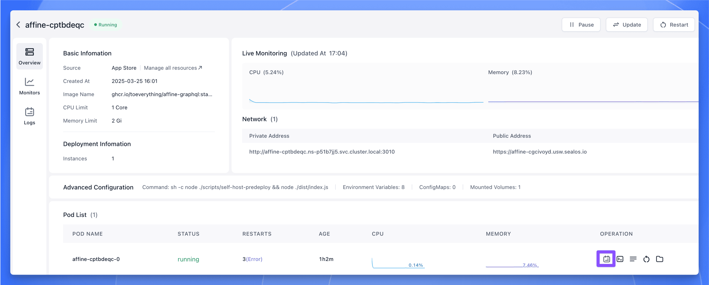
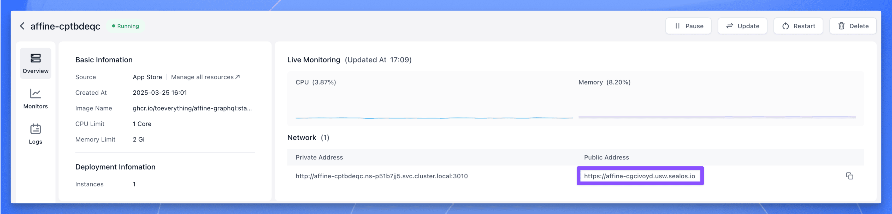
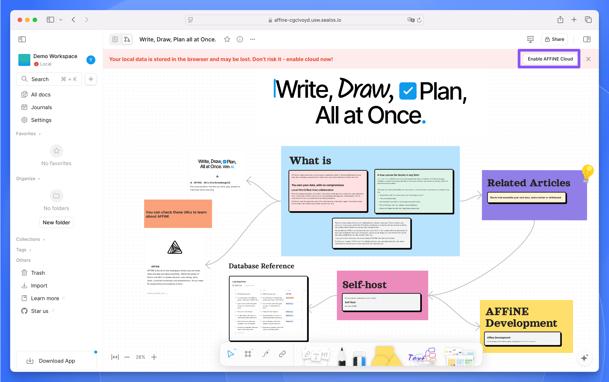
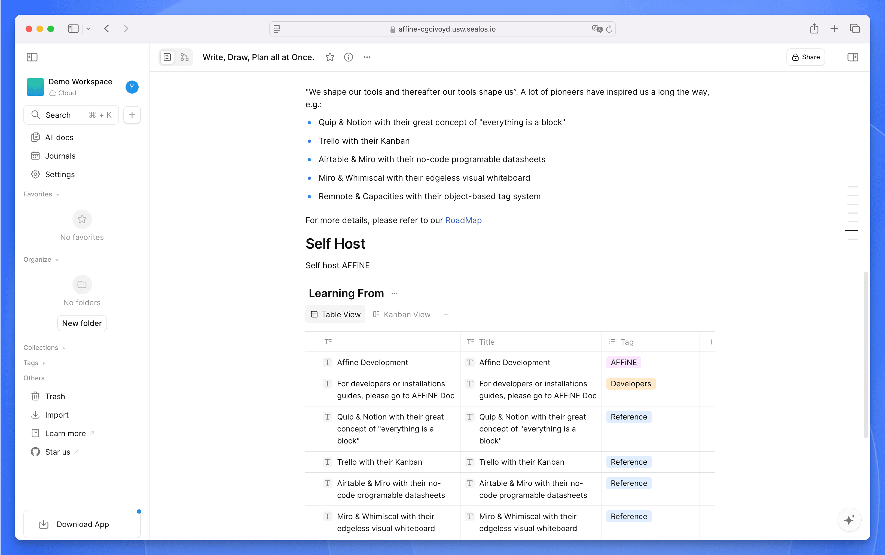
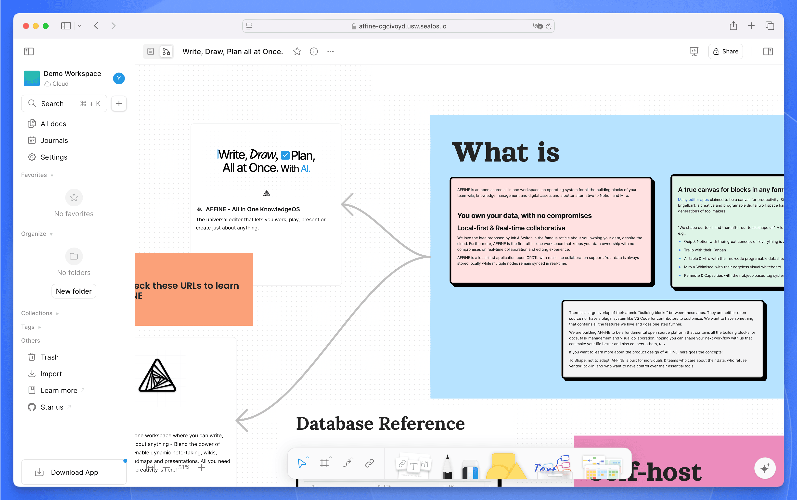
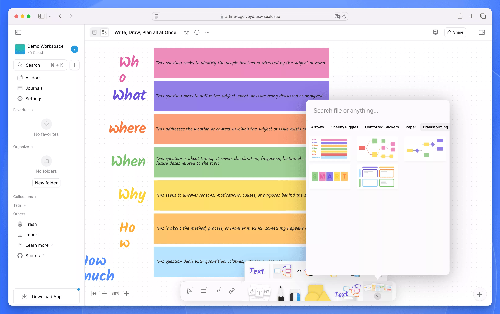

import { DeployButton } from '@/components/ui/button'

## What is AFFINE? The Complete Open-Source Knowledge Management System

[AFFiNE](https://github.com/toeverything/AFFiNE) is a powerful open-source alternative to Notion and Miro that prioritizes privacy and security by saving your notes locally. If you're looking for a knowledge management tool that combines document editing with whiteboard functionality while maintaining complete control over your data, AFFINE offers the perfect solution.

Built with Rust and TypeScript, AFFINE provides developers with maximum creative freedom while requiring minimal setup - just a single command runs the entire project. This comprehensive guide will walk you through deploying your own private AFFINE instance using Sealos, ensuring you maintain data privacy while enjoying all premium features completely free.

Unlike Miro and Notion which focus specifically on whiteboards and pages, AFFINE positions itself as an integrated KnowledgeOS. It uses kanban boards, tables, and rich text paragraphs as building blocks to create pages or whiteboards where you can perform document editing, data processing, or brainstorming in one unified environment.

*Figure 1: AFFINE main interface showing document editing and knowledge management capabilities*

## Core Features of AFFINE Compared to Notion and Miro

### Document and Whiteboard Integration

While many editing applications claim to be productivity canvases, AFFINE stands out as one of the few that truly allows you to place any building block on an infinite canvas - from rich text and sticky notes to embedded webpages, multi-view databases, linked pages, and even slides.

Every page offers two distinct views, enabling you to access and edit fully-featured blocks anywhere in any format. This integration provides flexibility that neither Notion nor Miro can match on their own.

*Figure 2: AFFINE's infinite canvas feature, enabling free organization and arrangement of content similar to Miro but with Notion's document capabilities*

### Multimodal AI Assistant

From drafting professional work reports to transforming outlines into expressive presentations, summarizing articles into well-structured mind maps, or even designing and coding prototype applications and websites with just a single prompt - AFFINE AI can do it all.

The AI assistant integrates seamlessly with both document and whiteboard modes, providing contextual help without requiring expensive add-on subscriptions like those offered by competing platforms.

### Local-First and Real-Time Collaboration

AFFINE adheres to the [local-first software principles](https://www.inkandswitch.com/local-first/), emphasizing data privacy while still enabling powerful collaboration features. You can completely opt out of using its cloud services and handle synchronization yourself, giving users more choices and flexibility compared to cloud-only solutions like Notion.

### Self-Hosting Capabilities

Users can freely fork and build custom versions of AFFINE or deploy it privately using the methods described in this guide. A plugin ecosystem and third-party modules are coming soon, providing extensibility that closed-source alternatives cannot match.

## Why Choose AFFINE Over Notion and Miro

Among the many knowledge management tools available, AFFINE offers these distinctive advantages:

1. **Open Source and Free**
   - Fully open source with transparent codebase
   - No subscription fees required (unlike Notion's $8-15/month plans)
   - Freedom to customize and extend functionality

2. **Enhanced Data Security**
   - Local-first storage approach protects sensitive information
   - Support for self-hosting on your own infrastructure
   - Complete control over where your data is stored and how it's backed up

3. **Comprehensive Integrated Features**
   - Incorporates Notion's document management capabilities
   - Integrates Miro's whiteboard functionality in the same interface
   - Supports multi-user real-time collaboration without compromises

4. **Consistent Cross-Platform Experience**
   - Works seamlessly across desktop and mobile devices
   - Maintains feature parity across all platforms
   - Ensures your content looks and behaves the same everywhere

## AFFINE vs Notion vs Miro Feature Comparison

| Features | AFFINE | Notion | Miro |
|---------|--------|---------|------|
| Document Editing | ✅ | ✅ | ❌ |
| Whiteboard Functionality | ✅ | ❌ | ✅ |
| Local-First | ✅ | ❌ | ❌ |
| Self-Hosting | ✅ | ❌ | ❌ |
| Real-Time Collaboration | ✅ | ✅ | ✅ |
| AI Assistant | ✅ | ✅ | ✅ |
| Price | Free and Open Source | Paid Subscription | Paid Subscription |
| Data Privacy Control | High | Limited | Limited |
| Customization Options | Extensive | Limited | Limited |
| Mobile Support | ✅ | ✅ | ✅ |

## Step-by-Step AFFINE Deployment Guide with Sealos

### Technical Requirements for Self-Hosting AFFINE

AFFINE's self-hosted deployment requires the following components:
- PostgreSQL database
- Redis database
- Docker environment (optional)

However, the [one-click deployment process](https://template.os.sealos.io) with Sealos handles all these requirements automatically, making self-hosting accessible even for non-technical users.

### One-Click Deployment Process

The [Sealos App Store](https://template.os.sealos.io) offers a seamless deployment solution, allowing you to complete the entire setup with just a mouse click.

1. Visit the deployment link:

   <DeployButton deployUrl="https://template.os.sealos.io/deploy?templateName=affine" />

2. Click "Go to Sealos Deployment" to begin deployment

   > If you're a first-time [Sealos](https://sealos.io) user, you'll need to register and log in to a Sealos public cloud account. After logging in, you'll be automatically redirected to the template deployment page.

Once redirected, click "Deploy Application" in the top-right corner to start the deployment process. When deployment completes, simply click "Details" to access the application's details page.

*Figure 3: AFFINE deployment configuration page on the Sealos platform showing simplified setup options*

### Post-Deployment Configuration

Wait until the instance status shows "running," then click the log icon to view logs:

*Figure 4: Log viewing interface during the AFFINE deployment process, helpful for troubleshooting*

If you see the following logs, it indicates a successful startup:

*Figure 5: Log information showing successful AFFINE startup with all services properly initialized*

Now click the public network address to open the AFFINE Web UI:

*Figure 6: AFFINE instance details page showing connection information for your private deployment*

After opening the interface, register and log in first, then return to the homepage.

By default, AFFINE uses local browser storage. If you want to log in to your self-deployed cloud service, click "Enable AFFINE Cloud" in the top-right corner:

*Figure 7: AFFINE cloud service enabling page for configuring synchronized storage*

Once enabled, you can start using AFFINE right away with all features fully activated.

## Complete AFFINE Usage Tutorial

AFFINE is very intuitive and easy to use. After completing deployment and logging in, you can:

1. **Create a workspace**: Click on the workspace in the top-left corner, then click the "+ Create Cloud Workspace" button to create a new workspace. You can customize the workspace with a name and icon.

2. **Create a new document**: Within your workspace, click the "+" button in the left sidebar to create a new document page.

3. **Edit content**: AFFINE offers a WYSIWYG (What You See Is What You Get) editing experience where you can:
   - Use Markdown syntax for quick formatting
   - Insert images, tables, code blocks, and other multimedia content
   - Access additional functions through the `/` command
   - Drag and rearrange content layout

4. **Collaboration and sharing**:
   - Click the share button in the top-right corner to invite others to collaborate
   - Configure page access permissions
   - Monitor other users' editing activities in real-time

5. **Data Synchronization**: Once cloud services are enabled, all your content automatically syncs to the cloud, allowing you to work seamlessly across different devices.

AFFINE also offers comprehensive keyboard shortcuts to boost your productivity. Press `Ctrl+/` or `Cmd+/` to view all available shortcuts.

### Document Mode Features and Commands

Document mode is AFFINE's basic editing mode, focusing on single-document creation. This mode features powerful editing capabilities that satisfy most document creation requirements.

*Figure 8: AFFINE Document Mode showing Notion-like document editing features with clean interface*

Using the `/` command menu, you can quickly access various functions including: text editing, formatting options, list management, document operations, content and media insertion, date and time selection, database creation, template framework application, group management, and additional shortcuts. These features enable more efficient organization and editing of your document content.

*Figure 9: AFFINE Document Mode Command Menu showing the variety of blocks and functions available*

### Whiteboard Mode Capabilities

When you switch to whiteboard view, content from the text view automatically converts into standalone text modules embedded within the whiteboard, making flexible layout and organization easier.

Whiteboard mode offers an infinite canvas where you can edit text, draw by hand, upload images, apply templates, draw lines, and use the eraser, among other operations.

*Figure 10: AFFINE Whiteboard Mode demonstrating the Miro-like infinite canvas functionality*

AFFINE includes a diverse template library featuring mind maps, task planning, project management, market analysis charts, and many other types. You can quickly start working by importing these templates with just one click.

*Figure 11: AFFINE Whiteboard Mode Template library offering productivity-boosting pre-designed layouts*

## Summary

AFFINE is a powerful yet user-friendly knowledge management tool that integrates document editing and whiteboard capabilities, offering users a flexible space for creation. Through its intuitive interface, users can easily create and manage workspaces, edit documents, and collaborate with team members.

Whether for personal knowledge management or team collaboration, AFFINE excellently meets all needs. The cloud synchronization feature ensures data security and accessibility, allowing users to work anytime and anywhere. With the self-hosting option detailed in this guide, you can maintain complete control over your data while enjoying all premium features at no cost.

Overall, AFFINE represents the future of knowledge management tools - open-source, privacy-focused, and feature-rich without the subscription fees of commercial alternatives like Notion and Miro. 