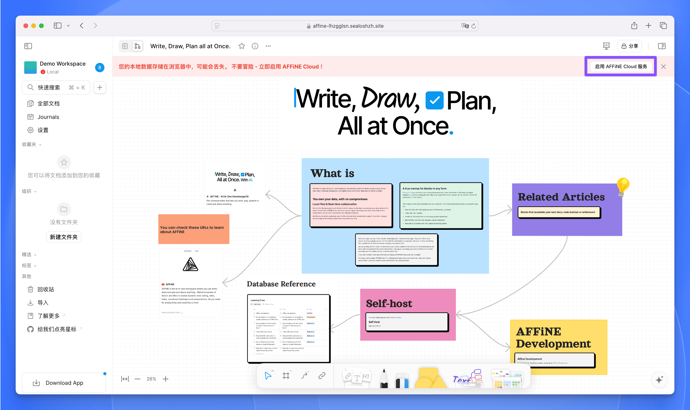
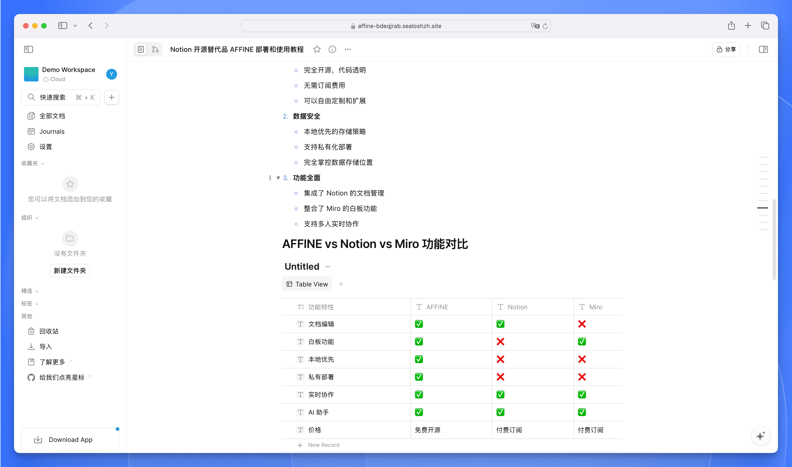
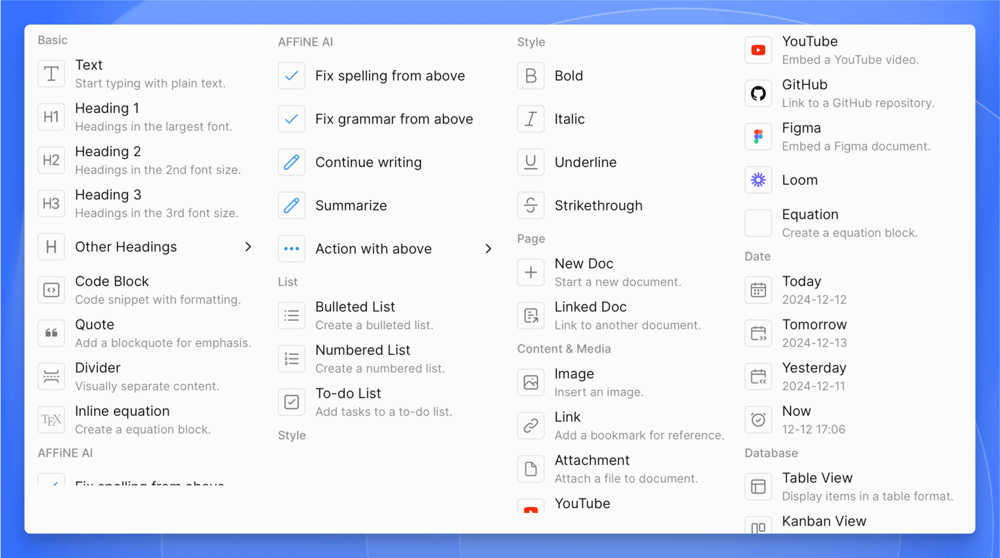
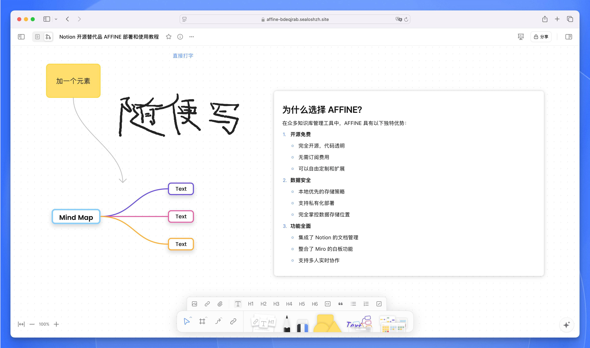

import { DeployButton } from '@/components/ui/button'

[AFFiNE](https://github.com/toeverything/AFFiNE) 是一款完全开源的 Notion + Miro 替代品，与 Notion 相比，AFFiNE 更注重隐私安全，优先将笔记内容保存到本地。

AFFiNE 使用 Rust 和 Typescript 构建，只需要一个命令即可运行整个项目，AFFiNE 以最简单的方式给了所有开发者最大的想象力。

与专注于白板和页面的 Miro 和 Notion 不同，AFFiNE 将其定位定义为一体化的 KnowledgeOS。它支持看板、表格和富文本段落作为构建块来形成页面或白板，可以在这里进行文档编辑、数据处理或头脑风暴等综合处理。

*图 1：AFFINE 主界面*

## 核心特性

### 文档与白板融合

许多编辑应用声称自己是提高生产力的画布，但 AFFiNE 是为数不多的几款可以让你在无边界画布上放置任何构建块的应用之一 -- 富文本、便签、任何嵌入的网页、多视图数据库、链接页面甚至幻灯片。

每个页面都有 2 个视图，你可以在任何地方以任何形式访问和编辑功能齐全的块。

*图 2：AFFINE 的无边界白板功能，可以自由组织和编排内容*

### 多模态 AI 助手

无论是撰写专业的工作报告，还是将大纲转化为富有表现力的幻灯片，亦或是将文章总结为结构良好的思维导图，又或者……只需一个提示，即可直接绘制和编写原型应用和网页，AFFiNE AI 都可以做到。

### 本地优先与实时协作

AFFiNE 遵从本地优先的理念，强调数据的私有性，你完全可以不用它的云服务，自己进行同步。用户有了更多的选择权。

*图 3：AFFINE 工作区管理界面，支持多空间切换和协作管理*

### 私有化部署支持

用户可以随意分叉和构建自定义的 AFFiNE，也可以私有化部署。未来还会推出插件社区和第三方模块。

## 为什么选择 AFFINE？

在众多知识库管理工具中，AFFINE 具有以下独特优势：

1. **开源免费**
   - 完全开源，代码透明
   - 无需订阅费用
   - 可以自由定制和扩展

2. **数据安全**
   - 本地优先的存储策略
   - 支持私有化部署
   - 完全掌控数据存储位置

3. **功能全面**
   - 集成了 Notion 的文档管理
   - 整合了 Miro 的白板功能
   - 支持多人实时协作

## AFFINE vs Notion vs Miro 功能对比

| 功能特性 | AFFINE | Notion | Miro |
|---------|--------|---------|------|
| 文档编辑 | ✅ | ✅ | ❌ |
| 白板功能 | ✅ | ❌ | ✅ |
| 本地优先 | ✅ | ❌ | ❌ |
| 私有部署 | ✅ | ❌ | ❌ |
| 实时协作 | ✅ | ✅ | ✅ |
| AI 助手 | ✅ | ✅ | ✅ |
| 价格 | 免费开源 | 付费订阅 | 付费订阅 |

## 部署指南

### 环境要求

AFFiNE 的私有化部署依赖以下组件：
- PostgreSQL 数据库
- Redis 数据库
- Docker 环境 (可选)

### 部署步骤

[Sealos 的应用商店](https://sealos.run/docs/5.0.0/user-guide/app-store/)提供了一键部署的应用模板，点一下鼠标即可完成部署，非常丝滑。

1. 访问部署链接：

   <DeployButton deployUrl="https://template.hzh.sealos.run/deploy?templateName=affine" />

2. 点击“去 Sealos 部署”开始部署

   > 如果您是第一次使用 [Sealos](https://sealos.run)，则需要注册登录 Sealos 公有云账号，登录之后会立即跳转到模板的部署页面。

跳转进来之后，点击右上角的“部署应用”开始部署，部署完成后，直接点击应用的“详情”进入该应用的详情页面。

*图 4：Sealos 平台上的 AFFINE 部署配置页面*

等待实例的状态变成 running 后，点击日志图标查看日志：

*图 5：AFFINE 部署过程中的日志查看界面*

如果出现了下面的日志，就说明启动成功了：

*图 6：AFFINE 成功启动的日志信息*

这时点击外网地址即可打开 AFFINE 的可视化界面：

*图 7：AFFINE 实例详情页面*

打开之后先注册登录用户，然后再回到首页。

AFFINE 默认使用的是本地浏览器存储，如果想登录我们自己部署的云服务，需要点击右上角的“启用 AFFINE Cloud 服务”：

*图 8：AFFINE 云服务启用页面*

启用之后，我们就可以愉快地使用 AFFINE 啦。

## 使用教程

AFFINE 的使用非常简单直观。在完成部署和登录后，您可以：

1. 创建工作区：点击左上角的工作区，然后“+ 创建云端工作区”按钮，创建一个新的工作区。您可以为工作区设置名称和图标。

2. 新建文档：在工作区中，点击左侧边栏的“+”按钮，即可创建一个新的文档页面。

3. 编辑内容：AFFINE 支持所见即所得的编辑模式，您可以：
   - 使用 Markdown 语法快速排版
   - 插入图片、表格、代码块等多媒体内容
   - 通过 `/` 命令调用更多功能
   - 拖拽调整内容布局

4. 协作分享：
   - 点击右上角的分享按钮，可以邀请其他用户协作
   - 设置页面的访问权限
   - 实时查看其他用户的编辑状态

5. 数据同步：启用云服务后，您的所有内容都会自动同步到云端，可以在不同设备间无缝切换。

AFFINE 还提供了丰富的快捷键支持，建议您在使用过程中多加尝试，以提高工作效率。

### 文档模式

文档模式是 AFFINE 的基础编辑模式，以单篇文章为核心。文档模式的编辑功能十分强大，可以满足大多数文档编辑需求。

*图 9：AFFINE 文档模式*

通过 `/` 命令菜单，您可以快速调用多种功能，主要包括：文本编辑、格式设置、列表管理、文档操作、内容和媒体插入、日期时间选择、数据库创建、模板框架应用、分组管理以及其他快捷动作等功能。这些功能让您可以更高效地组织和编辑文档内容。

*图 10：AFFINE 文档模式命令菜单*

### 白板模式

切换到白板视图时，原文本视图中的内容会自动转换为独立的文本模块并嵌入白板中，方便您进行灵活的布局和组织。

白板模式提供了一个无边界的创作空间，您可以在其中进行文本编辑、手写绘图、图片上传、模板应用、绘制线段以及使用橡皮擦等多种操作。

*图 11：AFFINE 白板模式*

AFFINE 内置了丰富的模板库，包括脑图、任务计划、项目管理、市场图标分析等多种类型，您可以一键导入这些模板快速开始工作。

*图 12：AFFINE 白板模式模板*

## 总结

AFFINE 是一款功能强大且易用的知识管理工具，它结合了文档编辑和白板两种模式，为用户提供了灵活的创作空间。通过简单直观的操作界面，用户可以轻松创建和管理工作区、编辑文档内容、进行团队协作。

无论是个人知识管理还是团队协作，AFFINE 都能够很好地满足需求。云端同步功能确保了数据的安全性和可访问性，让用户可以随时随地处理工作。总的来说，AFFINE 是一个值得尝试的现代化知识管理工具。