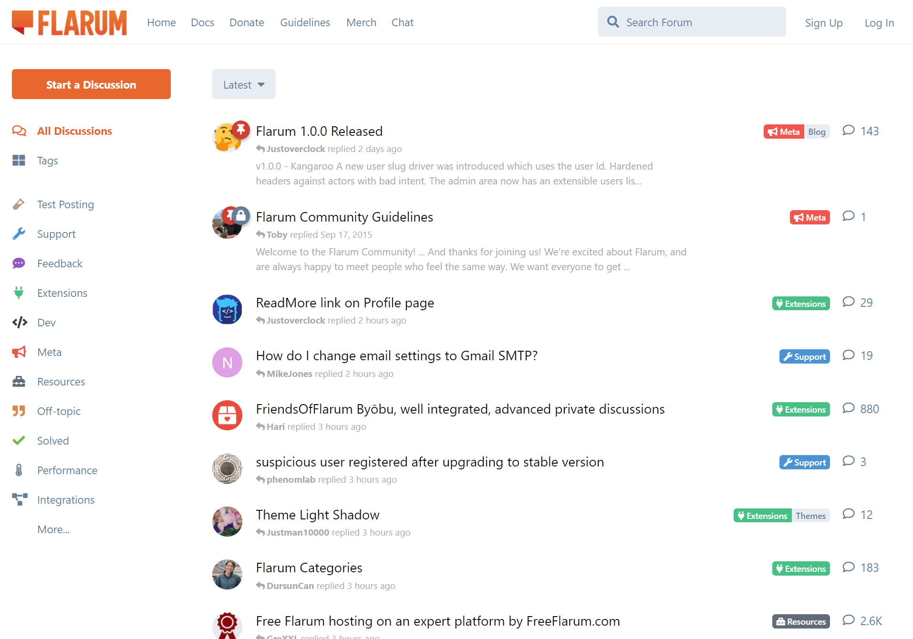
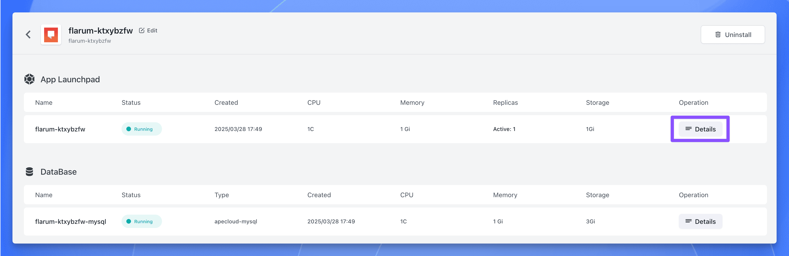
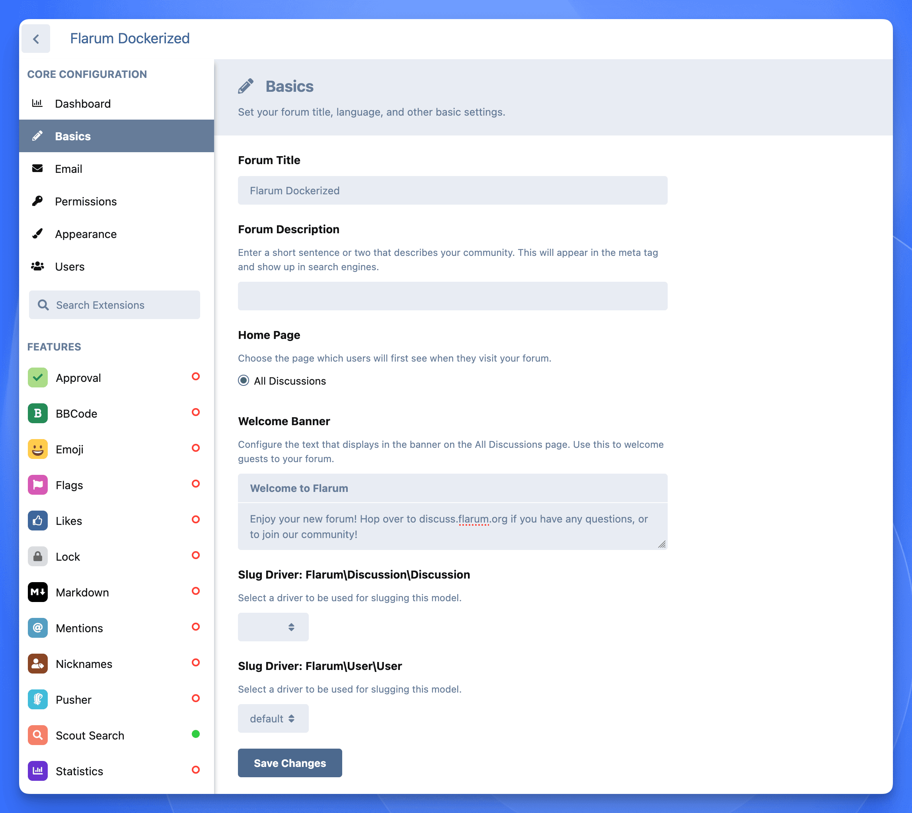
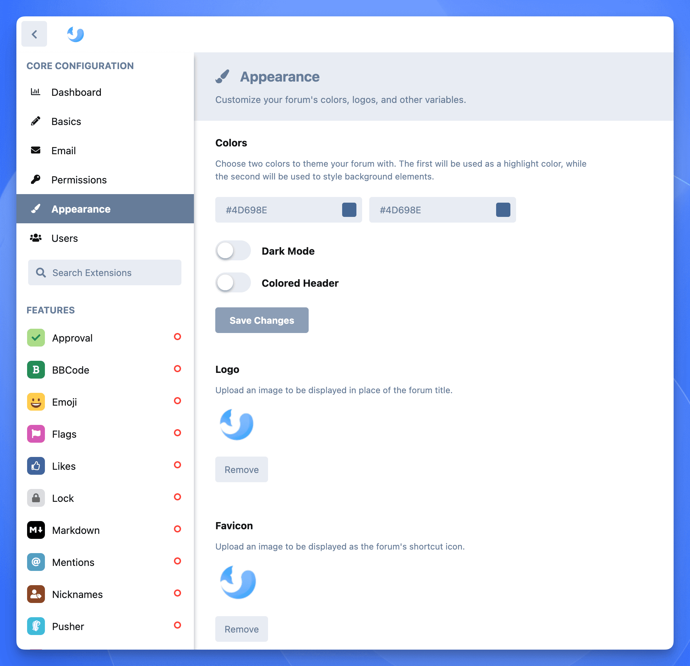
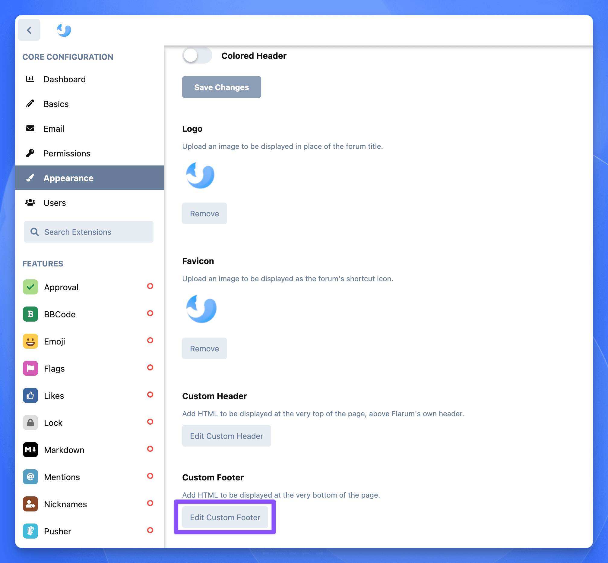
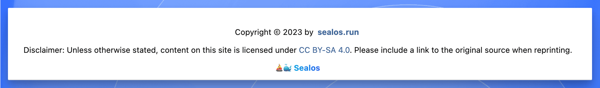
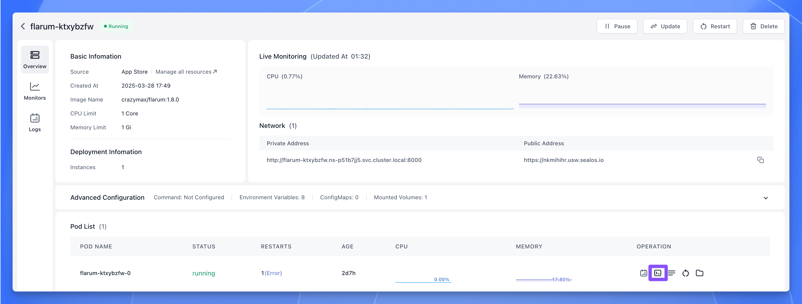
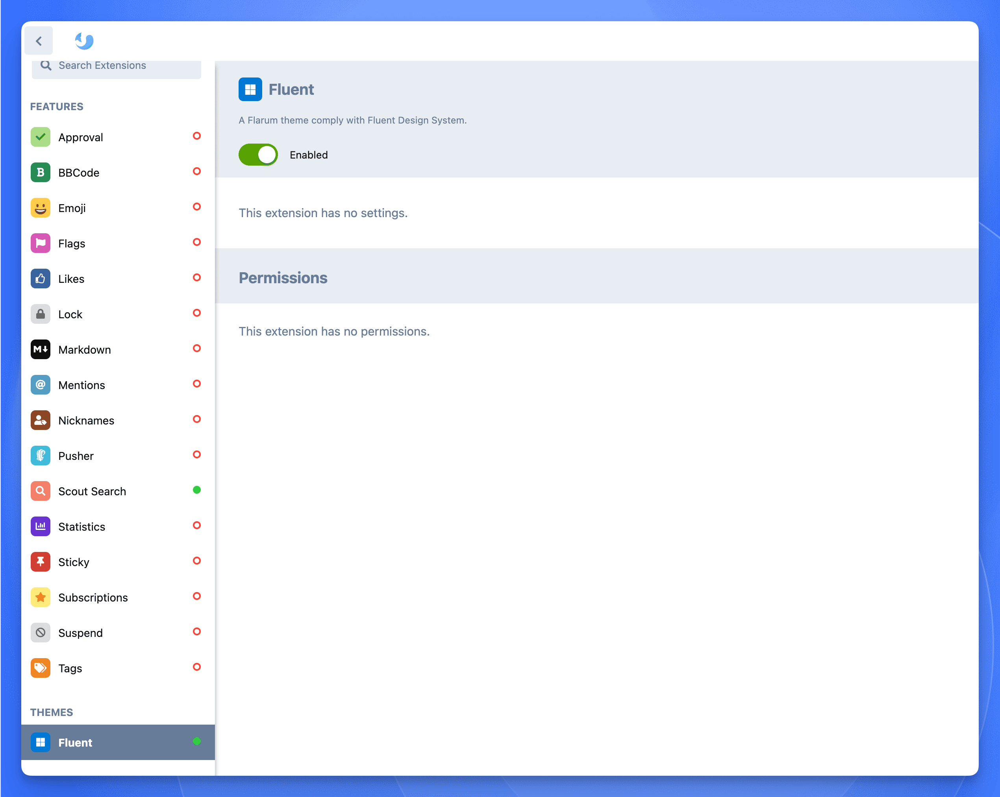

import { DeployButton } from '@/components/ui/button'

As open-source communities flourish, users and developers alike are demanding higher quality online community platforms. Traditional BBS (Bulletin Board System) forums often fall short in terms of modern aesthetics, mobile adaptability, user experience convenience, and interactivity, struggling to meet contemporary user expectations. Therefore, **how to build a modern, high-quality, and feature-rich online community** has become a pressing need and common challenge for many website administrators and community operators.

Today, we'll dive deep into a modern, elegant, and powerful open-source forum software that effectively addresses these challenges: Flarum.



With its modern minimalist design philosophy, exceptional user experience, powerful **extensibility**, and **SEO-friendly** architecture, Flarum is redefining our imagination for online communities, offering a fresh solution for building vibrant interactive spaces.

## Introducing Flarum: Modern Open-Source Forum Software

[Flarum](https://github.com/flarum/flarum) is an **open-source forum software** project born in 2014. Its founders, Toby Zerner and Franz Liedke, aimed to create a modern, elegantly designed forum system to address the common pain points of **traditional forum software**, such as outdated interface design, poor user experience, inadequate mobile adaptation, and limited **extensibility**.

Driven by community development and iteration, Flarum released its first public Beta version in 2015. Its forward-thinking design and outstanding performance quickly attracted a large number of developers and community operators worldwide. Since then, the Flarum team, in collaboration with active community contributors, has continuously updated versions and enhanced features, gradually establishing Flarum as a highly regarded rising star in the **modern forum software** landscape.


Flarum's core design philosophy can be summarized as "**modern, simple, elegant**." It completely abandons the often bloated interfaces and complex operational logic common in traditional forum software, instead pursuing an extremely clean interface layout, smooth and natural interaction animations, and an intuitive user experience.

Currently, the Flarum project has garnered over 15,000 stars on GitHub, fully demonstrating its popularity and influence within the developer community.


## Flarum Core Features and Highlights

Flarum offers a suite of powerful features designed to help users easily build and manage modern online communities:

*   **Interface Design**: Utilizes a flat, **responsive design**, ensuring a consistent and aesthetically pleasing visual experience across different device sizes, including desktops, tablets, and smartphones.
*   **User Experience**: Features a simple and intuitive workflow with a gentle learning curve, significantly lowering the barrier to entry for new users.
*   **Permission Management**: Provides a granular **user permission management** system, allowing administrators to precisely configure access and operational rights for different user groups, meeting the needs of complex community management.
*   **Social Interaction**: Includes built-in rich social interaction features like likes, @mentions, and real-time notifications, effectively boosting member engagement and stickiness.
*   **High Extensibility**: Built on a modular design, Flarum boasts powerful **extensibility**. Users can easily expand forum functionality by installing a wide array of **Flarum plugins** (Extensions) or leveraging its **REST API** for custom development, catering to various customization needs (e.g., **integrating payments for premium content**, **enhancing SEO features**, **adding third-party logins**).

## Flarum's Technical Architecture

Flarum employs an advanced **frontend-backend separation** architecture:

*   **Backend**: Developed using **PHP** (often dubbed "the world's best language") and its popular **Laravel** framework, providing stable and secure **RESTful API** endpoints.
*   **Frontend**: Built with modern JavaScript and the high-performance **Mithril.js** framework, implementing a **Single Page Application (SPA)** user interface for a smooth browsing experience akin to native applications.

This modern technical architecture endows Flarum with excellent **performance**, high **flexibility**, and better **maintainability**.


Simultaneously, Flarum actively utilizes modern web development stacks like Composer (PHP dependency management tool) and WebSockets (for real-time communication), further enhancing the system's overall performance, development efficiency, and real-time interaction capabilities.

## Flarum vs. Traditional BBS Forums

Here's a detailed comparison between Flarum and traditional BBS forum software:

| Feature                  | Flarum                                                                 | Traditional BBS Forum                                       |
| :----------------------- | :--------------------------------------------------------------------- | :---------------------------------------------------------- |
| **Interface Design**     | ✅ Modern, minimalist, beautiful, aligns with current aesthetics        | ❌ Relatively outdated, complex interface, less visually appealing |
| **Mobile Adaptability**  | ✅ **Responsive design**, auto-adapts to screen sizes, great mobile UX | ❌ Mostly not optimized for mobile, inconvenient browsing/ops |
| **Social Interaction**   | ✅ Rich features (likes, @mentions, real-time notifications) promote activity | ❌ Interaction forms are relatively basic, weaker user engagement |
| **Real-time Capability** | ✅ Near real-time content updates (via WebSockets), no manual refresh needed | ❌ Weaker real-time capabilities, information retrieval latency |
| **Extensibility**        | ✅ **Modular design**, rich **plugin ecosystem**, easy **custom dev**    | ❌ Extensibility relatively limited, harder custom development |
| **User Permissions**     | ✅ Granular user group permissions, flexible management                | ✅ Usually has a relatively complete permission system        |
| **Feature Richness**     | ⚠️ Relatively new, some advanced features rely on **plugins**, core evolving | ✅ Accumulated many built-in features over years            |
| **User Habits**          | ⚠️ Modern UI/interactions may require adaptation for **traditional users** | ✅ Many users are accustomed to traditional BBS layouts/usage |
| **SEO Optimization**     | ✅ Modern architecture & **dedicated SEO plugins** support better SEO    | ⚠️ Generally weaker SEO support, requires manual optimization |
| **Performance**          | ✅ Lightweight core, high **optimization potential**, fast loading       | ⚠️ Older architecture may have performance bottlenecks        |

## Flarum Installation and Deployment Guide

### System Requirements

To successfully install and run Flarum on your server, ensure the following environmental requirements are met:

- **Web Server**: Apache (with `mod_rewrite` enabled) or Nginx
- **PHP Version**: PHP 7.4 or higher
- **PHP Extensions**: Fileinfo, Mbstring, OpenSSL, PDO, Tokenizer, XML, Ctype, JSON, GD extensions must be enabled
- **Database**: MySQL 5.6+ or MariaDB 10.0.5+
- **Command-Line Access**: SSH access is required to run Composer

As you can see, Flarum's technical environment dependencies are relatively professional. **For users without server management or PHP development experience, the manual installation and configuration process can be complex, time-consuming, and potentially lead to encountering various environmental issues, causing them to give up.** This is often the first hurdle many potential users face when trying Flarum.

### One-Click Flarum Deployment with Sealos

For those without a technical background, don't worry about installation issues. The [Sealos App Store](https://template.sealos.io) offers an application template for one-click deployment. A single mouse click completes the deployment seamlessly.

**If you want to quickly set up a Flarum forum without getting bogged down in tedious installation and configuration processes**, give Sealos a try.

Open the Flarum application template directly:

<DeployButton deployUrl="https://template.sealos.io/deploy?templateName=flarum" />

Then, click "Deploy on Sealos" in the top right corner.

> If this is your first time using [Sealos](https://sealos.io/), you'll need to register and log in to your Sealos public cloud account. After logging in, you'll be immediately redirected to the template deployment page.

Click "Deploy App" in the top right to start the deployment. Once completed, click the application's "Details" to enter its details page.



Wait for the application status to become `running`, then click the public address to open the Flarum.

Click "Log In" in the top right corner to log in with the administrator account:


+ Username: `flarum`
+ Password: `flarum`

Open the admin backend, and you can start customizing various forum settings.


## Flarum Advanced Customization and Optimization Guide

Flarum offers rich **personalization settings**, allowing you to easily create a forum that aligns with your community's positioning and possesses unique characteristics. Through **custom themes**, adjusting color schemes, uploading logos, setting background images, modifying navigation bar styles, etc., you can make your forum visually stand out.

### Basics Settings

Next, let's configure some basics settings like the forum title, description, welcome banner, etc.



Additionally, you can set the forum's color scheme, logo, etc.



### Custom Header and Footer

The header and footer can also be customized. For example:

```html
<div class="footer" style="padding:0 15px;">
    <p style="text-align: center;">
        Copyright © 2023 by <a style="padding: 0 3px;" href="https://sealos.run/" target="_blank"><b>sealos.io</b></a>
    </p>
    <p style="text-align: center;">
        Disclaimer: Unless otherwise stated, content on this site is licensed under <a rel="license" href="https://creativecommons.org/licenses/by-sa/4.0/" target="_blank">CC BY-SA 4.0</a>. Please include a link to the original source when reprinting.
    </p>
    <p style="text-align: center;">
        ⛵️🐳 <a href="https://sealos.io/" target="_blank" style="font-weight:bold; color:transparent;background-image:linear-gradient(to right,#0ea5e9,#2563eb);-webkit-background-clip: text;background-clip: text">Sealos</a>
    </p>
</div>
```



The final effect is as follows:



### Theme Recommendation and Installation

Here's a recommendation for a modern-style theme, GitHub address: **https://github.com/DellZHackintosh/fluent-flarum**

Installation is the same as before. In the Sealos Flarum application details interface, click the terminal button:



Execute the following command in the opened terminal to install:

```bash
extension require dalez/fluent-flarum
```

After installation, enable it in the admin backend.



## Flarum Plugin Recommendations and Extension Guide

One of Flarum's major appeals is its extensibility. By installing various plugins, you can add new features and functionalities to your forum, meeting the specific needs of your community. Whether it's enhancing SEO performance, integrating third-party authentication, supporting full-text search, or enabling real-time chat, there's likely a plugin to suit your needs.

### Recommended Core and Essential Plugins

**One of Flarum's core strengths is its powerful extensibility.** By installing a diverse range of **plugins (Extensions)**, you can add countless new features and functionalities to meet the specific development needs of your community. Whether you need to **enhance SEO performance**, **integrate third-party authentication (like Google, GitHub login)**, support **full-text search**, implement a **real-time chat room**, add **paid content or membership tiers**, or require **more sophisticated content moderation tools** or **data analytics**, Flarum's vast plugin ecosystem almost always offers a suitable solution.

Faced with numerous plugins, new users might feel overwhelmed. Here are some community-verified, popular, and practical **basic and advanced Flarum plugin recommendations**, covering aspects like **user management, content management, SEO optimization, and interface enhancement**:

*   **User & Interaction Enhancement:**
    *   [**FoF User Directory**](https://flarum.org/extension/fof/user-directory) (`fof/user-directory`): Adds a user directory page, making it easy for users to browse, search, and discover other community members. *(Sealos Install Command: `extension require fof/user-directory:*`)*
    *   [**Emoji Picker**](https://github.com/clarkwinkelmann/flarum-ext-emojionearea) (`clarkwinkelmann/flarum-ext-emojionearea`): Provides a convenient emoji picker for users to easily insert emojis when posting or replying. Note: This may conflict with Flarum's built-in Emoji extension; disable the default one before installing. *(Sealos Install Command: `extension require clarkwinkelmann/flarum-ext-emojionearea`)*
    *   [**FoF Follow Tags**](https://flarum.org/extension/fof/follow-tags) (`fof/follow-tags`): Allows users to follow tags (topic categories) they are interested in and receive notifications for new content under those tags. *(Sealos Install Command: `extension require fof/follow-tags:*`)*

*   **Content Management & Display:**
    *   [**FoF Filter**](https://github.com/FriendsOfFlarum/filter) (`fof/filter`): Offers automatic content moderation and filtering features, helping admins manage user-generated content and prevent spam or inappropriate language. *(Sealos Install Command: `extension require fof/filter:*`)*
    *   [**Discussion views**](https://github.com/MichaelBelgium/flarum-discussion-views) (`michaelbelgium/flarum-discussion-views`): Displays the view count for each discussion (topic) in the list and detail pages, intuitively reflecting content popularity. *(Sealos Install Command: `extension require michaelbelgium/flarum-discussion-views`)*
    *   [**Echo showfloor**](https://gitee.com/echo886/flarum-showfloor) (`wanecho/showfloor`): Displays post floor numbers in replies, similar to traditional forums. *(Sealos Install Command: `extension require wanecho/showfloor:*`)*
    *   [**Fancybox-Plus**](https://github.com/tohsakrat/fancybox-plus) (`tohsakarat/fancybox-plus`): Enhances the image viewing experience within the forum. Clicking an image opens an elegant, feature-rich Lightbox interface. *(Sealos Install Command: `extension require tohsakarat/fancybox-plus`)*

*   **Navigation & SEO Optimization:**
    *   [**FoF Links**](https://github.com/FriendsOfFlarum/links) (`fof/links`): Allows administrators to easily add custom links to the forum's navigation bar, sidebar, or footer, providing quick access to other important pages or resources inside or outside the forum. *(Sealos Install Command: `extension require fof/links`)*
    *   [**Flarum SEO**](https://github.com/v17development/flarum-seo) (`v17development/flarum-seo`): Highly Recommended! Provides comprehensive **SEO optimization** features, including automatic Sitemap generation, Meta tag optimization, adding structured data (Schema.org), etc., significantly boosting the forum's visibility in search engines. *(Sealos Install Command: `extension require v17development/flarum-seo`)*
    *   [**FoF Sitemap**](https://github.com/FriendsOfFlarum/sitemap) (`fof/sitemap`): Specifically generates standards-compliant `sitemap.xml` files, helping search engines better discover and index forum content. Often works best in conjunction with the Flarum SEO plugin. *(Sealos Install Command: `extension require fof/sitemap`)*

*   **Administration & Security:**
    *   [**FoF Ban IPs**](https://flarum.org/extension/fof/ban-ips) (`fof/ban-ips`): Allows administrators to ban specific IP addresses or IP ranges, blocking malicious users from accessing the forum. *(Sealos Install Command: `extension require fof/ban-ips:*`)*
    *   [**FoF Spamblock**](https://flarum.org/extension/fof/spamblock) (`fof/spamblock`): Helps identify and mark spam users, simplifying the **anti-spam** management process. *(Sealos Install Command: `extension require fof/spamblock:*`)*

There are many more plugins available. Explore the Flarum Extension Marketplace for others: **https://flarum.org/extensions**

<Callout type="important">
  Remember, when installing plugins within the Sealos Flarum template environment demonstrated here, **you must use the `extension require <plugin-package-name>` command format**. This differs from the standard `composer require <plugin-package-name>` command typically found in Flarum's official documentation or plugin pages.

For example, to install the "Discussion views" plugin, even if the official page shows `composer require michaelbelgium/flarum-discussion-views`:


The command you actually need to execute in the Sealos Flarum terminal is:

  ```bash
  extension require michaelbelgium/flarum-discussion-views
  ```
</Callout>

**Explore More Plugins**

The list above is just the tip of the iceberg. Flarum has an active developer community constantly contributing new extensions. You can visit the [Official Flarum Extension Marketplace](https://flarum.org/extensions) (formerly Extiverse) to discover more plugins tailored to your needs. Here, you can filter by category, compatibility, rating, and more to find the perfect **functional extensions** for your community's growth. Wisely selecting and combining plugins is key to leveraging Flarum's **high extensibility**.

## Conclusion: Embrace Flarum, Build Your Modern Online Community

With its **minimalist and beautiful interface design, powerful core features, exceptional user experience**, and crucially, its **excellent extensibility**, Flarum is attracting increasing attention globally from operators and users seeking modern community solutions.

Choosing Flarum means you get a **modern, technologically advanced, and vibrant community platform right out of the box**. Compared to complex **traditional BBS** systems, Flarum allows you to focus more energy on building community content, fostering user interaction, and driving actual operational growth, rather than getting bogged down in tedious technical details or maintaining outdated systems.

The core advantages Flarum offers—such as **mobile-friendly responsive design，flexible and granular permission management，rich social interaction methods，inherent SEO friendliness，and a powerful plugin ecosystem**—will inject new vitality into your online community，helping you build an engaging，smooth-running，and efficiently managed interactive space。

Although Flarum might present a learning curve in areas like **initial installation** (for non-technical users), **advanced theme customization**, and implementing certain **specific advanced features** (often relying on community plugins), its modern architecture and active community provide a solid foundation and abundant resources to overcome these challenges.

If you're looking for a replacement for an **outdated BBS forum** and aspire to build an online community truly fit for the 21st century, Flarum is definitely worth exploring and trying. With tools like Sealos, you can easily bypass the installation hurdles and quickly experience the charm of Flarum.