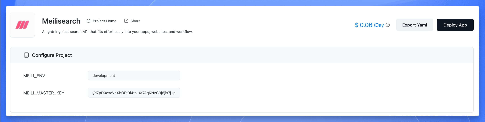
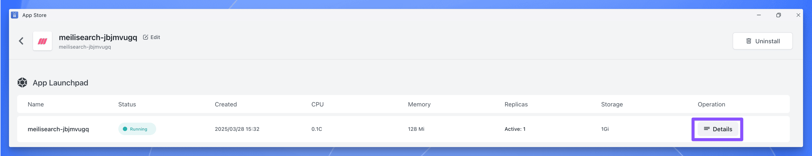
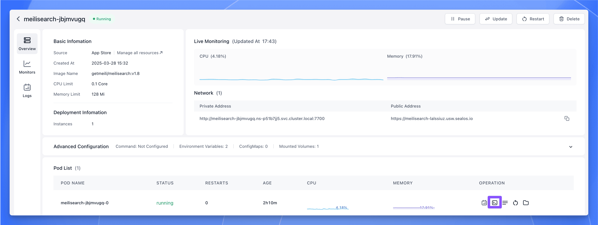
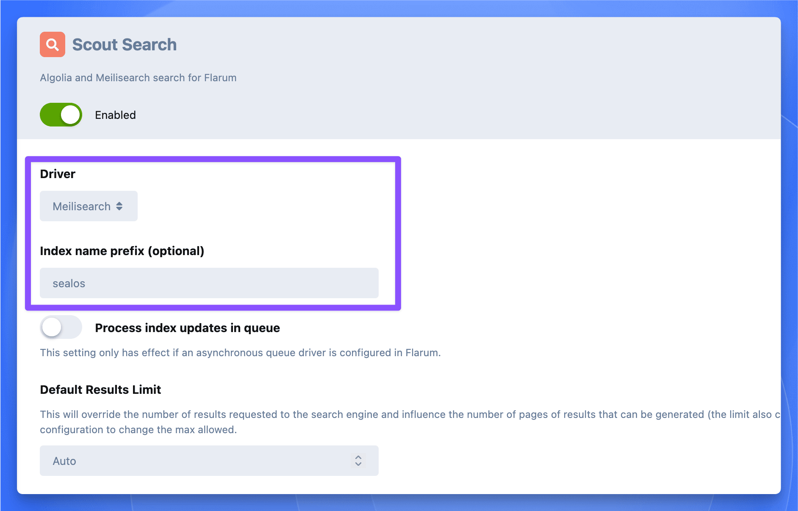
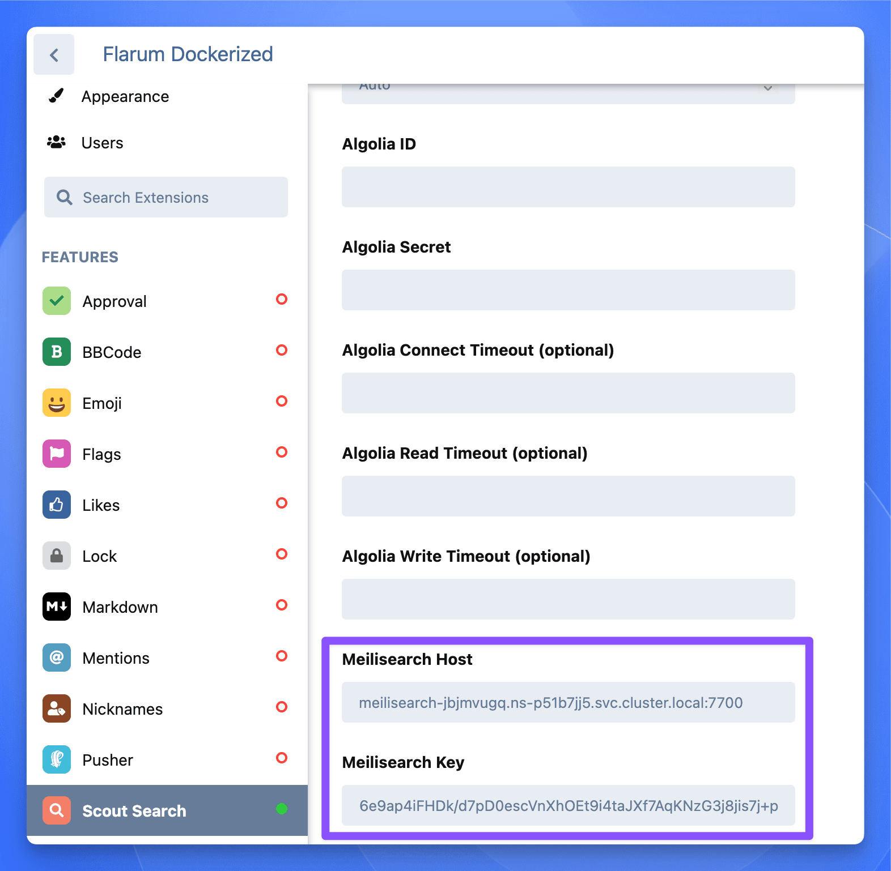
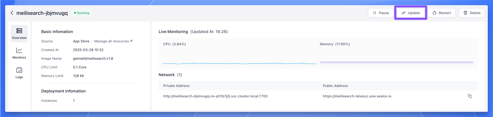
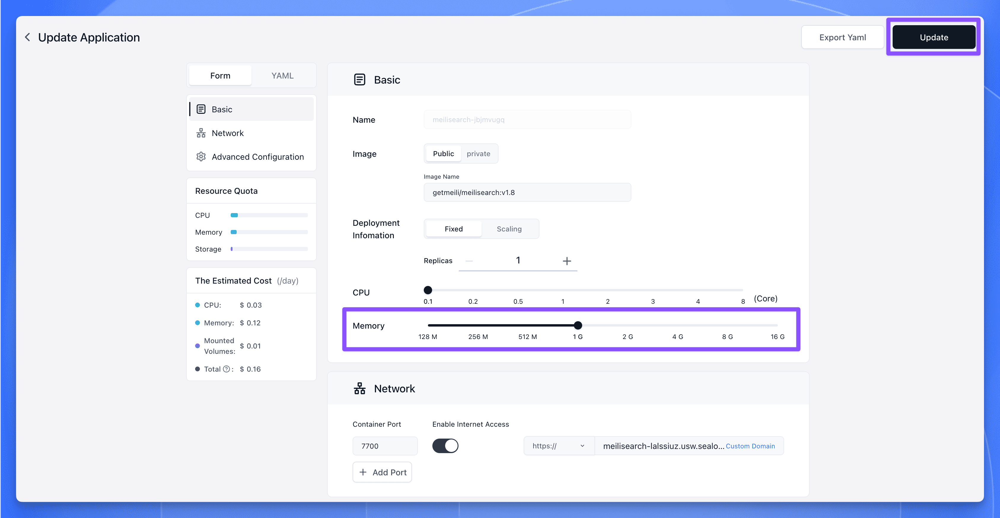

import { DeployButton } from '@/components/ui/button'

Search functionality has become an indispensable part of almost every application today. Whether it's an e-commerce platform, a content management system (CMS), or an internal corporate knowledge base, users expect to find the information they need quickly and accurately. However, traditional search solutions often face numerous challenges: slow response times, poor relevance, difficulty scaling with large datasets, and lack of flexibility. These issues not only negatively impact the user experience but can also lead to user churn and ultimately hinder business growth.

To tackle these problems, let's introduce you to a powerful and flexible open-source search engine: [Meilisearch](https://www.meilisearch.com/). Built with [Rust](https://www.rust-lang.org/), Meilisearch stands out for its simple deployment process, blazing-fast query responses, and rich feature set. You can run the Meilisearch server and start querying with just a single command-line binary, significantly lowering the barrier to entry for using a search engine. It supports advanced features like typo tolerance and schemaless indexing, and even provides a web frontend interface for demonstration purposes.

In this tutorial, we'll dive deep into Meilisearch's core advantages and practical applications. We will cover:

+   An overview of Meilisearch's core features and benefits
+   How to install and configure Meilisearch (including a super-easy method!)
+   Basic usage of Meilisearch's API
+   Integrating Meilisearch into a real-world application (using Flarum forum as an example)
+   A comparison of Meilisearch with other search solutions

## Prerequisites

Before we begin, please ensure you have the following:

-   Basic knowledge of command-line operations
-   A fundamental understanding of RESTful APIs
-   (Optional) A [Sealos](https://sealos.io) account for quickly deploying Meilisearch

## Introducing Meilisearch

[Meilisearch](https://github.com/meilisearch/meilisearch) is a powerful, **open-source search engine written in Rust**. It delivers lightning-fast full-text search capabilities and is designed to be easy to use and integrate. Meilisearch's philosophy revolves around these core principles:

1.  **Speed First**: Returns results in under 50 milliseconds, regardless of dataset size.
2.  **Relevance Priority**: Smart ranking algorithms ensure the most relevant results always appear first.
3.  **Developer-Friendly**: Provides an intuitive API and comprehensive documentation, drastically reducing integration and usage complexity.
4.  **Highly Customizable**: Flexible configuration options allow developers to tailor search behavior to specific needs.

Since its initial release in 2018, Meilisearch has quickly gained traction in the open-source community thanks to its ease of use and exceptional performance. It currently boasts over 40,000 stars on GitHub.


## Meilisearch Core Features

Meilisearch offers a wide array of search functionalities suitable for everything from personal projects to large-scale enterprise applications. Here are its core features:

### Search Performance

-   **Lightning-Fast Speed**: Delivers results typically under 50ms, regardless of dataset size.
-   **Instant Search**: Supports "search-as-you-type" for real-time feedback.
-   **Typo Tolerance**: Intelligently handles typos, returning relevant results even with spelling mistakes in the query.

### Relevance Optimization

-   **Custom Ranking Rules**: Allows customization of result sorting based on business logic.
-   **Faceted Search**: Supports filtering and navigation across multiple dimensions or categories.
-   **Synonym Management**: Define synonyms to enhance search flexibility (e.g., "pants" matches "trousers").

### Multi-Language Support

-   **Optimized for Many Languages**: Tuned for various languages, including non-Latin scripts like Chinese and Japanese.
-   **Stop Word Handling**: Configurable list of common words to ignore for better relevance (e.g., "the", "a", "is").

### Advanced Functionality

-   **Geosearch**: Supports searching and sorting based on geographical location.
-   **Multi-Tenancy**: Enables data isolation and access control using tenant tokens.
-   **Highlighting**: Highlights matching terms within search results.
-   **Document Management**: Supports adding, updating, and deleting documents within indexes.

### Developer Experience

-   **RESTful API**: Offers a clean and straightforward API for easy integration.
-   **Multi-Language SDKs**: Official SDKs available for various popular programming languages.
-   **Detailed Documentation**: Provides comprehensive guides and examples.
-   **Self-Hostable**: Allows deployment and management on your own infrastructure.

## Meilisearch vs. Other Search Solutions

To better illustrate Meilisearch's advantages, let's compare it with other popular search solutions on the market:

| Feature          | Meilisearch       | Elasticsearch                  | Algolia          |
|------------------|-------------------|--------------------------------|------------------|
| Response Speed   | **\<50ms**         | Varies (often \>100ms)          | \<100ms           |
| Ease of Use      | **High**          | Medium                         | High             |
| Typo Tolerance   | **Built-in**      | Requires Configuration         | Built-in         |
| Language Support | Excellent         | Good                           | Excellent        |
| Geosearch        | Supported         | Supported                      | Supported        |
| Open Source      | **Yes (MIT)**     | Yes (Core, some features paid) | No (SaaS)        |
| Pricing          | Free (Self-hosted)| Free (Self-hosted), Paid Cloud | Paid SaaS        |

While Elasticsearch might offer broader functionality and a larger ecosystem, and Algolia excels in its cloud offering and out-of-the-box experience, **Meilisearch uniquely shines in speed, ease of use, and open-source friendliness.** It strikes a perfect balance, especially for small to medium-sized projects and teams wanting full control over their search infrastructure.

## Installing and Configuring Meilisearch

Meilisearch is relatively simple to install and use, offering various installation methods to suit different environments and needs.

Even if you don't have a technical background, you don't need to worry about installation. The [Sealos App Store](https://template.sealos.io) provides a one-click deployment template – just click your mouse, and you're done. It's incredibly smooth.

**If you want to quickly deploy Meilisearch without getting bogged down in tedious installation and configuration**, give Sealos a try.

Open the Meilisearch application template directly:

<DeployButton deployUrl="https://template.sealos.io/deploy?templateName=meilisearch" />

Then, click "Deploy on Sealos" in the top right corner.

> If this is your first time using [Sealos](https://sealos.io/), you'll need to register and log in to your Sealos public cloud account. After logging in, you'll be immediately redirected to the template deployment page.

There are two crucial environment variables to pay special attention to here. Configuring these correctly ensures the security and performance of your Meilisearch instance.

1.  **`MEILI_ENV`**: Sets the instance environment. It can only be **`production`** or **`development`**.
    -   `production` mode: Disables the search preview interface for security.
    -   `development` mode: Enables the search preview interface.

2.  **`MEILI_MASTER_KEY`**: Sets the master key for Meilisearch, which automatically protects all routes except `GET /health`. Other endpoints, including the search preview interface, can only be accessed using an API key derived from this master key.
    -   In `production` mode:
        -   Providing a master key is **mandatory**.
        -   If no master key is provided, or if it's less than 16 bytes long, Meilisearch will throw an error and refuse to start.
    -   In `development` mode:
        -   Providing a master key is **optional**.
        -   If no master key is provided, all routes are unprotected and publicly accessible.

Regardless of the mode, if you don't provide a master key or if the provided key is less than 16 bytes, Meilisearch will suggest using an automatically generated one.

**In summary: A master key is required for `production` mode; it's optional for `development` mode.**

Generating a key is very simple. Just execute the following command in a Linux or macOS terminal to generate a random key:

```bash
openssl rand -base64 48
```

After filling in the parameters, click "Deploy App" in the top right corner to start the deployment.



Once deployment is complete, click the application's "Details" to go to its details page.



Wait for the application status to become `running`, then click the "Public Address" to open the Meilisearch search preview dashboard.

When you open it, it looks like this. Enter the master key you set to gain access.


## Basic Meilisearch Usage

Meilisearch provides an intuitive RESTful API, making integration with various programming languages and frameworks straightforward. Here are some basic operation examples using `curl`:

### Create an Index

An index is where your documents (data records) are stored.

```bash
curl \
  -X POST 'http://localhost:7700/indexes' \
  -H 'Content-Type: application/json' \
  -H 'Authorization: Bearer YOUR_MASTER_KEY' \
  --data-binary '{
    "uid": "movies",
    "primaryKey": "id"
  }'
```
*(Replace `YOUR_MASTER_KEY` with your actual key, or an appropriate API key)*

### Add Documents

Add some data to your newly created index.

```bash
curl \
  -X POST 'http://localhost:7700/indexes/movies/documents' \
  -H 'Content-Type: application/json' \
  -H 'Authorization: Bearer YOUR_MASTER_KEY' \
  --data-binary '[
    {
      "id": 1,
      "title": "Carol",
      "genres": ["Romance", "Drama"]
    },
    {
      "id": 2,
      "title": "Wonder Woman",
      "genres": ["Action", "Adventure"]
    },
    {
      "id": 3,
      "title": "Little Women",
      "genres": ["Drama", "Romance"]
    }
  ]'
```

### Search Documents

Perform a search query on your indexed data.

```bash
curl \
  -X POST 'http://localhost:7700/indexes/movies/search' \
  -H 'Content-Type: application/json' \
  -H 'Authorization: Bearer YOUR_MASTER_KEY' \
  --data-binary '{
    "q": "wonder"
  }'
```
*(This will likely return the "Wonder Woman" document)*

## Integrating Meilisearch into a Flarum Forum

To showcase Meilisearch's power in a real-world application, we'll use the Flarum forum software as an example, demonstrating how to integrate Meilisearch to enhance its search capabilities.

> For instructions on installing and using Flarum, refer to our previous article: [Flarum Installation and Usage Tutorial](./how-to-deploy-and-configure-flarum-using-docker)

### Install the Meilisearch PHP SDK

In the Flarum application details interface on Sealos, click the terminal button in the bottom right corner:



In the opened terminal, execute the following command to install the Meilisearch PHP SDK (assuming Flarum uses Composer and extensions are managed this way):

```bash
extension require meilisearch/meilisearch-php
```

### Install the Scout Search Extension for Flarum

Similarly, in the Flarum container terminal, execute the following command to install the Scout Search extension (which bridges Laravel Scout functionality, often used for search integration, into Flarum):

```bash
extension require clarkwinkelmann/flarum-ext-scout
```

### Enable the Scout Extension

In the Flarum administration panel, enable the `Scout` extension. Then, configure it to use "Meilisearch" as the search engine. You can optionally specify an index name (e.g., `flarum_posts`); if left blank, it might use a default.



Next, you need to configure the Meilisearch URL (Host) and API Key.



If your Meilisearch and Flarum instances are deployed in the same Sealos availability zone (or namespace), you can use Meilisearch's internal network address. Go to the Meilisearch application details page on Sealos, click the "Private Address" to copy it, and paste this value into the "Meilisearch Host" field in the Scout plugin settings. Use the `MEILI_MASTER_KEY` you set during deployment for the API Key field.

### Increase Meilisearch Memory Allocation

Meilisearch deployed via the default Sealos template might only have 128MB of memory allocated. This is often insufficient when integrating with an application like Flarum. It's recommended to increase this to at least 1GB. Here's how:

Go to the Meilisearch application details page on Sealos and click "Update" in the top right corner:



Adjust the memory allocation to 1G (1 Gigabyte), then click "Update" to apply the changes.



### Import Flarum Data into Meilisearch Index

Use the following command within the Flarum terminal to import your existing forum data (posts, discussions, users, etc.) into the Meilisearch index managed by Scout:

```bash
php flarum scout:import-all
```

A successful import will look something like this in the terminal output:


Finally, let's test the search functionality (the screenshot shows a Chinese search, demonstrating multi-language capability):


## Conclusion

Meilisearch provides developers with a powerful yet flexible search solution, particularly well-suited for applications needing fast, relevant, and easy-to-implement search functionality. Through this tutorial, we've explored Meilisearch's core features, its installation and configuration process (including a convenient one-click Sealos deployment), and how to integrate it into a real-world application like Flarum.

We encourage you to further explore Meilisearch's advanced features, such as custom ranking rules, synonym configurations, and filtering options, to fully leverage its potential. Keep an eye on the official Meilisearch documentation and community updates for the latest features and best practices. Happy searching!