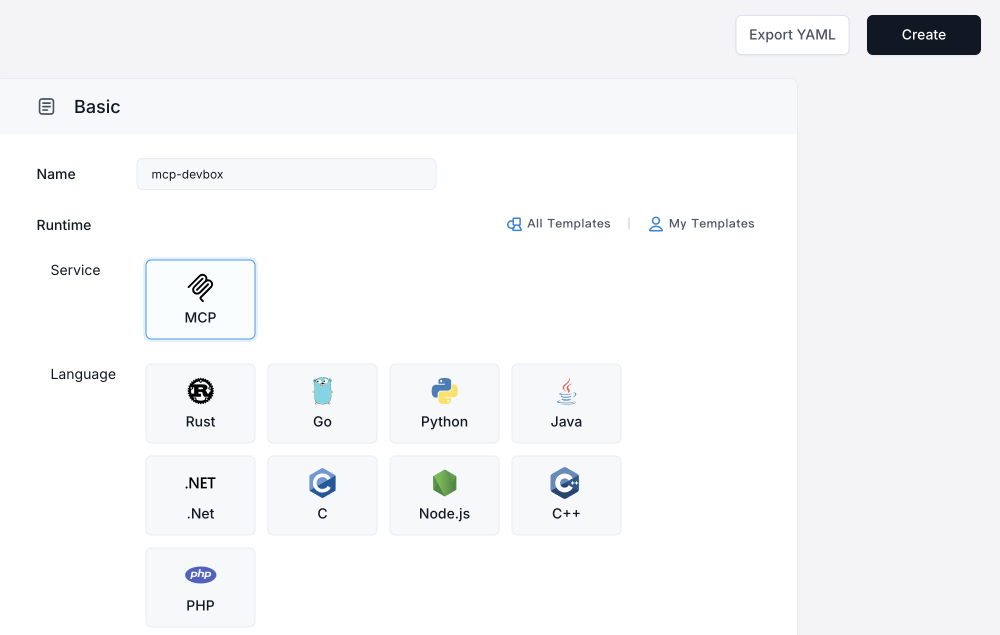
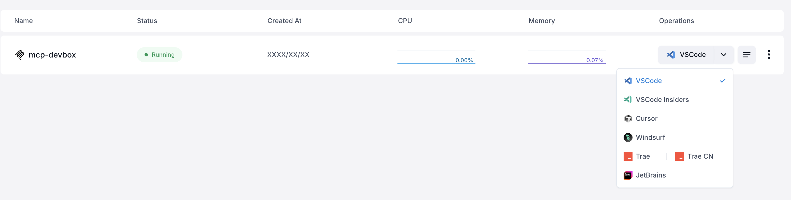
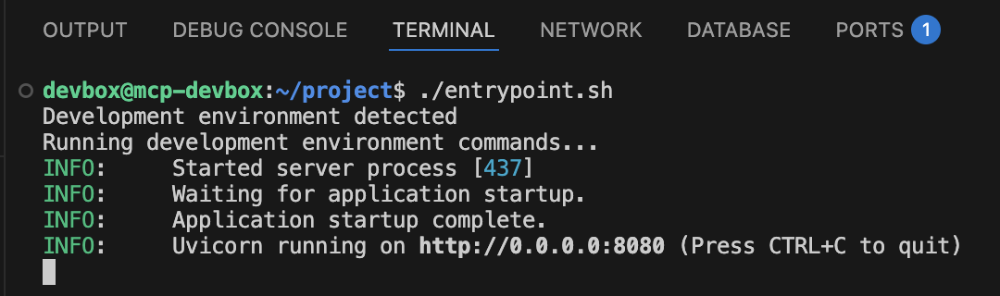
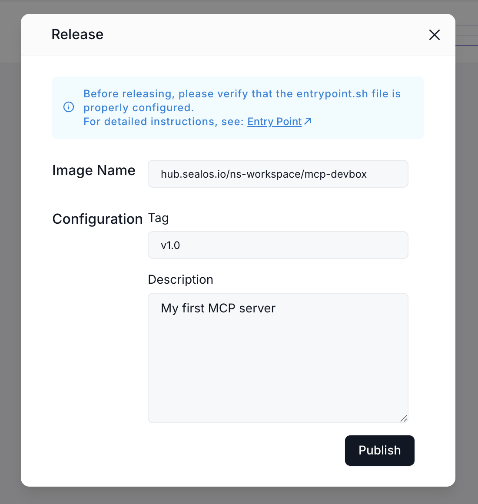

# The Ultimate Step-By-Step Guide To Creating Your Own MCP Server with Sealos DevBox

With the growing popularity of Machine Context Protocol (MCP), developers increasingly want to create custom MCP servers to extend AI capabilities. Sealos DevBox offers a streamlined solution, allowing you to develop and deploy your own MCP server in minutes. This comprehensive guide walks you through the entire process, from initial setup to deployment.

Want to get started straight away? [Deploy an MCP server with DevBox](https://os.sealos.io/?openapp=system-devbox?page%3Dcreate%26runtime%3Dmcp).

## What is an MCP Server?

Machine Context Protocol (MCP) servers extend AI capabilities by connecting large language models to external tools and services. By developing your own MCP server, you can create custom integrations that empower AI models to perform specialized tasks. If you want to learn more checkout: [What is MCP?](https://sealos.io/blog/what-is-mcp)

## Getting Started with Sealos DevBox

### Step 1: Create Your Development Environment

1.  Visit [Sealos Cloud](https://os.sealos.io)
2.  Click on the DevBox icon and select "New Project"
3.  In the configuration settings, choose "MCP Service" as your development framework
4.  Select your preferred programming language (Python, JavaScript, Go, etc.)
5.  Click "Create" to finish setting up your project



### Step 2: Connect to Your Development Environment

1.  In the project list, find your newly created project
2.  Click the dropdown arrow next to the IDE icon
3.  Select your preferred IDE (VS Code, JetBrains, etc.)
4.  Follow the prompts to install the DevBox plugin for secure SSH connection
5.  Your IDE will automatically establish a remote connection



### Step 3: Understanding the Project Structure

Once connected, you'll see a basic project structure. In this example we will go other the Python deployment - so the file names and contents may vary slightly. In the Python version you will find:

- `.venv`: Contains all project dependencies (MCP-related dependencies are pre-installed)
- `entrypoint.sh`: Contains project startup commands
- `manage.py`: Your main program file (for Python projects)

## Developing Your MCP Server

The template includes three main components:

### 1. MCP Service Initialization

```python
"""Define your mcp server name"""
mcp = FastMCP("demo")

```

This initializes your MCP service with a specified name.

### 2. SSE Communication Logic

The template includes pre-configured Server-Sent Events (SSE) communication code to handle client connections, so you don't need to modify this part.

### 3. Tool Implementation

```python
"""Define your mcp server logic"""
@mcp.tool()
async def demo_toolcall() -> str:
    return "Hello,World!"

```

This is where you'll implement your MCP server's functionality.

## Practical Example: IP Geolocation Service

Let's create an MCP server that retrieves geographical information based on IP addresses:

```python
"""Define your mcp server logic"""
@mcp.tool()
async def get_ip_info(ip: str = None) -> str:
    """Get geographical information about an IP address"""

    url = f"https://ip.rpcx.io/api/ip?ip={ip}"
    async with httpx.AsyncClient() as client:
        response = await client.get(url)
        if response.status_code == 200:
            return response.text
        else:
            return f"IP lookup failed with status code: {response.status_code}"

```

This function accepts an IP address parameter, queries an external geolocation API, and returns the results in JSON format.

## Running and Testing Your MCP Server

1.  Execute `./entrypoint.sh` to start your project
2.  In VSCode Network tab, you can see your public URL
3.  This URL is your MCP server's public endpoint that anyone can access



## Connecting to Your MCP Server

You can connect to your MCP server using any SSE-compatible client. Let's go with Cherry Studio as an example:

1.  Install [Cherry Studio](https://github.com/CherryHQ/cherry-studio)
2.  Add your preferred AI model (like OpenAI or DeepSeek)
3.  Add your MCP server:
    - Type: SSE
    - URL: Your public URL + "/sse" path
4.  Enable tool calling in your model's settings
5.  In the chat interface, enable your MCP server
6.  Test by asking the AI to look up an IP address


## Deploying Your MCP Server to Production

Once development and testing are complete:

1.  Navigate to the "Version History" section in your project details
2.  Click "Publish Version"
3.  Fill in the required information:
    - Image name (auto-filled)
    - Version number (e.g., v1.0)
    - Description
4.  Click "Release" and then "Deploy"
5.  The system will redirect you to Sealos Application Management
6.  Click "Deploy Application" (default configurations are usually sufficient)
7.  When the status shows "running," your deployment is complete
8.  Copy the public address and update it in your client application



## Conclusion

With Sealos DevBox, developing and deploying MCP servers becomes remarkably simple and accessible. As the MCP protocol continues to evolve, AI capabilities will become increasingly powerful and diverse, lowering development barriers further.

The ease of development means your creativity, not technical constraint, will define what's possible. Whether you're building tools for data analysis, content generation, or specialized industry applications, Sealos DevBox provides the infrastructure to bring your ideas to life quickly.

Start building your own MCP server today and join the growing ecosystem of developers extending AI capabilities!
