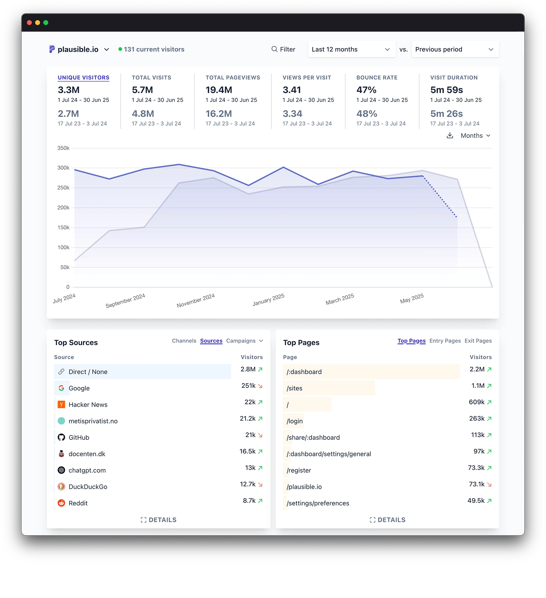
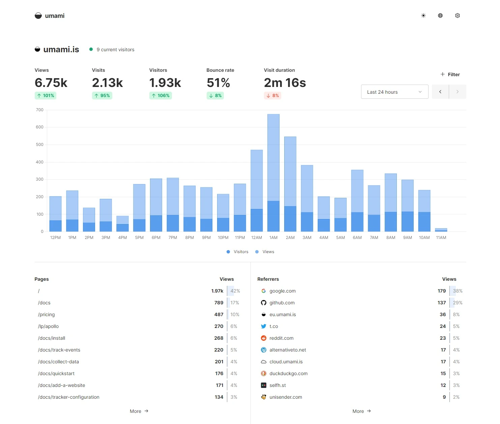
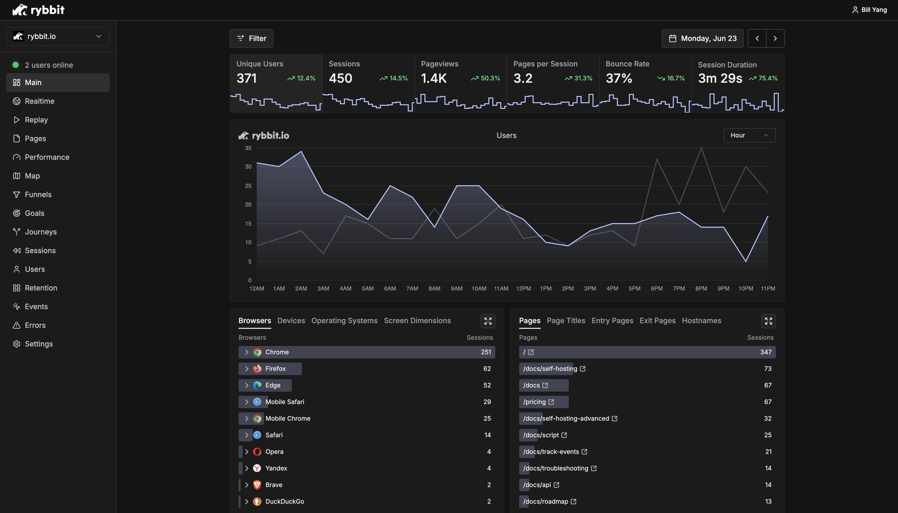
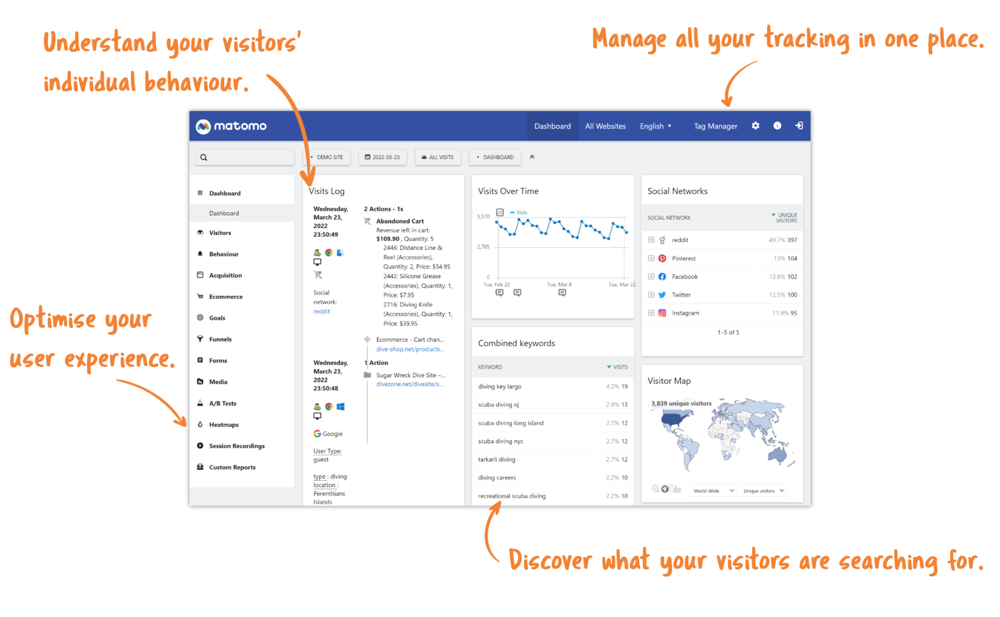

Google Analytics is a widely used platform for tracking and analyzing website and app traffic. It helps organizations understand user behavior, optimize digital strategies, and improve marketing effectiveness. The latest version, GA4, uses an event-based model to provide a more complete view of the customer journey across devices and platforms, with a focus on privacy-safe measurement.

# Why Google Analytics is Used and Its Advantages

Google Analytics is popular because it offers powerful, often free, analytics and reporting tools. Businesses use it to:

- Gain insights into customer behavior and website performance
- Track conversions and optimize marketing campaigns
- Access real-time and historical data
- Integrate seamlessly with Google Ads, Google Cloud, and other tools
- Scale from small sites to large enterprises
  Its robust features, integrations, and accessibility have made it the industry standard for web analytics.

# Key Limitations and Disadvantages

Despite its strengths, Google Analytics has notable drawbacks:

- **Privacy and Compliance:** Increasing privacy regulations (like GDPR and CCPA) and legal rulings in Europe have made standard Google Analytics usage problematic for many organizations.
- **Data Ownership:** Users have limited control over where data is stored and how it is used, as Google retains significant rights over collected data.
- **Complexity:** The GA4 interface can be overwhelming, especially for beginners, and migrating from Universal Analytics is challenging.
- **Data Sampling:** For high-traffic sites, reports may be based on sampled data, reducing accuracy.
- **Feature Gaps:** Lacks built-in qualitative tools like heatmaps and session replay, often requiring third-party solutions.
- **Support:** Free users rely on community support, with no dedicated help from Google.

# Top Alternatives

## Plausible

**Official Website:** [plausible.io](https://plausible.io)

**Introduction** Plausible is a lightweight, privacy-first web analytics tool designed to be simple, fast, and fully compliant with privacy regulations. It is open-source and can be self-hosted or used via a managed EU-based cloud service. Plausible is known for its clean interface and focus on essential metrics without tracking personal data or using cookies.

**Screenshots** 

**Advantages**

- No cookies or personal data collected
- GDPR, CCPA, and PECR compliant by design
- Simple, intuitive dashboard with real-time data
- Lightweight script for fast page loads
- Open-source and can be self-hosted
- Easy goal and event tracking

**Disadvantages**

- Fewer advanced features compared to Matomo or Google Analytics
- Limited integrations and customization
- No built-in heatmaps or session recordings
- Paid for managed cloud version (no perpetual free tier)

**Who Should Use Plausible?** Plausible is perfect for privacy-conscious site owners, bloggers, startups, and small businesses who want simple, transparent analytics without the complexity or privacy concerns of Google Analytics.

**Get Started:** [Deploy and get started with Plausible](/products/app-store/plausible)

## Umami

**Official Website:** [umami.is](https://umami.is)

**Introduction** Umami is an open-source, privacy-focused analytics solution that provides simple, clear insights without tracking personal data or requiring cookies. It is designed for easy self-hosting and offers a minimalist, user-friendly dashboard.

**Screenshots** 

**Advantages**

- 100% open-source and free to self-host
- No cookies or personal data collected
- Simple, modern dashboard with real-time stats
- Lightweight and easy to deploy
- Multi-site support from a single installation

**Disadvantages**

- Requires self-hosting and basic server management
- Fewer features and integrations than Matomo or Google Analytics
- No built-in heatmaps, session replay, or advanced segmentation

**Who Should Use Umami?** Umami is ideal for developers, privacy advocates, and anyone who wants a no-frills, open-source analytics solution they can fully control.

**Get Started:** [Deploy and get started with Umami](/products/app-store/umami)

## Rybbit

**Official Website:** [rybbit.io](https://rybbit.io)

**Introduction** Rybbit is a modern analytics platform focused on privacy, speed, and actionable insights. It aims to provide a balance between simplicity and powerful features, with a strong emphasis on user privacy and compliance.

**Screenshots** 

**Advantages**

- Privacy-first approach with no personal data collection
- Fast, real-time analytics and reporting
- Clean, modern interface
- Easy event and goal tracking
- Designed for compliance with global privacy laws

**Disadvantages**

- Newer platform with a smaller user base
- Limited third-party integrations
- Some advanced features may require a paid plan

**Who Should Use Rybbit?** Rybbit is a great choice for startups, small businesses, and privacy-focused organizations looking for a modern, easy-to-use analytics tool that respects user privacy.

**Get Started:** [Deploy and get started with Rybbit](/products/app-store/rybbit)

## Matomo

**Official Website:** [matomo.org](https://matomo.org)

**Introduction** Matomo is a leading open-source web analytics platform designed as a privacy-focused alternative to Google Analytics. It offers full data ownership, flexible hosting options (cloud or self-hosted), and a comprehensive feature set that rivals Google Analytics, making it a popular choice for organizations with strict privacy or compliance requirements.

**Screenshots** 

**Advantages**

- 100% data ownership and control
- Can be self-hosted or hosted in the EU for compliance
- No data sampling—reports are always based on complete data
- Built-in features like heatmaps, session recordings, and form analytics
- GDPR, CCPA, and HIPAA compliant
- No need for intrusive cookie consent banners (with proper configuration)
- Open-source and extensible with plugins

**Disadvantages**

- Self-hosting requires technical setup and ongoing maintenance
- Some advanced features require paid add-ons or a cloud subscription
- Interface can be less polished than Google Analytics for some users
- Smaller community and fewer third-party integrations compared to Google

**Who Should Use Matomo?** Matomo is ideal for organizations that prioritize privacy, need full control over their analytics data, or operate in regions with strict data protection laws. It's also a strong choice for those who want advanced analytics features without sharing data with third-party ad networks.

# Conclusion: The Importance of Analytics and Choosing the Right Solution

Web analytics are essential for understanding your audience, measuring success, and making informed decisions about your digital presence. While Google Analytics remains a powerful and accessible tool, its limitations—especially around privacy, data ownership, and complexity—mean it may not be the best fit for every organization.

When choosing an analytics solution, consider your privacy requirements, data control needs, technical expertise, and the specific features that matter most for your business. Alternatives like Matomo, Plausible, Simple Analytics, and others offer privacy-focused, user-friendly, or specialized options that may better align with your goals. Ultimately, the best analytics platform is the one that empowers you to make smarter decisions while respecting your users' privacy and your own operational needs.
