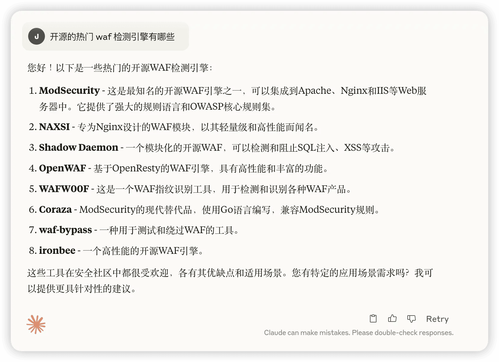
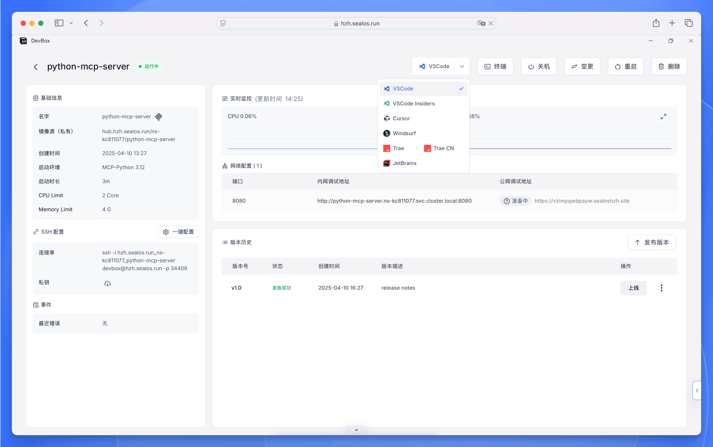
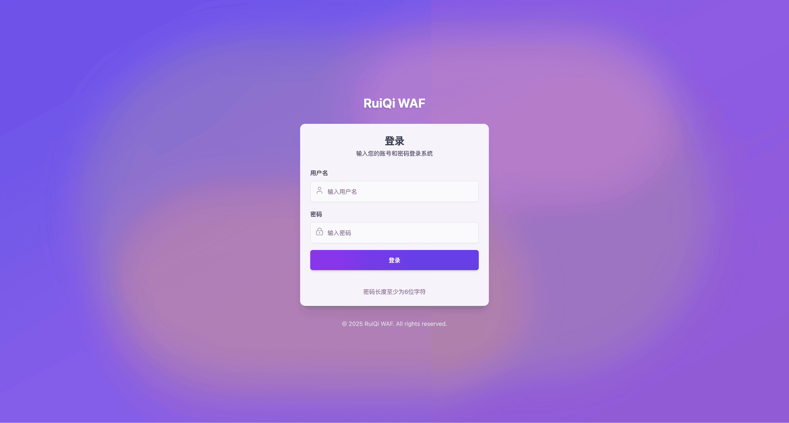
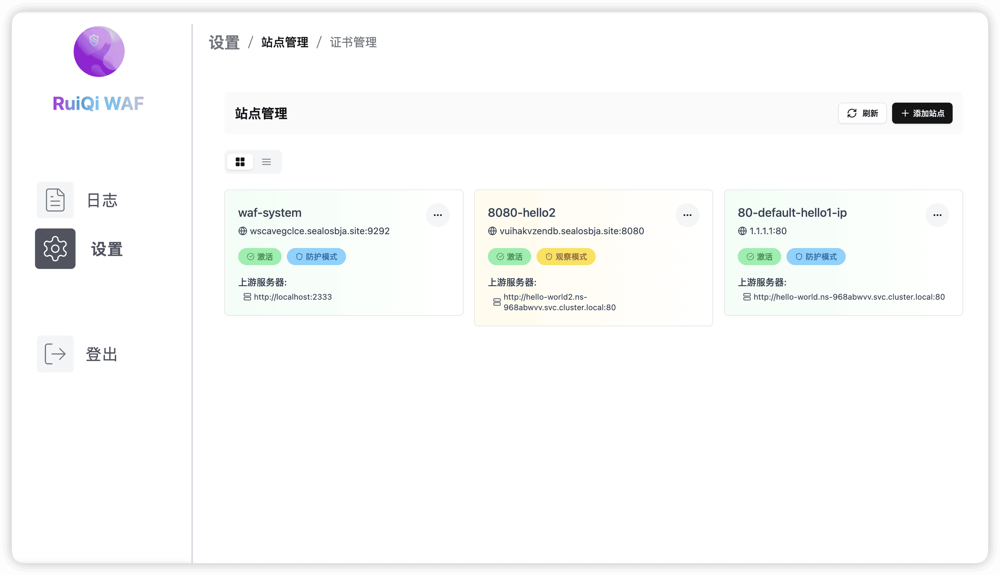
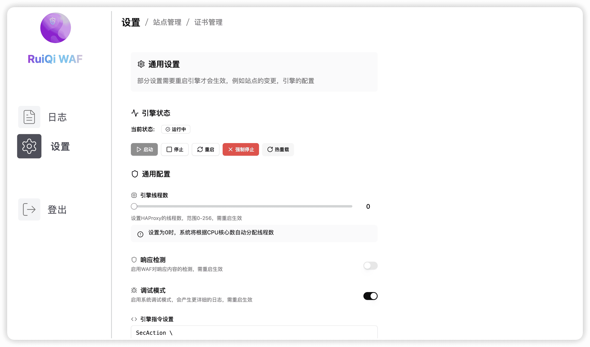
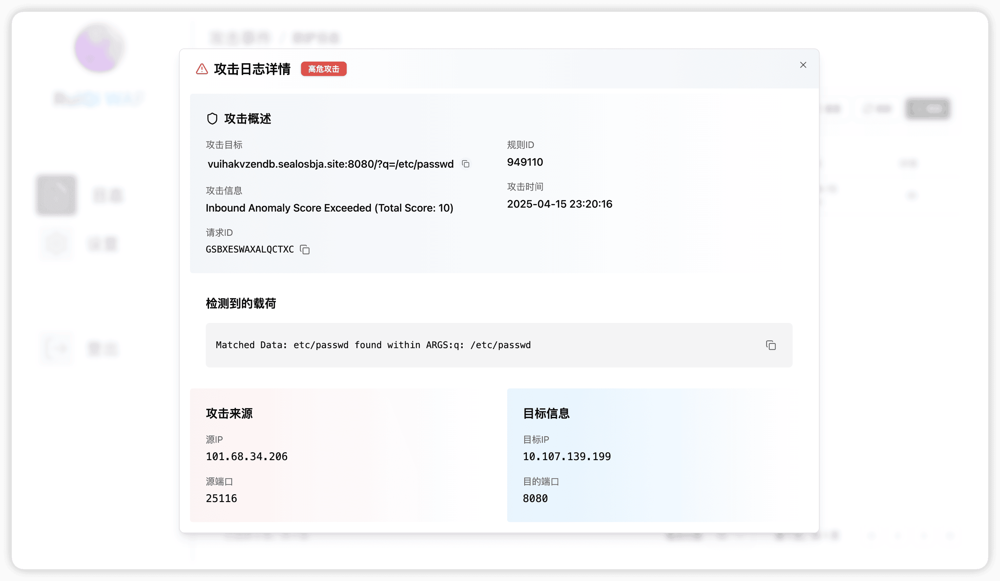
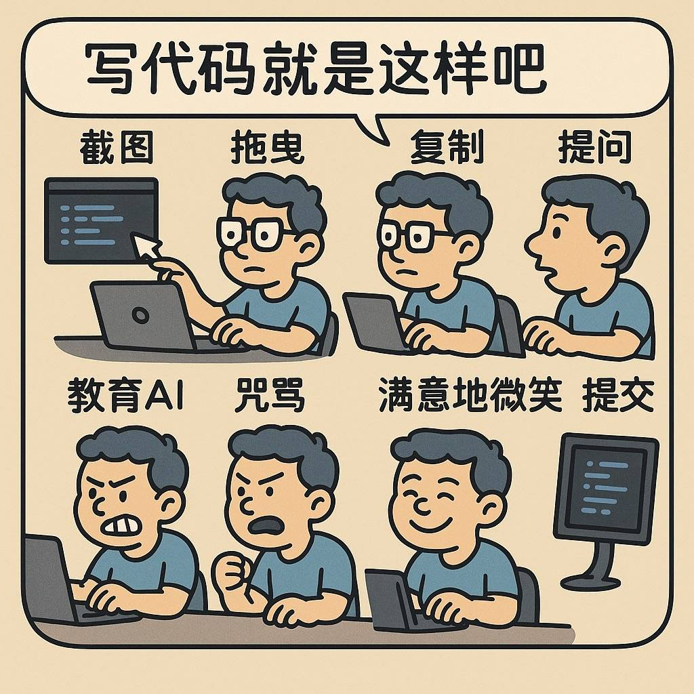
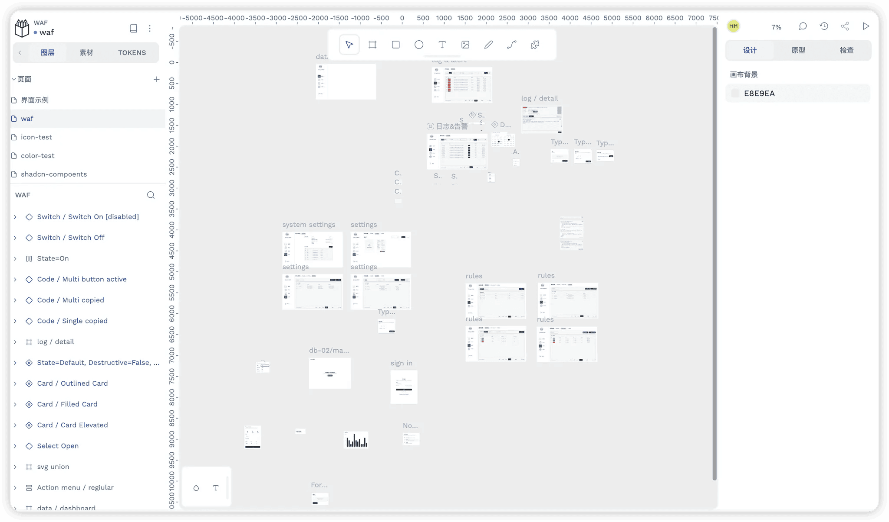
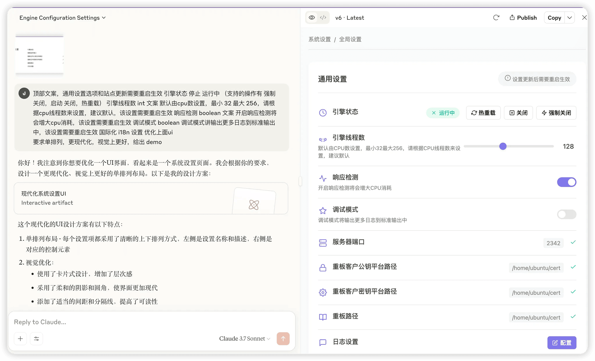

这篇文章将详细分享我是如何借助 **AI 辅助开发**工具和 **DevBox**，在三周业余时间内，从一个编程经验有限的运维，成功捣鼓出一个 WAF 防火墙 Demo 的完整历程和心得体会。希望能给像我一样，懂些技术概念但编程实践不足的朋友们一点启发。

## 最初的火花：一个 WAF 的需求

我是一个小运维，日常在各个群里巡逻，到处看看有没有啥 “火情” 需要救。

某天有个同学问我，“咱 Sealos 上面有没有 Web 防火墙 (WAF) 可以用啊？”


我打开一看还真没有，于是想开发一个 **Web 防火墙 (WAF)** 的想法就冒出来了，作为一个运维，接触的技术名词和知识还真不少，平时跟人聊技术，什么 K8s、Docker、微服务，名词一套一套的，听起来好像挺唬人。可真要撸起袖子写代码，那水平……基本上就是 “Hello World” 专业户，顶多再写个自动化脚本。

开发一个正儿八经的 “产品”？这步子迈得也太大了，刚冒出的想法又缩进去了。不过这事没完。

## AI 的“诱惑”：点燃 WAF 开发的火花

搁置的那几天里，我的朋友圈、技术群、各种资讯 App，简直被各种关于 AI 的文章刷屏了！什么 “卧槽！程序员要完蛋了，饭碗要被 AI 抢了！”、“从零开始 AI 全部搞定！”、“我一行代码没写，全靠 AI 生成！”……

一开始看吧，心里还挺焦虑的：“我去，AI 真这么神了？程序员是不是真要下岗了？”

但转念一想，如果 AI 真的这么牛，能搞定这么多事儿……那它能不能……帮我写个 WAF 呢？这个想法让我对 **AI 编程** 产生了浓厚的兴趣。

于是我开始搜索了解各种如何使用 **AI 写代码**相关的知识，通过一顿搜索发现借助 AI 开发一个 WAF 防火墙似乎也不是很难。

首先我问 AI 开源的热门 WAF 检测引擎有哪些，下面是 AI 的回答（这里我使用的是类似 [ChatGPT](https://chat.openai.com) 的大语言模型）：



后面我又让 AI 根据维护频率，难易程度，好不好用等对他们进行一一的总结，同时我去这些项目把他们的 README 丢给 AI，让 AI 给出总结和使用 demo，最后发现 [Coraza](https://coraza.io/) 这个是最简单的，文档也全，是 Go 写的，使用 demo 也简单，于是就选它了。

后面我继续与 AI 交流得出了一个技术路线，写一个 WAF 需要一个前端，一个后端，一个检测引擎。

因为检测引擎是 Go 写的，所以后端也使用了 Go 的 [Gin 框架](https://gin-gonic.com/) (AI 给的建议)，技术路线确认了，又有了 AI 加持，再加上之前看了一堆洗脑文章，我感觉我信心爆棚。

中间有一个小插曲，AI 给出 demo 代码时，我需要一个运行环境来跑他，但是有时候 AI 给出的 demo 跑不起来，需要把报错丢给 AI 进一步调试，这期间 AI 有时候会给一堆命令，我不是专业的开发，所以 AI 给什么我先把他给的命令跑一遍再说，出了问题再丢回给 AI。

这样就有一个问题了，**这样一来二去我电脑的环境就乱七八糟，装了一堆我也不知道有什么具体作用的工具。**

这个时候我想到了我公司的产品 [DevBox](/docs/overview/intro)。

## DevBox：我的“无限试错”秘密武器与 AI 开发的完美搭档

Devbox 是啥？简单说，它就是一个远程的、**云端的开发环境**。就像给你一个云上的、专属的、干净的“虚拟电脑”来写代码、跑程序。这对于进行 **AI 辅助编程** 时的环境管理至关重要。



现在写这篇文章回头看来，当时选择 DevBox 真是太正确的选择了，用 Devbox 来配合 AI 干活，简直完美解决了我的痛点：

*   **需要跑 AI 给的 Demo 了？** 没问题，秒开一个全新的 Devbox 环境。里面干干净净，啥也没有。
*   **AI 给的命令需要在特定环境跑？** 好说，在 Devbox 里随便折腾！装包、改配置，想怎么来怎么来。
*   **跑了几十次 AI 修订的 Demo，环境又被搞乱了？** 小事，直接把这个 Devbox 删掉！ 对，你没听错，就是删掉！
*   **需要继续尝试？** 再秒开一个新的、干净的 Devbox！又是干干净净啥也没有！

整个过程，就像是你有了一个**无限次使用的、用完即弃的“草稿箱”**！再也不用担心把自己的本地电脑搞得乱七八糟，再也不用花大把时间去清理那些“历史遗留问题”。

有了它，我可以毫无顾忌地让 AI 放飞自我，大胆地尝试各种可能性，反正搞砸了，删掉重来就好，**试错成本几乎降到了零！** 这对于学习和实践 **AI 驱动开发** 来说是革命性的。

就这样我用三周业余时间写了一个 Demo 版的 WAF 防火墙，下面是成果。

再来点截图：






## 我的 AI 辅助 WAF 开发实战全流程

接下来我就给大家拆解一下，我是怎么利用 DevBox 跟 AI “结伴”把这个 WAF Demo 一点点“磨”出来的。**希望能帮助到像我这种对技术名词了解很多，但不是很会编程的同学完成自己的产品开发，特别是那些想尝试用 AI 开发 Web 应用的朋友们。**

### 1. 阶段一：AI 辅助攻克 Coraza 检测引擎

在技术路线确认了使用 `coraza-spoe` 作为检测引擎后，我做了下面两件事：

**步骤一**：让 AI 给我读代码，告诉我这个玩意是干什么的，并以我容易理解的方式给出结论，这里我是把 `coraza-spoe` 仓库的代码 ([coraza-spoe GitHub](https://github.com/corazawaf/coraza-spoa)) 丢给 AI，因为这个仓库的代码量不大。

如果仓库代码量很大，可以分模块丢给 AI，让 AI 分别总结，比如有三个模块 a/b/c，把 a 模块代码询问 AI 得出结论，如果 b 模块依赖了 a 模块的话，就把 b 模块和刚刚 a 模块的结论一起丢给 AI，然后又会得到 b 模块的结论，这样循环下去就行。

AI 的联想能力非常非常的强，下面是我的提示词和 AI 给出的结论 (这里我主要与类似 [Cursor AI 编辑器](https://cursor.sh/) 的工具进行交互，它可以很好地结合代码上下文)：

**提示词 (Prompt for AI Code Analysis)：**

```bash
根据这个完整流程 给出 两个版本的流程图
第一个版本，强调抽象完整性，重在业务过程,关注业务逻辑,展示了整体的处理流程和各个阶段的职责
第二版本，关注实现细节,展示了每个步骤具体的代码实现和数据流转,要求每一个步骤，附带关键代码解释
关键区别:
第一版本更适合理解整体架构和处理流程
第二版本更适合理解具体实现和调试问题
第一版本聚焦于"做什么"
第二版本聚焦于"怎么做"

要求1， 两个版本均给出 Mermaid 文件和 excalidraw 文件
要求1，用 text 格式，readme 风格画图实现
```

**AI 给出的结论 (coraza-spoe agent 代码分析摘要)：**

```text
coraza-spoe agent 代码分析

[HAProxy] ─── TCP连接 ───> [SPOE代理服务]
                              │
                        [消息类型识别]
                              │
                    ┌─────────┴──────────┐
                    │                    │
              coraza-req            coraza-res
                    │                    │
            [获取应用程序名称]      [获取应用程序名称]
                    │                    │
            [查找对应Application]  [查找对应Application]
                    │                    │
            [请求处理程序]        [响应处理程序]
                    │                    │
                    └─────────┬──────────┘
                              │
                      [处理结果返回HAProxy]
                         (状态/动作)

--------------------------------

[HAProxy请求] → [internal.Agent.Serve(Listener)] 
                          ↓
                   创建 spop.Agent
                   agent := spop.Agent{
                       Handler: a,
                       BaseContext: a.Context,
                   }
                          ↓
                [spop.Agent.Serve(Listener)]
                          ↓
                   循环Accept新连接
                   nc, err := l.Accept()
                          ↓
                   创建协议处理器
                   p := newProtocolClient(ctx, nc, as, handler) // as := newAsyncScheduler() 异步调度器
                          ↓
                   启动goroutine处理连接
                   go func() { 
                       p.Serve() 
                   }()
                          ↓
                [protocolClient.Serve]
                   循环处理Frame(连接中的数据读取)
                   for {
                       f := acquireFrame()
                       f.ReadFrom(c.rw) // 读取连接中的数据，放到 f.buf 中
                       c.as.schedule(f, c) // 将 f 和 c 放到 asyncScheduler 中，由异步队列调度处理
                   }
                          ↓
                [frameHandler处理Frame]
                   根据frame类型分发
                   - frameTypeIDHaproxyHello: onHAProxyHello
                   - frameTypeIDNotify: onNotify
                   - frameTypeIDHaproxyDisconnect: onHAProxyDisconnect
                          ↓
                [onNotify处理消息] 
                   创建消息扫描器和消息对象
                   调用Handler.HandleSPOE
                          ↓ 
                [internal.Agent.HandleSPOE处理]
                          ↓
                   解析消息类型
                   switch message.NameBytes() {
                   case "coraza-req": messageHandler = HandleRequest
                   case "coraza-res": messageHandler = HandleResponse
                   }
                          ↓
                   获取应用名称
                   k := encoding.AcquireKVEntry()
                   message.KV.Next(k)
                   appName := string(k.ValueBytes())
                          ↓
                   查找Application
                   a.mtx.RLock()
                   app := a.Applications[appName]
                   a.mtx.RUnlock()
                          ↓
                   执行消息处理
                   err := messageHandler(app, ctx, writer, message)
                          ↓
                   处理返回结果
                   - 正常返回：继续处理
                   - ErrInterrupted：设置中断信息
                   - 其他错误：panic
                          ↓
                [返回给HAProxy]
```

在 AI 给出清晰的流程后，我很快就知道 `coraza-spoe` 是干什么的，定位到了处理请求（HandleRequest）和响应（HandleResponse）的关键函数。

**步骤二**：让 AI 在 `coraza-spoe` 的这两个函数里写一个日志处理逻辑，日志的表结构设计，字段设计也是 AI 给的，提示词也没什么特殊的就是让 AI 基于这个项目结构，在 `HandleRequest` 和 `HandleResponse` 函数中添加日志存储逻辑，同时使用 [MongoDB](/docs/guides/databases/mongodb) 作为存储数据库，字段设计由你来决定，要求符合程序设计，核心需求修改完后程序能运行，给出运行步骤。

很快 AI 就给了一个版本，并且成功运行起来了，同时他设计的表中有些我不需要的字段也让他删除了，然后后面就是不断的新一轮的对话，大致就是不断让 AI 改需求，同时我也下手改一点点，工作流程变成读代码，让 AI 给下一版本，继续读代码，给下一版本，直到满意为止。

整个流程总结一下就是：**截图，拖，COPY，问，教育 AI，骂，露出满意的微笑，然后 Commit**。这正是 **AI 辅助编程**的魅力所在。



### 2. 阶段二：AI 助力 Go Gin 后端框架搭建

检测引擎的目录和相关代码写好后，就开始了后端开发了。目标是使用 **AI 开发 Go Gin 应用**。

因为检测引擎是 Go 写的代码，所以后端在 AI 的建议下选择使用 Go 的 [Gin 框架](https://gin-gonic.com/)。在确认框架后，AI 还给出后端框架有两个功能：

*   一个是 CRUD 需求，也就是我提的各种业务需求；
*   另一个就是后台任务管理，负责启动检测引擎，HAproxy，以及生成 HAproxy 的配置。

得到这些信息后我就让 AI 首先给出一个 Gin 框架的常规目录结构，给出一个最小能运行的 demo。

这期间我也去搜索了解 Gin 框架的手把手教程，看一些文章，看看别人的 Gin 框架的目录结构是什么样的，多一些知识储备，这样我好接下来以更专业一点的视角去问 AI。

我把一个 Gin 的最佳示例项目丢了 AI，然后让他初始化项目，很快 AI 给了一个能跑的 demo 项目，这个项目没有任何业务实现，就是一个可以跑起来的 hello world 后端 Web。

接下来我就一步一步让他给我完成我的需求，我记得我最先是让他给我加了一个中间件记录日志，然后又在他给的中间件基础的目录基础上，让他基于现有格式完成了鉴权中间件，并且这个过程 AI 创造性的给我添加了 controller router service repository 这几个目录，和一大堆代码，在我询问下得知原来这是 MVC 模式的 Web 后端模型，意外的学习到新知识。

后面我就让他基于该模式给我添加业务实现，同时我发现了 Cursor 一个很好用的功能就是可以用 `@` 来将项目文件和目录发给 AI，并且我发现有一个上下文文件来记录项目结构，那么 AI 就会完全按照你的要求去填充代码。

而且由于我不断的与 AI 谈话，学习到的专业知识越来越多，后面的提问也越来越专业，我最开始的提问就是给我一个能跑的程序，后面我的提问会附加上下文文件，会清晰的描述清楚我要的需求。

下面是我的一些提示词，和 AI 补充的上下文文件，没错这个上下文文件也是 AI 补充完整的，我要求 AI 每实现一个需求，就把这个需求填充到上下文中。

**上下文文件 `@context` (后端 Go Gin 项目结构节选):**

```bash
# 目录结构如下 (部分展示)
# server 后端，负责后端接口处理，haproxy 启动管理，配置生成等
server/
├── main.go             # 入口包，主函数，包含 swagger 和 redoc 文档配置
├── config/             # 配置文件
├── model/              # 模型层，负责数据模型定义 (user.go, site.go, role.go)
├── dto/                # DTO 层，数据传输对象 (auth.go, site.go)
├── controller/         # 控制器 (auth.go, site.go, waf_log.go)
├── service/            # 服务层，业务逻辑 (auth.go, site.go, daemon/, engine/, haproxy/, waf_log.go)
├── router/             # 路由层 (router.go)
├── repository/         # 仓库层，数据库操作 (user.go, role.go, site.go, waf_log.go)
├── middleware/         # 中间件 (auth.go)
├── utils/              # 工具类 (response.go, jwt.go)
├── validator/          # 验证器 (validators.go, struct_validators.go)
# ... (其他如 coraza-spoa, pkg 目录结构类似原文)
```

#### 一些后端开发的 AI 提示词示例

**证书管理功能实现:**

```bash
@server @context.txt 
context.txt  为 server 的项目上下文信息，后续做的变更需要同步到 context.txt 上下文文件中

@cert.go @cert.go 
model/cert.go 是证书的数据模型，其中只有 PublicKey 和 PrivateKey 是必选字段，其余都是可选字段

@pkg @mongodb.go  是数据库驱动，使用 mongo mongo-driver/v2 驱动

要求如下
1. 参考  @auth.go @auth.go @user.go @auth.go  @site.go @site.go    完成证书管理的 curd 接口，增加证书，分页获取证书列表，删除证书，修改证书
2. 完成 curd 请求的 dto 定义
3. 要求代码有完整的 swagger 注释
```

**服务状态管理功能实现:**

```bash
@context.txt 
context.txt  为 server 的项目上下文信息，后续做的变更需要同步到 context.txt 上下文文件中
dto 放在 @dto  目录下，model 放在 @model  目录下，数据操作仓库放在 @repository目录下 , controller 放在 @controller  目录下，service 业务实现放在 @service 目录下

参考 @auth.go  @auth.go  @auth.go  和 @runner.go  实现后台服务状态管理接口，包括 停止 启动 重启 强制停止 热重载

服务的状态定义在 runner 文件中
```

其他功能的实现基本和上面一样，不断把需求给 AI，在和 AI 的来回对话中，不断试错，这期间也不断增加我的专业水平，同时代码阶段性保存到 GitHub，和 **DevBox 随时重置环境**给了我试错的勇气，重来的时间成本大大降低。

### 3. 阶段三：AI 协同完成 React 前端界面

有了后端开发时和 AI 大战三百回合的经历，Web 开发时我与 AI 的交互就炉火纯青了，目标是使用 **AI 开发 React 应用**。也是一样的流程，从网上搜了一个 [React](https://react.dev/) 最佳 demo 项目丢给 AI，然后让 AI 一步一步完成我的需求，同时也有一个上下文文件进行记录，同时还有 DevBox 给我随时重置环境的便利。

有一点需要注意，在 Web 开发时一定要把 Swagger OpenAPI 文件发给 AI，这样 AI 定义的类型，以及 axios 请求的业务代码会非常的准确。

**上下文文件 `@context` (前端 React 项目结构节选):**

```bash
重点信息如下
项目采用的框架是 react + vite + tailwindcss + typescript
路由使用的是 "react-router": "^7.1.3"
包管理器使用的是 pnpm
ui 使用的是 shadcn
主要分为左右布局，左边是sidebar 负责主导航，右边是内容区。
内容区顶部为 breadcrumb，breadcrumb负责子导航，sidebar 不同的导航点进来会有不同的 breadcrumb 路径。
项目 icon 使用 lucide-react

---
项目要求
1. 结构完整，功能完整，代码规范，可维护性强
2. 目录组装，文件命名符合规范，关键代码需要有友好注释
3. 使用 vite 进行开发，使用 vite 进行打包
4. 使用 tailwindcss 进行样式开发
5. 使用 shadcn 进行 ui 开发
6. 使用 react-router "react-router": "^7.1.3", 进行路由开发
7. 使用 tanstack query @tanstack/react-query@4 进行数据请求
8. 使用 tanstack table 进行表格开发
9. 使用 zustand 进行状态管理
10. 使用 react-hook-form 进行表单开发
11. 使用 zod 进行数据验证
12. 使用 react-i18next 进行国际化
13. 支持中英文切换，默认使用中文
14. 使用 i18next-http-backend 加载翻译文件
15. 使用 i18next-browser-languagedetector 检测用户语言
16. 项目 icon 使用 lucide-react
---

项目主要目录结构介绍
静态资源
public
public/locales 是国际化文件夹，负责项目的国际化配置
public/locales/en/translation.json 是英文翻译文件
public/locales/zh/translation.json 是中文翻译文件
src/assets 是项目静态资源文件夹，负责项目的静态资源管理

入口与配置
index.html 单应用挂载点，入口文件
src/main.tsx 是项目入口文件，负责项目的初始化
src/App.tsx 是项目主组件，负责项目的根组件
src/i18n.ts 是国际化 i18n 配置文件，负责项目的国际化配置
eslint.config.js 是 eslint 的配置文件，负责项目的 eslint 配置
package.json 包文件
vite.config.ts 是 vite 的配置文件，负责项目的 vite 配置
components.json 是 shadcn 的配置文件，负责项目的 shadcn 配置

样式
src/index.css 是项目样式文件，负责项目的样式
tailwind.config.ts 是 tailwindcss 的配置文件

API 请求封装
src/api/index.ts: 使用 axios 创建了基础 API 客户端，包含请求拦截器和响应拦截器
src/api/auth.ts: 实现了认证相关的 API 服务，包括登录、获取当前用户信息和密码重置
src/api/certificate.ts: 提供证书相关API服务，包括获取证书列表、创建证书、获取单个证书、更新和删除证书
src/api/site.ts: 提供站点相关API服务，包括获取站点列表、创建站点、获取单个站点、更新和删除站点
src/api/services.ts: 统一导出 API 服务

项目内容
路由配置
src/routes 下是路由配置文件，负责路由的配置和面包屑的配置，
src/routes/config.tsx 是路由配置文件，负责路由的配置和面包屑的配置
src/routes/constants.ts 定义路由路径常量，例如 ROUTES

布局
src/components/layout 下是布局文件，负责项目的布局管理
src/components/layout/root-layout.tsx 是根布局文件，负责项目的根布局管理
src/components/layout/sidebar.tsx 是侧边栏文件，负责项目的侧边栏管理
src/components/layout/breadcrumb.tsx 是面包屑文件，负责项目的面包屑管理

路由端点 页面
src/pages 下是页面文件，负责项目的页面管理
src/pages/auth 下是认证页面文件，负责项目的认证页面管理
src/pages/setting/pages/site/index.tsx: 站点管理页面主组件
src/pages/setting/pages/certificate/index.tsx: 证书管理页面主组件
src/pages/logs 下是日志页面文件，负责项目的日志页面管理
src/pages/logs/components 下是日志页面组件文件，负责项目的日志页面组件管理
src/pages/logs/components/logs-attack.tsx 是日志攻击页面组件文件，负责项目的日志攻击页面组件管理
src/pages/logs/components/logs-protect.tsx 是日志保护页面组件文件，负责项目的日志保护页面组件管理

src/pages/monitor 下是监控页面文件，负责项目的监控页面管理
src/pages/rule 下是规则页面文件，负责项目的规则页面管理
src/pages/setting 下是设置页面文件，负责项目的设置页面管理

src/lib 公共库
src/lib 下是项目公共库文件，负责项目的公共库管理

src/hooks hook
src/hooks 下是项目 hooks 文件，负责项目的 hooks 管理

src/types 类型
src/types 下是项目 types 文件，负责项目的 types 管理
src/types/i18next.d.ts 是 i18next 的类型文件，它扩展了 i18next 模块的类型定义，目的是提供更好的类型检查和代码补全功能。
src/types/auth.ts: 定义了认证相关的类型，包括请求类型、响应类型和状态类型
src/types/certificate.ts: 定义证书相关类型，包括证书数据结构、请求和响应类型
src/types/site.ts: 定义站点相关类型，包括站点数据结构、请求和响应类型

src/components 项目组件
src/components/common 下是项目公共组件文件，负责项目的公共组件管理
src/components/layout 下是项目布局组件文件，负责项目的布局组件管理
src/components/table 下是项目表格组件文件，负责项目的表格组件管理，将tanstack table 进行封装
src/components/ui shadcn ui基础组件，由 shadcn 命令行生成

src/store 状态管理
src/store 下是项目状态管理文件，负责项目的状态管理
src/store/auth.ts 是认证状态管理文件，负责项目的认证状态管理

src/validation 表单验证
src/validation 下是项目表单验证文件，负责项目的表单验证管理
src/validation/auth.ts 是认证表单验证文件，负责项目的认证表单验证管理
src/validation/site.ts: 使用zod定义站点表单验证规则
src/validation/certificate.ts: 使用zod定义证书表单验证规则

src/feature 功能模块 一些页面的功能，组件可以单独抽离出来
src/feature 下是项目功能模块文件，负责项目的功能模块管理
src/feature/auth/hook 下是认证功能模块的 tanstack query 数据管理封装 
src/feature/auth 下是认证功能模块文件，负责项目的认证功能模块管理
src/feature/auth/components 下是认证功能模块组件文件，负责项目的认证功能模块组件管理
src/feature/auth/components/LoginForm.tsx 是登录表单组件文件，负责项目的登录表单组件管理
src/feature/auth/components/PasswordResetForm.tsx 是密码重置表单组件文件，负责项目的密码重置表单组件管理
src/feature/auth/components/ProtectedRoute.tsx 是路由保护组件文件，负责项目的路由保护组件管理

src/utils 工具函数
src/utils 下是项目 utils 文件，负责项目的 utils 管理

全局状态管理:
- 认证状态: 包括用户信息、token、是否已认证等
- 状态持久化: 使用 Zustand persist 中间件实现
```

#### 一些前端开发的 AI 提示词示例

**证书管理功能实现:**

```bash
使用中文回答

@src @api 
@openapi.yaml  是后端 api 定义文件
项目使用的 @tanstack/react-query 和 react-router": "^7.1.3

完成证书管理页面，要求如下:
1. 使用 shadcn 的组件库
2. 使用 tanstack query 进行数据请求
3. 使用 react-hook-form 和 zod 进行表单验证
4. 页面简洁大方
5. 按照项目原本的目录结构进行组织
6. 代码不出错，可以运行

详细要求如下:

1. 对齐后端 api
2. 完成 证书添加，证书删除，证书获取，证书更新
3. 证书 的表格 可以参考 @logs-attack.tsx  ，使用的是 @tanstack/react-table  要求无翻页，使用  tanstack query 哨兵滚动模式
4. 表格只展示 证书的名字，证书的 Domains，IssuerName和过期时间放在一个单元格
5. 证书的解析使用 node-forge 库，解析证书的 ExpireDate ExpireDate FingerPrint Domains 字段，这个功能写在工具函数中，写在 utils 目录下
6. 证书上传表单，用户可以选择输入公钥，私钥，也可以是上传公钥，私钥文件，ExpireDate ExpireDate FingerPrint Domains 这些信息由解析得出，不需要用户输入，另外描述字段是可选的
7. 证书创建的 modal 框组件化，方便后续别的页面调用证书创建
8. 组件 icon 使用 lucide-react
9. 代码工整，有完整的类型，简洁，可维护性高

非常重要的一点
@context.txt  是项目的上下文信息，在设计的时候可以参考这个文件获取目前项目已有的信息，在完成本次变更后，所做的变更需要同步到 context.txt 上下文文件中，方便下次提问。

项目核心结构如下
src/
├── api/                   ## API相关文件
│   ├── index.ts           ## 基础配置和拦截器
│   ├── auth.ts            ## 认证相关API
│   ├── waf.ts             ## WAF日志相关API
│   ├── site.ts           ## 站点管理相关API
│   └── services.ts        ## 统一导出所有API服务
├── feature/              ## 功能模块（包含特定功能的组件和hooks）
│   ├── auth/              ## 认证相关功能
│   │   ├── components/    ## 认证相关组件
│   │   └── hooks.ts       ## 认证相关自定义hook
│   └── ... 
├── store/                 ## 全局状态管理
│   ├── auth.ts
│   ├── logs.ts
│   └── index.ts
├── validation/           ## 表单验证逻辑
│   ├── auth.ts
│   └── ...
├── components/            ## 通用组件
│   ├── table/             ## 表格组件
│   ├── layout/            ## 布局组件
│   │   ├── breadcrumb.tsx ## 面包屑组件
│   │   ├── sidebar.tsx    ## 侧边栏组件
│   │   └── root-layout.tsx ## 根布局组件
│   ├── ui/                ## 通用UI组件
├── routes/                ## 路由配置
│   ├── config.ts          ## 路由配置，包括面包屑的 nav 生成等
│   └── ...
├── utils/                 ## shadcn ui 组件
│   ├── env.ts
│   └── ...
├── hooks/                 ## 自定义hooks
├── lib/                   ## 工具库
│   ├── utils.ts
│   └── ...
├── types/                 ## 类型定义
│   ├── auth.ts
│   └── ...
├── pages/                 ## 页面组件
│   ├── auth/              ## 认证相关页面
│   │   ├── login.tsx      ## 登录页面
│   │   ├── reset-password.tsx ## 重置密码页面
│   └── ...
```

**登录认证功能实现:**

```bash
@src 
@context.txt  为项目的上下文信息，后续做的变更需要同步到 context.txt 上下文文件中

@openapi.json  是后端 api 定义文件

项目使用的 @tanstack/react-query 和 react-router": "^7.1.3
完成用户登录页面的开发，要求如下，
1. 使用 shadcn 的组件库
2. 使用 tanstack query 进行数据请求
3. 使用 react-hook-form 和 zod 进行表单验证
4. 页面简洁大方
5. 按照项目原本的目录结构进行组织
6. 代码不出错，可以运行

详细要求如下
---
对齐后端 api
完成 
/auth/login
/auth/reset-password  接口管理
组件 icon 使用 lucide-react

未登录时，页面跳转至登录页面
登录成功后，页面跳转至首页

封装统一的接口请求，定义统一的 api 函数，封装 get post put delete 的请求方式
登录鉴权使用的是 bearer token 方式，使用 zustand 对状态进行管理

src/
├── api/                   ## API相关文件
│   ├── index.ts           ## 基础配置和拦截器
│   ├── auth.ts            ## 认证相关API
│   ├── waf.ts             ## WAF日志相关API
│   ├── sit.ts           ## 站点管理相关API
│   └── services.ts        ## 统一导出所有API服务
├── feature/              ## 功能模块（包含特定功能的组件和hooks）
│   ├── auth/              ## 认证相关功能
│   │   ├── components/    ## 认证相关组件
│   │   └── hooks.ts       ## 认证相关自定义hook
│   └── ... 
├── store/                 ## 全局状态管理
│   ├── auth.ts
│   ├── logs.ts
│   └── index.ts
├── validation/           ## 表单验证逻辑
│   ├── auth.ts
│   └── ...
├── components/            ## 通用组件
│   ├── table/             ## 表格组件
│   ├── layout/            ## 布局组件
│   │   ├── breadcrumb.tsx ## 面包屑组件
│   │   ├── sidebar.tsx    ## 侧边栏组件
│   │   └── root-layout.tsx ## 根布局组件
│   ├── ui/                ## 通用UI组件
├── routes/                ## 路由配置
│   ├── config.ts          ## 路由配置，包括面包屑的 nav 生成等
│   └── ...
├── utils/                 ## shadcn ui 组件
│   ├── env.ts
│   └── ...
├── hooks/                 ## 自定义hooks
├── lib/                   ## 工具库
│   ├── utils.ts
│   └── ...
├── types/                 ## 类型定义
│   ├── auth.ts
│   └── ...
├── pages/                 ## 页面组件
│   ├── auth/              ## 认证相关页面
│   │   ├── login.tsx      ## 登录页面
│   │   ├── reset-password.tsx ## 重置密码页面
│   └── ...
```

## 锦上添花：AI 辅助 UI 设计与调整

在 UI 调整上初期没必要花太多时间，我曾经学了一阵子用 Penpot 画图，画了好多时间画出来的很丑，虽说大部分是拖拖拽拽，用公共的组件库拼接。



后面我改变了策略，**我们只需要画草稿就行，现在 AI 越来越强，对图片的理解和对需求的理解比我脑子里想象的都强，我后面就是把草稿发给 AI（例如使用支持图片输入的 AI 模型），让 AI 渲染一个好看的画面出来。**



AI 出图后，再结合提示词和图片交给 [Cursor](https://cursor.sh/)，让 AI 对齐就行，告诉 AI 用什么组件库（比如 Shadcn/UI）实现这个效果，或者进行进一步微调。这极大地提升了 **AI 辅助 UI 设计** 的效率。

## AI 编程时代的反思与感悟：我的三大核心体会

在深度使用 AI 三周后，我完全相信了前面说的 “程序员完蛋了，被 AI 替代了”，“从零开始 AI 全部搞定”，“一行代码没写，全是 AI 写的”，这些文章。

但我现在不担心了，因为这是利好我这种写代码能力差的同学，最后我想对AI、Cursor 和 DevBox 做一个使用总结：

1.  **AI 大模型 (如 ChatGPT/Claude)：你的 24/7 专属技术导师**
    *   **多问！多问！多问！** 重要的事情说三遍！遇到 AI 给的答案不理解？别怕丢人，刨根问底地追问，直到你彻底搞懂为止。这是提升 **AI 辅助学习** 效果的关键。
    *   **学会提问：** 提问是个技术活。一开始可能只会说“给我个 xxx”，慢慢地，你要学会提供上下文（比如我那个 `@context.txt` 文件）、明确需求、甚至告诉 AI 你期望的格式和风格。你越“懂行”，AI 给你的答案质量就越高。这个能力，就是在不断对话中练出来的。**有效的 AI 提示工程 (Prompt Engineering)** 是核心。

2.  **Cursor AI 代码编辑器：强大的智能副驾，但方向盘在你手中**
    *   **Agent 模式 vs Ask 模式：** Agent 模式（就是让 AI 自动干活）特别适合那种**有固定框架、重复性**的工作。比如我让它给整个项目做国际化翻译，它对着现成的目录和文件结构，干得又快又好。但如果是**需要创造性、或者改动比较大**的任务，Agent 模式有时候容易“用力过猛”，把项目改得乱七八糟，然后陷入“越改越错”的死循环。
    *   **Ask 模式是我的最爱：** 这更像是“智能辅助驾驶”，AI 给你建议和代码片段，但**最终决策权在你手里**。你可以随时审查、修改、拒绝 AI 的提议。这样虽然慢一点，但可控性强得多，不容易翻车。记住，AI 是工具，你才是那个最终负责任的“司机”。

3.  **DevBox 云端开发环境：终极“大杀器”，赋予无限试错的勇气**
    *   **环境隔离，不怕搞乱电脑！** 这点真的太重要了！有了 Devbox，我可以**毫无心理负担**地让 AI 去尝试各种骚操作，哪怕是重构这样的大改动。代码提交到 Git，然后在 Devbox 里让 AI 放飞自我，能跑就行！环境乱了？删掉重开一个，前后不过几分钟的事！这是 **DevBox 在 AI 开发中的核心价值**。
    *   **快速迭代的利器：** 这种“用完即弃”的模式，**极大地降低了试错成本**，让我敢于不断尝试新的想法和 AI 给出的新方案，迭代速度快了好几倍。
    *   **测试无缝衔接：** 还有一点特别爽，因为 Devbox 就在 [Sealos](https://sealos.io) 平台上，我测试起来超级方便。比如我在 Sealos 应用商店里随手启动一个 Nginx 或者其他 Web 应用，然后在我的 WAF Demo 环境里配置一下域名，立马就能测试防护效果。开发和测试无缝切换，体验极佳！

## 结语：拥抱 AI，人人皆可创造

这次经历对我最大的改变，可能就是心态上的。以前总觉得“开发”是离我很遥远的事情，是专业程序员才能干的活儿。但现在发现，有了 **AI 编程工具** 和 **DevBox 云开发环境** 这样的好帮手，想法和执行之间的鸿沟，正在被快速填平。如果你也有一个深藏心底的技术想法，不妨现在就借助 AI 和合适的工具，勇敢地迈出第一步吧！未来已来，我们都是参与者。