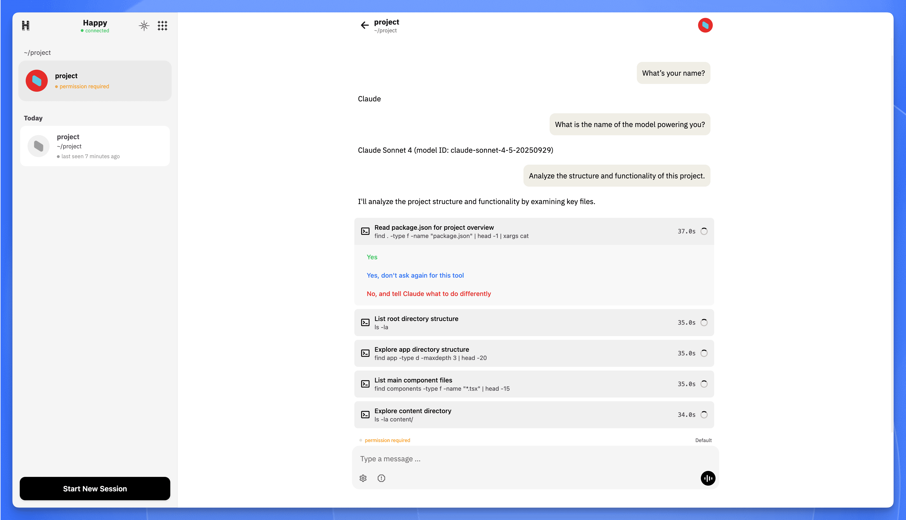

**Imagine:** reviewing a pull request from a coffee shop, fixing a critical bug while commuting, or scaffolding a new project from your couch—all from your phone. This is no longer a fantasy. With AI coding assistants like Anthropic's Claude Code, a truly portable development environment is surprisingly within reach.

While there isn't an official "Claude Code" mobile app, the developer community has devised ingenious ways to bridge this gap. These solutions transform your phone from a communication device into a powerful remote control for your development workflow.

This guide provides a comprehensive overview of the most effective strategies for using Claude Code on your mobile device, from DIY setups to one-click cloud environments.

## Why Code on a Phone, Anyway?

Let's be honest: coding on a tiny touchscreen sounds miserable. And for building an entire application from scratch, it is. The real value of a mobile coding setup isn't to replace your desktop, but to **extend** it.

**The Advantages:**

  * **Unmatched Portability**: The freedom to manage projects from anywhere. You are no longer tethered to a specific location to be productive.
  * **Emergency Fixes**: A critical bug alert arrives while you're away. A mobile setup lets you immediately investigate and deploy a hotfix, turning a crisis into a minor inconvenience.
  * **AI-Powered Project Management**: Much of working with Claude involves high-level instructions and review. These tasks are perfect for a mobile interface, letting you delegate work to your AI partner and keep projects moving on the go.
  * **Continuous Learning**: A dev environment in your pocket is a fantastic tool for testing snippets, experimenting with libraries, or working through tutorials in spare moments.

**The Challenges:**

  * **Limited Screen Real Estate**: Difficult for viewing multiple files or complex codebases.
  * **Virtual Keyboards**: Slow and error-prone for typing complex syntax.
  * **Environment Constraints**: Phones can't run a full-fledged local development environment.

The key is leveraging mobile for targeted tasks. When combined with an AI assistant that handles the heavy lifting of code generation, mobile development becomes not just possible, but practical.

## The Core Concept: A Remote-First Architecture

Every method shares a fundamental principle: **your phone is a remote control for a more powerful host machine.**

The Claude Code CLI (Command-Line Interface) runs on a primary computer (the "host")—your desktop, a laptop, or a cloud server. Your phone connects to this host, allowing you to send commands and view the output. This gives you the full power of a proper computer, accessed through the convenience of your phone.

Let's explore the best ways to build this connection.

## Method 1: The Power User's Setup (SSH + Tailscale)

This is the most robust and flexible method, giving you a direct, secure terminal session to your host machine from anywhere. It's the gold standard for remote access.

  * **Host Machine**: A computer (Windows with WSL, macOS, or Linux) that is on and connected to the internet. This is where the Claude Code CLI runs.
  * **SSH (Secure Shell)**: The protocol providing a secure, encrypted command-line connection—your tunnel.
  * **[Tailscale](https://tailscale.com/)**: A brilliantly simple networking tool. It creates a secure private network (VPN) between your devices, letting them connect directly without complex router configuration.
  * **[Termius](https://termius.com/) (or similar SSH Client)**: A mobile app (iOS/Android) that acts as your terminal window.

### How to Set It Up:

1.  **On Your Host Machine**:
      * Install and configure the Claude Code CLI.
      * Install and log into Tailscale.
2.  **On Your Phone**:
      * Install the Tailscale app and log in with the *same* account.
      * Install an SSH client like Termius.
3.  **Connect**:
      * In the Tailscale app, copy the private IP address of your host machine.
      * In Termius, create a new host connection using the Tailscale IP and your host machine's username and password.

Once connected, you have a fully functional terminal on your host. You can run Claude Code, edit files, and execute any command as if you were sitting right in front of it.

## Method 2: The UI-Centric Approach with Happy

If a raw terminal feels too stark, the **[Happy](https://happy.engineering/)** ecosystem provides a polished experience designed for remote mobile development. It pairs a sleek mobile app with a CLI tool to create an intuitive bridge to your dev environment.



### The Core Components:

  * **The Happy Client**: Your gateway, available as a native app (iPhone/Android) or a web app.
  * **The `happy-coder` CLI & Claude Code**: Two tools installed on your host machine. `happy-coder` is the secure bridge, and `@anthropic-ai/claude-code` is the AI editor.

### How to Set It Up:

**Prerequisites:**

  * A host machine (Linux, macOS, or Windows with WSL).
  * **Node.js v18 or later** installed on the host.

**Step 1: Install the Backend Tools**

On your host machine's terminal, install both packages globally using npm:

```bash
# Install the Happy Coder connectivity tool
npm install -g happy-coder

# Install the Claude Code AI editor
npm install -g @anthropic-ai/claude-code
```

**Step 2: Authenticate Claude Code**

You need to connect Claude to an AI model.

  * **Option 1: Official Anthropic Subscription**: Run `claude`, then type `/login` and follow the prompts.
  * **Option 2: Third-Party API (like Sealos AI Proxy)**: Use environment variables to connect. Set the following in your terminal with your provider's credentials:

```bash
# Example for Sealos AI Proxy
export ANTHROPIC_BASE_URL=https://aiproxy.usw.sealos.io
export ANTHROPIC_AUTH_TOKEN=your-api-token-here
export ANTHROPIC_MODEL=claude-sonnet-4-5-20250929
```

**Step 3: Link Your Mobile App**

1.  **Download the Client**: Get the app from the **[App Store](https://apps.apple.com/us/app/happy-claude-code-client/id6748571505)**, **[Google Play](https://play.google.com/store/apps/details?id=com.ex3ndr.happy)**, or open the **[Web App](https://app.happy.engineering/)**.
2.  **Generate QR Code**: In your host terminal, run:

    ```bash
    happy --auth
    ```
    A QR code will appear.
3.  **Scan and Connect**: In the Happy Coder mobile app, add a new connection and scan the QR code to securely pair your devices.

Now, you can start a new conversation in the Happy client to interact with your remote terminal and code with Claude.

### The Accelerator: The 1-Click Solution with Cloud Development Environments (CDEs)

For those who want to bypass manual setup entirely, a **Cloud Development Environment (CDE)** is the ultimate shortcut. A CDE is an on-demand, pre-configured workspace that runs in the cloud, eliminating the need to manage your own host machine.

**[Sealos DevBox](/products/devbox)** offers a ready-made template where `happy-coder` and `Claude Code` come pre-installed.

This is the fastest path from zero to coding:

1.  **Instant Environment**: With a single click, DevBox provisions a fully isolated development environment in the cloud in under 60 seconds. You skip all Node.js and npm installation steps.
2.  **Immediate Connection**: Once the environment is running, you just need to run `happy --auth` to link your mobile app (Step 3) and configure your AI model (Step 2).

It’s the quickest way to get a powerful, disposable cloud workspace without touching your local machine.

➡️ **[Launch the Claude Code Environment on Sealos DevBox](https://os.sealos.io/?openapp=system-devbox?page%3Dcreate%26runtime%3Dclaude-code)**

## Conclusion

The path to a truly mobile development workflow is clear. While an official app may be on the horizon, today’s solutions already turn your phone into a powerful extension of your development environment.

  * For **total control**, the **SSH and Tailscale** method offers unparalleled, direct access.
  * For a **friendlier experience**, UI-centric tools like **Happy** bridge the gap with a polished interface.
  * For **maximum efficiency**, **Cloud Development Environments (CDEs)** like the **Sealos DevBox** eliminate setup entirely, offering an instant, powerful workspace in the cloud.

The future of coding isn't about being chained to a desk. It's about having the right tools to be productive, wherever you are. For those interested, you can explore setting up your own cloud-based environment on **[Sealos Cloud](https://os.sealos.io)**.
