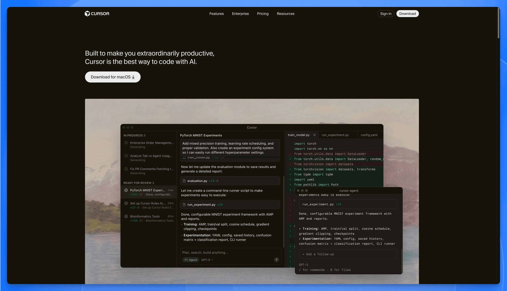
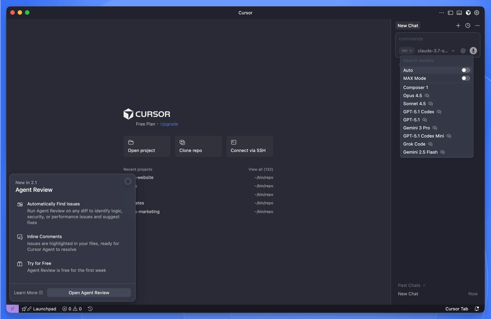

Looking for a free Cursor student plan? Good news: Cursor now offers students one full year of Pro access—completely free. That's $240 worth of AI-powered coding features, available to anyone with a valid .edu email or student enrollment proof.

If you haven't heard of Cursor: it's a VS Code fork built by MIT engineers at Anysphere, backed by the OpenAI Startup Fund. The company jumped from $1M to $100M in annual revenue in under two years—one of the fastest growth runs in SaaS history. The reason? Developers discovered what some call "vibe coding": describing what you want in plain language and letting AI write the implementation.

## What is Cursor?



Cursor is a VS Code fork with AI built into its core—not bolted on as a plugin, but wired into the editor itself. It connects to large language models (Gemini, Claude, and others) and uses them to do things a traditional editor simply can't.

### The Three Features That Matter Most

**Tab AI (Next Action Prediction)**
Press Tab, and Cursor doesn't just finish a line—it predicts your next edit. Switch files, and it often knows which one you meant to open.

**Shadow Workspace**
Cursor can test risky changes in a hidden copy of your project before touching the real files. It runs your tests, catches errors, and only surfaces suggestions that actually work. 

**Agent Mode**
Describe what you want in plain English. Cursor's agent will plan the changes, edit multiple files, create new ones if needed, and explain its reasoning as it goes. GitHub Copilot suggests code inline; Cursor orchestrates entire features.

### Other Useful Tools

- **Natural language generation**: Write a comment describing what you need; get working code back.
- **Error explanations**: Cursor translates cryptic stack traces into sentences you can actually understand—and often suggests a fix.
- **Codebase Q&A**: Ask "where is authentication handled?" and get a pointed answer instead of grepping through folders.
- **Refactoring suggestions**: One-click restructuring with AI guidance.
- **Terminal integration**: Run shell commands from the editor, with a confirmation step so you don't accidentally `rm -rf` anything important.

## Cursor Student Plan: What's Included

On May 7, 2025, Cursor opened its full Pro tier to students—free for a year. That's $240 you keep in your pocket.

Here's what you unlock after verification:

### Feature Comparison Table

| Feature                 | Free Student Pro Plan (1 Year) | Basic Free Plan      |
| ----------------------- | ------------------------------ | -------------------- |
| Premium Model Access    | ✅                             | ❌                   |
| Fast Premium Requests   | 500 per month                  | None                 |
| Slow Premium Requests   | Unlimited                      | None                 |
| AI Chat Interactions    | Unlimited                      | Limited to 300/month |
| GPT-4 Powered Functions | ✅                             | ❌                   |
| o1-mini Model Uses      | 10 per day                     | ❌                   |
| Custom AI Commands      | ✅                             | ❌                   |
| Fast Context Awareness  | ✅                             | Limited              |
| Priority Support        | ✅                             | ❌                   |
| Multi-Language Support  | 20+ Languages                  | Limited              |

One thing to know: once you burn through those 500 fast requests in a month, Cursor doesn't cut you off. It queues your requests behind paying users. You'll still get answers—just with a short wait during busy hours.

## How to Claim Your Free Cursor Student Plan 

Skip the fine print. Here's the short version.

**Who qualifies:**

- High school, college, university, or bootcamp students
- Anyone with a .edu email (or other proof you're enrolled)
- Age 13 or older

**Step-by-Step Signup Process:**

1. Go to [cursor.sh/students](https://cursor.sh/students)
2. Sign up with your school email
3. If you have a .edu address, verification is instant. No .edu? Upload proof—an acceptance letter or current class schedule works fine.
4. Enter payment details. You won't be charged for 12 months, but Cursor needs a card on file.
5. Wait. Most approvals come through within 48 hours.

**A few things worth knowing:**

- Already paying for Pro? Verify your student status and Cursor refunds whatever's left on your subscription.
- Set a calendar reminder for month 11. The plan auto-renews at $20/month unless you cancel first.
- Expect to re-verify your student status once a year.

## Why Cursor Matters for Student Developers

### A Tutor That Never Sleeps

It's 2 AM. You're stuck on a binary search tree implementation, the assignment is due tomorrow, and office hours don't start until Thursday.

Sound familiar?

With Cursor, you just type:

```javascript
// How do I implement a binary search tree in JavaScript?
```

And you get an answer. Not a Stack Overflow link buried under five outdated solutions—an actual explanation, right there in your editor, walking you through the logic.

This isn't about getting answers handed to you. It's about having someone to talk to when you're learning alone.

### Syntax Is No Longer the Bottleneck

Here's a dirty secret about learning to code: most of the frustration isn't conceptual. It's syntactical. You understand *what* you need to do—read a file, filter some data, calculate an average—but you're stuck Googling whether Python uses `readlines()` or `read().split()`.

Cursor flips that equation. Type what you want in plain English:

```python
# I need to read a CSV file, filter rows where age > 18, and calculate the average salary
```

The AI handles the syntax. You focus on the thinking.

Programming courses should teach you to solve problems, not memorize API documentation. When the boilerplate disappears, what's left is the actual skill: breaking down a problem, structuring a solution, understanding why it works.

### From Toy Projects to Real Codebases

There's a gap that textbooks don't prepare you for. In class, you write 200-line programs. In internships, you inherit 200,000-line codebases. The jump is brutal.

Cursor makes it less so. Point at a component and ask:

```
Explain how this React component interacts with the Redux store
```

Suddenly, a sprawling codebase becomes navigable. You stop staring at files wondering where to start. You start asking questions and getting answers.

### Speed Without Shortcuts

Here's what actually slows students down: not the hard problems, but the tedious ones. Renaming a variable across 12 files. Wiring up boilerplate for the hundredth time. Debugging a test that fails for reasons unrelated to your actual code.

Cursor's Tab AI, Agent Mode, and Shadow Workspaces handle these. The IDE anticipates your next edit, proposes changes across multiple files, and validates them before anything breaks.

The result? You work faster—not because you're cutting corners, but because you're spending time on decisions that matter. Architecture. Logic. Design.

Senior engineers have always had this advantage: they've internalized the boilerplate, so they focus on the interesting parts. Cursor gives you that advantage on day one.

### What "Vibe Coding" Actually Means

There's a term floating around the Cursor community: *vibe coding*. It sounds fluffy. It's not.

Vibe coding is what happens when friction disappears. You have an idea. You type it. It works. You iterate. Ideas flow into code without the usual interruptions—syntax errors, forgotten imports, mysterious type mismatches.

For students, this changes the emotional texture of programming:

- **Prototype in minutes, not hours.** A rough idea becomes working code before you lose momentum.
- **Experiment without fear.** Shadow Workspaces mean you can try wild changes without breaking your main branch.
- **Enjoy building again.** When the tedious parts vanish, what's left is creative work.

This isn't laziness. It's removing the parts of coding that aren't teaching you anything. And when those are gone, the real learning begins.

## Cursor vs GitHub Copilot: Student Comparison

**Here's the real difference: Cursor isn't a plugin bolted onto an existing editor—it's a full IDE built with AI at its core.** GitHub Copilot, by contrast, runs as an add-on inside VS Code or JetBrains. Why should you care? Because Cursor can do things a plugin simply can't: coordinate changes across multiple files, test risky edits in a hidden workspace before they touch your code, and keep track of your entire project without extra configuration.

The table below breaks it down:

| Feature                | Cursor                                         | GitHub Copilot                          | Traditional IDEs                 | Online Tutorials |
| ---------------------- | ---------------------------------------------- | --------------------------------------- | -------------------------------- | ---------------- |
| Architecture           | AI-native IDE (VS Code fork + built-in agents) | Plugin layered onto VS Code/JetBrains   | Desktop-first, manual setup      | N/A              |
| Cost for Students      | Free (1 year)                                  | Discounted                              | Varies                           | Often Free       |
| AI Integration         | Deep (Tab AI, Shadow Workspace, Agent Mode)    | Inline code completion + chat           | Minimal/None                     | None             |
| Learning Resources     | Built-in                                       | Separate                                | Separate                         | Primary Focus    |
| Codebase Understanding | Advanced                                       | Basic                                   | Manual                           | N/A              |
| Setup Complexity       | Low                                            | Medium                                  | High                             | N/A              |

## A Student Community That Actually Helps

Around 70,000 people hang out on r/Cursor, and a surprising number of them are students. On any given day, you'll find threads about prompt tricks, agent configurations, and the occasional rant about a confusing error message. It's messier than official documentation—and often more useful.

Beyond Reddit, there's an [official forum](https://forum.cursor.com), walk-throughs on LinkedIn Learning, and independent courses like Nat Eliason's "Build Your Own Apps with Cursor." None of these feel corporate-polished. They're made by people who use the tool and want to share what they've figured out.

What does this mean when you're stuck at 2 AM? You can post your problem and get a response—not from a support ticket queue, but from another student who hit the same wall last week. Bootcamps and hackathons have started recommending Cursor as their go-to AI IDE, so the person sitting next to you at a coding event probably knows their way around it too.

## Getting More Out of Cursor: Features and Techniques That Actually Help

### Features Worth Knowing

These aren't hidden in settings menus. They're the things you'll reach for daily once you know they exist.

**@Codebase and @Web Tools**

Search your entire project—or the internet—without switching windows.

```
@Codebase how are authentication tokens handled in this project?
```

Useful when you inherit someone else's code. Which, in group projects, is constantly.

**Input Images and Documentation**

Upload a screenshot or a PDF. Cursor can work with it.

```
Can you explain what's happening in this diagram I uploaded?
```

Handy when your professor's lecture slides make more sense to a machine than to you.

**Plain-English Code Editing**

Describe what you want changed. Cursor rewrites it.

```
Convert this function to use async/await instead of promises
```

---

### Study Techniques That Work

These aren't gimmicks. They're patterns students have figured out through actual use.

**1. Code Explanation Mode**

Paste confusing code from your textbook. Ask what it does.

```
Explain this algorithm and what each part does
```

Most textbooks assume too much. Cursor doesn't.

**2. Concept Implementation Practice**

Ask for multiple solutions to the same problem.

```
Show me three different ways to implement a linked list in Python
```

Seeing variations side by side is often more instructive than reading about "the right way."

**3. Interactive Debugging**

When something breaks, ask why.

```
Why isn't this function returning the correct result?
```

The explanation often matters more than the fix.

**4. The Sandbox Method**

Try solving a problem yourself first. Then ask Cursor for its version. Compare.

```
I tried to write this loop, but it's slow. How would you optimize it?
```

This isn't cheating. It's how you learn to recognize better patterns.

**5. Learning from AI Mistakes**

Cursor isn't always right. Treat it like a study partner who sometimes gets things wrong. Finding its errors is a surprisingly effective way to test your own understanding.

---

### Fitting Cursor into Your Courses

Different classes, different uses:

- **Data Structures & Algorithms**: Ask for explanations of complex algorithms. Request alternative implementations to see trade-offs.
- **Web Development**: Generate boilerplate so you can focus on the interesting parts. Ask about framework patterns when documentation fails you.
- **Machine Learning**: Get help with data preprocessing and model implementation. The syntax overhead in ML libraries is enormous—let Cursor handle it.
- **Systems Programming**: Have low-level concepts explained in plain language. Ask for safer patterns when working with memory or concurrency.

## What Students Are Saying

Two perspectives from students who've used Cursor through full semesters:

> "As a first-generation computer science student, I often felt behind my peers who had been coding since childhood. Cursor's AI assistant helped me catch up by explaining concepts in ways I could understand and showing me how to implement them correctly."
> — Jamie, Computer Science Junior

> "My senior project seemed overwhelming until I started using Cursor. Being able to ask questions about the codebase and get intelligent refactoring suggestions made managing a large project possible for the first time."
> — Miguel, Software Engineering Senior

A pattern shows up in both stories: Cursor tends to help most when you feel behind, or when you're tackling something bigger than you've attempted before.

## Going Remote: Cursor Meets Cloud Development

Your laptop has limits. Maybe it's an aging MacBook Air that groans under a Docker build. Maybe you're in a dorm room with spotty Wi-Fi and no way to leave a heavy process running overnight. This is where remote development changes things.

Cursor inherits VS Code's Remote SSH extension, which means you can run the editor on your local machine while the actual code executes on a remote server. Point Cursor at a cloud workspace—say, one hosted on Sealos—and suddenly your five-year-old laptop can train ML models or spin up a Kubernetes cluster. The heavy lifting happens elsewhere. You just type.

### Why This Matters for Students

1. **Your Hardware Stops Being the Bottleneck**
   Fine-tuning an LLM for a class project? Running integration tests on a large codebase? That work runs on cloud CPUs (or GPUs), not your overheating laptop.

2. **"Works on My Machine" Becomes Irrelevant**
   Group projects often die on configuration mismatches. A shared remote environment means everyone codes against the same setup. No more debugging someone else's local Python version at 2 AM.

3. **Work From Anywhere, On Anything**
   Library computer. Friend's laptop. A tablet with a keyboard. If it can run Cursor—or even a browser-based SSH client—you're in.

4. **Share Your Exact Setup When Asking for Help**
   Instead of describing your environment to a TA, give them access. They see exactly what you see.

5. **Skip the Setup Nightmare**
   Installing PostgreSQL, configuring Node versions—these tasks eat hours. Pre-configured cloud templates let you start coding in minutes.

### Sealos as a Cloud Backend

[Sealos](/) is one option for hosting your remote workspace. It's a Kubernetes-based cloud platform with features built for developers:

- **Student-Friendly Free Tier**: More resources than typical free cloud accounts.
- **Pre-Built Templates**: Environments for common stacks—Python ML, Node.js, Go—ready to clone.
- **Team Workspaces**: Shared environments for group projects, so everyone works on identical setups.
- **Global Edge Nodes**: Low latency whether you're connecting from campus, a coffee shop, or home.

#### A Typical Workflow

Here's what using Cursor with Sealos actually looks like:

1. **Spin up a development environment** from a template (takes about one minutes).
2. **Connect Cursor** via Remote SSH—one click if you've saved the config.
3. **Code with AI assistance** as usual; Cursor's features run locally, but file operations happen on the remote machine.
4. **Run tests or builds** on the cloud server's resources.
5. **Push to Git** when done; the environment persists for next time.

The result: you get Cursor's AI-powered editing without your laptop becoming a space heater. For students working on anything heavier than a simple script—ML projects, containerized apps, full-stack assignments—this setup removes a real friction point.

To explore the student program, visit [sealos.io/education](/education).

## Getting Started with Cursor as a Student

### First Steps After Installation

You've got the Pro plan. Now what?

1. **Run the interactive tutorial first.** It's short, and it'll show you features you'd otherwise discover by accident three months later.

2. **Connect your GitHub repos.** Pull and push without leaving the editor—no more juggling terminal windows.

3. **Install extensions for your stack.** Python, Java, web frameworks—whatever your courses throw at you. Cursor inherits VS Code's entire extension library.

4. **Set up a few custom AI commands.** If you keep asking Cursor to "explain this error" or "add type hints," save it as a shortcut. Small automation, big time savings.

5. **Understand the fast vs. slow request system.** You get 500 fast requests per month. Use them for time-sensitive work. When they run out, slow requests still function—just with a brief wait. Don't panic when you hit the limit; the slow queue handles everyday coding just fine.

### Best Practices for Learning with AI Assistance

Here's the thing: Cursor can write code faster than you can. That's the point. But if you copy-paste whatever it generates without reading it, you'll pass the assignment and learn nothing.

A few guardrails that actually help:

- **Read the code before you run it.** Line by line. If you can't explain what a line does, you're not ready to submit.

- **Ask "why," not just "how."** Don't stop at working code. Ask Cursor to explain *why* it chose that approach over alternatives.

- **Try first, then compare.** Write your own solution—even a broken one. Then ask Cursor for its version. The gap between the two is where real learning happens.

- **Treat AI output like a peer's code review.** Often right, sometimes wrong, occasionally brilliant. Your job is to know which is which.

## What This Means for Learning to Code

The shift is already underway. Programming courses are spending less time on syntax drills and more time on design thinking, debugging strategies, and understanding *why* code works—not just *how* to type it. AI handles the repetitive parts; students get to focus on the interesting ones.

Free access matters here. A student at a well-funded university and a self-taught learner in a small-town library should have the same shot at these tools. Cursor's student plan is one step in that direction.

## Frequently Asked Questions About Cursor Student Plan

### Is Cursor really free for students?

Yes. Cursor offers a completely free Pro plan for verified students, valid for one full year. This is the same $20/month tier that professional developers pay for—a total value of $240. You'll need to provide a valid .edu email or proof of enrollment to qualify.

### What happens after the free year ends?

Your account will automatically convert to a paid Pro subscription at $20/month unless you cancel before the 12-month period ends. Set a reminder for month 11 to decide whether to continue, downgrade to the free tier, or cancel entirely.

### Can I use Cursor student plan without a .edu email?

Yes. If your school doesn't issue .edu addresses, you can upload alternative proof of enrollment—such as an acceptance letter, current class schedule, or student ID. Verification typically takes 24-48 hours for non-.edu applications.

### Does the Cursor student plan work with all programming languages?

Cursor supports 20+ programming languages including Python, JavaScript, TypeScript, Java, C++, Go, Rust, and more. The AI features work across all supported languages, though performance may vary slightly depending on the language's representation in the training data.

### Can I use the Cursor student plan for commercial projects?

Yes. The student Pro plan includes the same features and permissions as the regular Pro plan. You can use it for freelance work, startup projects, or any other commercial purposes during your free year.

### What's the difference between fast and slow requests?

Fast requests are processed immediately with priority server access—you get 500 of these per month. Once depleted, your requests join the slow queue, which processes during off-peak times or after paying users. Slow requests still work fine for everyday coding; you'll just notice a brief delay during busy hours.

### Can high school students get the free Cursor plan?

Yes. The student plan is available to high school students, college/university students, bootcamp participants, and anyone aged 13 or older who can verify current enrollment in an educational program.

### I'm already paying for Cursor Pro. Can I switch to the student plan?

Yes. If you verify your student status while on a paid Pro subscription, Cursor will refund the remaining balance on your current billing cycle and switch you to the free student plan.

### Does Cursor work offline?

Cursor requires an internet connection for its AI features (Tab AI, Agent Mode, chat). However, basic code editing functions work offline—you just won't have access to AI assistance until you reconnect.

### How does Cursor compare to GitHub Copilot for students?

Both offer student discounts, but they work differently. GitHub Copilot is a plugin that adds AI suggestions to existing editors like VS Code. Cursor is a complete IDE with AI built into its core—enabling features like Shadow Workspace (testing changes before applying them) and multi-file Agent Mode that plugins can't replicate. For a detailed comparison, see our [comparison section above](#how-cursor-compares-to-other-student-coding-resources).

## Wrapping Up

A year of free Pro access won't make you a great programmer. Practice will. Curiosity will. Struggling through problems you don't immediately understand will.

But the right tools can shorten the feedback loop. They can turn a frustrating afternoon into a productive one. They can help you attempt projects you'd otherwise shy away from.

That's what Cursor offers: not a shortcut, but a better-lit path.

If you're a student, [grab the free year](https://cursor.sh/students). Try it on a real project—not just a toy example. See if it changes how you work.

If it doesn't? You've lost nothing but a few hours of experimentation. That's a trade worth making.

---

_Note: Features and eligibility requirements described in this article are subject to change. Please visit the official Cursor website for the most up-to-date information. The one-year free Pro plan for students was announced on May 7, 2025._