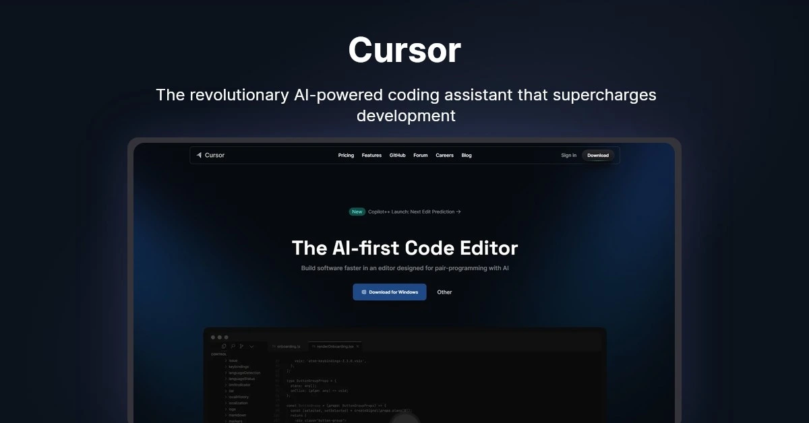

# Cursor's Free Student Plan: AI-Enhanced Coding for Education



In today's rapidly evolving tech education landscape, having access to cutting-edge tools can make a significant difference in students' learning journeys. **Cursor**, the revolutionary AI-powered code editor, now offers a **completely free plan for students for one full year**, making advanced coding assistance accessible to the next generation of developers.

## What is Cursor?

Cursor is not just another code editor - it's an AI-augmented development environment built on top of Visual Studio Code that integrates powerful large language models (LLMs) to transform the coding experience. Founded by ex-Scale AI engineers, Cursor brings AI-powered coding assistance directly into your workflow.

### Key Features of Cursor's AI Integration:

- **Intelligent Code Completion**: Real-time suggestions that understand context beyond simple autocomplete
- **Natural Language Code Generation**: Write comments describing what you want and watch AI generate the code
- **Error Explanation and Fixing**: Get human-readable explanations for errors and AI-suggested fixes
- **Codebase Navigation**: Ask questions about your codebase and get instant answers
- **Code Refactoring Assistance**: Improve and restructure existing code with AI guidance
- **Intelligent Agent Mode**: Complete coding tasks end-to-end with your oversight
- **Terminal Command Automation**: Run terminal commands with confirmation
- **Error Detection and Fixing**: Automatically identify and resolve lint errors
- **Smart Multi-Line Code Suggestions**: Get comprehensive code suggestions across multiple lines

## Cursor's Free Student Plan: What's Included

As announced on May 7, 2025, students can now receive the full Cursor Pro experience completely free for one year (normally $20/month). After verification, the Pro plan is activated with these premium features:

| Feature                 | Free Student Pro Plan (1 Year) | Basic Free Plan      |
| ----------------------- | ------------------------------ | -------------------- |
| Premium Model Access    | ✅                             | ❌                   |
| Fast Premium Requests   | 500 per month                  | None                 |
| Slow Premium Requests   | Unlimited                      | None                 |
| AI Chat Interactions    | Unlimited                      | Limited to 300/month |
| GPT-4 Powered Functions | ✅                             | ❌                   |
| o1-mini Model Uses      | 10 per day                     | ❌                   |
| Custom AI Commands      | ✅                             | ❌                   |
| Fast Context Awareness  | ✅                             | Limited              |
| Priority Support        | ✅                             | ❌                   |
| Multi-Language Support  | 20+ Languages                  | Limited              |

When Pro users exhaust their 500 fast premium requests, Cursor automatically shifts to slower requests with variable wait times based on usage.

## How to Qualify for Cursor's Free Student Plan

Getting access to the free one-year Pro student plan is straightforward for eligible students:

1. **Eligibility Requirements**:

   - Currently enrolled in a high school, college, university, or coding bootcamp
   - Have an active .edu email address or other proof of enrollment
   - Be at least 13 years of age

2. **Application Process**:

   - Visit [cursor.sh/students](https://cursor.sh/students)
   - Sign up with your educational email address
   - Verify your student status (automatic with .edu emails)
   - For non-.edu addresses, submit proof of enrollment documentation
   - Enter payment details (required but not charged for 12 months)
   - Receive approval typically within 48 hours

3. **Important Notes**:
   - Existing Pro users will receive a refund for unused time after verifying student status
   - New users must subscribe through account settings after verification
   - The subscription will automatically renew at the standard rate after 12 months unless cancelled
   - Student verification may be required annually

## Why Cursor's AI Capabilities Matter for Students

### Accelerated Learning Path

For students learning to code, Cursor's AI assistant serves as an always-available tutor. When you're stuck, instead of waiting for office hours or searching through documentation, you can ask directly in your editor:

```javascript
// How do I implement a binary search tree in JavaScript?
```

The AI will provide not just code but explanations tailored to educational purposes, helping students understand concepts more deeply.

### Focus on Problem-Solving, Not Syntax

Beginner programmers often struggle with remembering exact syntax while trying to solve complex problems. Cursor allows students to focus on understanding the logic and problem-solving aspects by handling many of the syntax details:

```python
# I need to read a CSV file, filter rows where age > 18, and calculate the average salary
```

The AI will generate the appropriate code, allowing students to focus on understanding the data processing concepts rather than getting lost in implementation details.

### Real-World Project Experience

Many computer science educators emphasize the importance of working on substantial projects. Cursor's ability to help students understand large codebases makes ambitious projects more approachable:

```
Explain how this React component interacts with the Redux store
```

This capability helps bridge the gap between classroom learning and real-world development scenarios.

## How Cursor Compares to Other Student Coding Resources

| Feature                | Cursor           | GitHub Copilot  | Traditional IDEs | Online Tutorials |
| ---------------------- | ---------------- | --------------- | ---------------- | ---------------- |
| Cost for Students      | Free (1 year)    | Discounted      | Varies           | Often Free       |
| AI Integration         | Deep, Contextual | Limited to Code | Minimal/None     | None             |
| Learning Resources     | Built-in         | Separate        | Separate         | Primary Focus    |
| Codebase Understanding | Advanced         | Basic           | Manual           | N/A              |
| Setup Complexity       | Low              | Medium          | High             | N/A              |

## Maximizing Cursor for Educational Success

### Advanced Features for Students

1. **@Codebase and @Web Tools**: Search your entire project or the internet without leaving the editor

   ```
   @Codebase how are authentication tokens handled in this project?
   ```

2. **Input Images and Documentation**: Provide screenshots or PDFs for better context

   ```
   Can you explain what's happening in this diagram I uploaded?
   ```

3. **Plain-English Code Editing**: Request changes in natural language
   ```
   Convert this function to use async/await instead of promises
   ```

### Effective Study Techniques with Cursor

1. **Code Explanation Mode**: Have the AI explain complex code sections from your textbooks or assignments

   ```
   Explain this algorithm and what each part does
   ```

2. **Concept Implementation Practice**: Request multiple implementations of the same concept to understand different approaches

   ```
   Show me three different ways to implement a linked list in Python
   ```

3. **Interactive Debugging**: Learn debugging by having the AI help identify and explain issues
   ```
   Why isn't this function returning the correct result?
   ```

### Integration with Coursework

Cursor can be seamlessly integrated into various CS coursework:

- **Data Structures & Algorithms**: Get explanations of complex algorithms and alternative implementations
- **Web Development**: Generate boilerplate code and understand framework-specific patterns
- **Machine Learning**: Help with preprocessing data and implementing models
- **Systems Programming**: Explain low-level concepts and provide safer implementation patterns

## Success Stories: Students Using Cursor

> "As a first-generation computer science student, I often felt behind my peers who had been coding since childhood. Cursor's AI assistant helped me catch up by explaining concepts in ways I could understand and showing me how to implement them correctly." - Jamie, Computer Science Junior

> "My senior project seemed overwhelming until I started using Cursor. Being able to ask questions about the codebase and get intelligent refactoring suggestions made managing a large project possible for the first time." - Miguel, Software Engineering Senior

## Elevating the Experience: Cursor IDE with Remote Development

While Cursor offers an exceptional local coding experience, combining it with a remote development environment takes student productivity to new heights. This powerful combination creates what many developers call a "vibe coding" experience - effortless, fluid, and free from technical distractions.

### Why Cursor + Remote Development is the Ultimate Student Setup

1. **Hardware Freedom**: Run resource-intensive projects without taxing your personal laptop - perfect for students with budget-friendly machines
2. **Consistent Development Environment**: Eliminate the "it works on my machine" problem in group projects
3. **Access Anywhere**: Work on your projects from any device with internet access - switch between library computers, personal laptops, or even tablets
4. **Seamless Collaboration**: Share your exact development environment with classmates or professors when seeking help
5. **Focus on Learning, Not Setup**: Skip complex local configurations for frameworks, databases, and dependencies

### Sealos: The Perfect Remote Environment for Students

[Sealos](https://sealos.io) provides an ideal cloud development platform that pairs wonderfully with Cursor's AI capabilities through its seamless SSH and Remote Development integration.

#### The Sealos Education Program

Sealos offers a specialized program for students and educational institutions that complements Cursor's free student offering:

- **Free Tier for Students**: Extended resources compared to standard free accounts
- **Educational Institution Partnerships**: Discounted rates for computer science departments
- **Ready-to-Code Templates**: Pre-configured environments for popular CS courses and frameworks
- **Collaboration Spaces**: Shared environments for student team projects
- **Low-Latency Global Access**: Connect from campus, home, or anywhere with minimal lag

#### How the Cursor + Sealos Workflow Enhances Learning

With this powerhouse combination, students can:

1. **Prototype with AI Assistance**: Use Cursor's AI to rapidly generate and explain code
2. **Deploy and Test Instantly**: Run your code in Sealos cloud environment without configuration headaches
3. **Access Specialized Tools**: Utilize GPU resources for machine learning projects without expensive hardware
4. **Version Without Worry**: Experiment freely with Git branches knowing you can always reset your environment
5. **Get Help Contextually**: Share your exact development setup with instructors for precise guidance

Setting up this workflow takes just minutes and creates a professional-grade development experience that prepares students for industry practices while making learning more accessible and enjoyable.

To learn more about combining Cursor with Sealos for educational purposes, visit [sealos.io/education](https://sealos.io/education).

## Getting Started with Cursor as a Student

### First Steps After Installation

1. **Take the interactive tutorial** to understand Cursor's unique AI capabilities
2. **Connect your GitHub repositories** for seamless integration with your projects
3. **Install extensions** that complement your coursework (Python, Java, web development, etc.)
4. **Create custom AI commands** for repetitive tasks in your assignments
5. **Learn to use both fast and slow request options** to optimize your premium quota

### Best Practices for Learning with AI Assistance

While Cursor's AI capabilities are powerful, they're most effective when used as a learning tool rather than a replacement for understanding. Consider these best practices:

- **Always read and understand generated code** before submitting it
- **Ask the AI to explain its suggestions** to deepen your comprehension
- **Use AI assistance to explore alternative approaches** to problems
- **Challenge yourself to implement solutions independently** before asking for help

## Future of Education with AI-Assisted Coding

As tools like Cursor become more prevalent in education, we're seeing a shift in how programming is taught and learned. Rather than focusing on memorization of syntax or standard algorithms, education can move toward higher-level concepts, creative problem-solving, and practical application.

Cursor's commitment to providing free access to students represents an important step in ensuring that advanced AI tools enhance educational equity rather than creating new divides.

## Conclusion: Empowering Student Developers

Cursor's free one-year Pro plan offers an unprecedented opportunity for learners to work with cutting-edge AI assistance during their educational journey. By removing financial barriers to professional-grade tools, Cursor is helping to prepare the next generation of developers for a future where human-AI collaboration is the norm.

Whether you're taking your first programming course or working on an advanced capstone project, Cursor's AI-enhanced environment can help you learn more efficiently, tackle more ambitious projects, and develop the skills needed for today's technology landscape.

Ready to transform your coding education? [Sign up for Cursor's free student plan today](https://cursor.sh/students) and experience the future of AI-assisted programming.

---

_Note: Features and eligibility requirements described in this article are subject to change. Please visit the official Cursor website for the most up-to-date information. The one-year free Pro plan for students was announced on May 7, 2025._
