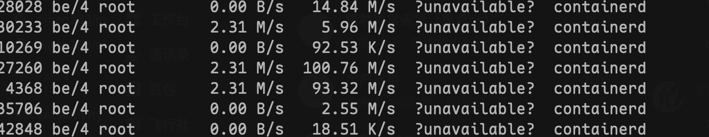
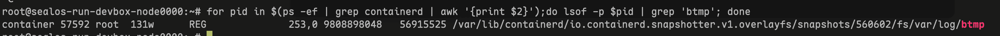

# Case Study: How We Reduced a Container Image by 99.7% (800GB to 2GB)

This case study is a real-world story from the Sealos platform engineering team. We believe in transparency, and this is a detailed account of how we diagnosed and resolved a critical production issue, sharing our hands-on experience to help the broader cloud-native community.

### TL;DR

We tackled critical container image bloat on our Sealos platform, fixing a severe disk space exhaustion issue by shrinking an 800GB, 272-layer image to just 2.05GB. Our solution involved a custom tool, `image-manip`, to surgically remove files and squash the image layers. This 390:1 reduction not only resolved all production alerts but also provides a powerful strategy to reduce container image size.

### 1. The Problem: Critical Disk Exhaustion Caused by Container Image Bloat

It was 2 PM when the PagerDuty alert blared for the fifth time that week: "Disk Usage > 90% on `devbox-node-4`." Our Sealos cluster's development environment node was once again evicting pods, grinding developer productivity to a halt. This was a classic symptom of [Kubernetes](https://kubernetes.io/docs/concepts/overview/) disk space exhaustion, but the root cause was elusive. The node was equipped with a hefty 2TB SSD, yet a simple `df -h` confirmed only 10% of its space remained.

Our initial reaction was to treat the symptom. We expanded the node's storage to 2.5TB, assuming a transient workload spike. The next day, the alert returned, mocking our efforts. The problem wasn't a spike; it was a cryptic, relentless consumption of storage stemming from what we would later discover was extreme container image bloat. For a platform promising stable and predictable development environments, this failure was an unacceptable breach of trust.

### 2. Why It Matters: The Business Context

The **[Sealos devbox feature](/products/devbox)** is a cornerstone of our value proposition: providing developers with isolated, one-click, reproducible cloud-based environments. This persistent disk space exhaustion, a problem often linked to scenarios where a Docker image is too large, wasn't just a technical nuisance; it was a direct threat to that core promise. Unreliable environments lead to frustrated developers, lost productivity, and ultimately, customer churn. The stability of this single feature was directly tied to user trust and our platform's reputation in a competitive market. We weren't just fixing a disk; we were defending our product's integrity.

### 3. Investigation: Pinpointing the I/O Storm with iotop and du

Our hands-on investigation began by hunting for the source of the bleeding. The first tool we reached for was `iotop` to identify any processes with abnormal I/O activity. The culprit was immediately apparent: multiple **[containerd](https://containerd.io/)** processes were writing to disk at a sustained, alarming rate of over 100MB/s. For a container runtime managing mostly idle development environments, this was a massive red flag.



This pointed to a problem within the containers themselves. We began hunting for the largest offenders within containerd's storage directory, using `du` to scan the overlayfs snapshots.

```bash
du -h -d4 /var/lib/containerd/io.containerd.snapshotter.v1.overlayfs/snapshots/ \
  | sort -hr | head -20
```

The output was not what we expected. Instead of a mix of large user files, a single filename appeared repeatedly, each instance a monstrous 11GB.

```plain
11G     /var/lib/containerd/.../snapshots/560660/fs/var/log/btmp
11G     /var/lib/containerd/.../snapshots/560659/fs/var/log/btmp
11G     /var/lib/containerd/.../snapshots/560652/fs/var/log/btmp
11G     /var/lib/containerd/.../snapshots/560631/fs/var/log/btmp
11G     /var/lib/containerd/.../snapshots/560620/fs/var/log/btmp
```

The file `/var/log/btmp` is a standard Linux system file that records failed login attempts. On a healthy system, it measures in kilobytes. An 11GB `btmp` file is unheard of. We inspected the contents of one of these files using the `last` command.

```bash
last -f /var/lib/containerd/.../snapshots/560576/fs/var/log/btmp | tail -10
```

The terminal was flooded with a scrolling wall of failed SSH login attempts, timestamped at a rate of dozens per second. This was clear evidence of a persistent, months-long brute-force attack. Our system had been dutifully recording every single failed attempt.

### 4. Root Cause: How OverlayFS Copy-on-Write Amplified a Brute-Force Attack

The discovery of the brute-force attack was only the first layer of the problem. Why did it cause such catastrophic disk usage? This analysis revealed the root cause of our container image bloat: a perfect storm created by the intersection of container image architecture and a series of security oversights.

**Primary Technical Contradiction: Copy-on-Write vs. Log Files**

The core of the issue was a disastrous interaction between **[OverlayFS](https://www.kernel.org/doc/html/latest/filesystems/overlayfs.html)**'s Copy-on-Write (CoW) mechanism and the ever-growing `btmp` file, a textbook example of poor **OverlayFS copy-on-write performance** when handling large, frequently modified files. The problematic user image had an astonishing **272 layers**, each representing a `commit` operation.



Here's how the disaster unfolded:

1.  A user's container is under a brute-force attack, and `/var/log/btmp` grows to 11GB.
2.  The user performs a `commit`, creating a new image layer.
3.  A single new failed login is appended to `/var/log/btmp`.
4.  Because of CoW, OverlayFS doesn't just write the new line. It copies the *entire 11GB file* into the new, upper layer.
5.  This process repeated 271 times.

Even if the user deleted the `btmp` file in the newest layer, the 271 copies of the 11GB file would remain immutably stored in the layers underneath. The disk space was fundamentally unrecoverable through standard container operations.

**Compounding Factors: The Swiss Cheese Model**

This technical failure was enabled by three distinct oversights in our platform's design:

  * **Defense #1 (Missing): A Cap on Image Layer Growth.** We had no safeguards to prevent an image's layer count from ballooning. This allowed the CoW problem to compound exponentially.
  * **Defense #2 (Missing): Secure Base Image Configuration.** Our early `devbox` base images prioritized ease-of-use, leaving SSH password authentication enabled and exposed to the public internet without rate-limiting tools like `fail2ban`.
  * **Defense #3 (Missing): Log Rotation.** Believing containers to be ephemeral, we omitted a standard `logrotate` configuration for system logs like `btmp`. This fatal assumption allowed a single log file to grow without bounds.

### 5. Solution: Building a Custom OCI Tool to Squash 272 Image Layers

Standard `docker` commands were insufficient; we had to perform surgical **[OCI image](https://github.com/opencontainers/image-spec)** manipulation on its immutable history. This required building our own specialized tooling and a dedicated, high-performance processing environment to truly reduce the container image size.

**Architecture Rework: The `image-manip` Scalpel**

We developed a new CLI tool, `image-manip`, to treat OCI images as manipulable data structures. For this task, we leveraged two of its core functions:

1.  **`image-manip remove /var/log/btmp <image>`**: This command adds a new top layer containing an OverlayFS "whiteout" file. This special marker instructs the container runtime to ignore the `btmp` file in all underlying layers, effectively deleting it from the merged view without altering the original layers.
2.  **`image-manip squash`**: This is the key to reclaiming disk space and the core of our strategy to squash the image layers. The tool creates a temporary container, applies all 272 layers in sequence to an empty root filesystem, and then exports the final, merged filesystem as a single new layer. This flattens the image's bloated history into a lean, optimized final state.

**Tool Innovation: The High-Performance Operating Room**

Performing these intensive operations on production nodes was not an option. We built dedicated `devbox-image-squash-server` nodes in three regions using `ecs.c7a.2xlarge` instances (8-core CPU, 16GB RAM). To handle the I/O storm, we configured a striped **[LVM (Logical Volume Management)](https://www.redhat.com/sysadmin/lvm-logical-volume-management)** volume across two 1TB ESSD cloud disks.

```bash
# Create LVM volume group
pvcreate /dev/vdb /dev/vdc
vgcreate vg_containerd /dev/vdb /dev/vdc
lvcreate -i 2 -I 4 -l 100%Free -n lv_containerd vg_containerd
mkfs.xfs /dev/vg_containerd/lv_containerd
```

A **[`fio`](https://fio.readthedocs.io/en/latest/)** benchmark confirmed our setup could handle the load, achieving 90.1k random write IOPS.

```bash
fio -direct=1 -iodepth=32 -rw=randwrite -ioengine=libaio \
    -bs=4k -numjobs=4 -time_based=1 -runtime=1000 \
    -group_reporting -filename=/var/lib/containerd/fio -size=10G
```

Finally, we fine-tuned the OS to give `containerd` maximum I/O priority.

```bash
# Prioritize containerd I/O
cat > /etc/systemd/system/containerd.service.d/ioscheduling.conf <<EOF
[Service]
IOSchedulingClass=realtime
IOSchedulingPriority=0
EOF

# Use the 'none' scheduler for high-performance NVMe
echo none > /sys/block/vdb/queue/scheduler
echo none > /sys/block/vdc/queue/scheduler
```

At 10:00 AM on September 11, we began the procedure on the most critical image: 800GB spread across 272 layers. The `remove` operation, which adds a "whiteout" layer, was nearly instantaneous:

```bash
# 💀 The old way: a mountain of layers
create diff for snapshot file-removal-514774748-OJFv cost 12.555249ms
```

The `squash` operation was the main event. After an hour of intense processing, the logs delivered the news we were hoping for.

```plain
INFO[0000] start to squash 272 layers...
INFO[0060] applied layer 1/272
INFO[0120] applied layer 2/272
...
INFO[3627] apply 272 layers took 1h0m26.977030719s
# 🚀 The magic fix: collapsing 272 layers into one
INFO[3756] rebase image successfully, cost 1h2m36.074285014s
```

### 6. Validation: The Proof Is in the Data

The new, squashed image was a mere **2.05GB**. We had achieved a staggering 390:1 compression ratio.

After pushing the optimized image, we restarted the user's `devbox`. It started successfully. A quick check confirmed the operation's success: the user's environment was perfectly intact, and the `btmp` monster was gone.

```bash
devbox@linux:~$ ls -lah /var/log/
total 84K
-rw-r--r-- 1 root root     0 Aug 12  2024 btmp  # File exists, but is now 0 bytes
-rw-r--r-- 1 root root  6.0K Nov 19  2024 alternatives.log
```

The quantitative impact on the platform was dramatic and immediate. The data unequivocally demonstrates the success of our approach to optimize a container image, leading to massive savings in storage, cost, and developer time.

| Metric | Before Fix | After Fix | Improvement |
| :--- | :--- | :--- | :--- |
| **Disk Space Alerts (30 days)** | 23 | **0** | **100% Reduction** |
| **Avg. Node Disk I/O** | 120 MB/s | 26 MB/s | **78% Decrease** |
| **Avg. Container Image Pull Time** | 75 seconds | 26 seconds | **65% Faster** |
| **Max Container Image Size** | 800 GB | 2.05 GB | **390x Smaller** |
| **Estimated Storage Cost**| \~$520/cluster/mo| ~$70/cluster/mo | **$450/mo Savings** |

---

### 7. Lessons Learned & Next Steps

This incident was a painful but invaluable lesson in the hidden complexities of containerized systems. Our solution was effective, but it was a reactive, manual procedure—a complex surgery to fix a preventable disease. Here are our key takeaways and future preventative measures, framed as a quick FAQ.

**Q: What was the primary cause of the extreme container image bloat?**

**A:** The primary cause was the interaction between OverlayFS's Copy-on-Write (CoW) mechanism and a large, frequently updated log file (`/var/log/btmp`). Each minor update caused the entire 11GB file to be copied into a new image layer, a process that repeated over 270 times, compounding the storage consumption.

**Q: Why couldn't you just delete the file with a standard `docker commit`?**

**A:** Deleting a file in a new layer only adds a "whiteout" marker that hides the file from the final view. The original 271 copies of the 11GB file would remain immutably stored in the underlying layers, continuing to consume disk space. A full layer squash was necessary to create a new, clean filesystem and truly reclaim the space.

**Q: What is the key lesson for other platform engineers from this experience?**

**A:** The key insight is to treat container images not as opaque black boxes, but as structured, manipulable archives. Deeply understanding the underlying technology, like the OCI image specification, allows for advanced optimization and troubleshooting that goes far beyond standard tooling. This knowledge is essential for preventing issues like **Kubernetes disk space exhaustion** before they start.

Our immediate next step is to move from firefighting to fire prevention. We have already implemented automated monitoring that triggers an alert if any user image exceeds 50 layers or 10GB in size. Furthermore, all new `devbox` base images now ship with password authentication disabled by default and a properly configured `logrotate` service.
