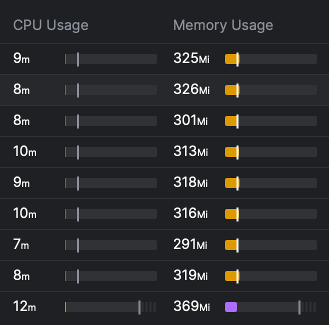
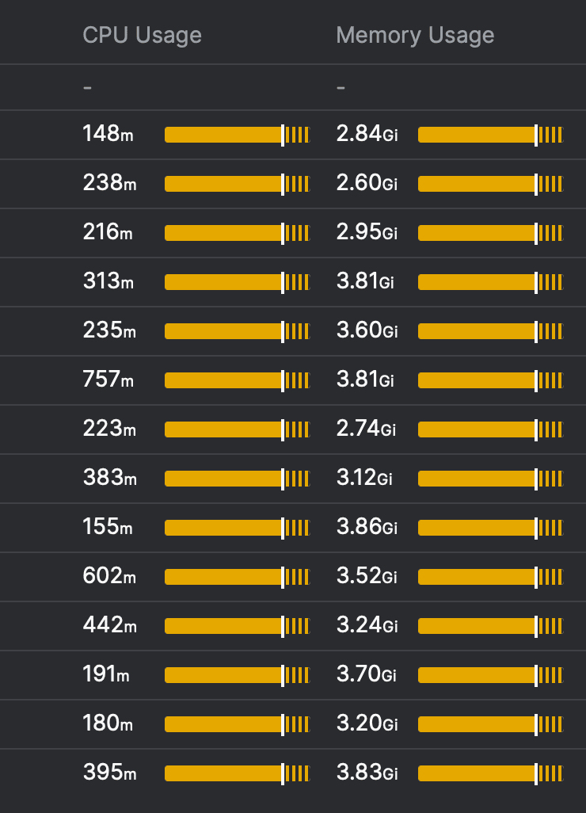
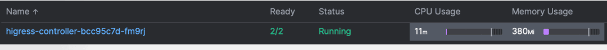
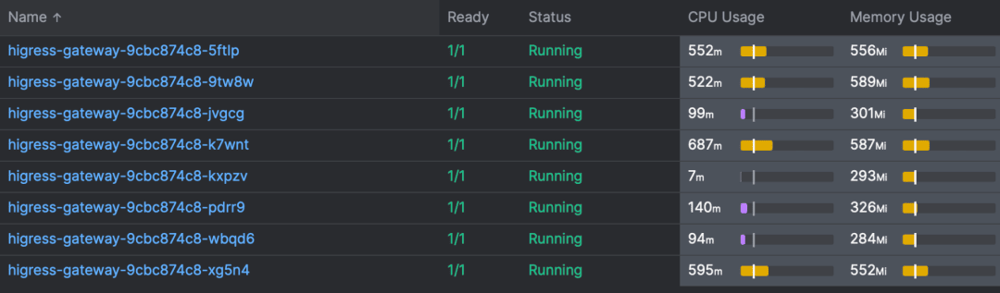

Sealos Cloud has effectively navigated the complex landscape of mainstream open-source API gateways. This article aims to help readers understand the challenges of **API gateway selection** for demanding public cloud environments, prevent common pitfalls, and provide a reference based on practical experiences from Sealos.

## The Complex Demands of Sealos Cloud: A High-Stakes Environment for API Gatewa

Since its launch, Sealos Cloud has maintained explosive growth, currently supporting 87,000 registered users. Each user deploying applications requires dedicated access endpoints, causing the cluster's routing table to grow exponentially, **requiring robust support for hundreds of thousands of [Ingress entries](https://kubernetes.io/docs/concepts/services-networking/ingress/)**. This scale is a primary factor in our **Kubernetes gateway selection**.

Delivering shared cluster services on the public internet demands stringent [multi-tenancy capabilities](https://www.redhat.com/en/topics/cloud-computing/what-is-multitenancy). User traffic must maintain complete isolation with robust traffic management controls to prevent cross-tenant interference.

Public cloud environments present significant security challenges. Attackers target both tenant applications and platform exit points, creating complex threat vectors for cloud operators. Therefore, a secure and **scalable API gateway** is paramount.

Controller components face extreme performance demands. As routing tables expand, many solutions consume excessive resources, often resulting in OOM (Out of Memory) failures that crash gateways – a critical concern for any **production-ready Kubernetes Ingress solution**.

## Initial Challenges: Eliminating Nginx Ingress Due to Limitations

Our initial implementation utilized [Nginx Ingress](https://github.com/kubernetes/ingress-nginx), but several critical limitations emerged, impacting our ability to serve a multi-user public cloud:

- **Reload Instability**: Configuration changes caused temporary connection drops. In multi-user clusters, frequent ingress modifications led to persistent network instability.
- **Unreliable Long Connections**: Active connections frequently terminated during configuration updates, a major issue for real-time applications.
- **Performance Limitations**: We observed slow configuration propagation and high resource consumption under load, making it unsuitable as a **high-performance API gateway** for our needs.

These **Nginx Ingress limitations** ruled out most Nginx-based gateways. Our comparative testing revealed that [Envoy-based solutions](https://www.envoyproxy.io/) deliver superior performance with minimal overhead on both control and data planes.

The significant performance disparity clearly justified our complete transition towards Envoy-based solutions for a more **efficient cloud native gateway**.

## APISIX Considerations: Promising Core, Controller Instability

[APISIX](https://apisix.apache.org/) is fundamentally an excellent project that effectively addresses Nginx reload challenges. This is why we initially adopted APISIX for our Laf platform. However, we encountered significant operational issues with its **APISIX Ingress Controller**, which proved unstable in practice. Control plane crashes caused multiple critical failures and even controller OOM incidents.

While we genuinely wanted to make it work, recurring faults eventually forced us to abandon it. That said, the APISIX community remains actively engaged in resolving these issues and continues to improve the platform.

To summarize: APISIX demonstrates strong core stability, but its controller requires substantial optimization and stability improvements for demanding production environments. The community shows robust support, yet our urgent production requirements couldn't accommodate their gradual development pace. We ultimately had to migrate to alternative gateway solutions.

## Cilium Gateway: Alignment and Limitations

Having transitioned our CNI to [Cilium](https://cilium.io/) early on (a decision that has proven technically sound), we naturally considered adopting **Cilium Gateway** for our gateway implementation as well. Reality, however, presented significant limitations for our specific use case.

Cilium Gateway exclusively supports LB mode, creating tight coupling with cloud vendor LB services. This conflicts with our private deployment requirements where we prefer decoupled architectures. Stability concerns also emerged: when handling large-scale routing configurations, **Cilium Gateway Ingress rule propagation** became unacceptably slow (measured in minutes). Our operational SLA requires sub-5-second route convergence. Given these constraints, our current conclusion is to defer Cilium Gateway adoption until these critical issues are resolved.

## Envoy Gateway: Early Evaluation Issues, Now Resolved

As Kubernetes evolves toward standardized Gateway APIs (replacing traditional Ingress), and considering our preference for Envoy-based implementations, **[Envoy Gateway](https://gateway.envoyproxy.io/)** initially appeared promising. During our **early evaluation** (based on last year's versions), however, the project was still in relatively early development stages with several limitations we encountered at the time: memory leaks causing OOM, pathpolicy misconfigurations, and feature gaps in merged gateway mode.

We're pleased to note that **these issues have since been resolved**, and the Envoy Gateway community has demonstrated excellent responsiveness and problem-solving capabilities. We actively contributed to upstream development through bug reports and improvement suggestions. However, given our urgent production requirements at that time, **we chose to proceed with more mature solutions available then.**

## The Kubernetes Gateway API Standard: Elegant but Impractical for Multi-Tenancy

The [Kubernetes Gateway API standard](https://gateway-api.sigs.k8s.io/) faces an awkward reality in complex deployments. From my perspective, its designers haven't fully grappled with real-world **multi-tenant Kubernetes gateway** requirements. When multiple tenants share a cluster, clear permission boundaries between administrators and users become essential. The current Gateway design lacks this crucial consideration.

Consider this example: Network listening port configurations should be exclusive to cluster administrators rather than regular users. TLS certificate settings are application-specific – while administrators maintain configuration privileges, individual users should manage their own certificates. This permission overlap necessitates user-level Gateway access, requiring complex controller-level permission controls including port whitelisting and conflict resolution mechanisms.

An optimal design would push tenant-specific fields down to the HTTPRoute level or implement them through dedicated Custom Resource Definitions (CRDs). This architectural approach would establish clearer boundaries between user-space operations and super-admin management. Though functional, the existing hybrid approach remains somewhat convoluted – albeit still viable.

## Higress: Addressing Critical Gateway Challenges for Sealos

Our extensive evaluation and real-world testing led us to focus on solutions that could overcome the limitations of previous gateways. **[Higress](https://higress.cn/en/), an Envoy-based gateway**, emerged as a strong contender by directly addressing our key pain points:

1.  **Rapid Ingress Configuration:** Initial Ingress configuration delays were significant with other solutions when handling large volumes of routing entries (new routes requiring over 2 minutes to activate). Higress, through community optimizations and its incremental configuration loading mechanism, reduced this to **around 3 seconds**. This extreme performance level, now even surpassing container readiness duration, is vital for our dynamic environment.
2.  **Controller Stability and Resource Efficiency:** Controller OOM issues, experienced with other gateways during non-dynamic loading scenarios due to high resource consumption, were resolved. Higress's controller implementation proved stable and remarkably resource-efficient even under massive routing loads.
3.  **Timeout Anomaly Resolution:** We mitigated occasional timeout anomalies (observed with onDemandRDS parameters in one cluster with a previous setup) by fine-tuning configurations, ensuring consistent performance across all clusters with Higress.

Regarding security, many of our past incidents originated from performance bottlenecks. Traffic surges overwhelming gateways are common in our environment, making **API gateway performance** absolutely critical. Testing confirms Envoy demonstrates significantly superior performance, and **Higress particularly shines** in this aspect with its controller implementation:

Even under massive routing loads and ultra-high concurrency scenarios, Higress requires surprisingly minimal resources.

A crucial factor for us was that **Higress maintains compatibility with Nginx Ingress syntax** through annotation support. Since our existing codebase already uses Ingress, **migration costs are virtually non-existent** – upgrades can be completed in just a few minutes. This seamless transition path was a significant advantage.

To further promote community development and enhance Higress for broader use cases, we've provided several suggestions:

- **Enhanced Gateway API Standard Support**: While v1 version compatibility exists, full feature parity with Ingress capabilities remains incomplete and is an area for growth.
- **Open-Sourcing Advanced Features**: Game-changing features like advanced security protections and circuit breaker mechanisms should ideally be open-sourced. We welcome commercial integration opportunities as platform requirements evolve.
- **Plugin Architecture Expansion**: Peripheral functionality should be expanded through a robust plugin architecture to maintain core function cohesion and reliability.

## Summary: Strategic Gateway Selection for Cloud Success

Gateways represent absolutely critical components for cloud infrastructure and applications. As Sealos continues scaling, new challenges in **API gateway management** will inevitably emerge. We aim to establish close collaboration with upstream/downstream communities to advance open-source gateway technology and benefit more developers.

The gateways listed above – Nginx Ingress, APISIX, Cilium Gateway, and Envoy Gateway – are all excellent solutions in their own right. The fact that Sealos hasn't adopted them doesn't reflect any shortcomings in these projects, but rather our highly demanding and unique scenarios requiring a **high-performance, scalable, multi-tenant API gateway**.

In reality, there are very few gateways capable of supporting multi-tenant environments in public internet deployments at our scale. Therefore, we encourage readers to make selections based on their specific use cases. Our **API gateway selection journey** is provided solely as a reference. Meanwhile, [Sealos Cloud](https://os.sealos.io/) itself will also continue to monitor the development of other gateways with an open mindset.
