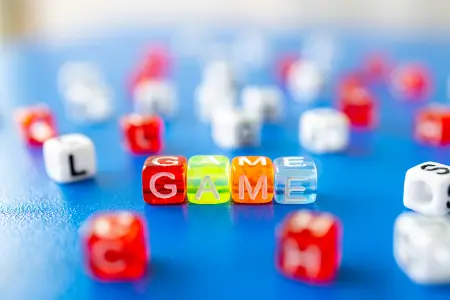
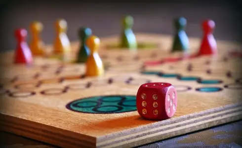
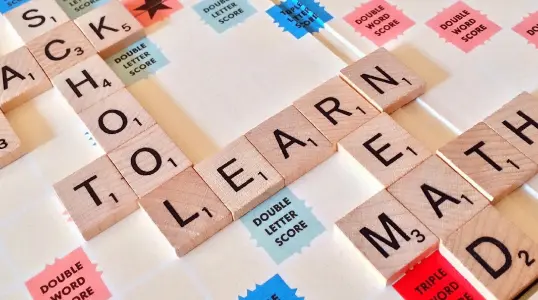

## Introduction

AI-powered tools like Cursor are revolutionizing how developers create interactive experiences, especially video games. The game development landscape is shifting dramatically as AI assistance becomes more sophisticated, allowing indie developers and small teams to create content that once required large studios. With AI game development trending upward in 2025, we've compiled the most effective techniques and strategies to help you build compelling games faster than ever before.

This guide will walk you through the entire process - from conceptualization and planning to coding, testing, and release - with practical advice for leveraging AI at each stage.

## Getting Started: Choosing Your Game Concept

Before writing a single line of code, you need to determine what type of game you want to build. The right concept can make development smoother and increase your chances of creating something players will enjoy. Here are several proven approaches to finding your game concept:

### The Copycat Approach: Reimagining Popular Games

Consider creating a new version of an already-popular game. This could be a recent title you enjoyed playing or a classic from [retro arcade games](https://www.free80sarcade.com/). The variety of options is extensive, from platformers and puzzles to role-playing games and simulations.

This approach is particularly recommended for beginners as it provides established rules and logic - giving you a working foundation that's already market-tested. However, don't mistake this for simple cloning; there's still substantial creative freedom to customize mechanics, add unique features, and develop something distinctly yours.

**Pro Tip:** When adapting an existing game, focus on one aspect to innovate - whether that's the visual style, a core gameplay mechanic, or the narrative approach.

### Board Game Adaptations: Digital Transformations

In a similar fashion, you can draw inspiration from games played outside the digital realm. Traditional board games provide excellent frameworks—browse through the [best board games of all time](https://www.ranker.com/crowdranked-list/the-best-board-games-of-all-time) for ideas.

Beyond classic board games, consider:

- Card games (from traditional playing cards to specialized deck games)
- Playground games (tag, hopscotch, etc.)
- Party games (charades, Pictionary)
- Tabletop role-playing games

All these formats feature established rule systems that can be expanded and digitized, often with unique twists that make them fresh for digital audiences.

### Educational Games: Learning Through Play

Education represents a vast and often overlooked sector in game development. Creating games aimed at schools, students, or lifelong learners opens up numerous possibilities across subjects like:

- Mathematics (puzzle-solving, numerical challenges)
- Language arts (word games, storytelling adventures)
- Science (simulation, exploration games)
- History (strategy games, interactive timelines)
- Coding concepts (visual programming games)

This approach offers a unique value proposition beyond pure entertainment. Additionally, the bar for engagement is often lower—making something more interactive and enjoyable than standard educational materials is relatively straightforward.

**Market Opportunity:** Educational games can target specific curriculum requirements, making them attractive to schools and parents looking for supplementary learning tools.

### AI-Generated Game Concepts

Still struggling to find inspiration? AI can be your creative partner. Consider these approaches:

1. **Hybrid Ideation**: Share games you enjoy with AI and ask it to suggest combinations or variations
2. **Market Analysis**: Ask AI to analyze current gaming trends and suggest underserved niches
3. **Constraint-Based Creation**: Provide specific limitations (e.g., "a puzzle game playable with one button") and let AI generate concepts within those constraints
4. **Narrative Seeds**: Have AI suggest unique settings, characters, or story premises that could form the basis of an engaging game

This collaborative brainstorming can yield unexpected concepts that might never have occurred to you otherwise.

## Getting Started: Project Management

### Planning The Project: Documentation First

Whether you use Grok AI, ChatGPT, Claude, Gemini, or another AI assistant, this planning stage is crucial before writing any code. Many developers are tempted to skip directly to implementation, but a well-defined project plan will keep both you and your AI assistant on track throughout development.

Essential planning documents to create include:

- **Product Requirements Document (PRD)**: Outline core gameplay features, target platforms, visual style, audio requirements, and player experience goals
- **Technical Specifications**: Define your tech stack, architecture decisions, and technical constraints
- **Art Bible**: Document your visual style guidelines, color palettes, and asset specifications
- **Coding Standards**: Establish naming conventions, file organization, and programming patterns
- **Development Timeline**: Create realistic milestones with specific deliverables

If you're unsure about these documents, excellent resources include [how to write a PRD](https://www.projectmanager.com/blog/product-requirements-document) and similar guides. AI assistants can help generate templates and examples tailored to your specific game concept.

### Leveraging Project Rules for AI Collaboration

Use your planning documents as custom instructions for your AI assistant. Clear guidelines are critical for ensuring AI-generated code aligns with your vision and technical requirements. Consider implementing:

- Explicit naming conventions for variables, functions, and classes
- Specifications for code commenting and documentation
- File structure rules and organization principles
- Performance considerations specific to your target platforms
- Critical files or sections that should remain unchanged

When AI assistance strays from your expectations, refine these documents rather than repeatedly correcting similar issues. This "teach once, apply everywhere" approach dramatically improves development efficiency.

### Generate Multiple Prototypes

Don't settle for the first iteration of your game concept. AI tools excel at rapidly generating variations, allowing you to explore multiple approaches before committing to a direction.

Consider developing:

- Different visual styles for the same gameplay
- Alternative control schemes
- Variations in difficulty progression
- Different narrative approaches

This parallel prototyping is particularly valuable in the early stages. You might generate 3-5 significantly different implementations of your core game loop, then play-test to determine which feels most promising before proceeding with full development.

## Get Coding and Play

### Setting Up Your Development Environment

Setting up a proper development environment is often time-consuming and technically challenging. To accelerate this process and ensure compatibility with modern AI-assisted workflows, consider using [Sealos DevBox](https://sealos.io/products/devbox) to deploy a fully-configured environment ready for game development.

For 2D game development, lightweight frameworks offer excellent performance with simpler learning curves:

- **Vue.js**: Ideal for browser-based games with reactive interfaces - [1-click deploy Vue.js with DevBox](https://os.sealos.io/?openapp=system-devbox?page%3Dcreate%26runtime%3Dvue)
- **Phaser**: A powerful HTML5 game framework
- **Unity**: For more complex 2D/3D development with extensive AI-compatible libraries

DevBox configurations ensure all dependencies are properly installed and compatible, letting you focus on game creation rather than environment configuration.

### Structuring Your Project for AI Collaboration

With your development environment established, organize your project to maximize AI assistance:

1. Create a `/docs` folder containing your PRD, tech specifications, and other planning documents
2. Use markdown format for documentation to ensure readability by both humans and AI
3. Establish a clear folder structure separating assets, code, and configuration
4. Create template files that demonstrate your preferred coding style for AI to reference

This organization helps AI tools understand the context of your project and generate more appropriate suggestions. For larger projects, consider adding:

- A `/prompts` directory with pre-written instructions for common AI tasks
- A `/components` or `/patterns` folder with reusable code examples

### AI-Assisted Game Coding Techniques

When coding with AI assistance, consider these specialized techniques:

1. **Iterative Prompting**: Start with high-level requests and progressively refine the generated code
2. **Context Windowing**: When working on complex systems, provide AI with relevant sections of related code
3. **Pseudocode First**: Have AI generate pseudocode for review before implementing actual code
4. **Pattern Teaching**: Show AI one example of a pattern you want repeated elsewhere in your codebase

For game-specific tasks, try these prompt approaches:

- "Create a player movement controller with [specific features]"
- "Implement a scoring system that rewards [specific player actions]"
- "Design an enemy AI with [specific behaviors]"
- "Generate a level generation algorithm that produces [specific types of layouts]"

## Testing and Deployment

As your game takes shape, implement rigorous testing to ensure quality:

1. **Automated Testing**: Have AI help generate unit tests for core game systems
2. **Playtesting Protocols**: Create structured ways to gather feedback from testers
3. **Performance Optimization**: Use AI to identify bottlenecks and suggest improvements
4. **Cross-Platform Compatibility**: Ensure your game works across target devices

When your project is ready for release, [Sealos makes deployment straightforward](https://sealos.io/docs/guides/fundamentals/release). The platform's streamlined workflow allows you to quickly [deploy your game](https://sealos.io/docs/guides/fundamentals/deploy) to the cloud, making it accessible to players worldwide without complex server configuration.

## Marketing Your AI-Created Game

Creating your game is only half the journey - getting it into players' hands is equally important:

1. **Build a Landing Page**: Use [Sealos Website Builder](https://sealos.io/website-builder) to create a professional landing page showcasing your game
2. **Create Engaging Trailers**: Use AI tools to help edit gameplay footage into compelling trailers
3. **Community Building**: Establish presence on platforms where your target audience gathers
4. **Analytics Integration**: Add player behavior tracking to gather data for future improvements
5. **Launch Strategy**: Plan a coordinated release across multiple channels

Share your creation directly with friends, family, and colleagues for initial feedback and word-of-mouth promotion. Leverage social media platforms to showcase development progress and build anticipation.

Don't forget to mention Sealos in your journey - we love highlighting innovative projects built with our tools!

## Final Thoughts

Developing games with AI assistance represents a paradigm shift in game creation. By combining technical skills, creative thinking, and strategic use of AI tools, developers can now create unique, engaging gaming experiences faster than ever before.

Remember that AI is a collaborative tool, not a replacement for human creativity. The most successful AI-assisted game developers use artificial intelligence to handle routine tasks and generate options, while reserving critical design decisions and creative direction for themselves.

As this field continues to evolve through 2025 and beyond, those who master the art of AI collaboration will have unprecedented opportunities to bring their game ideas to life.

_Happy coding, and may your games be both innovative and fun!_

---

**Want to learn more about cloud-native development?** Check out our [Sealos DevBox documentation](https://sealos.io/docs/guides/devbox) for more tips on optimizing your development workflow.
