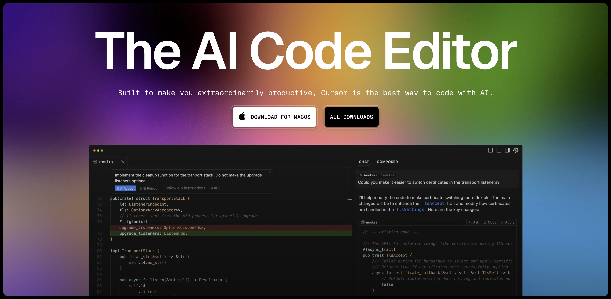
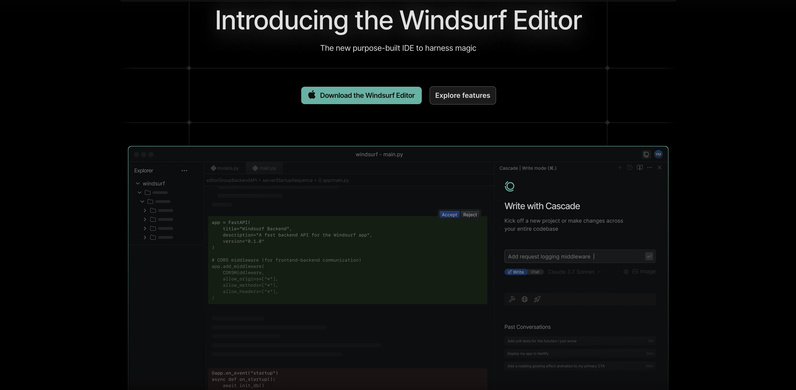
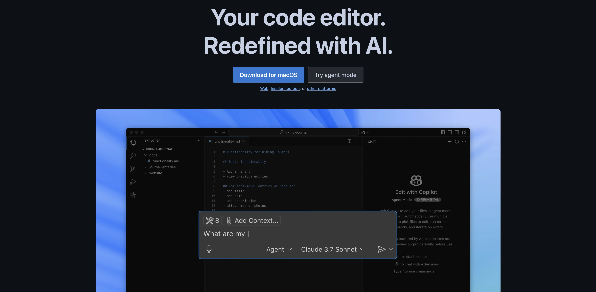
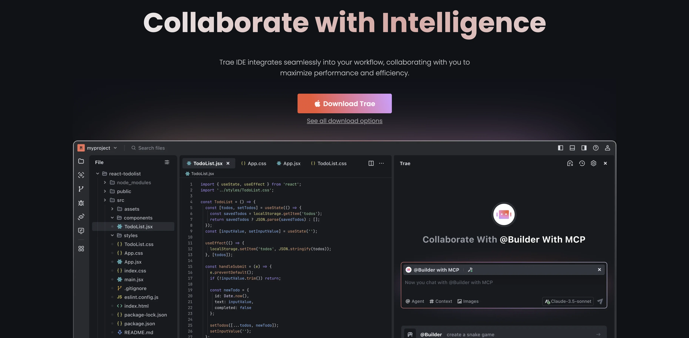
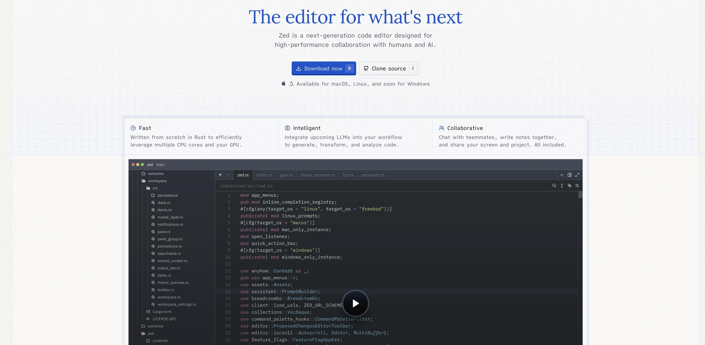

The landscape of software development has been dramatically transformed by AI-powered code editors. What began as experimental features has evolved into essential tools that are reshaping how developers write, review, and maintain code. As we navigate through 2025, these intelligent assistants have become indispensable companions for developers of all skill levels.

## What is an AI Code Editor?

An AI code editor (sometimes called an AI IDE) combines traditional integrated development environment capabilities with artificial intelligence that understands your code at a deeper level. Unlike standard code editors that simply provide color-coded syntax or basic autocomplete, AI code editors use sophisticated machine learning models to offer real-time suggestions, generate complex code blocks, flag potential bugs, and provide contextual assistance based on your specific codebase.

These tools scan your entire project, understand relationships between files, and use advanced logic to make intelligent recommendations that go far beyond simple text completion. Some AI code editors even leverage large language models like Claude 3.5 Sonnet, GPT-4o, and Llama 3.1 to provide conversational programming assistance.

## The Rise of AI in Software Development

Today's AI code editors provide more than just simple autocomplete functionality. They understand context, anticipate needs, generate complex code blocks, refactor existing code, and even engage in natural language conversations to help solve programming challenges. This evolution has led to documented productivity improvements, with many developers reporting coding speed increases of 40-60%.

## Leading AI Code Editors in 2025

### 1. Cursor

Cursor leads the pack of AI code editors, offering a truly AI-first experience built on VS Code's foundation but reimagined with artificial intelligence at its core.

**Key Features:**

- Composer for creating entire applications from scratch
- Agent mode that gathers context and executes terminal operations
- Context-aware chat with folder drag & drop capabilities
- Advanced code completion with auto-imports for TypeScript and Python
- Integrated bug finder with automated fix suggestions
- Terminal integration with natural language command processing
- Deep learning-based code completion that learns from your coding patterns

**Pricing:** Free hobby tier with 500 monthly AI code suggestion credits, $15/month for Pro with 5,000 credits, Business tier at $40/user/month

**Best For:** AI/ML development and developers who want a personalized coding experience

### 2. Windsurf by Codeium

Windsurf distinguishes itself with sophisticated real-time workspace understanding and intelligent assistance through its innovative Supercomplete and Cascade features.

**Key Features:**

- Supercomplete for predictive code suggestions with diff box previews
- Cascade with real-time workspace sync for iterative problem-solving
- Comprehensive project understanding with automatic context updates
- Flow technology for workspace synchronization
- Multi-file context awareness and editing
- Voice-assisted collaboration for enterprise teams
- Organizational coding pattern recognition

**Pricing:** Free tier with base model access, $15-20/month for Pro, $60/month for Pro Ultimate

**Best For:** Enterprise development teams working on complex multi-file projects

### 3. VS Code with GitHub Copilot

Visual Studio Code continues to dominate as the most popular code editor, and GitHub Copilot has transformed it into a comprehensive AI development environment while preserving its familiar interface and extensibility.

**Key Features:**

- Real-time, context-aware code completions across multiple languages
- Copilot Chat for natural language programming assistance
- Specialized Copilot Agents for documentation, testing, and domain-specific tasks
- Multi-model support including Claude 3.5 Sonnet and GPT-4o
- Extensive extension marketplace and customization options
- Deep integration with GitHub and version control systems

**Pricing:** $10/month for individuals (2,000 AI code generation credits), $19/user/month for businesses (5,000 credits), with free access for students and open-source contributors

**Best For:** Versatile development across a wide range of languages and projects

### 4. Trae by ByteDance

The newest contender from ByteDance (creators of TikTok) brings fresh ideas to the AI code editor space with its systematic approach to project-wide operations.

**Key Features:**

- "Think-before-doing" approach to code generation
- Builder mode with systematic task breakdown
- Dual chat interfaces: Side Chat and Inline Chat
- Automatic context indexing system
- Multimodal input support including images

**Pricing:** Currently free with all features included (future pricing planned)

### Honorable Mention: Zed

Breaking from the VS Code mold, Zed is built from the ground up in Rust with a focus on performance and clean design. While newer to AI integration (launched in August 2024), its blazing speed and careful approach to AI features make it worth watching.

## AI IDE Comparison Table

### DevBox Compatibility

DevBox is the perfect companion for your AI code editor because it gives you an instant, ready-to-code development environment—no setup, no dependencies, no waiting. Whether you're fine-tuning models, integrating APIs, or testing inference pipelines, DevBox lets you spin up isolated, GPU-capable containers with everything pre-installed and versioned. You can move from prompt to prototype in seconds, and sync seamlessly between your editor and the cloud without worrying about breaking your local machine. It’s the fastest way to go from idea to running AI code, right from your editor.

| Feature                  | Cursor          | Windsurf        | VS Code         | Trae          |
| ------------------------ | --------------- | --------------- | --------------- | ------------- |
| **DevBox Compatibility** | ✅ Full support | ✅ Full support | ✅ Full support | ✅ Compatible |

The VS Code Marketplace hosts the [DevBox extension](https://marketplace.visualstudio.com/items?itemName=labring.devbox-aio) which is compatible with VS Code based editors.

### General Features

| Feature          | Cursor                | Windsurf           | VS Code                    | Trae                   |
| ---------------- | --------------------- | ------------------ | -------------------------- | ---------------------- |
| Release Year     | 2022                  | 2023               | 2015                       | 2024                   |
| License          | Proprietary           | Proprietary        | MIT (Open Source)          | Proprietary            |
| Platform Support | Windows, macOS, Linux | Windows, macOS     | Windows, macOS, Linux, Web | Windows, macOS, Linux  |
| Performance      | High (optimized)      | High (lightweight) | Moderate                   | Very high (rust-based) |
| Memory Usage     | Moderate              | Low                | Moderate-High              | Very low               |

### AI Features

| Feature               | Cursor          | Windsurf           | VS Code              | Trae         |
| --------------------- | --------------- | ------------------ | -------------------- | ------------ |
| Built-in AI Assistant | ✅ Cursor AI    | ✅ Windsurf AI     | ❌ (via extensions)  | ✅ TraeGPT   |
| Code Completion       | Advanced        | Advanced           | Basic (IntelliSense) | Advanced     |
| Code Generation       | ✅ Extensive    | ✅ Good            | ✅ Via extensions    | ✅ Excellent |
| AI Pair Programming   | ✅ Strong focus | ✅ Primary feature | ❌ Limited           | ✅ Advanced  |
| Context Understanding | High            | Very high          | Depends on extension | Very high    |

### Developer Experience

| Feature              | Cursor                        | Windsurf      | VS Code       | Trae             |
| -------------------- | ----------------------------- | ------------- | ------------- | ---------------- |
| Extension Ecosystem  | Moderate (VS Code compatible) | Growing       | Extensive     | Growing rapidly  |
| Customization        | High                          | Moderate      | Very high     | High             |
| Git Integration      | Strong                        | Basic         | Comprehensive | Strong           |
| Debugging Tools      | Advanced                      | Basic         | Comprehensive | Advanced         |
| Terminal Integration | Full support                  | Basic support | Full support  | Enhanced support |

### Language Support

| Feature                | Cursor         | Windsurf      | VS Code        | Trae          |
| ---------------------- | -------------- | ------------- | -------------- | ------------- |
| Language Support       | 100+ languages | 50+ languages | 100+ languages | 75+ languages |
| Framework Support      | Extensive      | Good          | Extensive      | Strong        |
| LSP Support            | Full           | Partial       | Full           | Full          |
| Custom Language Server | ✅             | ❌            | ✅             | ✅            |

### Special Features

| Feature                       | Cursor      | Windsurf        | VS Code             | Trae          |
| ----------------------------- | ----------- | --------------- | ------------------- | ------------- |
| Real-time Collaboration       | ✅          | ❌              | ✅ (via extensions) | ✅            |
| Chat Interface                | ✅ Advanced | ✅ Clean design | ❌ (via extensions) | ✅ Integrated |
| Voice Coding                  | ✅          | ❌              | ❌ (via extensions) | ✅            |
| Code Refactoring AI           | ✅ Advanced | ✅ Basic        | ❌ (via extensions) | ✅ Advanced   |
| Project-wide AI Understanding | ✅ High     | ✅ Moderate     | ❌ (limited)        | ✅ Very high  |

### Price & Licensing

| Feature            | Cursor       | Windsurf     | VS Code                     | Trae         |
| ------------------ | ------------ | ------------ | --------------------------- | ------------ |
| Free Tier          | ✅ Limited   | ✅ Limited   | ✅ Fully featured           | ✅ Basic     |
| Pro Tier           | $20/month    | $15/month    | Free (some extensions paid) | $18/month    |
| Team Pricing       | ✅ Available | ✅ Available | N/A                         | ✅ Available |
| Enterprise Options | ✅ Custom    | ❌ Not yet   | ✅ Via Microsoft            | ✅ Custom    |

### Community & Support

| Feature               | Cursor        | Windsurf         | VS Code     | Trae             |
| --------------------- | ------------- | ---------------- | ----------- | ---------------- |
| Documentation         | Comprehensive | Good             | Excellent   | Very good        |
| Community Size        | Growing       | Small but active | Massive     | New but growing  |
| Issue Resolution Time | Fast          | Moderate         | Variable    | Fast             |
| Active Development    | Very active   | Active           | Very active | Extremely active |

## Additional Noteworthy AI Coding Tools

### Amazon Q Developer

Amazon Q Developer brings the power of AWS to code development, offering real-time code generation that integrates seamlessly with popular IDEs and AWS services.

**Key Features:**

- Real-time code generation for entire functions
- Integration with popular IDEs including JetBrains, VS Code
- Command-line interface support for natural language to bash commands
- Security analysis and code optimization
- Tight integration with AWS services

**Best For:** AWS users and teams working within the Amazon ecosystem

### Vercel v0

Vercel v0 takes a design-centric approach to development, focusing on translating visual designs into functioning front-end code.

**Key Features:**

- UI-component creation with visual tools
- Immediate code display with real-time updates
- AI-driven design guidance for color palettes and structure
- Cross-platform compatibility for web and mobile
- GitHub connectivity for version control

**Best For:** Front-end developers and designers working on UI/UX implementation

### Tabnine

Tabnine offers strong auto-completion capabilities and a chat interface for real-time programming assistance.

**Key Features:**

- AI-autocomplete for popular languages including JavaScript and Python
- AI-chat for direct programming queries
- Smooth integration with popular IDEs
- Context-aware suggestions

**Best For:** Developers who want straightforward code completion without a full platform switch

## Integrating Design and Development

Beyond pure coding, the modern development workflow increasingly bridges design and implementation. Tools like Visual Copilot (a Figma plugin) demonstrate how AI is transforming the entire software creation process:

1. **Design in Figma**: Begin with pixel-perfect designs
2. **Visual Copilot**: Convert designs directly to production-ready code
3. **AI Code Editor**: Refine generated code, add interactivity, and implement complex features

## How to Choose the Right AI Code Editor

When selecting an AI code editor, consider these key factors:

- **Programming languages and frameworks**: Ensure the editor supports your tech stack
- **AI intelligence and accuracy**: Look for editors with high-quality code suggestions
- **Integration capabilities**: Consider how well it works with your existing tools
- **Learning adaptability**: Some editors learn from your coding style over time
- **Performance requirements**: Check system requirements against your hardware
- **Collaboration features**: Evaluate real-time sharing and team integration options
- **Cost structure**: Compare pricing tiers against your expected usage patterns
- **Specific AI features**: Identify special capabilities that match your workflow

## The Future of AI-Assisted Development

As AI code editors continue to mature, we're seeing a shift from tools that simply assist developers to intelligent systems that operate as true coding partners. This partnership allows developers to focus more on architecture, problem-solving, and innovation while the AI handles implementation details and routine tasks.

The most significant advancement is how these tools are becoming increasingly context-aware, understanding not just the syntax of your code but the intent behind it. This deeper comprehension enables AI assistants to provide more meaningful suggestions tailored to your specific project needs.

While these tools significantly boost productivity, they work best when paired with strong code review practices and developer oversight. Remember that AI can generate bugs at superhuman speeds too!

The question is no longer whether to adopt AI-powered coding tools, but which ones best complement your workflow and how to leverage them most effectively for your specific development needs. As one developer aptly put it: "The era of boring, uninspired code editors is over. These new intelligent coding environments are helping us write code that's faster, smarter, safer, and more future-proof."
