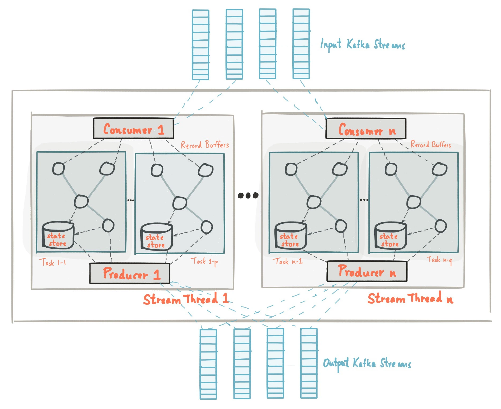

Apache Kafka has established itself as the de facto standard for event streaming and real-time data processing, revolutionizing how organizations handle data flows in today's event-driven landscape. This comprehensive guide explains everything you need to know about Kafka, from basic concepts to advanced implementation strategies.

## Understanding Apache Kafka: The Foundation of Modern Event Streaming

Apache Kafka is an open-source distributed streaming platform designed to handle real-time data feeds with high throughput, fault tolerance, and scalability. Originally developed by LinkedIn in 2010 and later donated to the Apache Software Foundation, Kafka has rapidly become the industry standard for building real-time streaming data pipelines and applications.

At its core, Kafka provides a distributed commit log service that allows applications to publish and subscribe to streams of records. It acts as a highly scalable message broker that can handle millions of messages per second while maintaining durability and fault tolerance across distributed systems.

### Why Kafka Matters

In today's data-driven digital environment, organizations need to:

- Process real-time data streams efficiently and reliably
- Build event-driven architectures that respond to changes instantly
- Scale data processing to handle massive volumes of information
- Ensure data durability and fault tolerance across distributed systems
- Enable microservices communication through reliable messaging

Kafka addresses these needs by providing a unified platform for handling all real-time data feeds in an organization. Its combination of high throughput, low latency, and fault tolerance has made it the backbone of modern data architectures.

## The Evolution of Data Processing

To understand Kafka's significance, it's important to recognize the evolution of data processing approaches:

1. **Batch Processing Era**: Data processed in large batches at scheduled intervals with high latency
2. **Request-Response Era**: Synchronous communication patterns with tight coupling between services
3. **Message Queue Era**: Asynchronous messaging with traditional brokers having throughput limitations
4. **Event Streaming Era**: Kafka emerged as a scalable solution for continuous data streams
5. **Event-Driven Architecture Era**: Modern applications built around events and real-time processing

Kafka built upon decades of distributed systems research and real-world experience at scale to create a solution that balances performance, reliability, and operational simplicity, making enterprise-grade streaming capabilities available to organizations of all sizes.

## Core Design Principles

Kafka is built around fundamental design principles that guide its implementation and development:

1. **Durability**: Kafka implements robust data persistence with configurable replication, ensuring your data streams remain available and recoverable even during failures or system outages.

2. **Scalability**: The platform is designed to scale horizontally across multiple brokers, handling massive throughput requirements while maintaining low latency for real-time processing needs.

3. **Fault Tolerance**: Kafka provides automatic failover, data replication, and self-healing capabilities that ensure continuous operation even when individual components fail.

### The Event Log Model

One of Kafka's key strengths is its commit log design that treats all data as an immutable sequence of events. This approach ensures:

- Strong ordering guarantees within partitions
- Replay capability for reprocessing historical data
- Event sourcing patterns for building stateful applications
- Audit trails and compliance through immutable event history

## Kafka Architecture Explained

A Kafka deployment consists of several interconnected components working together to provide streaming services:

### Kafka Cluster Architecture

The Kafka cluster architecture is designed with distributed processing in mind, featuring multiple layers of abstraction:

1. **Broker Layer**: Individual Kafka servers that store and serve data
2. **Partition Layer**: Horizontal scaling units that distribute topics across brokers
3. **Replication Layer**: Ensures data durability through configurable replication factors
4. **Coordination Layer**: Uses Apache ZooKeeper (or KRaft) for cluster coordination and metadata management

### Core Components

Kafka's distributed architecture includes several key components:

1. **Brokers**: Individual Kafka servers that form the cluster and handle client requests
2. **Topics**: Categories or feeds of messages that organize data streams
3. **Partitions**: Ordered, immutable sequence of records within a topic
4. **Producers**: Applications that publish data to Kafka topics
5. **Consumers**: Applications that subscribe to topics and process the data
6. **Consumer Groups**: Logical grouping of consumers for parallel processing

### Message Processing Flow

Kafka processes messages through several stages:

1. **Message Publishing**: Producers send records to specific topics and partitions
2. **Storage**: Brokers persist messages to disk with configurable retention policies
3. **Replication**: Data is replicated across multiple brokers for fault tolerance
4. **Consumption**: Consumers read messages from partitions at their own pace
5. **Offset Management**: Consumer progress is tracked through partition offsets



## Essential Kafka Components

### Topics and Partitions

**Topics** in Kafka are categories that organize related messages, similar to database tables or message queues.

**Partitions** are ordered, immutable sequences of records within a topic that enable horizontal scaling and parallel processing.

Example topic configuration:

```bash
# Create a topic with 3 partitions and replication factor of 2
kafka-topics.sh --create \
  --topic user-events \
  --partitions 3 \
  --replication-factor 2 \
  --bootstrap-server localhost:9092
```

### Producers and Consumers

**Producers** publish messages to Kafka topics with configurable delivery semantics:

1. **At-most-once**: Messages may be lost but never duplicated
2. **At-least-once**: Messages are never lost but may be duplicated
3. **Exactly-once**: Messages are delivered exactly once (requires additional configuration)

**Consumers** subscribe to topics and process messages, supporting both push and pull models for data consumption.

### Consumer Groups and Partitioning

**Consumer Groups** enable parallel processing by distributing partitions among multiple consumer instances within the same group.

**Partition Assignment** ensures that each partition is consumed by exactly one consumer within a group, enabling horizontal scaling of message processing.

### Schemas and Serialization

**Schema Registry** provides centralized schema management for message formats:

1. **Avro**: Binary serialization format with schema evolution support
2. **JSON Schema**: Human-readable format with structure validation
3. **Protobuf**: Efficient binary format with strong typing

**Serializers and Deserializers** handle conversion between application objects and byte arrays for network transmission.

### Offsets and Retention

**Offsets** track consumer progress through partition logs, enabling replay and parallel processing.

**Retention Policies** control how long messages are stored:

1. **Time-based**: Delete messages older than specified time
2. **Size-based**: Delete oldest messages when size limit is reached
3. **Compaction**: Keep only the latest value for each key

## The Kafka Data Model

Kafka uses an event-driven data model based on immutable event logs:

### Message Structure

Each Kafka message consists of:

1. **Key**: Optional identifier for message routing and compaction
2. **Value**: The actual message payload or event data
3. **Timestamp**: When the message was produced or ingested
4. **Headers**: Optional metadata key-value pairs
5. **Partition**: The partition where the message is stored
6. **Offset**: Unique position within the partition

### Event Patterns

1. **Event Notification**: Notify other services when something happens
2. **Event-Carried State Transfer**: Include state changes in events
3. **Event Sourcing**: Store all state changes as a sequence of events
4. **CQRS**: Separate read and write models using event streams

### Stream Processing Concepts

1. **Stateless Processing**: Transform events without maintaining state
2. **Stateful Processing**: Aggregate or join events using local state
3. **Windowing**: Group events by time or count for batch processing
4. **Stream-Table Duality**: Convert between streams and tables

## Kafka Performance and Optimization

Kafka provides numerous mechanisms for optimizing performance:

### Throughput Optimization

1. **Batch Size**: Configure optimal batch sizes for producers and consumers
2. **Compression**: Use algorithms like Snappy, LZ4, or GZIP to reduce network overhead
3. **Partitioning Strategy**: Distribute load evenly across partitions
4. **Hardware Optimization**: Optimize disk I/O, network, and memory configuration

### Configuration Tuning

Key configuration parameters for performance optimization:

1. **Broker Settings**: Log segment size, flush intervals, replica fetch settings
2. **Producer Settings**: Batch size, linger time, compression type
3. **Consumer Settings**: Fetch size, session timeout, heartbeat interval
4. **JVM Settings**: Heap size, garbage collection configuration

Example performance configuration:

```bash
# Producer optimization
batch.size=65536
linger.ms=10
compression.type=snappy
acks=1

# Consumer optimization
fetch.min.bytes=50000
fetch.max.wait.ms=500
max.partition.fetch.bytes=1048576
```

### Monitoring and Metrics

1. **Throughput Metrics**: Messages per second, bytes per second
2. **Latency Metrics**: End-to-end latency, producer/consumer lag
3. **Broker Metrics**: CPU usage, disk utilization, network I/O
4. **Consumer Lag**: How far behind consumers are from latest messages

## Kafka Networking and Connectivity

Kafka supports various connection methods and protocols:

1. **Native Protocol**: Binary protocol optimized for high performance
2. **SSL/TLS Encryption**: Secure connections with certificate-based authentication
3. **SASL Authentication**: Support for various authentication mechanisms
4. **Access Control Lists (ACLs)**: Fine-grained permission management

### Connection Management

Kafka manages connections through:

1. **Connection Pooling**: Reusing connections for efficiency
2. **Load Balancing**: Distributing client connections across brokers
3. **Automatic Discovery**: Clients automatically discover cluster topology
4. **Failover Handling**: Automatic reconnection during broker failures

### Multi-Cluster Replication

Kafka supports several replication strategies:

```bash
# Mirror Maker 2.0 configuration for cross-cluster replication
clusters = source, target
source.bootstrap.servers = source-cluster:9092
target.bootstrap.servers = target-cluster:9092
source->target.enabled = true
source->target.topics = user-events, order-events
```

## Data Storage in Kafka

Kafka provides flexible storage options to meet diverse requirements:

### Log Storage

Kafka stores messages in segment files on disk:

1. **Segment Files**: Immutable files containing batches of messages
2. **Index Files**: Enable fast lookups by offset or timestamp
3. **Log Compaction**: Keeps only the latest value for each key
4. **Retention Policies**: Time-based or size-based message cleanup

### Partitioning Strategies

Kafka supports various partitioning approaches:

1. **Key-based Partitioning**: Route messages based on message key hash
2. **Round-robin Partitioning**: Distribute messages evenly across partitions
3. **Custom Partitioning**: Implement application-specific routing logic
4. **Sticky Partitioning**: Optimize batching by preferring the same partition

Example custom partitioner:

```java
public class CustomPartitioner implements Partitioner {
    public int partition(String topic, Object key, byte[] keyBytes,
                        Object value, byte[] valueBytes, Cluster cluster) {
        // Custom partitioning logic
        if (key == null) {
            return 0; // Default partition for null keys
        }
        return Math.abs(key.hashCode()) % cluster.partitionCountForTopic(topic);
    }
}
```

### Backup and Recovery

Kafka offers multiple backup and recovery strategies:

1. **Cross-Cluster Replication**: Mirror data to secondary clusters
2. **Snapshot Backups**: Point-in-time cluster state backups
3. **Log Shipping**: Stream transaction logs to backup systems
4. **Disaster Recovery**: Automated failover to backup clusters

## Security Best Practices

Securing Kafka requires a comprehensive approach:

### Authentication and Authorization

1. **SASL Authentication**: Support for PLAIN, SCRAM-SHA-256, GSSAPI/Kerberos, and OAUTHBEARER
2. **SSL/TLS**: Encrypt client-broker and inter-broker communication
3. **Access Control Lists (ACLs)**: Control topic, consumer group, and cluster operations
4. **Principal Mapping**: Map authenticated principals to internal user names

### Network Security

1. **Encryption in Transit**: TLS encryption for all network communication
2. **Encryption at Rest**: Encrypt stored data using filesystem or hardware encryption
3. **Network Segmentation**: Isolate Kafka clusters using firewalls and VPNs
4. **Inter-Broker Authentication**: Mutual authentication between cluster nodes

Example security configuration:

```bash
# Enable SASL/SSL authentication
listeners=SASL_SSL://localhost:9093
security.inter.broker.protocol=SASL_SSL
sasl.mechanism.inter.broker.protocol=PLAIN
sasl.enabled.mechanisms=PLAIN

# SSL configuration
ssl.keystore.location=/path/to/keystore.jks
ssl.keystore.password=keystore_password
ssl.key.password=key_password
ssl.truststore.location=/path/to/truststore.jks
ssl.truststore.password=truststore_password
```

### Compliance and Governance

1. **Data Privacy Regulations**: GDPR, CCPA compliance through data masking and deletion
2. **Audit Logging**: Comprehensive access and operation logging
3. **Data Lineage**: Track data flow and transformations
4. **Schema Governance**: Control schema evolution and compatibility

## Deployment Strategies

Kafka supports various deployment patterns to meet different requirements:

### Single Cluster Deployment

Traditional single-cluster deployment suitable for:

- Development and testing environments
- Small to medium-scale applications
- Scenarios where simplicity is prioritized

### Multi-Cluster Deployment

Distributed deployment across multiple clusters for:

- Geographic data distribution and latency reduction
- Disaster recovery and high availability
- Compliance with data residency requirements
- Workload isolation and resource optimization

### Kafka Connect Integration

Kafka Connect provides a framework for connecting external systems:

- Source connectors: Import data from databases, files, and APIs
- Sink connectors: Export data to databases, data warehouses, and storage systems
- Transform data in-flight using Single Message Transforms (SMTs)

### Kubernetes Deployment

Deploy Kafka on Kubernetes using operators:

```yaml
apiVersion: kafka.strimzi.io/v1beta2
kind: Kafka
metadata:
  name: kafka-cluster
spec:
  kafka:
    version: 3.5.0
    replicas: 3
    listeners:
      - name: plain
        port: 9092
        type: internal
        tls: false
      - name: tls
        port: 9093
        type: internal
        tls: true
    storage:
      type: persistent-claim
      size: 100Gi
  zookeeper:
    replicas: 3
    storage:
      type: persistent-claim
      size: 10Gi
```

## Deploy Kafka on Sealos: Managed Streaming Excellence

Sealos transforms Kafka deployment from a complex infrastructure challenge into a simple, streamlined operation. By leveraging Sealos's cloud-native platform built on Kubernetes, organizations can deploy production-ready Kafka clusters that benefit from enterprise-grade management features without the operational overhead.

### Benefits of Managed Kafka on Sealos

**Kubernetes-Native Architecture**: Sealos runs Kafka clusters natively on Kubernetes, providing all the benefits of container orchestration including automatic pod scheduling, health monitoring, and self-healing capabilities. This ensures your Kafka brokers are always running optimally with automatic recovery from failures.

**Automated Scaling**: Sealos automatically adjusts your Kafka cluster resources based on throughput and storage requirements. During peak data processing periods, broker capacity scales up seamlessly through Kubernetes horizontal pod autoscaling, while scaling down during low-traffic periods to optimize costs. This dynamic scaling ensures consistent performance without manual intervention or over-provisioning.

**High Availability and Fault Tolerance**: Sealos implements optimized deployment strategies for Kafka clusters using Kubernetes deployment strategies, ensuring your streaming platform remains available even during infrastructure failures. Automatic broker replacement, partition rebalancing, and cross-zone replication maintain service continuity with minimal data loss through Kubernetes StatefulSets and persistent volumes.

**Simplified Backup and Recovery**: The platform provides easy-to-configure backup solutions leveraging Kubernetes persistent volume snapshots and automated backup scheduling. Point-in-time recovery capabilities allow you to restore your Kafka cluster state to any specific moment, while incremental backups minimize storage costs and recovery time objectives.

**Automated Operations Management**: The platform handles broker upgrades, security patches, configuration optimization, and cluster maintenance automatically through Kubernetes operators. Advanced monitoring detects performance issues and automatically applies optimizations for throughput, latency, and resource utilization using Kubernetes-native monitoring and alerting.

**One-Click Deployment Process**: Deploy production-ready Kafka clusters in minutes rather than days required for traditional infrastructure setup. The platform handles ZooKeeper coordination, broker discovery, security hardening, network configuration, and Kubernetes service mesh integration automatically.

### Kubernetes Benefits for Kafka

Running Kafka on Sealos's Kubernetes platform provides additional advantages:

- **Resource Efficiency**: Kubernetes bin-packing algorithms optimize resource utilization across your cluster
- **Rolling Updates**: Seamless Kafka version upgrades without downtime using Kubernetes rolling deployment strategies
- **Service Discovery**: Automatic service registration and discovery for Kafka brokers and clients
- **Load Balancing**: Built-in load balancing for Kafka client connections through Kubernetes services
- **Configuration Management**: Kubernetes ConfigMaps and Secrets for secure configuration and credential management
- **Horizontal Pod Autoscaling**: Automatic scaling based on CPU, memory, or custom metrics like consumer lag

For organizations seeking Kafka's streaming power with cloud-native convenience, Sealos provides the perfect balance of performance and operational simplicity, allowing teams to focus on building event-driven applications rather than managing complex Kubernetes and Kafka infrastructure.

## Stream Processing with Kafka

### Kafka Streams

Kafka Streams is a client library for building real-time streaming applications:

1. **Stream Processing Topology**: Define data flow graphs with sources, processors, and sinks
2. **State Stores**: Maintain local state for aggregations and joins
3. **Windowing**: Process events in time-based or session-based windows
4. **Fault Tolerance**: Automatic recovery and state restoration

Example Kafka Streams application:

```java
StreamsBuilder builder = new StreamsBuilder();
KStream<String, String> textLines = builder.stream("text-input");

KTable<String, Long> wordCounts = textLines
    .flatMapValues(line -> Arrays.asList(line.toLowerCase().split("\\W+")))
    .groupBy((key, word) -> word)
    .count(Materialized.as("counts-store"));

wordCounts.toStream().to("word-count-output", Produced.with(Serdes.String(), Serdes.Long()));
```

### ksqlDB

ksqlDB provides SQL interface for stream processing:

1. **Streaming SQL**: Query streaming data using familiar SQL syntax
2. **Materialized Views**: Create real-time tables from streaming data
3. **REST API**: HTTP interface for queries and administration
4. **Connectors Integration**: Built-in integration with Kafka Connect

### External Stream Processors

Popular external streaming frameworks that integrate with Kafka:

1. **Apache Flink**: Low-latency stream processing with advanced windowing
2. **Apache Spark Streaming**: Micro-batch processing for large-scale analytics
3. **Apache Storm**: Real-time computation system for continuous processing
4. **Akka Streams**: Reactive streaming toolkit for JVM applications

## Monitoring and Observability

Comprehensive monitoring is essential for maintaining optimal Kafka performance:

### Key Metrics

1. **Throughput Metrics**: Messages per second, bytes per second per topic/partition
2. **Latency Metrics**: End-to-end latency, producer/consumer response times
3. **Consumer Lag**: How far behind consumers are from the latest messages
4. **Broker Health**: CPU, memory, disk usage, and network I/O per broker

Tools: JMX metrics, Prometheus, Grafana, Kafka Manager

### Performance Analysis

1. **JMX Monitoring**: Built-in metrics exposed through Java Management Extensions
2. **Custom Metrics**: Application-specific metrics for business logic monitoring
3. **Distributed Tracing**: Track message flow across distributed systems
4. **Log Analysis**: Centralized logging for troubleshooting and auditing

Tools: Kafka Lag Exporter, Burrow, Kafdrop, Confluent Control Center

### Capacity Planning

1. **Growth Projections**: Predict storage and throughput requirements
2. **Resource Allocation**: Optimize broker CPU, memory, and storage allocation
3. **Scaling Strategies**: Plan for horizontal scaling and partition redistribution
4. **Performance Baselines**: Establish normal operating parameters for alerting

## Kafka in Production

Running Kafka in production environments requires attention to several critical areas:

### High Availability

1. **Multi-Broker Clusters**: Deploy across multiple availability zones
2. **Replication Configuration**: Configure appropriate replication factors
3. **Load Balancing**: Distribute client connections across brokers
4. **Disaster Recovery**: Cross-region replication and backup strategies

### Scalability Solutions

1. **Horizontal Scaling**: Add brokers to increase cluster capacity
2. **Partition Management**: Balance partitions across brokers
3. **Consumer Scaling**: Scale consumer groups for parallel processing
4. **Topic Design**: Design topics for optimal performance and scalability

### Maintenance Procedures

1. **Rolling Upgrades**: Upgrade brokers without downtime
2. **Partition Rebalancing**: Redistribute partitions for optimal performance
3. **Log Compaction**: Manage disk usage through compaction policies
4. **Performance Tuning**: Regular optimization based on usage patterns

## Popular Kafka Distributions and Services

Several Kafka distributions and cloud services offer enhanced features and management:

### Cloud Streaming Services

1. **Amazon MSK**: Managed Kafka service on AWS with automated operations
2. **Google Cloud Pub/Sub**: Google's managed messaging service with Kafka API compatibility
3. **Azure Event Hubs**: Microsoft's managed event streaming service
4. **Confluent Cloud**: Fully managed Kafka service from the creators of Kafka

### Enhanced Distributions

1. **Confluent Platform**: Enterprise Kafka distribution with additional tools and support
2. **Red Hat AMQ Streams**: Enterprise-ready Kafka based on Apache Kafka and Strimzi
3. **Amazon MSK**: AWS managed service with integrated AWS ecosystem features
4. **Strimzi**: Kubernetes-native operator for running Kafka on Kubernetes

## Advanced Kafka Features

### Kafka Connect

Kafka Connect framework for building and running reusable data import/export connectors:

```json
{
  "name": "jdbc-source-connector",
  "config": {
    "connector.class": "io.confluent.connect.jdbc.JdbcSourceConnector",
    "connection.url": "jdbc:postgresql://localhost:5432/mydb",
    "connection.user": "postgres",
    "connection.password": "password",
    "table.whitelist": "users,orders",
    "mode": "incrementing",
    "incrementing.column.name": "id",
    "topic.prefix": "postgres-"
  }
}
```

### Schema Evolution

Manage schema changes over time with backward/forward compatibility:

```json
{
  "type": "record",
  "name": "User",
  "namespace": "com.example",
  "fields": [
    { "name": "id", "type": "long" },
    { "name": "name", "type": "string" },
    { "name": "email", "type": "string", "default": "" }
  ]
}
```

### Transactional Processing

Exactly-once processing semantics with transactions:

```java
Properties props = new Properties();
props.put("transactional.id", "my-transactional-id");
props.put("enable.idempotence", true);

Producer<String, String> producer = new KafkaProducer<>(props);
producer.initTransactions();

try {
    producer.beginTransaction();
    producer.send(new ProducerRecord<>("topic1", "key1", "value1"));
    producer.send(new ProducerRecord<>("topic2", "key2", "value2"));
    producer.commitTransaction();
} catch (Exception e) {
    producer.abortTransaction();
}
```

### Kafka Streams State Stores

Maintain local state for stream processing applications:

```java
StoreBuilder<KeyValueStore<String, Long>> countStoreBuilder =
    Stores.keyValueStoreBuilder(
        Stores.persistentKeyValueStore("count-store"),
        Serdes.String(),
        Serdes.Long())
    .withLoggingEnabled(Collections.emptyMap());

builder.addStateStore(countStoreBuilder);
```

## Common Challenges and Solutions

### Performance Issues

1. **High Latency**: Optimize batch sizes, compression, and network configuration
2. **Low Throughput**: Increase partitions, optimize producers, and tune broker settings
3. **Memory Usage**: Configure JVM heap sizes and garbage collection
4. **Disk I/O**: Use SSDs, optimize log segment sizes, and partition distribution

### Scaling Challenges

1. **Partition Limits**: Plan partition count based on consumer parallelism needs
2. **Broker Overload**: Distribute partitions evenly and monitor resource usage
3. **Consumer Lag**: Scale consumer groups and optimize processing logic
4. **Cross-Cluster Replication**: Implement efficient replication strategies

### Data Consistency Issues

1. **Message Ordering**: Use single partitions for strict ordering requirements
2. **Duplicate Processing**: Implement idempotent consumers and exactly-once semantics
3. **Data Loss**: Configure appropriate acknowledgment levels and replication factors
4. **Schema Compatibility**: Enforce schema evolution rules and testing

## The Future of Kafka

Kafka continues to evolve with several emerging trends and improvements:

1. **KRaft (Kafka Raft)**: Removing ZooKeeper dependency for simplified operations
2. **Cloud-Native Features**: Enhanced integration with cloud platforms and Kubernetes
3. **Stream Processing Evolution**: Improved real-time analytics and machine learning integration
4. **Security Enhancements**: Advanced encryption, authentication, and authorization mechanisms
5. **Operational Improvements**: Better monitoring, management, and automated operations

## Getting Started with Kafka

### Installation Options

1. **Apache Kafka**: Open-source distribution with all core features
2. **Docker Containers**: Containerized Kafka for development and testing
3. **Kubernetes Operators**: Deploy Kafka on Kubernetes with operators like Strimzi
4. **Cloud Services**: Managed Kafka services for production use

### Learning Path

1. **Event Streaming Fundamentals**: Understand publish-subscribe patterns and event-driven architectures
2. **Kafka Core Concepts**: Learn topics, partitions, producers, and consumers
3. **Stream Processing**: Explore Kafka Streams and ksqlDB for real-time processing
4. **Production Operations**: Study monitoring, scaling, and operational best practices

### First Streaming Steps

1. **Install Kafka**: Choose appropriate installation method for your environment
2. **Design Event Schema**: Plan event structure and schema evolution strategy
3. **Implement Producers**: Build applications that publish events to Kafka
4. **Build Consumers**: Create applications that process events from topics
5. **Monitor Performance**: Deploy monitoring tools and establish performance baselines

### Development Best Practices

```java
// Producer configuration for reliability
Properties props = new Properties();
props.put("bootstrap.servers", "localhost:9092");
props.put("key.serializer", "org.apache.kafka.common.serialization.StringSerializer");
props.put("value.serializer", "org.apache.kafka.common.serialization.StringSerializer");
props.put("acks", "all"); // Wait for all replicas
props.put("retries", Integer.MAX_VALUE);
props.put("enable.idempotence", true);

// Consumer configuration for at-least-once processing
props.put("bootstrap.servers", "localhost:9092");
props.put("group.id", "my-consumer-group");
props.put("key.deserializer", "org.apache.kafka.common.serialization.StringDeserializer");
props.put("value.deserializer", "org.apache.kafka.common.serialization.StringDeserializer");
props.put("enable.auto.commit", false); // Manual offset management
```

## Conclusion

Apache Kafka has proven itself as a robust, scalable, and reliable streaming platform that continues to power real-time applications across industries and scales. Its combination of high throughput, fault tolerance, and comprehensive ecosystem makes it an excellent choice for organizations seeking a dependable foundation for their event-driven architectures.

Whether you're building real-time analytics platforms, implementing microservices communication, or processing IoT data streams, Kafka provides the tools and capabilities needed to handle data flows effectively. Its active development community, extensive documentation, and broad ecosystem support ensure that Kafka remains a forward-looking choice for modern applications.

By understanding Kafka's architecture, capabilities, and best practices, developers and platform engineers can leverage its full potential to build applications that are not only functional but also performant, scalable, and maintainable. The combination of Kafka's proven reliability with modern deployment platforms creates opportunities for organizations to innovate while maintaining the data consistency and performance their users expect.

For organizations looking to deploy Kafka with simplified management and enterprise-grade infrastructure, [Sealos](https://sealos.io) offers streamlined streaming platform solutions that combine Kafka's power with Kubernetes orchestration and cloud-native convenience and scalability.

**References and Resources:**

- [Apache Kafka Official Documentation](https://kafka.apache.org/documentation/)
- [Confluent Platform Documentation](https://docs.confluent.io/)
- [Kafka: The Definitive Guide](https://www.oreilly.com/library/view/kafka-the-definitive/9781491936153/)
- [Sealos Streaming Solutions](https://sealos.io)
