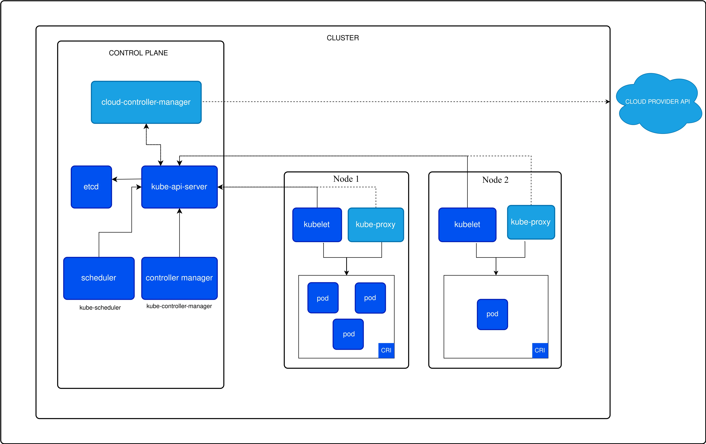

# What Is Kubernetes? The Complete Guide to Container Orchestration

In the rapidly evolving world of cloud-native computing, few technologies have had as transformative an impact as Kubernetes. Originally developed by Google and now maintained by the Cloud Native Computing Foundation (CNCF), Kubernetes has become the undisputed leader in container orchestration, powering millions of applications across organizations of all sizes. From startups deploying their first microservices to Fortune 500 companies managing thousands of containers, Kubernetes provides the foundation for modern application deployment and management.

Kubernetes, often abbreviated as K8s (representing the 8 letters between "K" and "s"), is an open-source platform that automates the deployment, scaling, and management of containerized applications. What started as Google's internal container orchestration system called Borg has evolved into the industry standard that enables organizations to harness the full power of containerization at scale. This comprehensive guide explores everything you need to know about Kubernetes, from fundamental concepts to advanced production strategies that can transform how your organization builds and deploys software.

## Understanding Kubernetes: The Foundation of Modern Application Architecture

Kubernetes represents more than just a container orchestration tool—it's a complete platform that has fundamentally changed how we think about application deployment, scaling, and management. Before Kubernetes, managing containerized applications at scale required complex, custom solutions that were difficult to maintain and scale. Organizations struggled with manual deployment processes, inconsistent environments, and the operational overhead of managing distributed systems.

The platform emerged from Google's two decades of experience running containerized workloads in production through their internal Borg system. Google's engineers recognized that the challenges they solved internally—automatic scaling, self-healing systems, and efficient resource utilization—were universal problems that every organization would face as they adopted containerization. By open-sourcing these capabilities through Kubernetes, Google created a foundation that enables any organization to deploy and manage applications with the same sophistication as hyperscale technology companies.

At its core, Kubernetes provides a framework for running distributed systems resiliently and efficiently. The platform handles scaling decisions automatically based on resource utilization and custom metrics, provides self-healing capabilities that automatically replace failed containers and reschedule them on healthy nodes, implements sophisticated deployment patterns that enable zero-downtime updates, and offers service discovery and load balancing that simplifies microservices communication.

What makes Kubernetes particularly powerful is its declarative approach to infrastructure management. Instead of imperatively defining step-by-step deployment procedures, operators describe the desired state of their applications, and Kubernetes continuously works to maintain that state. This approach reduces operational complexity, enables version-controlled infrastructure configurations, and provides the foundation for modern GitOps workflows.

## The Critical Need for Container Orchestration

Modern applications rarely consist of single, monolithic containers. Today's cloud-native applications typically involve dozens or hundreds of interconnected microservices, each running in separate containers with specific resource requirements, networking needs, and scaling characteristics. Managing this complexity manually quickly becomes impossible as applications grow beyond toy examples.

Container orchestration addresses fundamental challenges that emerge when deploying containerized applications at scale. These challenges include coordinating deployments across multiple containers and services, ensuring high availability through automatic failover and recovery, implementing efficient resource allocation to maximize infrastructure utilization, managing network communication between services and external traffic, handling persistent data storage for stateful applications, and maintaining security boundaries between different applications and tenants.

Without orchestration, development teams spend enormous amounts of time on operational tasks rather than building features that deliver business value. Kubernetes abstracts away these operational complexities while providing the control and flexibility that enterprise applications require.

## The Evolution of Application Deployment: From Physical Servers to Kubernetes

Understanding Kubernetes' revolutionary impact requires examining the evolution of application deployment methodologies and the problems each approach attempted to solve. This progression reveals why container orchestration has become essential for modern software development.

The Traditional Deployment Era marked the beginning of enterprise computing, where applications ran directly on physical servers without resource boundaries or isolation. Organizations purchased dedicated servers for each application, leading to poor resource utilization and significant hardware costs. When applications failed, entire servers became unavailable, and scaling required purchasing additional physical hardware—a process that could take weeks or months.

The Virtualization Era introduced virtual machines that allowed multiple applications to run on a single physical server, improving resource utilization and reducing hardware costs. However, VMs came with their own overhead, as each virtual machine required a complete operating system installation, consuming significant memory and storage resources. While virtualization solved some resource efficiency problems, it introduced new complexities around VM management and still required significant time to provision new environments.

The Container Era emerged when Docker popularized lightweight, portable containers that shared the host operating system kernel while maintaining application isolation. Containers started much faster than VMs and used resources more efficiently, enabling higher density deployments. However, as organizations began running dozens or hundreds of containers across multiple hosts, they quickly discovered that container technology alone wasn't sufficient for production deployments.

The Container Orchestration Era began when organizations realized they needed sophisticated platforms to manage containerized applications at scale. Early solutions were often custom-built and difficult to maintain, until Kubernetes emerged as a comprehensive platform that addressed the fundamental challenges of distributed container management. Kubernetes brought Google's internal expertise to the broader industry, providing battle-tested solutions for the most complex operational challenges.

## Kubernetes Design Philosophy: Built for Production Scale

Kubernetes embodies three fundamental design principles that distinguish it from simpler container management tools and make it suitable for production environments at any scale.

**Security by Default** represents Kubernetes' commitment to providing secure configurations out of the box. The platform implements the principle of least privilege across all components, uses network policies to control traffic between services, provides secure secret management for sensitive data, supports role-based access control (RBAC) for fine-grained permissions, and integrates with enterprise identity management systems. This security-first approach means organizations can deploy Kubernetes with confidence, knowing that security best practices are built into the platform rather than being an afterthought.

**Declarative Simplicity** makes Kubernetes accessible to teams with varying levels of infrastructure expertise. Despite managing incredibly complex distributed systems underneath, Kubernetes presents a declarative interface where users describe the desired state of their applications rather than the steps needed to achieve that state. This approach reduces cognitive load on operators, enables version-controlled infrastructure configurations, supports automated reconciliation when systems drift from desired state, and provides the foundation for GitOps workflows that treat infrastructure as code.

**Extensible Architecture** ensures that Kubernetes can adapt to diverse organizational needs and emerging technologies. The platform's API-centric design enables third-party tools and services to integrate seamlessly, custom resource definitions allow organizations to extend Kubernetes with domain-specific concepts, operators encode operational knowledge for complex applications, and admission controllers enable policy enforcement and automated workflows. This extensibility has fostered a rich ecosystem of tools and platforms that build upon Kubernetes' foundation.

### The Declarative Configuration Advantage

Kubernetes' declarative configuration model represents a fundamental shift from traditional imperative infrastructure management. Rather than writing scripts that define step-by-step deployment procedures, operators create YAML or JSON files that describe the desired state of their applications and infrastructure. Kubernetes then continuously monitors the actual state of the system and takes actions to reconcile any differences with the declared desired state.

This declarative approach delivers several critical advantages that make Kubernetes suitable for production environments. Configuration files become version-controlled artifacts that can be reviewed, tested, and rolled back like application code. Teams can implement GitOps workflows where infrastructure changes are proposed through pull requests and automatically applied when merged. The system becomes self-healing, automatically correcting drift that occurs due to hardware failures, manual changes, or other environmental factors.

## Kubernetes Architecture: A Deep Dive into Distributed Systems Design



Kubernetes implements a sophisticated distributed systems architecture that provides both high availability and horizontal scalability. Understanding this architecture is crucial for designing resilient applications and troubleshooting production issues.

### Control Plane: The Brain of Kubernetes

The Kubernetes Control Plane orchestrates all cluster operations through a collection of highly available components that can be distributed across multiple machines for resilience. This design ensures that cluster management functions remain available even when individual control plane nodes fail.

The **API Server (kube-apiserver)** serves as the primary interface for all cluster interactions, exposing a RESTful API that handles authentication, authorization, and validation of all requests. All components within Kubernetes communicate through this API server, making it the central coordination point for the entire cluster. The API server is stateless and can be horizontally scaled to handle increasing cluster sizes, with load balancers distributing requests across multiple instances.

**etcd** provides distributed, strongly consistent storage for all cluster state information, serving as the single source of truth for the entire Kubernetes cluster. This distributed key-value store maintains configuration data, secrets, and the current state of all cluster resources. etcd's consistency guarantees ensure that all cluster components have access to the same information, preventing split-brain scenarios that could compromise cluster integrity. For production deployments, etcd typically runs across multiple nodes with automated backup and recovery procedures.

The **Scheduler (kube-scheduler)** makes intelligent decisions about where to place newly created pods based on resource requirements, constraints, affinity rules, and cluster topology. The scheduler considers CPU and memory requirements, storage needs, networking constraints, and custom scheduling policies when selecting optimal nodes for workloads. Advanced scheduling features include node affinity and anti-affinity rules that control pod placement, taints and tolerations that enable dedicated node pools, and custom schedulers for specialized workloads.

The **Controller Manager (kube-controller-manager)** runs multiple controller loops that monitor cluster state and take corrective actions to maintain desired configurations. These controllers handle diverse responsibilities including managing pod replication, monitoring node health, managing service endpoints, and handling persistent volume claims. Each controller operates independently but coordinates through the API server to ensure consistent cluster behavior.

The **Cloud Controller Manager** provides integration with underlying cloud infrastructure, managing cloud-specific resources like load balancers, storage volumes, and network configurations. This component abstracts cloud provider differences, enabling portable Kubernetes deployments across different cloud environments.

### Worker Nodes: Where Applications Run

Worker nodes provide the compute resources where containerized applications actually execute. Each worker node runs several essential components that coordinate with the control plane to ensure applications run as specified.

The **Kubelet** serves as the primary node agent that communicates with the control plane and manages container lifecycle on each node. The kubelet receives pod specifications from the API server and ensures that the described containers are running and healthy. It monitors resource usage, performs health checks, and reports node and pod status back to the control plane. The kubelet also manages volume mounts, handles container log collection, and enforces resource limits.

**Kube-proxy** implements network services on each node, maintaining network rules that enable communication to pods from inside or outside the cluster. It handles load balancing for Kubernetes services, manages iptables or IPVS rules for traffic distribution, and ensures that network policies are enforced. Modern implementations of kube-proxy can handle thousands of services efficiently while maintaining low latency for network requests.

The **Container Runtime** provides the actual container execution environment, supporting various runtime implementations including Docker, containerd, and CRI-O. The runtime handles container image management, creates and destroys containers as directed by the kubelet, and provides container isolation using Linux namespaces and control groups.

## Essential Kubernetes Resources: Building Blocks of Applications

### Pods: The Fundamental Execution Unit

Pods represent the smallest deployable and manageable unit in Kubernetes, embodying the concept of co-located containers that share lifecycle, network, and storage resources. Understanding pods is crucial because all higher-level Kubernetes abstractions ultimately manage collections of pods.

A pod typically contains a single application container, though it can include additional sidecar containers that provide supporting functionality like logging, monitoring, or service mesh integration. All containers within a pod share the same network namespace, meaning they can communicate with each other using localhost and share the same IP address and port space. This design enables tight coupling between containers that need to work together while maintaining isolation from other pods.

Pods also share storage volumes, enabling containers within the pod to share data through mounted filesystems. This shared storage model supports patterns like init containers that prepare data for application containers, or sidecar containers that collect logs or metrics from the main application.

The ephemeral nature of pods is a fundamental concept in Kubernetes architecture. Pods are designed to be disposable and replaceable, with higher-level controllers managing pod lifecycle and ensuring that the desired number of replicas are always running. This design enables self-healing behavior where failed pods are automatically replaced and rescheduled on healthy nodes.

Example pod configuration:

```yaml
apiVersion: v1
kind: Pod
metadata:
  name: nginx-pod
  labels:
    app: nginx
spec:
  containers:
    - name: nginx
      image: nginx:1.21
      ports:
        - containerPort: 80
```

### Deployments and ReplicaSets: Managing Application Lifecycle

While pods represent individual application instances, production applications require higher-level abstractions that provide scalability, high availability, and automated management capabilities. Deployments and ReplicaSets work together to ensure that applications remain available and can be updated safely.

**ReplicaSets** ensure that a specified number of identical pod replicas are running at any given time, providing the foundation for high availability and fault tolerance. When pods fail due to node failures, resource constraints, or other issues, the ReplicaSet controller automatically creates replacement pods to maintain the desired replica count. This self-healing behavior is essential for production applications that must remain available despite infrastructure failures.

**Deployments** build upon ReplicaSets to provide sophisticated application lifecycle management capabilities. Deployments enable rolling updates that gradually replace old pod instances with new ones, ensuring that applications remain available during updates. They provide rollback capabilities that can quickly revert to previous versions if issues are discovered, support scaling operations that can increase or decrease replica counts based on demand, and offer pause and resume functionality for controlled update processes.

The deployment process demonstrates Kubernetes' declarative approach in action. When you update a deployment's container image, Kubernetes automatically creates a new ReplicaSet with the updated configuration while gradually scaling down the old ReplicaSet. This process continues until all pods are running the new version, providing zero-downtime updates for stateless applications.

### Services: Stable Networking for Dynamic Applications

Kubernetes Services solve a fundamental challenge in distributed systems: how to provide stable network endpoints for applications that consist of constantly changing sets of pods. Since pods are ephemeral and can be created, destroyed, or rescheduled at any time, applications need a way to discover and communicate with each other without depending on specific pod IP addresses.

Services provide stable virtual IP addresses and DNS names that remain constant even as the underlying pods change. When a service receives traffic, it automatically load balances requests across healthy pods that match the service's selector criteria. This abstraction enables loose coupling between application components and supports dynamic scaling scenarios where the number of backend pods changes frequently.

Kubernetes supports several service types that address different networking requirements. **ClusterIP services** provide internal cluster networking for communication between microservices, creating virtual IP addresses that are only accessible within the cluster. **NodePort services** expose applications on specific ports across all cluster nodes, enabling external access for development and testing scenarios. **LoadBalancer services** integrate with cloud provider load balancers to provide production-grade external access with health checking and traffic distribution. **ExternalName services** provide DNS-based service discovery for external resources, enabling applications to use consistent service names regardless of whether dependencies are internal or external.

### ConfigMaps and Secrets: Separating Configuration from Code

Modern application development emphasizes the separation of configuration from application code to enable portability across different environments. Kubernetes provides ConfigMaps and Secrets as first-class resources for managing application configuration and sensitive data.

**ConfigMaps** store non-sensitive configuration data as key-value pairs that can be consumed by applications through environment variables, command-line arguments, or mounted files. This separation enables the same container image to be used across development, testing, and production environments with different configurations. ConfigMaps support complex configuration scenarios including multi-line configuration files, structured data in JSON or YAML format, and hierarchical configuration structures.

**Secrets** provide secure storage for sensitive information like passwords, OAuth tokens, SSH keys, and TLS certificates. Kubernetes encrypts secret data at rest and in transit, provides fine-grained access controls through RBAC policies, and supports automatic rotation for certain types of secrets. Secrets can be mounted as files or exposed as environment variables, giving applications flexible options for accessing sensitive data.

### Namespaces: Multi-tenancy and Resource Organization

Namespaces provide virtual clusters within a physical Kubernetes cluster, enabling multiple teams or applications to share cluster resources while maintaining isolation and organization. This multi-tenancy capability is essential for organizations that want to efficiently utilize cluster resources while providing appropriate boundaries between different workloads.

Namespaces enable resource quotas that limit the total amount of CPU, memory, and storage that can be consumed within each namespace, preventing individual teams or applications from overwhelming shared cluster resources. They support network policies that control traffic flow between namespaces, enabling security isolation between different applications or environments. RBAC policies can be scoped to specific namespaces, allowing fine-grained access controls that grant teams permissions only for their own resources.

## Advanced Kubernetes Resource Management

### Resource Allocation and Quality of Service

Kubernetes provides sophisticated resource management capabilities that ensure fair allocation of cluster resources while maintaining application performance. Understanding these mechanisms is crucial for running production workloads efficiently.

**Resource Requests and Limits** enable fine-grained control over how much CPU and memory each container can consume. Requests specify the minimum resources that must be available for a pod to be scheduled, ensuring that applications have adequate resources to function properly. Limits define the maximum resources a container can use, preventing individual applications from consuming excessive resources that could impact other workloads.

**Quality of Service (QoS) Classes** categorize pods based on their resource specifications, influencing scheduling decisions and eviction behavior during resource pressure. Guaranteed pods have equal requests and limits for all resources, receiving the highest priority for scheduling and the lowest likelihood of eviction. Burstable pods have requests lower than limits, enabling them to use additional resources when available while providing some protection during resource contention. BestEffort pods have no resource requirements, making them suitable for non-critical workloads that can tolerate variable performance.

**Node Affinity and Anti-Affinity** rules provide control over pod placement based on node characteristics and existing workloads. Node affinity enables requirements like scheduling compute-intensive pods on high-performance nodes or ensuring that data processing pods run close to storage resources. Pod anti-affinity can distribute replicas across different nodes or availability zones to improve fault tolerance and reduce the impact of node failures.

## Comprehensive Kubernetes Networking Architecture

Kubernetes networking represents one of the platform's most sophisticated subsystems, addressing the complex challenges of connecting thousands of dynamic, ephemeral containers across distributed infrastructure. The networking model provides a flat network topology where every pod receives a unique IP address and can communicate directly with any other pod in the cluster, regardless of which node they're running on.

### Fundamental Networking Principles

Kubernetes networking is built around four core communication patterns that together enable comprehensive connectivity for modern applications. **Container-to-container communication** within pods leverages shared network namespaces, allowing containers to communicate using localhost and share the same IP address and port space. This design enables tight coupling between containers that need to work together, such as application containers and logging sidecars.

**Pod-to-pod communication** forms the backbone of microservices architectures, where each service runs in separate pods that need to communicate with each other. Kubernetes assigns each pod a unique IP address from the cluster's pod CIDR range, enabling direct communication without network address translation (NAT). This approach simplifies service discovery and eliminates the port conflicts that plague traditional deployment models.

**Pod-to-service communication** provides stable endpoints for accessing groups of pods that implement specific services. Services abstract away the dynamic nature of pod IP addresses, providing consistent DNS names and virtual IP addresses that remain stable even as pods are created, destroyed, or rescheduled. This abstraction enables loose coupling between services and supports dynamic scaling scenarios.

**External-to-service communication** enables applications running outside the cluster to access services within the cluster. Kubernetes provides multiple mechanisms for external access, including Ingress controllers that provide HTTP/HTTPS routing, LoadBalancer services that integrate with cloud provider load balancers, and NodePort services that expose applications on specific ports across cluster nodes.

### Network Policies: Implementing Microsegmentation

Network Policies provide fine-grained control over traffic flow between pods, enabling organizations to implement zero-trust networking principles within Kubernetes clusters. These policies use label selectors to define groups of pods and specify rules for allowed ingress and egress traffic.

```yaml
apiVersion: networking.k8s.io/v1
kind: NetworkPolicy
metadata:
  name: access-nginx
spec:
  podSelector:
    matchLabels:
      app: nginx
  ingress:
    - from:
        - podSelector:
            matchLabels:
              access: 'true'
      ports:
        - protocol: TCP
          port: 80
```

Network policies enable security-focused architectures where applications can only communicate with explicitly authorized services. This microsegmentation approach reduces the attack surface by preventing lateral movement in case of security breaches and provides compliance with security frameworks that require network-level access controls.

### Service Mesh Integration: Advanced Traffic Management

Modern Kubernetes deployments often incorporate service mesh technologies that provide enhanced networking capabilities beyond what Kubernetes offers natively. Service meshes like Istio, Linkerd, and Cilium add a dedicated infrastructure layer that handles service-to-service communication, providing advanced features like traffic management, security policies, and observability.

The service mesh architecture typically consists of a control plane that manages configuration and policies, and a data plane composed of lightweight proxies that intercept and control all network traffic between services. This approach enables sophisticated traffic management capabilities including canary deployments, circuit breakers, retry logic, and traffic splitting for A/B testing scenarios.

Service meshes also provide security enhancements through mutual TLS (mTLS) that automatically encrypts all inter-service communication, identity-based access controls that authorize requests based on service identity rather than network location, and policy enforcement that can implement complex authorization rules based on request attributes.

## Kubernetes Storage: Managing Data in Dynamic Environments

Kubernetes storage addresses one of the most challenging aspects of running stateful applications in containerized environments: providing persistent, reliable data storage that survives pod restarts, rescheduling, and node failures. The platform provides a comprehensive storage framework that abstracts underlying storage implementations while offering the flexibility and performance characteristics required by diverse application workloads.

### Understanding Persistent Volumes and Claims

The Kubernetes storage model separates storage provisioning from consumption through the Persistent Volume (PV) and Persistent Volume Claim (PVC) abstractions. This separation enables administrators to manage storage resources independently from applications while giving developers a simple interface for requesting storage that meets their application requirements.

**Persistent Volumes** represent storage resources that have been provisioned by administrators or dynamically created through StorageClasses. PVs encapsulate the details of storage implementation, whether it's cloud provider block storage, network-attached storage, or local storage. Each PV has specific characteristics including capacity, access modes, and performance classes that determine which applications can use it.

**Persistent Volume Claims** represent requests for storage by applications, specifying requirements like capacity, access patterns, and performance characteristics. When a PVC is created, Kubernetes matches it with an appropriate PV or triggers dynamic provisioning if no suitable PV exists. This binding creates a one-to-one relationship between the claim and volume that persists until explicitly released.

**StorageClasses** define different tiers of storage with varying performance, availability, and cost characteristics. They enable dynamic provisioning where storage volumes are created automatically when applications request them, eliminating the need for administrators to pre-provision storage resources. StorageClasses can specify parameters like replication factors, encryption settings, and backup policies that influence how storage is provisioned and managed.

Example PVC configuration:

```yaml
apiVersion: v1
kind: PersistentVolumeClaim
metadata:
  name: mysql-data-claim
spec:
  accessModes:
    - ReadWriteOnce
  storageClassName: fast
  resources:
    requests:
      storage: 10Gi
```

### StatefulSets: Managing Stateful Applications

StatefulSets address the unique requirements of stateful applications that need stable network identities, ordered deployment and scaling, and persistent storage that follows pods across rescheduling events. Unlike Deployments that treat pods as interchangeable replicas, StatefulSets maintain the identity and state of each pod instance.

StatefulSets provide several guarantees that are essential for stateful applications. Pods receive stable hostnames based on the StatefulSet name and ordinal index, enabling applications to maintain persistent network identities. Storage volumes are bound to specific pod instances and persist across pod restarts and rescheduling. Deployment and scaling operations follow strict ordering rules that ensure data consistency and application stability.

These characteristics make StatefulSets ideal for applications like databases, message queues, and distributed storage systems that require stable identities and persistent state. The ordered deployment ensures that database replicas start in the correct sequence, while persistent storage guarantees that data remains available even when pods are moved between nodes.

## Comprehensive Kubernetes Security Framework

Kubernetes security requires a defense-in-depth approach that addresses threats at multiple layers of the stack, from container images and runtime environments to network communication and cluster access. The platform provides extensive security capabilities, but implementing them effectively requires understanding the security model and following established best practices.

### Identity and Access Management

**Authentication** in Kubernetes verifies the identity of users and services accessing the cluster through multiple supported mechanisms. X.509 client certificates provide strong cryptographic authentication for both users and cluster components. OAuth and OpenID Connect integration enables single sign-on with enterprise identity providers. Service accounts provide identity for applications running within the cluster, with automatically mounted credentials that enable secure API access.

**Authorization** controls what authenticated entities can do within the cluster through sophisticated policy engines. Role-Based Access Control (RBAC) provides fine-grained permissions based on user roles and responsibilities, enabling organizations to implement least-privilege access principles. RBAC policies can be scoped to specific namespaces or apply cluster-wide, giving administrators flexibility in designing access control hierarchies.

Example RBAC configuration:

```yaml
apiVersion: rbac.authorization.k8s.io/v1
kind: Role
metadata:
  namespace: default
  name: pod-reader
rules:
  - apiGroups: ['']
    resources: ['pods']
    verbs: ['get', 'watch', 'list']
```

### Pod Security and Runtime Protection

**Pod Security Standards** define security baselines that prevent common security misconfigurations and enforce security best practices. The Privileged standard allows unrestricted pod configurations suitable for system-level workloads. The Baseline standard prevents privilege escalation and other dangerous configurations while remaining broadly compatible with common applications. The Restricted standard implements hardened security policies suitable for security-critical applications.

**Security Contexts** enable fine-grained control over pod and container security settings. These contexts can specify the user and group IDs under which containers run, control privilege escalation capabilities, set Linux capabilities and SELinux contexts, and configure seccomp profiles that restrict system call access. Properly configured security contexts significantly reduce the attack surface of containerized applications.

**Pod Security Admission** enforces security policies at pod creation time, preventing the deployment of pods that don't meet security requirements. This admission controller can operate in enforce mode that blocks non-compliant pods, audit mode that logs violations, or warn mode that provides feedback to users without blocking deployments.

### Supply Chain Security and Image Management

Container image security represents a critical aspect of Kubernetes security, as compromised images can introduce vulnerabilities throughout the application stack. **Image scanning** tools analyze container images for known vulnerabilities, outdated packages, and security misconfigurations before they're deployed to production environments. These tools can be integrated into CI/CD pipelines to prevent vulnerable images from reaching production.

**Image signing and verification** using technologies like Sigstore and Notary provide cryptographic guarantees about image authenticity and integrity. Signed images enable organizations to verify that images haven't been tampered with and originated from trusted sources. **Admission controllers** can enforce policies that only allow signed images or images that have passed security scanning.

**Software Bill of Materials (SBOM)** generation creates comprehensive inventories of all components within container images, enabling organizations to track dependencies and quickly identify affected systems when vulnerabilities are discovered in upstream components.

## Deployment Strategies

Kubernetes supports various deployment strategies to minimize downtime and risk:

### Rolling Updates

The default strategy that gradually replaces old pods with new ones, ensuring availability during updates.

### Blue-Green Deployments

Maintain two identical environments (blue and green), with only one serving production traffic at a time. When deploying, switch traffic from the old (blue) to the new (green) environment.

### Canary Deployments

Release a new version to a small subset of users before rolling it out to everyone, allowing early detection of issues.

### A/B Testing

Route a percentage of traffic to different versions to compare performance or user behavior.

Example implementation using a service with multiple deployments:

```yaml
apiVersion: v1
kind: Service
metadata:
  name: my-app
spec:
  selector:
    app: my-app
  ports:
    - port: 80
      targetPort: 8080
```

## Monitoring and Observability

A comprehensive observability strategy for Kubernetes includes:

### Metrics

1. **System Metrics**: CPU, memory, disk, and network utilization
2. **Kubernetes Metrics**: Pod/node status, API server latency, etcd health
3. **Application Metrics**: Request rates, error rates, response times

Tools: Prometheus, Grafana, Datadog

### Logging

Centralized logging solutions capture logs from:

- Applications
- Containers
- Kubernetes components
- Node system logs

Tools: Elasticsearch, Fluentd, Kibana (EFK stack), Loki

### Tracing

Distributed tracing tracks requests as they flow through microservices, helping identify performance bottlenecks.

Tools: Jaeger, Zipkin, OpenTelemetry

## Kubernetes in Production

Running Kubernetes in production requires attention to several key areas:

### Cluster Management

1. **Multi-cluster Strategies**: Using multiple clusters for:

   - Workload isolation
   - Geographic distribution
   - High availability
   - Dev/test/prod separation

2. **Cluster Upgrades**: Strategies for upgrading Kubernetes components with minimal disruption

3. **Backup and Disaster Recovery**: Regular backups of etcd data, configuration, and application state

### Resource Optimization

1. **Right-sizing Resources**: Matching resource requests with actual usage
2. **Horizontal Pod Autoscaling**: Automatically scaling applications based on metrics
3. **Vertical Pod Autoscaling**: Recommending or automatically adjusting CPU and memory resources
4. **Cluster Autoscaling**: Dynamically adding or removing nodes based on demand

### Cost Management

1. **Namespace Quotas**: Limit resource consumption by team or application
2. **Cost Allocation**: Tag resources for accurate billing and chargeback
3. **Spot/Preemptible Instances**: Use lower-cost, interruptible instances for suitable workloads

## Popular Kubernetes Distributions

Several Kubernetes distributions offer simplified installation and added features:

### Managed Kubernetes Services

1. **Amazon EKS**: Managed Kubernetes service on AWS
2. **Google GKE**: Google's managed Kubernetes offering
3. **Azure AKS**: Microsoft's managed Kubernetes service
4. **DigitalOcean Kubernetes**: Simple managed Kubernetes for smaller teams

### Self-Managed Distributions

1. **Red Hat OpenShift**: Enterprise Kubernetes platform with developer tools and security features
2. **Rancher**: Complete container management platform
3. **K3s**: Lightweight Kubernetes for edge, IoT, and development
4. **Sealos**: User-friendly distribution focused on simplicity and production readiness

## Advanced Topics

### Operators

Kubernetes Operators extend the platform's capabilities by encoding operational knowledge for specific applications:

1. **How Operators Work**: Using the Kubernetes API to observe and take action
2. **Operator Frameworks**: Tools like Operator SDK to build custom operators
3. **Common Use Cases**: Managing databases, message queues, and complex stateful applications

Example operators:

- Prometheus Operator
- PostgreSQL Operator
- Elasticsearch Operator

### Service Mesh

Service meshes provide advanced capabilities for microservice communication:

1. **Control Plane**: Manages the configuration and policies
2. **Data Plane**: Proxies that intercept and control traffic between services
3. **Features**: Traffic management, security, observability

Popular implementations:

- Istio
- Linkerd
- Cilium

### GitOps

GitOps uses Git as the single source of truth for declarative infrastructure and applications:

1. **Core Principles**: Infrastructure as code, Git as the single source of truth, continuous verification
2. **Tools**: Flux, ArgoCD, Jenkins X
3. **Benefits**: Improved auditing, reliability, and developer experience

## Common Challenges and Solutions

### Performance Issues

1. **Etcd Performance**: Optimizing etcd for large clusters
2. **API Server Bottlenecks**: Strategies for horizontal scaling and caching
3. **Network Performance**: Tuning CNI providers for specific workloads

### Troubleshooting

1. **Pod Failures**: Diagnosing and fixing container crashes
2. **Networking Issues**: Debugging connectivity problems
3. **Resource Constraints**: Identifying and resolving resource bottlenecks

### Scaling Challenges

1. **Large Cluster Management**: Challenges with clusters of 1000+ nodes
2. **Multi-tenant Concerns**: Isolating workloads in shared environments
3. **Edge Computing**: Extending Kubernetes to remote locations

## The Future of Kubernetes: Trends and Innovations

Kubernetes continues to evolve rapidly, driven by the changing needs of modern applications and emerging technology trends. Understanding these developments helps organizations plan their container strategy and stay ahead of the technological curve.

**Simplified Developer Experience** represents one of the most significant areas of innovation, with new abstractions and tools that hide infrastructure complexity from developers while preserving the power and flexibility of Kubernetes. Platform engineering teams are building internal developer platforms that provide self-service capabilities while maintaining organizational standards for security, compliance, and operational excellence.

**Edge Computing and IoT Integration** drives the development of lightweight Kubernetes distributions and specialized orchestration capabilities for resource-constrained environments. These initiatives enable organizations to extend cloud-native practices to edge locations, bringing computation closer to data sources and users while maintaining centralized management and policy enforcement.

**AI and Machine Learning Workloads** present unique challenges for Kubernetes, including GPU resource management, specialized networking requirements, and integration with machine learning frameworks. The ecosystem continues to develop specialized operators, custom schedulers, and resource managers that optimize Kubernetes for AI/ML workloads.

**Enhanced Security and Zero-Trust Architecture** focuses on implementing security-by-default principles, improving supply chain security, and enabling zero-trust networking models that assume no implicit trust within the cluster environment.

## Getting Started with Kubernetes: A Strategic Approach

### Local Development Environment Setup

Beginning your Kubernetes journey requires establishing a local development environment that mirrors production capabilities while remaining accessible for learning and experimentation. **Minikube** provides a full-featured single-node Kubernetes cluster that runs in a virtual machine, offering complete compatibility with production Kubernetes APIs. **Kind (Kubernetes in Docker)** enables rapid creation and destruction of multi-node clusters using Docker containers, making it ideal for testing and development workflows. **k3d** offers lightweight k3s-based clusters that start quickly and consume minimal resources, perfect for resource-constrained development environments.

For developers seeking a more streamlined approach to cloud-native development, [modern development platforms](/products/devbox) provide pre-configured environments that eliminate the complexity of local Kubernetes setup while offering direct deployment capabilities to production infrastructure. These platforms combine the benefits of local development with cloud-native deployment, enabling teams to focus on application development rather than environment configuration.

### Strategic Learning Path

Mastering Kubernetes requires a structured approach that builds knowledge incrementally while providing hands-on experience with real-world scenarios. Start by understanding container fundamentals through Docker, as containerization concepts form the foundation for everything Kubernetes does. Progress to core Kubernetes concepts including pods, services, and deployments, focusing on understanding the declarative model and how resources relate to each other.

Hands-on practice becomes crucial at this stage, with guided tutorials and sample applications providing practical experience with common deployment patterns. Consider pursuing CNCF certifications like the Certified Kubernetes Administrator (CKA), Certified Kubernetes Application Developer (CKAD), or Certified Kubernetes Security Specialist (CKS) to validate your knowledge and demonstrate expertise to employers.

### Production Deployment Strategy

Implementing Kubernetes in production requires careful planning around infrastructure choices, operational procedures, and organizational readiness. Choose between managed Kubernetes services that reduce operational overhead or self-managed distributions that provide maximum control and customization. Define resource requirements including CPU, memory, and storage needs based on application characteristics and growth projections.

Establish CI/CD pipelines that automate application deployment while maintaining security and quality standards. Modern development workflows benefit from [integrated development environments](/products/devbox) that provide seamless deployment from development to Kubernetes production infrastructure, eliminating configuration drift and accelerating release cycles.

Implement comprehensive monitoring and observability using tools like Prometheus, Grafana, and distributed tracing systems. For applications requiring persistent data storage, integrate [managed database services](/products/databases) that provide enterprise-grade reliability and performance while maintaining operational consistency with your Kubernetes infrastructure. Develop backup and disaster recovery strategies that protect both cluster state and application data.

## Conclusion: Kubernetes as the Foundation of Modern Computing

Kubernetes has fundamentally transformed how organizations approach application deployment, scaling, and management, establishing itself as the foundation for modern cloud-native computing. Its impact extends far beyond simple container orchestration, enabling new architectural patterns, operational practices, and business capabilities that were previously impossible or prohibitively complex.

The platform's declarative model and extensive automation capabilities have democratized access to sophisticated infrastructure management, allowing teams of all sizes to implement practices that were once exclusive to large technology companies. Organizations report significant improvements in deployment frequency, system reliability, and infrastructure efficiency after adopting Kubernetes, along with enhanced developer productivity and faster time-to-market for new features.

Whether you're running applications in public clouds, private data centers, or hybrid environments, Kubernetes provides a consistent, portable platform that abstracts infrastructure differences while maintaining high performance and reliability. The extensive ecosystem of tools, operators, and integrations ensures that Kubernetes can adapt to virtually any organizational need or technical requirement.

## Building Complete Applications: Integrating Development and Data Services

Modern Kubernetes applications require more than just container orchestration—they need comprehensive ecosystems that support the entire application lifecycle from development to production. Organizations seeking to maximize their Kubernetes investment benefit from integrating complementary services that provide specialized capabilities while maintaining operational consistency.

For organizations seeking to complement their Kubernetes-based applications with reliable data services, [managed database solutions](/products/databases) provide the same level of automation and scalability that makes Kubernetes so effective for application orchestration. These services ensure your data layer matches the sophistication of your application platform, offering automated backups, scaling, and high availability without the operational overhead of managing database infrastructure manually.

Development teams building on Kubernetes can further accelerate their workflows through [integrated development platforms](/products/devbox) that provide instant, pre-configured environments with seamless deployment to Kubernetes infrastructure. This approach eliminates the traditional friction between development and production environments while maintaining the full power and flexibility of Kubernetes orchestration.

For teams looking to streamline their Kubernetes adoption without sacrificing capabilities, [Sealos](https://sealos.io) offers a user-friendly distribution that reduces operational complexity while maintaining full compatibility with the Kubernetes ecosystem. Sealos demonstrates how the right tools and abstractions can make sophisticated technology accessible to organizations of all sizes.

The future of software deployment is undeniably Kubernetes-centric, with the platform continuing to evolve and adapt to new challenges and opportunities. Understanding and mastering Kubernetes has become essential for any organization serious about digital transformation, operational efficiency, and competitive advantage in today's technology-driven marketplace.

**Key Resources for Continued Learning:**

- [Kubernetes Official Documentation](https://kubernetes.io/docs/) - Comprehensive technical documentation
- [CNCF Landscape](https://landscape.cncf.io/) - Cloud-native ecosystem overview
- [Kubernetes Patterns](https://www.oreilly.com/library/view/kubernetes-patterns/9781492050278/) - Advanced design patterns
- [CNCF Training and Certification](https://training.linuxfoundation.org/training/catalog/?_focus-area=kubernetes) - Professional development paths
