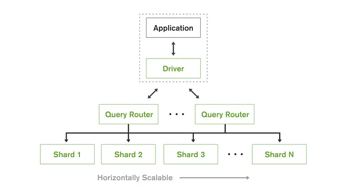

MongoDB has established itself as the leading NoSQL document database, revolutionizing how organizations store and manage data in today's application-driven landscape. This comprehensive guide explains everything you need to know about MongoDB, from basic concepts to advanced deployment strategies.

## Understanding MongoDB: The Foundation of Modern Document Storage

MongoDB is an open-source NoSQL document database designed to handle modern application data with flexibility, scalability, and performance. Originally developed by 10gen (now MongoDB Inc.) in 2007, MongoDB has rapidly become the industry standard for building applications that require flexible data models, horizontal scaling, and real-time analytics.

At its core, MongoDB stores data in flexible, JSON-like documents, meaning fields can vary from document to document and data structure can be changed over time. It provides a distributed database platform that can handle massive amounts of data while maintaining high performance across distributed systems.

### Why MongoDB Matters

In today's application-driven digital environment, organizations need to:

- Store and retrieve complex, nested data structures efficiently
- Scale database operations horizontally across multiple servers
- Adapt data models quickly as application requirements evolve
- Support real-time analytics and aggregation workloads
- Enable rapid application development with flexible schemas

MongoDB addresses these needs by providing a document-oriented database that works seamlessly with modern programming languages and development frameworks. Its combination of flexibility, performance, and scalability has made it the database of choice for modern applications.

Organizations deploying MongoDB at scale often benefit from [managed database platforms](/products/databases) that handle operational complexity while preserving the flexibility and performance characteristics that make MongoDB attractive for modern development workflows.

## The Evolution of Database Technology

To understand MongoDB's significance, it's important to recognize the evolution of database approaches:

1. **Relational Database Era**: Structured data in rigid tables with ACID properties
2. **Object-Relational Era**: Attempts to bridge object-oriented programming and relational storage
3. **Web Scale Era**: Need for horizontal scaling beyond single-server limitations
4. **NoSQL Era**: MongoDB emerged as a flexible solution for diverse data types
5. **Multi-Model Era**: Modern applications requiring multiple data models and real-time processing

MongoDB built upon decades of database research and real-world web-scale experience to create a solution that balances flexibility, performance, and operational simplicity, making enterprise-grade document storage capabilities available to organizations of all sizes.

## Core Design Principles

MongoDB is built around fundamental design principles that guide its implementation and development:

1. **Flexibility**: MongoDB supports dynamic schemas and nested data structures, allowing applications to evolve without rigid constraints or complex migrations.

2. **Scalability**: The platform is designed to scale horizontally through sharding, handling massive data volumes and high throughput requirements across distributed clusters.

3. **Performance**: MongoDB provides native indexing, in-memory processing, and query optimization that deliver excellent performance across diverse workloads.

### The Document Model

One of MongoDB's key strengths is its document-oriented approach that stores data in BSON (Binary JSON) format. This approach ensures:

- Natural mapping to programming language objects
- Support for nested structures and arrays
- Schema flexibility without sacrificing query capabilities
- Rich data types including dates, numbers, and binary data

## MongoDB Architecture Explained

A MongoDB deployment consists of several interconnected components working together to provide database services:

### MongoDB Cluster Architecture

The MongoDB cluster architecture is designed with distributed data management in mind, featuring multiple layers of functionality:

1. **Storage Layer**: Individual MongoDB instances that store and serve data
2. **Replica Set Layer**: Provides high availability through data replication
3. **Sharding Layer**: Enables horizontal scaling across multiple replica sets
4. **Query Layer**: Handles query routing and optimization across the cluster

### Core Components

MongoDB's distributed architecture includes several key components:

1. **Mongod**: The primary database process that handles data requests and management
2. **Collections**: Groups of documents, similar to tables in relational databases
3. **Documents**: Individual records stored in BSON format
4. **Replica Sets**: Groups of mongod instances that maintain the same data set
5. **Shards**: Horizontal partitions of data across multiple replica sets
6. **Config Servers**: Store metadata and configuration settings for sharded clusters

### Query Processing Flow

MongoDB processes queries through several stages:

1. **Query Parsing**: Analyzes query syntax and creates execution plans
2. **Index Selection**: Determines optimal indexes for query execution
3. **Data Retrieval**: Fetches documents from storage or memory
4. **Result Processing**: Applies projections, sorts, and aggregations
5. **Result Return**: Sends formatted results back to the client



## Essential MongoDB Components

### Databases and Collections

**Databases** in MongoDB are containers that hold collections, indexes, and other database objects.

**Collections** are groups of documents that don't enforce a schema, allowing flexible data structures within the same collection.

Example collection creation:

```javascript
// Switch to database
use ecommerce

// Insert documents (collection created automatically)
db.customers.insertOne({
  _id: ObjectId(),
  firstName: "John",
  lastName: "Doe",
  email: "john.doe@email.com",
  addresses: [
    {
      type: "home",
      street: "123 Main St",
      city: "New York",
      zipCode: "10001"
    }
  ],
  createdAt: new Date()
})
```

### Documents and Fields

**Documents** are the basic unit of data in MongoDB, stored in BSON format with flexible structure.

**Fields** can contain various data types including strings, numbers, dates, arrays, and nested documents.

### Indexes and Query Optimization

**Indexes** improve query performance by creating efficient access paths to data:

1. **Single Field Index**: Index on a single field
2. **Compound Index**: Index on multiple fields
3. **Multikey Index**: Index on array fields
4. **Text Index**: Full-text search capabilities
5. **Geospatial Index**: Location-based queries

**Query Optimization** uses the explain() method to analyze query performance.

### Aggregation Framework

**Aggregation Pipeline** provides powerful data processing and analysis capabilities:

1. **$match**: Filter documents
2. **$group**: Group documents and perform calculations
3. **$sort**: Sort documents
4. **$project**: Reshape documents
5. **$lookup**: Join collections

### Schema Validation

**Schema Validation** allows optional enforcement of document structure:

```javascript
db.createCollection('products', {
  validator: {
    $jsonSchema: {
      bsonType: 'object',
      required: ['name', 'price', 'category'],
      properties: {
        name: { bsonType: 'string' },
        price: { bsonType: 'number', minimum: 0 },
        category: { bsonType: 'string' },
      },
    },
  },
});
```

## The MongoDB Data Model

MongoDB uses a flexible document model that adapts to application needs:

### Document Structure

Each MongoDB document consists of:

1. **\_id Field**: Unique identifier for the document (automatically generated if not provided)
2. **Field Names**: String identifiers for data elements
3. **Field Values**: Data of various BSON types
4. **Nested Documents**: Documents within documents for complex structures
5. **Arrays**: Ordered lists of values or documents

### Data Modeling Patterns

1. **Embedding**: Store related data in a single document for atomic updates
2. **Referencing**: Link documents using references for normalized data
3. **Hybrid**: Combine embedding and referencing based on access patterns
4. **Bucketing**: Group time-series data into buckets for efficient storage

### Schema Design Considerations

1. **Read vs Write Patterns**: Optimize structure for primary operations
2. **Data Growth**: Plan for document and collection size growth
3. **Atomicity Requirements**: Leverage document-level atomicity
4. **Query Patterns**: Design schemas to support efficient queries

## MongoDB Performance and Optimization

MongoDB provides numerous mechanisms for optimizing performance:

### Index Optimization

1. **Index Usage Analysis**: Use explain() to understand query execution
2. **Compound Index Strategy**: Order fields by selectivity and query patterns
3. **Index Intersection**: Combine multiple single-field indexes
4. **Partial Indexes**: Index only documents that meet specific criteria

### Configuration Tuning

Key configuration parameters for performance optimization:

1. **WiredTiger Settings**: Storage engine configuration for memory and disk usage
2. **Connection Pool Settings**: Optimize connection management
3. **Read/Write Concerns**: Balance consistency and performance
4. **Profiler Settings**: Monitor slow operations

Example performance configuration:

```javascript
// Enable database profiler for slow operations
db.setProfilingLevel(1, { slowms: 100 });

// Create optimal indexes
db.orders.createIndex({ customerId: 1, orderDate: -1 });
db.products.createIndex({ category: 1, price: 1 });

// Use read preferences for scaling
db.customers.find().readPref('secondary');
```

### Monitoring and Metrics

1. **Operation Metrics**: Query execution times, index usage statistics
2. **Resource Metrics**: CPU, memory, disk I/O utilization
3. **Replication Metrics**: Lag time, oplog size, sync status
4. **Sharding Metrics**: Chunk distribution, balancer activity

## MongoDB Networking and Connectivity

MongoDB supports various connection methods and security features:

1. **MongoDB Wire Protocol**: Binary protocol optimized for efficiency
2. **SSL/TLS Encryption**: Secure connections with certificate-based authentication
3. **Authentication Mechanisms**: SCRAM, LDAP, Kerberos, and x.509 certificates
4. **Role-Based Access Control**: Fine-grained permission management

### Connection Management

MongoDB manages connections through:

1. **Connection Pooling**: Reusing connections for efficiency
2. **Load Balancing**: Distributing client connections across replica set members
3. **Automatic Failover**: Seamless switching to healthy replica set members
4. **Read Preferences**: Directing reads to appropriate replica set members

### Replica Set Configuration

MongoDB supports high availability through replica sets:

```javascript
// Initialize replica set
rs.initiate({
  _id: 'myReplicaSet',
  members: [
    { _id: 0, host: 'mongodb1:27017' },
    { _id: 1, host: 'mongodb2:27017' },
    { _id: 2, host: 'mongodb3:27017' },
  ],
});

// Check replica set status
rs.status();
```

## Data Storage in MongoDB

MongoDB provides flexible storage options to meet diverse requirements:

### Storage Engines

MongoDB supports multiple storage engines:

1. **WiredTiger**: Default storage engine with compression and encryption
2. **In-Memory**: Stores data entirely in memory for maximum performance
3. **Encrypted**: WiredTiger with encryption at rest

### Sharding Strategies

MongoDB supports horizontal scaling through sharding:

1. **Ranged Sharding**: Distribute data based on shard key ranges
2. **Hashed Sharding**: Distribute data using hash of shard key
3. **Zone Sharding**: Direct data to specific shards based on rules
4. **Tag-Aware Sharding**: Route data based on custom tags

Example sharding configuration:

```javascript
// Enable sharding on database
sh.enableSharding('ecommerce');

// Shard a collection
sh.shardCollection('ecommerce.orders', { customerId: 1 });

// Check shard distribution
db.orders.getShardDistribution();
```

### Backup and Recovery

MongoDB offers multiple backup and recovery strategies:

1. **mongodump/mongorestore**: Logical backups for smaller datasets
2. **Filesystem Snapshots**: Point-in-time snapshots of data files
3. **Replica Set Backups**: Use secondary members for backup operations
4. **MongoDB Atlas Backups**: Automated cloud backup services

## Security Best Practices

Securing MongoDB requires a comprehensive approach:

### Authentication and Authorization

1. **User Authentication**: Create users with strong passwords and appropriate roles
2. **Role-Based Access Control**: Assign minimal necessary privileges
3. **Database Roles**: Use built-in and custom roles for access management
4. **SSL/TLS Configuration**: Encrypt all network communications

### Network Security

1. **Bind IP**: Restrict network interfaces MongoDB listens on
2. **Firewall Rules**: Control network access to MongoDB ports
3. **VPN/Private Networks**: Isolate MongoDB traffic from public networks
4. **Encryption at Rest**: Encrypt stored data using WiredTiger encryption

Example security configuration:

```javascript
// Create administrative user
use admin
db.createUser({
  user: "admin",
  pwd: "strongPassword123",
  roles: [ { role: "userAdminAnyDatabase", db: "admin" } ]
})

// Create application user with limited privileges
use ecommerce
db.createUser({
  user: "appUser",
  pwd: "appPassword456",
  roles: [ { role: "readWrite", db: "ecommerce" } ]
})

// Enable authentication
// Start mongod with --auth option
```

### Compliance and Governance

1. **Data Privacy Regulations**: GDPR, CCPA compliance through field-level encryption
2. **Audit Logging**: Track database access and modifications
3. **Data Retention**: Implement automated data lifecycle policies
4. **Schema Governance**: Control schema changes and validation rules

## Deployment Strategies

MongoDB supports various deployment patterns to meet different requirements:

### Single Instance Deployment

Traditional single-server deployment suitable for:

- Development and testing environments
- Small applications with limited scale requirements
- Scenarios where simplicity is prioritized

### Replica Set Deployment

High availability deployment with multiple copies of data:

- Improved read performance through read scaling
- Automatic failover for high availability
- Data protection through multiple copies
- Zero-downtime maintenance operations

### Sharded Cluster Deployment

Horizontal scaling deployment for large datasets:

- Distribute data across multiple servers
- Scale beyond single-server limitations
- Handle massive read and write workloads
- Geographic data distribution

### Cloud Deployment

Deploy MongoDB on cloud platforms:

```yaml
# MongoDB on Kubernetes with StatefulSet
apiVersion: apps/v1
kind: StatefulSet
metadata:
  name: mongodb
spec:
  serviceName: mongodb
  replicas: 3
  selector:
    matchLabels:
      app: mongodb
  template:
    metadata:
      labels:
        app: mongodb
    spec:
      containers:
        - name: mongodb
          image: mongo:6.0
          ports:
            - containerPort: 27017
          volumeMounts:
            - name: mongodb-storage
              mountPath: /data/db
  volumeClaimTemplates:
    - metadata:
        name: mongodb-storage
      spec:
        accessModes: ['ReadWriteOnce']
        resources:
          requests:
            storage: 100Gi
```

## Deploy MongoDB on Sealos: Managed Database Excellence

Sealos transforms MongoDB deployment from a complex infrastructure challenge into a simple, streamlined operation. By leveraging the cloud-native platform of Sealos built on Kubernetes, organizations can deploy production-ready MongoDB clusters that benefit from enterprise-grade management features without the operational overhead.

### Benefits of Managed MongoDB on Sealos

**Kubernetes-Native Architecture**: Sealos runs MongoDB clusters natively on Kubernetes, providing all the benefits of container orchestration including automatic pod scheduling, health monitoring, and self-healing capabilities. This ensures your MongoDB instances are always running optimally with automatic recovery from failures.

**Automated Scaling**: Sealos automatically adjusts your MongoDB cluster resources based on storage and performance requirements. During peak application usage periods, compute and storage capacity scales up seamlessly through Kubernetes horizontal pod autoscaling, while scaling down during low-traffic periods to optimize costs. This dynamic scaling ensures consistent performance without manual intervention or over-provisioning.

**High Availability and Fault Tolerance**: Sealos implements MongoDB replica sets using Kubernetes deployment strategies, ensuring your database remains available even during infrastructure failures. Automatic primary election, member recovery, and cross-zone replication maintain service continuity with minimal data loss through Kubernetes StatefulSets and persistent volumes.

**Simplified Backup and Recovery**: The platform provides easy-to-configure backup solutions leveraging Kubernetes persistent volume snapshots and automated backup scheduling. Point-in-time recovery capabilities allow you to restore your MongoDB cluster state to any specific moment, while incremental backups minimize storage costs and recovery time objectives.

**Automated Operations Management**: The platform handles MongoDB upgrades, security patches, configuration optimization, and cluster maintenance automatically through Kubernetes operators. Advanced monitoring detects performance issues and automatically applies optimizations for query performance, index usage, and resource utilization using Kubernetes-native monitoring and alerting.

**One-Click Deployment Process**: Deploy production-ready MongoDB clusters in minutes rather than hours required for traditional infrastructure setup. The platform handles replica set configuration, user authentication, security hardening, network configuration, and Kubernetes service mesh integration automatically.

### Kubernetes Benefits for MongoDB

Running MongoDB on the Sealos Kubernetes platform provides additional advantages:

- **Resource Efficiency**: Kubernetes bin-packing algorithms optimize resource utilization across your cluster
- **Rolling Updates**: Seamless MongoDB version upgrades without downtime using Kubernetes rolling deployment strategies
- **Service Discovery**: Automatic service registration and discovery for MongoDB replica set members and clients
- **Load Balancing**: Built-in load balancing for MongoDB client connections through Kubernetes services
- **Configuration Management**: Kubernetes ConfigMaps and Secrets for secure configuration and credential management
- **Horizontal Pod Autoscaling**: Automatic scaling based on CPU, memory, or custom metrics like connection count

For organizations seeking MongoDB's flexibility with cloud-native convenience, Sealos provides the perfect balance of performance and operational simplicity, allowing teams to focus on building applications rather than managing complex Kubernetes and MongoDB infrastructure.

## MongoDB Query Language and Operations

### CRUD Operations

MongoDB provides intuitive methods for data manipulation:

```javascript
// Create (Insert)
db.products.insertOne({
  name: 'Laptop',
  price: 999.99,
  category: 'Electronics',
  specifications: {
    cpu: 'Intel i7',
    memory: '16GB',
    storage: '512GB SSD',
  },
  tags: ['computer', 'laptop', 'portable'],
});

// Read (Find)
db.products.find({ category: 'Electronics' });
db.products.findOne({ _id: ObjectId('...') });

// Update
db.products.updateOne(
  { name: 'Laptop' },
  { $set: { price: 899.99 }, $push: { tags: 'sale' } },
);

// Delete
db.products.deleteOne({ _id: ObjectId('...') });
```

### Advanced Querying

MongoDB supports sophisticated query patterns:

```javascript
// Complex queries with multiple conditions
db.orders.find({
  orderDate: { $gte: new Date('2024-01-01') },
  total: { $gt: 100 },
  status: { $in: ['pending', 'processing'] },
});

// Array queries
db.products.find({ tags: { $all: ['laptop', 'portable'] } });

// Nested document queries
db.customers.find({ 'address.city': 'New York' });

// Regular expressions
db.products.find({ name: /^Laptop/i });
```

### Aggregation Pipeline

Powerful data processing and analytics:

```javascript
// Sales analytics pipeline
db.orders.aggregate([
  { $match: { orderDate: { $gte: new Date('2024-01-01') } } },
  {
    $group: {
      _id: '$customerId',
      totalSpent: { $sum: '$total' },
      orderCount: { $sum: 1 },
      avgOrderValue: { $avg: '$total' },
    },
  },
  { $sort: { totalSpent: -1 } },
  { $limit: 10 },
]);
```

## Monitoring and Performance Tuning

Comprehensive monitoring is essential for maintaining optimal MongoDB performance:

### Key Metrics

1. **Query Performance**: Execution times, documents examined, index usage
2. **Database Metrics**: CPU usage, memory utilization, disk I/O patterns
3. **Replica Set Health**: Lag time, oplog size, member status
4. **Connection Metrics**: Active connections, connection pool usage

Tools: MongoDB Compass, MongoDB Cloud Manager, Third-party monitoring solutions

### Performance Analysis

1. **Database Profiler**: Built-in profiling for slow operations analysis
2. **Explain Plans**: Detailed query execution analysis
3. **Index Usage Stats**: Monitor index effectiveness and utilization
4. **WiredTiger Stats**: Storage engine performance metrics

Tools: mongostat, mongotop, MongoDB Compass, Custom monitoring scripts

### Capacity Planning

1. **Growth Projections**: Predict storage and performance requirements based on usage patterns
2. **Resource Allocation**: Optimize CPU, memory, and storage allocation for workloads
3. **Scaling Strategies**: Plan for vertical and horizontal scaling approaches
4. **Performance Baselines**: Establish normal operating parameters for alerting

## MongoDB in Production

Running MongoDB in production environments requires attention to several critical areas:

### High Availability

1. **Replica Set Configuration**: Deploy across multiple availability zones
2. **Read Preferences**: Configure appropriate read distribution strategies
3. **Write Concerns**: Balance consistency and performance requirements
4. **Disaster Recovery**: Cross-region replication and backup strategies

### Scalability Solutions

1. **Horizontal Scaling**: Implement sharding for large datasets
2. **Read Scaling**: Use replica sets for read distribution
3. **Connection Management**: Implement connection pooling and load balancing
4. **Index Optimization**: Design indexes for query patterns and performance

### Maintenance Procedures

1. **Rolling Maintenance**: Perform updates without service interruption
2. **Index Maintenance**: Regular analysis and optimization of indexes
3. **Oplog Management**: Monitor and maintain oplog size for replica sets
4. **Performance Tuning**: Regular optimization based on usage patterns and metrics

## Popular MongoDB Services and Tools

Several MongoDB services and tools offer enhanced features and management:

### Cloud Database Services

1. **MongoDB Atlas**: Fully managed MongoDB service with automated operations
2. **Amazon DocumentDB**: AWS-compatible MongoDB service
3. **Azure Cosmos DB**: Microsoft's multi-model database with MongoDB API
4. **Google Cloud Firestore**: Google's NoSQL document database

### Development Tools

1. **MongoDB Compass**: Visual exploration and analysis tool
2. **MongoDB Shell**: Command-line interface for database operations
3. **Studio 3T**: Professional IDE for MongoDB development
4. **Robo 3T**: Lightweight GUI for MongoDB management

## Advanced MongoDB Features

### Transactions

Multi-document ACID transactions for complex operations:

```javascript
// Start transaction session
const session = db.getMongo().startSession();
session.startTransaction();

try {
  // Perform multiple operations atomically
  db.accounts.updateOne(
    { _id: 'account1' },
    { $inc: { balance: -100 } },
    { session: session },
  );

  db.accounts.updateOne(
    { _id: 'account2' },
    { $inc: { balance: 100 } },
    { session: session },
  );

  // Commit transaction
  session.commitTransaction();
} catch (error) {
  // Abort transaction on error
  session.abortTransaction();
  throw error;
} finally {
  session.endSession();
}
```

### Change Streams

Real-time notifications for data changes:

```javascript
// Watch for changes to a collection
const changeStream = db.orders.watch([
  { $match: { operationType: { $in: ['insert', 'update'] } } },
]);

changeStream.on('change', (change) => {
  console.log('Order changed:', change);
  // Process the change event
});
```

### GridFS

Store and retrieve large files:

```javascript
// Store large files using GridFS
const bucket = new GridFSBucket(db, { bucketName: 'uploads' });

const uploadStream = bucket.openUploadStream('large-file.pdf');
uploadStream.on('finish', () => {
  console.log('File uploaded successfully');
});
```

### Time Series Collections

Optimized storage for time-series data:

```javascript
// Create time series collection
db.createCollection('sensor_data', {
  timeseries: {
    timeField: 'timestamp',
    metaField: 'sensorId',
    granularity: 'hours',
  },
});
```

## Common Challenges and Solutions

### Performance Issues

1. **Slow Queries**: Analyze with explain(), add appropriate indexes, optimize query patterns
2. **High Memory Usage**: Tune WiredTiger cache, optimize document sizes, implement data archiving
3. **Connection Limits**: Implement connection pooling, optimize connection usage patterns
4. **Disk I/O**: Use SSDs, optimize data models, implement proper indexing strategies

### Scaling Challenges

1. **Hot Spotting**: Choose better shard keys, implement zone sharding
2. **Uneven Data Distribution**: Rebalance chunks, optimize shard key selection
3. **Cross-Shard Queries**: Minimize cross-shard operations, denormalize data when appropriate
4. **Shard Key Limitations**: Plan shard keys carefully, consider compound shard keys

### Data Modeling Issues

1. **Document Size Limits**: Break large documents into smaller ones, use references
2. **Schema Evolution**: Plan for schema changes, use schema validation sparingly
3. **Relationship Modeling**: Choose between embedding and referencing based on access patterns
4. **Index Bloat**: Monitor index usage, remove unused indexes, optimize compound indexes

## The Future of MongoDB

MongoDB continues to evolve with several emerging trends and improvements:

1. **Serverless Architecture**: MongoDB Atlas Serverless for auto-scaling applications
2. **Multi-Cloud Support**: Enhanced deployment options across cloud providers
3. **Edge Computing**: Lightweight MongoDB deployments for edge applications
4. **AI/ML Integration**: Built-in machine learning capabilities and vector search
5. **Enhanced Security**: Advanced encryption, audit capabilities, and compliance features

## Getting Started with MongoDB

### Installation Options

1. **MongoDB Community Server**: Free, open-source version with core features
2. **MongoDB Enterprise**: Commercial version with advanced security and management features
3. **Docker Containers**: Containerized MongoDB for development and testing
4. **Cloud Services**: Managed MongoDB services for production use

### Learning Path

1. **Document Database Fundamentals**: Understand NoSQL concepts and document modeling
2. **MongoDB Core Concepts**: Learn collections, documents, queries, and indexes
3. **Data Modeling**: Master embedding vs referencing and schema design patterns
4. **Performance Optimization**: Study indexing strategies and query optimization
5. **Production Operations**: Learn replication, sharding, and operational best practices

### First Application Steps

1. **Install MongoDB**: Choose appropriate installation method for your environment
2. **Design Data Model**: Plan document structure and relationships
3. **Create Database Schema**: Set up collections and initial indexes
4. **Implement CRUD Operations**: Build application data access layer
5. **Monitor Performance**: Deploy monitoring tools and establish performance baselines

### Development Best Practices

```javascript
// Connection best practices
const MongoClient = require('mongodb').MongoClient;
const client = new MongoClient(uri, {
  useUnifiedTopology: true,
  maxPoolSize: 10,
  serverSelectionTimeoutMS: 5000,
});

// Index creation for performance
db.users.createIndex({ email: 1 }, { unique: true });
db.orders.createIndex({ customerId: 1, orderDate: -1 });

// Error handling
try {
  const result = await db.collection('users').insertOne(user);
  console.log('User created:', result.insertedId);
} catch (error) {
  if (error.code === 11000) {
    console.error('Duplicate email address');
  } else {
    console.error('Database error:', error);
  }
}
```

## Conclusion

MongoDB has proven itself as a robust, flexible, and scalable document database that continues to power modern applications across industries and scales. Its combination of schema flexibility, horizontal scalability, and comprehensive features makes it an excellent choice for organizations seeking a dependable foundation for their data management needs.

Whether you're building web applications, mobile backends, real-time analytics platforms, or content management systems, MongoDB provides the tools and capabilities needed to store and process data effectively. Its active development community, extensive documentation, and broad ecosystem support ensure that MongoDB remains a forward-looking choice for modern applications.

By understanding MongoDB's architecture, capabilities, and best practices, developers and database administrators can leverage its full potential to build applications that are not only functional but also performant, scalable, and maintainable. The combination of MongoDB's proven flexibility with modern deployment platforms creates opportunities for organizations to innovate while maintaining the data consistency and performance their users expect.

For organizations looking to deploy MongoDB with simplified management and enterprise-grade infrastructure, [Sealos](https://sealos.io) offers streamlined database hosting solutions that combine MongoDB's power with Kubernetes orchestration and cloud-native convenience and scalability.

**References and Resources:**

- [MongoDB Official Documentation](https://docs.mongodb.com/)
- [MongoDB University](https://university.mongodb.com/)
- [MongoDB: The Definitive Guide](https://www.oreilly.com/library/view/mongodb-the-definitive/9781491954454/)
- [Sealos Database Solutions](https://sealos.io)
