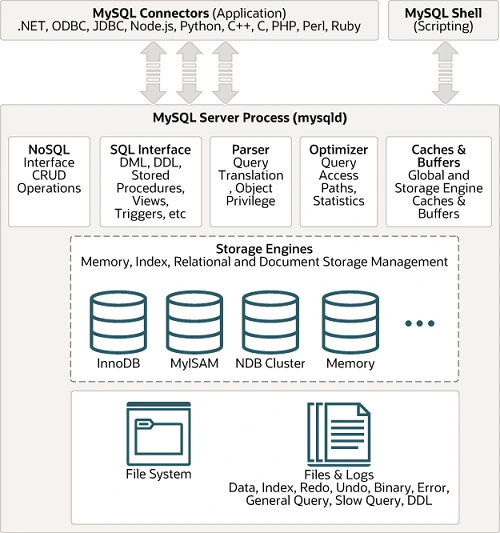

MySQL has established itself as one of the most widely used relational database management systems (RDBMS) in the world, powering millions of applications from small websites to enterprise-scale platforms. This comprehensive guide explains everything you need to know about MySQL, from fundamental concepts to advanced deployment strategies.

## Understanding MySQL: The Foundation of Modern Data Management

MySQL is an open-source relational database management system (RDBMS) that uses Structured Query Language (SQL) for accessing and managing data. Originally developed by MySQL AB in 1995 and now owned by Oracle Corporation, MySQL has become the backbone of countless web applications, powering some of the world's largest websites including Facebook, Twitter, YouTube, and Wikipedia.

At its core, MySQL provides a robust, scalable, and reliable platform for storing, organizing, and retrieving structured data. It follows the ACID (Atomicity, Consistency, Isolation, Durability) properties that ensure data integrity and reliability even in the face of system failures, power outages, or other unexpected events.

### Why MySQL Matters

In today's data-driven digital environment, organizations need to:

- Store and retrieve data efficiently and reliably
- Scale database operations to handle growing workloads
- Ensure data integrity and consistency across transactions
- Implement robust security measures for sensitive information
- Maintain high availability and disaster recovery capabilities

MySQL addresses these needs by providing a mature, feature-rich database platform that works seamlessly across different operating systems, programming languages, and deployment environments. Its combination of performance, reliability, and ease of use has made it the database of choice for developers and organizations worldwide.

For teams looking to focus on application development rather than database administration, [managed database solutions](/products/databases) offer MySQL hosting with automated maintenance, scaling, and monitoring capabilities.

## The Evolution of Database Management

To understand MySQL's significance, it's important to recognize the evolution of data storage solutions:

1. **Flat File Era**: Data stored in simple text files with limited querying capabilities
2. **Hierarchical and Network Databases**: Early structured databases with complex navigation requirements
3. **Relational Database Era**: Introduction of SQL and relational models for flexible data relationships
4. **Open Source Database Era**: MySQL emerged as a free, powerful alternative to expensive proprietary solutions
5. **Cloud and Distributed Era**: Modern MySQL deployments leverage cloud infrastructure and distributed architectures

MySQL built upon decades of database research and real-world experience to create a solution that balances performance, reliability, and accessibility, making enterprise-grade database capabilities available to organizations of all sizes.

## Core Design Principles

MySQL is built around fundamental design principles that guide its implementation and development:

1. **Reliability**: MySQL implements robust ACID compliance, transaction support, and data integrity mechanisms to ensure your data remains consistent and recoverable even in adverse conditions.

2. **Performance**: The database engine is optimized for speed with features like query optimization, indexing strategies, and caching mechanisms that deliver excellent performance across diverse workloads.

3. **Flexibility**: MySQL supports multiple storage engines, allowing users to choose the best approach for their specific use case, whether prioritizing speed, data integrity, or specialized functionality.

### The SQL Standard

One of MySQL's key strengths is its adherence to SQL standards while providing useful extensions and optimizations. This approach ensures:

- Portability across different database systems
- Familiar syntax for developers and database administrators
- Compatibility with a vast ecosystem of tools and frameworks
- Standardized query optimization and execution

## MySQL Architecture Explained

A MySQL deployment consists of several interconnected components working together to provide database services:

### MySQL Server Architecture

The MySQL server architecture is designed in layers, each handling specific aspects of database operations:

1. **Connection Layer**: Manages client connections, authentication, and security
2. **SQL Layer**: Parses SQL statements, optimizes queries, and manages caching
3. **Storage Engine Layer**: Handles data storage, retrieval, and transaction management
4. **File System Layer**: Manages physical data files, logs, and indexes

### Storage Engines

MySQL's pluggable storage engine architecture allows different engines to be used for different tables within the same database:

1. **InnoDB**: The default storage engine offering ACID compliance, foreign key support, and crash recovery
2. **MyISAM**: Fast storage engine optimized for read-heavy workloads
3. **Memory (HEAP)**: Stores data in RAM for extremely fast access
4. **Archive**: Compressed storage for archival data
5. **CSV**: Stores data in comma-separated values format
6. **Federated**: Accesses data from remote MySQL servers

### Query Processing

MySQL processes queries through several stages:

1. **Connection Handling**: Establishes and manages client connections
2. **Query Parsing**: Analyzes SQL syntax and creates parse trees
3. **Query Optimization**: Determines the most efficient execution plan
4. **Query Execution**: Executes the optimized plan and returns results
5. **Result Caching**: Stores frequently accessed results for improved performance



## Essential MySQL Components

### Databases and Tables

**Databases** in MySQL are containers that hold related tables, views, stored procedures, and other database objects.

**Tables** are the fundamental data storage structures organized in rows and columns, where each table represents an entity and columns define attributes.

Example table creation:

```sql
CREATE DATABASE ecommerce;
USE ecommerce;

CREATE TABLE customers (
    customer_id INT PRIMARY KEY AUTO_INCREMENT,
    first_name VARCHAR(50) NOT NULL,
    last_name VARCHAR(50) NOT NULL,
    email VARCHAR(100) UNIQUE NOT NULL,
    created_at TIMESTAMP DEFAULT CURRENT_TIMESTAMP
);
```

### Indexes and Keys

**Indexes** improve query performance by creating efficient access paths to data:

1. **Primary Key**: Unique identifier for each row
2. **Unique Index**: Ensures uniqueness across specified columns
3. **Composite Index**: Covers multiple columns for complex queries
4. **Full-Text Index**: Enables text search capabilities

**Foreign Keys** establish relationships between tables and enforce referential integrity.

### Views and Stored Procedures

**Views** provide virtual tables that simplify complex queries and enhance security by controlling data access.

**Stored Procedures** are pre-compiled SQL programs that encapsulate business logic and improve performance through reduced network traffic.

### Triggers and Events

**Triggers** automatically execute code in response to specific database events like INSERT, UPDATE, or DELETE operations.

**Events** are scheduled tasks that run at specified times or intervals, useful for maintenance operations and data processing.

### Users and Privileges

MySQL implements a comprehensive security model with:

- User accounts with authentication credentials
- Role-based access control
- Granular privileges at database, table, and column levels
- SSL/TLS encryption for secure connections

## The MySQL Data Model

MySQL uses a relational data model based on mathematical set theory and predicate logic:

### Data Types

1. **Numeric Types**: INT, BIGINT, DECIMAL, FLOAT, DOUBLE
2. **String Types**: VARCHAR, CHAR, TEXT, BLOB
3. **Date and Time Types**: DATE, TIME, DATETIME, TIMESTAMP
4. **JSON Type**: Native JSON data storage and manipulation
5. **Spatial Types**: GEOMETRY, POINT, LINESTRING, POLYGON

### Relationships

1. **One-to-One**: Each row in one table relates to exactly one row in another
2. **One-to-Many**: One row relates to multiple rows in another table
3. **Many-to-Many**: Multiple rows relate to multiple rows through junction tables

### Normalization

Database normalization reduces redundancy and improves data integrity:

1. **First Normal Form (1NF)**: Eliminate repeating groups
2. **Second Normal Form (2NF)**: Remove partial dependencies
3. **Third Normal Form (3NF)**: Eliminate transitive dependencies
4. **Boyce-Codd Normal Form (BCNF)**: Stricter version of 3NF

## MySQL Performance and Optimization

MySQL provides numerous mechanisms for optimizing performance:

### Query Optimization

1. **Query Cache**: Stores results of frequently executed queries
2. **Index Usage**: Proper index design for faster data access
3. **Query Execution Plans**: EXPLAIN statement for analyzing query performance
4. **Query Rewriting**: Optimizing SQL statements for better performance

### Configuration Tuning

Key configuration parameters for performance optimization:

1. **Buffer Pool Size**: Memory allocated for caching data and indexes
2. **Query Cache Settings**: Configuration for query result caching
3. **Connection Limits**: Managing concurrent connections
4. **Log File Settings**: Optimizing transaction log performance

Example configuration optimization:

```sql
-- Enable query cache
SET GLOBAL query_cache_type = ON;
SET GLOBAL query_cache_size = 268435456; -- 256MB

-- Optimize InnoDB settings
SET GLOBAL innodb_buffer_pool_size = 2147483648; -- 2GB
SET GLOBAL innodb_log_file_size = 536870912; -- 512MB
```

### Indexing Strategies

1. **Single Column Indexes**: For simple equality and range queries
2. **Composite Indexes**: For queries involving multiple columns
3. **Covering Indexes**: Include all columns needed by a query
4. **Partial Indexes**: Index only a portion of large text columns

## MySQL Networking and Connectivity

MySQL supports various connection methods and protocols:

1. **TCP/IP Connections**: Standard network connections over TCP/IP
2. **Unix Socket Connections**: Local connections on Unix-like systems
3. **Named Pipe Connections**: Local connections on Windows systems
4. **SSL/TLS Encryption**: Secure connections with certificate-based authentication

### Connection Management

MySQL manages connections through:

1. **Connection Pooling**: Reusing database connections for efficiency
2. **Connection Limits**: Controlling concurrent connection usage
3. **Connection Timeout**: Automatically closing idle connections
4. **Authentication Methods**: Various authentication plugins and methods

### Replication and Clustering

MySQL supports several replication and clustering technologies:

```sql
-- Master-slave replication setup
CHANGE MASTER TO
    MASTER_HOST='master.example.com',
    MASTER_USER='replication_user',
    MASTER_PASSWORD='secure_password',
    MASTER_LOG_FILE='mysql-bin.000001',
    MASTER_LOG_POS=154;

START SLAVE;
```

## Data Storage in MySQL

MySQL provides flexible storage options to meet diverse requirements:

### Storage Engines

Different storage engines offer varying capabilities:

1. **InnoDB Features**: ACID compliance, foreign keys, crash recovery, row-level locking
2. **MyISAM Features**: Fast SELECT operations, table-level locking, compact storage
3. **Memory Features**: RAM-based storage for temporary data
4. **Archive Features**: Compressed storage for historical data

### Partitioning

MySQL supports table partitioning for managing large datasets:

1. **Range Partitioning**: Partition based on column value ranges
2. **List Partitioning**: Partition based on discrete column values
3. **Hash Partitioning**: Distribute data using hash functions
4. **Key Partitioning**: Partition using MySQL's internal hash function

Example partitioning:

```sql
CREATE TABLE sales (
    sale_id INT PRIMARY KEY,
    sale_date DATE,
    amount DECIMAL(10,2)
)
PARTITION BY RANGE (YEAR(sale_date)) (
    PARTITION p2023 VALUES LESS THAN (2024),
    PARTITION p2024 VALUES LESS THAN (2025),
    PARTITION p2025 VALUES LESS THAN (2026)
);
```

### Backup and Recovery

MySQL offers multiple backup and recovery strategies:

1. **Logical Backups**: Using mysqldump for portable SQL dumps
2. **Physical Backups**: Copying data files directly
3. **Point-in-Time Recovery**: Using binary logs for precise recovery
4. **Incremental Backups**: Backing up only changed data

## Deploy MySQL on Sealos: Managed Database Excellence

Sealos transforms MySQL deployment from a complex infrastructure challenge into a simple, one-click operation. By leveraging the cloud-native platform of Sealos, organizations can deploy production-ready MySQL instances that benefit from enterprise-grade management features without the operational overhead.

### Benefits of Managed MySQL on Sealos

**Automated Scaling**: Sealos automatically adjusts your MySQL resources based on actual usage patterns. During peak traffic periods, CPU and memory allocation scales up seamlessly, while scaling down during quiet periods to optimize costs. This dynamic scaling ensures consistent performance without manual intervention or over-provisioning.

**High Availability and Redundancy**: Sealos implements multi-zone deployment strategies for MySQL instances, ensuring your database remains available even during infrastructure failures. Automatic failover mechanisms detect issues within seconds and redirect traffic to healthy replicas, maintaining service continuity with minimal downtime.

**Automated Backup Management**: The platform handles backup scheduling, retention policies, and disaster recovery automatically. Point-in-time recovery capabilities allow you to restore your database to any specific moment, while incremental backups minimize storage costs and recovery time objectives.

**Simplified Deployment Process**: Deploy MySQL on Sealos in minutes rather than hours or days required for traditional infrastructure setup. The platform handles security hardening, network configuration, SSL certificate management, and performance optimization automatically.

For organizations seeking MySQL's reliability with cloud-native convenience, Sealos provides the perfect balance of power and simplicity, allowing teams to focus on application development rather than database administration.

## Security Best Practices

Securing MySQL requires a comprehensive approach:

### Authentication and Authorization

1. **Strong Password Policies**: Enforce complex passwords and regular changes
2. **Principle of Least Privilege**: Grant only necessary permissions
3. **Account Management**: Regular review and cleanup of user accounts
4. **SSL/TLS Encryption**: Encrypt connections between clients and servers

### Database Security

1. **SQL Injection Prevention**: Use prepared statements and input validation
2. **Data Encryption**: Encrypt sensitive data at rest and in transit
3. **Audit Logging**: Track database access and modifications
4. **Network Security**: Firewall rules and network segmentation

Example security configuration:

```sql
-- Create user with limited privileges
CREATE USER 'app_user'@'192.168.1.%' IDENTIFIED BY 'strong_password';
GRANT SELECT, INSERT, UPDATE ON ecommerce.* TO 'app_user'@'192.168.1.%';

-- Enable SSL
REQUIRE SSL;

-- Set up audit logging
INSTALL PLUGIN audit_log SONAME 'audit_log.so';
SET GLOBAL audit_log_policy = ALL;
```

### Compliance and Governance

1. **Data Privacy Regulations**: GDPR, CCPA compliance measures
2. **Industry Standards**: SOC 2, ISO 27001 compliance
3. **Data Retention Policies**: Automated data lifecycle management
4. **Access Auditing**: Comprehensive logging and monitoring

## Deployment Strategies

MySQL supports various deployment patterns to meet different requirements:

### Single Instance Deployment

Traditional single-server deployment suitable for:

- Development and testing environments
- Small applications with limited scale requirements
- Scenarios where simplicity is prioritized

### Master-Slave Replication

Asynchronous replication where one master handles writes and multiple slaves handle reads:

- Improved read performance through load distribution
- Basic high availability through failover capabilities
- Geographic data distribution for reduced latency

### Master-Master Replication

Bi-directional replication allowing writes on multiple servers:

- Active-active configuration for higher write capacity
- Automatic conflict resolution mechanisms
- Enhanced availability during maintenance windows

### MySQL Cluster (NDB)

Distributed computing solution providing:

- Shared-nothing cluster architecture
- Automatic sharding and load balancing
- 99.999% availability with no single point of failure

Example cluster configuration:

```sql
-- Create NDB Cluster table
CREATE TABLE cluster_data (
    id INT PRIMARY KEY,
    data VARCHAR(255)
) ENGINE=NDB;
```

## Monitoring and Performance Tuning

Comprehensive monitoring is essential for maintaining optimal MySQL performance:

### Performance Metrics

1. **Query Performance**: Execution time, rows examined, index usage
2. **Server Metrics**: CPU usage, memory consumption, disk I/O
3. **Connection Metrics**: Active connections, connection errors, authentication failures
4. **Replication Metrics**: Lag time, error rates, data consistency

Tools: MySQL Performance Schema, sys schema, MySQL Enterprise Monitor

### Query Analysis

1. **EXPLAIN Statement**: Analyze query execution plans
2. **Performance Schema**: Built-in monitoring and diagnostics
3. **Slow Query Log**: Identify problematic queries
4. **Query Profiling**: Detailed timing information

Tools: MySQLTuner, pt-query-digest, MySQL Workbench

### Capacity Planning

1. **Growth Projections**: Predict storage and performance requirements
2. **Resource Allocation**: Optimize CPU, memory, and storage allocation
3. **Scaling Strategies**: Plan for horizontal and vertical scaling
4. **Performance Baselines**: Establish normal operating parameters

## MySQL in Production

Running MySQL in production environments requires attention to several critical areas:

### High Availability

1. **Replication Strategies**: Master-slave, master-master, group replication
2. **Failover Mechanisms**: Automatic and manual failover procedures
3. **Load Balancing**: Distribute connections across multiple servers
4. **Disaster Recovery**: Geographic redundancy and backup strategies

### Scalability Solutions

1. **Read Replicas**: Scale read operations across multiple servers
2. **Sharding**: Horizontal partitioning across multiple databases
3. **Connection Pooling**: Efficiently manage database connections
4. **Caching Layers**: Implement Redis or Memcached for performance

### Maintenance Procedures

1. **Regular Backups**: Automated backup schedules with testing
2. **Software Updates**: Security patches and version upgrades
3. **Index Maintenance**: Regular analysis and optimization
4. **Statistics Updates**: Keep query optimizer statistics current

## Popular MySQL Distributions and Services

Several MySQL distributions and cloud services offer enhanced features and management:

### Cloud Database Services

1. **Amazon RDS for MySQL**: Managed MySQL service on AWS
2. **Google Cloud SQL**: Google's managed MySQL offering
3. **Azure Database for MySQL**: Microsoft's managed MySQL service
4. **DigitalOcean Managed Databases**: Simple managed MySQL for smaller teams

### Enhanced Distributions

1. **Percona Server**: High-performance MySQL distribution with additional features
2. **MariaDB**: Community-developed fork with enhanced functionality
3. **MySQL Enterprise**: Oracle's commercial MySQL offering with advanced tools
4. **TiDB**: Distributed SQL database compatible with MySQL protocol

## Advanced MySQL Features

### JSON Support

MySQL 5.7+ provides native JSON data type and functions:

```sql
-- Create table with JSON column
CREATE TABLE products (
    id INT PRIMARY KEY,
    attributes JSON
);

-- Insert JSON data
INSERT INTO products VALUES (
    1,
    '{"color": "red", "size": "large", "tags": ["clothing", "shirt"]}'
);

-- Query JSON data
SELECT * FROM products
WHERE JSON_EXTRACT(attributes, '$.color') = 'red';
```

### Geographic Information Systems (GIS)

MySQL supports spatial data types and functions:

```sql
-- Create table with spatial data
CREATE TABLE locations (
    id INT PRIMARY KEY,
    name VARCHAR(100),
    coordinates POINT NOT NULL,
    SPATIAL INDEX(coordinates)
);

-- Insert spatial data
INSERT INTO locations VALUES (
    1,
    'New York Office',
    ST_GeomFromText('POINT(-74.006 40.7128)')
);

-- Find nearby locations
SELECT name, ST_Distance(coordinates, ST_GeomFromText('POINT(-74.006 40.7128)')) as distance
FROM locations
ORDER BY distance;
```

### Common Table Expressions (CTEs)

Recursive and non-recursive CTEs for complex queries:

```sql
-- Recursive CTE for hierarchical data
WITH RECURSIVE employee_hierarchy AS (
    SELECT employee_id, name, manager_id, 1 as level
    FROM employees
    WHERE manager_id IS NULL

    UNION ALL

    SELECT e.employee_id, e.name, e.manager_id, eh.level + 1
    FROM employees e
    JOIN employee_hierarchy eh ON e.manager_id = eh.employee_id
)
SELECT * FROM employee_hierarchy ORDER BY level, name;
```

### Window Functions

Advanced analytical functions for complex calculations:

```sql
-- Calculate running totals and rankings
SELECT
    order_date,
    amount,
    SUM(amount) OVER (ORDER BY order_date) as running_total,
    ROW_NUMBER() OVER (ORDER BY amount DESC) as rank_by_amount
FROM orders;
```

## Common Challenges and Solutions

### Performance Issues

1. **Slow Queries**: Optimize using indexes, query rewriting, and caching
2. **Lock Contention**: Use appropriate isolation levels and query patterns
3. **Memory Usage**: Tune buffer pools and connection limits
4. **Disk I/O**: Optimize storage configuration and query patterns

### Scaling Challenges

1. **Connection Limits**: Implement connection pooling and load balancing
2. **Storage Growth**: Plan for data archiving and partitioning strategies
3. **Replication Lag**: Optimize network configuration and hardware resources
4. **Geographic Distribution**: Implement regional replicas and CDN strategies

### Data Integrity Issues

1. **Backup Verification**: Regularly test backup and recovery procedures
2. **Replication Consistency**: Monitor and resolve replication conflicts
3. **Data Corruption**: Implement checksums and regular integrity checks
4. **Schema Changes**: Use proper migration procedures and testing

## The Future of MySQL

MySQL continues to evolve with several emerging trends and improvements:

1. **Cloud-Native Features**: Enhanced integration with cloud platforms and containerization
2. **Machine Learning Integration**: Built-in ML capabilities for predictive analytics
3. **Enhanced JSON Support**: Improved performance and functionality for document storage
4. **Distributed Architectures**: Better support for microservices and distributed systems
5. **Security Enhancements**: Advanced encryption and authentication mechanisms

## Getting Started with MySQL

### Installation Options

1. **MySQL Community Server**: Free, open-source version
2. **MySQL Installer**: Windows-based installation package
3. **Docker Containers**: Containerized MySQL for development and testing
4. **Cloud Instances**: Managed MySQL services for production use

### Learning Path

1. **SQL Fundamentals**: Master basic SQL commands and concepts
2. **Database Design**: Learn normalization and relationship modeling
3. **Performance Optimization**: Understand indexing and query tuning
4. **Administration**: Study backup, security, and maintenance procedures

### First Database Steps

1. **Install MySQL Server**: Choose appropriate installation method
2. **Design Your Schema**: Plan tables, relationships, and constraints
3. **Implement Security**: Set up users, roles, and access controls
4. **Set Up Monitoring**: Deploy performance monitoring tools
5. **Plan Backup Strategy**: Implement automated backup procedures

### Development Best Practices

```sql
-- Use transactions for data consistency
START TRANSACTION;
INSERT INTO orders (customer_id, total) VALUES (123, 99.99);
INSERT INTO order_items (order_id, product_id, quantity) VALUES (LAST_INSERT_ID(), 456, 2);
COMMIT;

-- Use prepared statements for security
PREPARE stmt FROM 'SELECT * FROM customers WHERE email = ?';
SET @email = 'user@example.com';
EXECUTE stmt USING @email;
```

## Conclusion

MySQL has proven itself as a robust, scalable, and reliable database management system that continues to power applications across industries and scales. Its combination of performance, flexibility, and comprehensive features makes it an excellent choice for organizations seeking a dependable foundation for their data management needs.

Whether you're building a simple web application, managing enterprise data warehouses, or developing cloud-native microservices, MySQL provides the tools and capabilities needed to store, process, and analyze data effectively. Its active development community, extensive documentation, and broad ecosystem support ensure that MySQL remains a forward-looking choice for modern applications.

By understanding MySQL's architecture, capabilities, and best practices, developers and database administrators can leverage its full potential to build applications that are not only functional but also performant, secure, and maintainable. The combination of MySQL's proven reliability with modern deployment platforms creates opportunities for organizations to innovate while maintaining the data integrity and performance their users expect.

For organizations looking to deploy MySQL with simplified management and enterprise-grade infrastructure, [Sealos](https://sealos.io) offers streamlined database hosting solutions that combine MySQL's power with cloud-native convenience and scalability.

**References and Resources:**

- [MySQL Official Documentation](https://dev.mysql.com/doc/)
- [MySQL Performance Blog](https://www.percona.com/blog/)
- [High Performance MySQL](https://www.oreilly.com/library/view/high-performance-mysql/9781449332471/)
- [Sealos Database Solutions](https://sealos.io)
