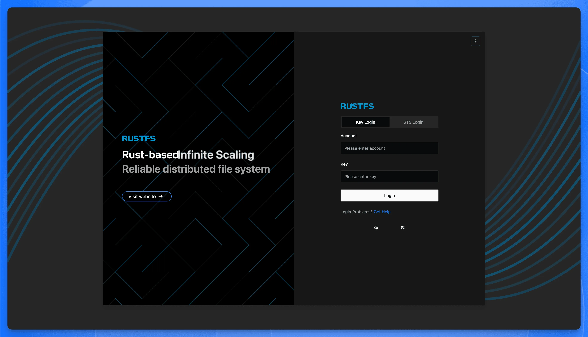
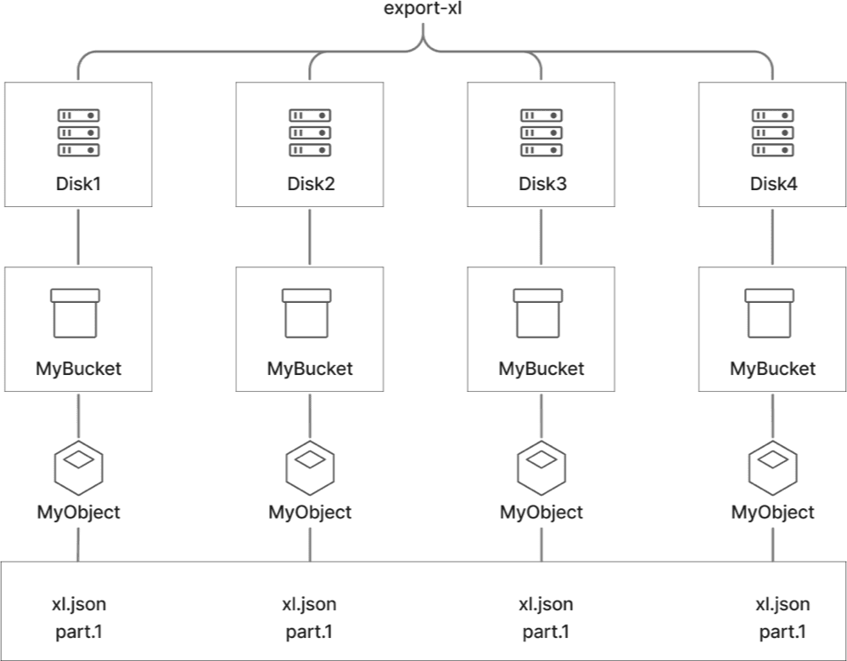

import { DeployButton } from '@/components/ui/button'

> **TL;DR:** RustFS is an open-source, S3-compatible distributed object storage system built in Rust. It delivers 2.3x better performance than MinIO for small objects, ships under Apache 2.0 licensing (vs MinIO's AGPLv3), and includes enterprise features like WORM compliance, encryption, and multi-site replication. Currently in beta, it's ideal for teams seeking a permissively-licensed MinIO alternative.
---

## What is RustFS?



**RustFS is a distributed object storage system written entirely in Rust, designed for full compatibility with the [Amazon S3 API](https://docs.aws.amazon.com/AmazonS3/latest/API/Welcome.html).** If you've used AWS S3 or [MinIO](https://min.io/), you already know how to use it—same SDKs, same CLI tools, same integration patterns.

The idea was simple: take MinIO's architecture and rebuild it in Rust. No metadata coordinator to fail. No garbage collector to stall under load. The result is a system that shares MinIO's deployment simplicity but sidesteps Go's runtime overhead—no GC pauses, no surprise latency spikes when traffic surges.

The benchmark that gets cited most: **2.3× the throughput of MinIO for 4KB objects.** Small-file, high-IOPS workloads—IoT telemetry, thumbnail storage, log ingestion—are where per-request overhead dominates, and where RustFS pulls ahead.

It's not a stripped-down proof-of-concept. Object versioning, WORM compliance, server-side encryption, multi-site replication—the enterprise checklist is there.

Then there's licensing. RustFS ships under **[Apache 2.0](https://www.apache.org/licenses/LICENSE-2.0)**. No copyleft. No source disclosure. For teams that walked away from MinIO after its 2021 switch to [AGPLv3](https://www.gnu.org/licenses/agpl-3.0.en.html), this alone can end the conversation.

Data lakes, local dev endpoints, escaping cloud egress fees—RustFS fits all of these. And because it's Apache-licensed and self-hosted, you're not locked into anyone. Including RustFS itself.

## Why Was RustFS Created? Origins and Motivation

In 2021, [MinIO changed its license](https://blog.min.io/from-open-source-to-free-and-open-source-minio-stands-with-the-oss-community/). What had been Apache 2.0—a permissive license that let companies embed, modify, and sell MinIO without legal friction—became AGPLv3.

AGPLv3 is a copyleft license with teeth. If you modify the software and offer it as a network service, you must release your source code under the same license. For startups building proprietary storage products, for cloud providers offering managed object storage, for any company with custom integrations they'd rather keep private—this was a problem. Legal teams flagged it. Some organizations purchased commercial licenses from MinIO, Inc. Others started looking for alternatives.

RustFS exists because those alternatives didn't.

### Why Choose Rust for Object Storage?

A parallel movement had been building in infrastructure: developers rewriting core systems—databases, networking stacks, OS components—in Rust instead of C, C++, or Go.

Rust manages memory through compile-time ownership rules, not a garbage collector. No "stop-the-world" pauses when the GC decides to run—a real issue for Go systems under heavy load, where latency can spike without warning. Buffer overflows, use-after-free bugs, null pointer dereferences: the compiler catches these before the code ships. You get the safety of managed languages with the performance of C. And when a storage node is handling thousands of concurrent connections, that predictability matters as much as raw speed.

For object storage—where reliability is non-negotiable and latency spikes cascade into application failures—these properties translate directly into systems that crash less, leak less, and behave predictably at 3 AM when traffic spikes.

### RustFS vs MinIO: The Licensing Difference

| | Apache 2.0 (RustFS) | AGPLv3 (MinIO) |
|---|---|---|
| **Embed in proprietary products** | Yes | Requires source disclosure |
| **Offer as a hosted service** | No special obligations | Must offer source to users |
| **Keep modifications private** | Yes | No—modifications inherit the license |
| **Enterprise legal review** | Typically straightforward | Often requires commercial license |

For many organizations, AGPLv3 isn't inconvenient—it's a non-starter. Apache 2.0 removes the friction: no copyleft obligations, no IP entanglement, no forced choice between open-sourcing your customizations or buying a commercial license.

### RustFS Growth: From Launch to 11,000 GitHub Stars

RustFS appeared around 2023. By late 2025, it had crossed 11,000 GitHub stars. The licensing story resonated. The 2.3× performance claim for small objects caught attention on Hacker News and Reddit. The maintainers built a reputation for fast response times—averaging roughly a day to resolve issues.

The project remains upfront about where it stands. As of late 2025, RustFS is still in beta, progressing through alpha releases toward a stable 1.0. The documentation states it plainly:

> *"RustFS is under rapid development. Do NOT use in production environments!"*

This isn't false modesty. The architecture is sound, the feature set is rich—but the battle-hardening that comes from years of diverse production deployments is still ahead.

One more thing: RustFS includes no telemetry. No "phone home" features that might complicate GDPR compliance or raise data sovereignty concerns. Your data stays where you put it.

## RustFS Architecture Explained


RustFS runs on a **distributed, metadata-free model**. There's no central database tracking where every object lives. The system spreads both data and the intelligence to locate it across all nodes equally. Combined with Rust's memory-safe concurrency primitives, this design is what makes the performance claims credible.

### How Does RustFS Handle Data Without a Metadata Server?

Most distributed storage systems rely on a dedicated metadata server—a central index that knows where every object is stored. This creates obvious problems. The metadata server becomes a single point of failure: if it dies, the entire cluster goes dark. It becomes a scalability ceiling: every read and write must query this layer first, and under heavy load, it chokes. It becomes an operational burden: now you need to back up, replicate, and babysit an entirely separate tier of infrastructure.

RustFS eliminates this layer. Every node is a peer. Each server stores both object data and the metadata needed to locate and serve requests. There is no "master" to elect, no quorum to maintain for metadata consensus.

The practical result: the cluster keeps running even when multiple nodes go offline (within your erasure coding limits). Adding nodes increases both capacity and throughput without introducing a new bottleneck. Deployment gets simpler—you don't provision separate metadata infrastructure.

When a client sends a request to any RustFS node, that node can serve it directly if it holds the relevant data shards, or coordinate with peers to fulfill it. Clients can connect to any node—or load-balance across all of them—without worrying about data locality.

### Understanding Nodes, Drives, and Sets

RustFS organizes storage into a hierarchy designed for efficient distribution and fault tolerance:

```
Cluster
  └── Server Pool (group of nodes)
        └── Node (individual server)
              └── Drive (storage volume/disk)
                    └── Set (stripe of drives across nodes)
```

**Nodes** are individual servers running the RustFS process. Each node can have one or more **Drives**—local storage volumes (typically XFS or ext4) where object data physically lives.

The critical unit is the **Set**, sometimes called a stripe. A Set is a group of drives distributed across multiple nodes. One object is stored on one Set. One cluster is divided into multiple Sets. Drives in one Set are distributed across different nodes as much as possible.

Consider a 4-node cluster where each node has 2 drives—8 drives total. RustFS might organize these into Sets of 4 drives each, with each Set spanning all 4 nodes. When an object is written, it gets assigned to a specific Set, and its data is distributed across that Set's drives.

This distribution ensures isolated failures (losing one node only affects a portion of the shards in each Set), parallel I/O (data can be read from or written to multiple nodes simultaneously), and straightforward expansion (new nodes join as new storage pools, and RustFS creates additional Sets to use them).

The recommended configuration: 4–8 nodes per storage pool, with Set sizes matching your desired erasure coding ratio.

### How Erasure Coding Protects Your Data

RustFS protects data using **erasure coding**, not simple replication. The difference matters for both durability and cost.

Erasure coding splits data into fragments—some holding original data (**data shards**), others holding mathematically computed recovery information (**parity shards**). The system can reconstruct the original as long as enough shards survive.

Configuration is expressed as **RS(k, m)**, where k equals the number of data shards and m equals the number of parity shards. The total shards (k + m) typically matches the number of drives in a Set.

With RS(4, 2), each object becomes 4 data shards plus 2 parity shards—6 total. The system tolerates the loss of any 2 shards and still recovers fully. Storage overhead: 50%. Compare that to triple replication, which costs 200% overhead for similar fault tolerance.

| Protection Scheme | Storage Overhead | Fault Tolerance |
|-------------------|------------------|-----------------|
| Triple Replication | 200% | Lose up to 2 copies |
| RS(4, 2) | 50% | Lose up to 2 shards |
| RS(10, 4) | 40% | Lose up to 4 shards |



RustFS auto-selects an appropriate configuration based on cluster size. A typical 4-node deployment uses 2+2 (2 data + 2 parity), surviving the loss of up to 2 drives or nodes.

#### Self-Healing: Automatic Data Recovery

Erasure coding does more than survive failures—it enables automatic recovery.

A background process continuously verifies stored objects. Each shard carries a SHA-256 checksum. During reads or periodic scans, RustFS verifies these checksums to catch silent corruption—bits flipping on disk without the filesystem noticing. If corruption or a missing shard is detected, RustFS reconstructs it from surviving shards and writes the repaired data to available drives.

Transient failures and silent corruption get corrected without anyone paging an admin at 3 AM.

### Why Rust Matters for Storage Performance

RustFS is written entirely in Rust. This choice shapes everything about how the system behaves.

Rust enforces compile-time guarantees against bugs that have plagued storage systems for decades. Buffer overflows, use-after-free, data races—the compiler catches them before the code ever runs. For storage, this translates to fewer crashes from memory corruption, a smaller attack surface (no buffer overflow exploits), and predictable performance (no garbage collector means no surprise pause times under load).

That last point deserves emphasis. MinIO, written in Go, occasionally sees latency spikes when the Go garbage collector kicks in. RustFS, with no GC, delivers consistent latency even under heavy concurrency. One user put it simply:

> "If your hardware is on the weaker side, RustFS is clearly the winner. That's gotta be the Rust magic."

#### Tokio Async Runtime

Under the hood, RustFS uses **[Tokio](https://tokio.rs/)**, Rust's leading async runtime. Network connections and disk operations multiplex efficiently across a small thread pool. Thousands of concurrent requests run as lightweight "tasks" without the overhead of spawning OS threads for each. The system accepts new connections and processes requests even while waiting for slow I/O to complete.

This architecture lets RustFS handle massive concurrency with modest resource consumption. It runs well on high-end servers and resource-constrained edge devices alike.

#### Internal Architecture Layers

Based on architectural docs and profiling, RustFS's internals include:

**API Layer (S3 Frontend)** — Handles incoming HTTP requests, implements AWS Signature v2/v4 auth, translates S3 operations into internal commands. Built on Hyper or a similar Rust HTTP stack.

**Distributed Object Logic** — Determines which Set an object belongs to via deterministic hashing, coordinates erasure coding, manages inter-node communication for distributed reads and writes.

**Object Layer** — Contains modules for caching (in-memory cache for hot objects or metadata), compression, encryption (integration with RustyVault), erasure coding ([Reed-Solomon](https://en.wikipedia.org/wiki/Reed%E2%80%93Solomon_error_correction) encoding/decoding), and bitrot protection (checksum verification and healing logic).

**Storage Layer** — Interfaces with the local filesystem on each drive. RustFS stores object shards as files on standard filesystems like XFS or ext4, prioritizing compatibility and debuggability over raw block device access.

### Read-After-Write Consistency in RustFS

RustFS implements **strict read-after-write consistency**. This is stronger than the eventual consistency that classic AWS S3 offered for certain operations.

When a PUT returns success, the object is immediately visible to any subsequent GET—even if that request hits a different node. No propagation delay where a newly written object might not be found. Overwrites and deletes are also strongly consistent.

Achieving this in a distributed system without a central coordinator requires careful synchronization. While RustFS hasn't published the exact algorithm, it likely uses distributed locking (a lock per object key ensures concurrent writes serialize), synchronous replication (PUT only returns success after all erasure-coded shards are durably written), and version-aware reads (reads verify they're not serving stale data by checking version information).

For application developers, strong consistency simplifies logic considerably. No retry loops. No "object not found" errors for data you just wrote.

### Deployment Environments: Where Can RustFS Run?

RustFS's architecture supports deployment across a wide range of environments:

| Environment | RustFS Fit |
|-------------|------------|
| **Bare metal** | Excellent—single binary, maximum performance |
| **Virtual machines** | Excellent—lightweight footprint |
| **Kubernetes** | Native support via RustFS Operator |
| **Edge devices** | Strong—sub-100 MB binary, low overhead |
| **Multi-cloud** | Supported—cross-region replication works across providers |

The **RustFS Operator** for Kubernetes automates cluster deployment, scaling, and upgrades. It manages StatefulSets, persistent volumes, and service endpoints.

For edge deployments, the small binary and efficient resource usage make RustFS viable on hardware ranging from Raspberry Pi clusters to 5G edge nodes—environments where heavier systems like Ceph would be impractical.

### Architecture Trade-offs to Consider

Every design choice has costs.

| Decision | Benefit | Trade-off |
|----------|---------|-----------|
| No metadata server | Simplicity, no SPOF, linear scaling | Metadata-heavy ops (huge bucket listings) may be slower |
| Erasure coding | Storage efficiency, self-healing | CPU overhead for encoding/decoding |
| Rust + Tokio | Memory safety, predictable latency | Smaller talent pool than Go or Java |
| Filesystem-based storage | Compatibility, easy debugging | Not as optimized as raw block access |
| Strong consistency | Simpler application logic | Slightly higher write latency than eventual consistency |

These choices reflect a philosophy of pragmatic simplicity: use proven techniques (erasure coding, distributed hashing), implement them in a modern, safe language, and avoid unnecessary complexity (no external dependencies, no separate metadata tier).

The result is an architecture that scales from a single-node dev setup to a multi-petabyte, multi-region cluster—while remaining operationally straightforward.

## RustFS Features: Enterprise Capabilities

A storage system lives or dies by what it can actually do. RustFS ships with a feature set dense enough to handle enterprise demands—without the bloat that makes some alternatives feel like they need a dedicated team just to operate.

### S3 API Compatibility

This is table stakes, but RustFS doesn't cut corners. The implementation covers the complete S3 API surface: bucket operations, multi-part uploads, presigned URLs, byte-range GETs, and both AWS Signature v2 and v4 authentication.

The practical test? Any application, SDK, or CLI tool built for AWS S3 works with RustFS by changing one line: the endpoint URL. The AWS CLI, boto3, the Java SDK—all of them. No code changes, no compatibility shims.

One user migrating from another S3-compatible system discovered this the hard way. Their Mattermost deployment had been failing against their previous storage backend due to incomplete API coverage. When they pointed it at RustFS, everything worked. Out of the box.

### Object Versioning

Enable versioning on a bucket, and every modification creates a new version instead of overwriting. Delete something by accident? The previous version is still there. Need to see what a configuration file looked like last Tuesday? Pull that specific version.

Each version gets a unique identifier. Recovery becomes trivial. Audit trails become automatic.

### WORM Compliance and Object Locking

For regulated industries, this is the feature that makes RustFS viable.

WORM—Write Once Read Many—locks data against modification or deletion. RustFS implements three distinct modes:

**Governance Mode** locks objects for a retention period, but administrators with elevated permissions can override if necessary. Use this for internal compliance where legitimate exceptions exist.

**Compliance Mode** is absolute. Once set, *nobody* can delete the object until the retention period expires. Not administrators. Not root. This satisfies SEC 17a-4](https://www.sec.gov/rules/final/34-38245.txt), [FINRA Rule 4511](https://www.finra.org/rules-guidance/rulebooks/finra-rules/4511), and similar regulations that demand tamper-proof storage.

**Legal Hold** applies an indefinite lock, independent of retention periods. When litigation looms, slap a hold on relevant data. It stays frozen until explicitly released.

The implementation targets [Cohasset Certification](https://www.cohasset.com/) standards—the benchmark financial auditors actually use. If your compliance officer asks whether the storage meets regulatory requirements, you have a concrete answer.

### Server-Side Encryption

Data at rest gets encrypted transparently through RustyVault integration. Objects are encrypted on write, decrypted on read. Applications don't need to change anything.

The system supports multiple encryption algorithms and key rotation strategies. Encryption throughput benefits from Rust's ability to tap hardware acceleration (AES-NI instructions) directly, without garbage collection overhead eating into performance.

### Access Control and IAM

RustFS includes a built-in identity management system. Create users, generate access key pairs, define policies that specify exactly who can do what to which resources.

The policies are granular. "This service account can read from the logs bucket but nothing else." "This admin can manage users but can't delete production data." Standard S3 policy syntax, so existing policy documents often work directly.

A notable difference from some alternatives: RustFS keeps user management in the web console. Other systems have progressively hidden administrative functions behind CLI-only interfaces. If clicking beats typing `mc admin user add` for your workflow, RustFS accommodates that.

Planned additions include OpenID Connect and LDAP integration for connecting to corporate identity providers.

### Multi-Site Replication

RustFS supports active-active bucket replication across sites:

**Synchronous replication** waits for data to reach all sites before confirming the write. Strong consistency, higher latency.

**Asynchronous replication** confirms locally first, then propagates in the background. Lower latency, eventual consistency across sites.

**Cross-cloud replication** means what it says. Run nodes on AWS, Azure, GCP, and your own hardware. Replicate between them.

A practical configuration: primary cluster on-premises, secondary cluster in a public cloud. Normal operations stay local. If the data center catches fire, the cloud replica is already current. Disaster recovery without the disaster.

### Lifecycle Management

Buckets accumulate cruft. Old versions pile up. Temporary files linger.

Lifecycle rules automate the cleanup. Configure a rule: delete objects in the `temp/` prefix after 7 days. Another rule: expire non-current versions after 90 days. The system handles execution. No cron jobs, no manual purges, no storage costs spiraling because someone forgot to clean up.

### Monitoring and Observability

Monitoring isn't an afterthought bolted on later. RustFS exposes a Prometheus metrics endpoint out of the box. Throughput, latency distributions, error rates, storage utilization—all available for scraping.

Grafana dashboards come pre-configured in some deployment options. One user switching from a competitor put it directly: *"RustFS brought back all the options that had become harder to find... monitoring and observability are first-class."*

### Event Notifications

When objects are created or deleted, RustFS can fire webhooks to external systems. New file uploaded? Trigger a processing pipeline. Object deleted? Update an external index.

Current support focuses on webhooks. The roadmap includes S3 Lambda-style triggers for more sophisticated event-driven workflows.

### Management Interfaces

**The web console** provides a modern GUI for bucket management, user administration, and system monitoring. Built with Vue.js 3, it's responsive enough to use from a phone if you're debugging at 2 AM and your laptop isn't handy.


**CLI compatibility** means existing scripts work. The MinIO Client (`mc`) targets RustFS by updating an alias. The AWS CLI works with the `--endpoint-url` flag. Automation doesn't require rewriting.

## RustFS vs MinIO: Complete Comparison

RustFS exists because of MinIO—and because of what MinIO became. Any serious evaluation starts there.

Both target the same goal: S3-compatible object storage that scales from a Raspberry Pi to a petabyte cluster. But they diverge in ways that matter beyond benchmarks.

### License Comparison: Apache 2.0 vs AGPLv3

MinIO uses AGPLv3. If you modify it and offer the result as a network service—say, a managed storage platform—you must release your source code under the same license. For startups building proprietary products, or cloud providers offering storage-as-a-service, this creates real legal exposure. Many companies won't touch AGPL-licensed code without a commercial agreement.

RustFS uses Apache 2.0. Modify it, embed it, sell it—no copyleft obligations, no requirement to disclose your changes. For organizations where legal reviewed MinIO and said "not without a commercial license," RustFS removes that obstacle.

The practical differences:

| | Apache 2.0 (RustFS) | AGPLv3 (MinIO) |
|---|---|---|
| **Embed in proprietary products** | Yes | Requires source disclosure |
| **Offer as a hosted service** | No special obligations | Must offer source to users |
| **Keep modifications private** | Yes | No—modifications inherit the license |

For many teams, this single difference ends the evaluation before any code is written.

### Performance: Rust vs Go

MinIO is Go. RustFS is Rust. Both are modern, memory-safe—but they achieve safety differently, and that shows up under load.

Go relies on garbage collection. The runtime periodically pauses execution to reclaim memory. Under normal load, these pauses are negligible. Under heavy concurrency—thousands of simultaneous connections, sustained throughput—they can spike latency. Most applications never notice. Latency-sensitive ones do.

Rust has no garbage collector. Memory management happens at compile time through ownership rules. When an object is no longer needed, it's freed immediately. No pause, no jitter.

There's a second benefit: Rust prevents entire categories of bugs before the code runs. Buffer overflows, use-after-free, data races—the compiler catches them. For a storage system handling critical data, fewer failure modes matter.

A user on Reddit captured the difference after testing both:

> "If you've got a beast of a CPU, RustFS and MinIO are basically neck-and-neck. But if your hardware is on the weaker side, RustFS is clearly the winner. That's gotta be the Rust magic."

The "magic" is the absence of GC overhead. On constrained hardware—edge devices, older servers, budget cloud instances—RustFS extracts more from the same resources.

### Benchmark Results: Where Each Wins

The headline: **RustFS is 2.3× faster than MinIO for 4KB objects.**

This matters for workloads involving many small files—IoT telemetry, log storage, thumbnail libraries. Per-operation overhead dominates for small objects, and Rust's efficiency compounds.

But the picture isn't one-sided.

A mid-2025 community benchmark ([GitHub Issue #73](https://github.com/rustfs/rustfs/issues/73)) tested both on a 4-node cluster with 20 MiB objects. MinIO delivered ~53 Gbps throughput with 24 ms time-to-first-byte. RustFS hit ~23 Gbps with 260 ms TTFB. For large sequential reads, MinIO was significantly faster.

The testers profiled RustFS and traced the bottleneck: blocking file I/O that wasn't fully optimized for async streaming. Write performance, notably, was comparable between both systems. The gap is specific to certain read patterns—and it's on the roadmap.

**RustFS leads today:**
- Small objects (up to 2.3× faster)
- High-concurrency workloads
- Resource-constrained environments
- Latency consistency (no GC spikes)

**MinIO currently leads:**
- Large sequential read throughput
- Time-to-first-byte for streaming big files

### Feature Comparison

On paper, both systems cover the enterprise checklist: S3 compatibility, object versioning, WORM compliance, server-side encryption, bucket replication, lifecycle management, erasure coding.

One difference users notice: recent MinIO updates moved some administrative functions out of the web console and into CLI-only access. User management, certain metrics—features that used to be a click away now require terminal commands.

RustFS's console retains these. As one user switching from MinIO put it:

> "RustFS brought back all the options that had become harder to find in MinIO... monitoring and observability are first-class."

The RustFS roadmap also includes features MinIO doesn't prioritize: WebDAV support, GPU Direct Storage for AI workloads, and RDMA for ultra-low-latency networking.

### Ecosystem and Maturity

MinIO has run in production since 2014. Thousands of deployments. Extensive documentation. Years of Stack Overflow threads. A commercial entity offering paid support with SLAs.

RustFS appeared around 2023. It's crossed [11,000 GitHub stars](https://github.com/rustfs/rustfs) and built a responsive community—but it's still in beta. The maintainers explicitly warn against critical production use. That's honest, and it's the right call for now.

For organizations needing proven stability and vendor-backed support *today*, MinIO with a commercial license remains the safer path. For those willing to pilot RustFS in non-critical environments, contribute feedback, or wait for 1.0, the trajectory is promising. The architecture is sound. The gaps are known and closing.

### Which Should You Choose?

Licensing blocked? RustFS's Apache 2.0 clears the path.

Small-object workloads or limited hardware? RustFS delivers measurable advantages now.

Need battle-tested stability with formal support? MinIO's decade counts.

Building something new with room for early-adopter risk? RustFS represents where open-source object storage is heading.

Both are capable systems. The question is which constraints weigh most.

## RustFS Performance Benchmarks

RustFS claims to be fast. The headline number—**2.3× faster than MinIO for 4KB objects**—has circulated widely. But benchmarks published by a project's own team tell only part of the story. The more interesting question: what happens when independent testers put RustFS through its paces?

### Official Performance Claims

The RustFS team highlights two metrics.

The first is small-object throughput. The 2.3× claim targets 4KB payloads—a workload that punishes storage systems because fixed overheads (HTTP parsing, metadata updates, disk seeks) dominate each operation. If MinIO handles 10,000 PUT or GET operations per second on a given hardware configuration, RustFS would hit roughly 23,000 on identical hardware.

This matters for workloads where tiny files accumulate fast: IoT sensors uploading readings every few seconds, log collectors flushing small batches, web apps storing thumbnails and avatars. Per-operation overhead is the bottleneck, and RustFS's advantage comes from Rust itself—no garbage collector pausing mid-request, tighter memory allocation, an async I/O layer tuned for high concurrency.

The second metric is aggregate cluster throughput. At scale, RustFS documentation reports **323 GB/s read and 183 GB/s write** in evaluation testing. These numbers require serious hardware—dozens of nodes, NVMe drives, 100 Gbps networking. The absolute figures matter less than what they demonstrate: RustFS scales linearly. Add more nodes, get more throughput. No hidden architectural ceiling.

### Independent Benchmark Results

Official numbers are marketing. Independent tests are where things get interesting.

In mid-2025, a team posted one of the most detailed independent benchmarks in RustFS GitHub Issue #73. They ran both RustFS and MinIO on a 4-node cluster with high-spec hardware and tested concurrent `GetObject` operations on 20 MiB files.

The results surprised some observers:

| Metric | MinIO | RustFS |
|--------|-------|--------|
| **Throughput (20 MiB objects)** | ~53.4 Gbps | ~23 Gbps |
| **Time-to-First-Byte (TTFB)** | ~24 ms | ~260 ms |

For large sequential reads, MinIO delivered more than double the throughput and an order of magnitude lower initial latency. Not the result RustFS advocates expected.

The testers didn't stop at the numbers. They profiled RustFS and traced the bottleneck: file I/O operations were blocking when they should have been async; the Tokio runtime was context-switching excessively between disk read tasks and network send tasks; data wasn't pipelining efficiently from storage to the wire.

One critical nuance: **write performance was comparable between the two systems**. RustFS's ingestion path was well-optimized. The gap was specific to the read path—a more tractable problem to fix.

The RustFS maintainers didn't dismiss the findings. Within days, "Bigfile optimization" appeared as an in-progress item on the public roadmap. Subsequent releases have likely narrowed the gap, though updated benchmark data hasn't been widely published yet.

> *"Some users report slower read throughput compared to MinIO. It is under active development, so these gaps may close over time."*

This is the reality of benchmarking a fast-moving project. The numbers you see today may not reflect what ships next month.

### Performance on Resource-Constrained Hardware

On weaker hardware, a different pattern emerges.

A user on r/selfhosted captured this well:

> *"If you've got a beast of a CPU, RustFS and MinIO are basically neck-and-neck. But if your hardware is on the weaker side, RustFS is clearly the winner. That's gotta be the Rust magic."*

The "magic" is technical, and it traces back to what Rust doesn't have: a garbage collector. Go's runtime periodically pauses execution to reclaim memory. Under light load, these pauses are negligible. Under heavy concurrency on limited hardware, they compound. RustFS sidesteps this entirely—memory is freed the moment it's no longer needed, no pause required. Add zero-cost abstractions that compile away at build time, stable allocation patterns that don't bloat under pressure, and you get more ops per cycle on the same silicon.

For edge deployments—ARM SoCs, Raspberry Pi clusters, low-power industrial boxes—this efficiency translates directly into either higher throughput on identical hardware or the ability to run on cheaper, lower-power devices. Where MinIO might struggle to keep up, RustFS still delivers.

### Latency Consistency Under Load

Raw throughput isn't the whole story. Tail latency—the worst-case response time experienced by a small percentage of requests—often matters more.

Garbage-collected runtimes have a known problem: when the collector runs, everything pauses. Most requests complete in milliseconds, but occasionally one takes hundreds of milliseconds because it got caught in a GC cycle. For applications with strict SLAs, those outliers are the problem.

RustFS has no collector, so it has no collection pauses. The project documentation claims *"stable memory usage with no high-concurrency jitter"*—in practice, P99 and P99.9 latencies stay closer to the median. Real-time pipelines, financial systems with latency-triggered alerts, user-facing apps where occasional slow responses frustrate users—these are the environments where consistency matters as much as speed.

### RustFS vs Ceph Performance

MinIO is the obvious comparison, but Ceph's RADOS Gateway (RGW) is another common S3-compatible option. The performance gap is more dramatic:

| Aspect | RustFS / MinIO | Ceph RGW |
|--------|----------------|----------|
| **Architecture** | Lightweight, metadata-free | Heavy, multiple service layers |
| **Typical Throughput** | Near network line-rate | Often 5–10 GB/s on similar hardware |
| **Latency** | Low (direct disk access) | Higher (network hops, journaling) |
| **Resource Usage** | Moderate | Significant |

RustFS and MinIO can saturate 10–40 Gbps networks per node on workloads where Ceph might reach a fraction of that. This isn't a knock on Ceph—its strength is versatility (block, file, and object in one system). RustFS optimizes for one thing: object storage performance.

### Benchmark Summary

RustFS leads today on small objects, resource-constrained environments, write/ingestion workloads, and latency consistency. It trails on large sequential read throughput and time-to-first-byte for big files—gaps the team is actively closing.

If your workload involves small objects, high concurrency, or edge hardware, RustFS already has the advantage. If you're streaming multi-gigabyte files, test a recent version against your specific requirements before committing.

## RustFS Use Cases: When to Use It

RustFS is general-purpose object storage. It works anywhere you need an S3 endpoint you actually own. But certain workloads expose its strengths more than others.

### Data Lakes and Real-Time Analytics

HDFS is fading. The data lake world now speaks S3. Spark, Trino, Presto—they all expect an S3 endpoint, and RustFS gives them one.

Scale matters here. Analytical queries routinely scan terabytes of Parquet files in a single job. A RustFS cluster can sustain over 300 GB/s in aggregate read throughput. That's enough to keep query engines busy instead of blocked on I/O. Erasure coding holds storage overhead to roughly 50%, compared to the 200% penalty of triple replication—a difference that compounds at petabyte scale.

[AutoMQ](https://www.automq.com/)'s story shows how this plays out in practice. They're building "Diskless Kafka," a streaming platform that writes messages directly to object storage rather than local disks. When they evaluated backends, Ceph proved too heavy; MinIO's AGPLv3 raised licensing concerns for their commercial product. RustFS checked both boxes: the throughput Kafka demands, under a license their lawyers could approve, with memory behavior stable enough to survive sustained high concurrency.

### AI and Machine Learning Pipelines

Training a single model can mean reading billions of files. Image tiles. Audio clips. Embedding vectors. Each one small—often just a few kilobytes—but the count is enormous.

This is where the 2.3× small-object advantage stops being a benchmark number and starts being hours saved. When a PyTorch `DistributedDataParallel` job spins up dozens of workers, all of them hammering storage simultaneously, two things matter: raw throughput and latency consistency. Garbage collection pauses—Go's Achilles' heel—inject jitter into training loops. Rust doesn't have that problem.

GPU Direct Storage (GDS) is on the roadmap. When it ships, data will flow straight from disk into GPU memory without touching the CPU. For pipelines where GPUs idle waiting for the next batch, that's a real gain. It's not ready yet—but it signals where the project is headed.

The integration story is simple. Training datasets live in RustFS buckets. Scripts pull data via `boto3` or whichever SDK your framework prefers. No special client. Just S3.

### Backup and Compliance Storage

Finance, healthcare, government—if you work in any of these, you've heard the acronyms. SEC Rule 17a-4. FINRA 4511. HIPAA. The through-line: certain records must be stored immutably, sometimes for decades, in a form that auditors can verify wasn't tampered with.

RustFS handles this with WORM and object locking:

- **Governance Mode** locks data for a retention period but allows privileged overrides.
- **Compliance Mode** is absolute. Once set, nothing deletes that object until the clock runs out. Not admins. Not root.
- **Legal Holds** freeze data indefinitely—useful when litigation looms and you need to preserve evidence until explicitly released.

The documentation claims Cohasset Certification compliance—the standard financial auditors actually reference. For teams running Veeam or Commvault, RustFS becomes the S3-compatible archive target that lives on infrastructure you control.

### Self-Hosted S3 for Web Applications

User uploads have to go somewhere. Profile pictures, attachments, videos—most apps store them in S3. AWS makes this easy. The egress bills make it expensive.

RustFS replaces that endpoint without changing your code. Point your SDK at a different URL, swap the credentials, and everything keeps working. For apps with heavy outbound traffic, eliminating per-gigabyte transfer fees can cut costs significantly. For organizations bound by data residency rules—GDPR, for instance—hosting storage on your own infrastructure isn't optional; it's mandatory.

One Mattermost deployment ran into this the hard way. Certain S3 API calls their app required weren't fully implemented in their previous storage backend. Uploads failed. Integrations broke. When they pointed Mattermost at RustFS, it worked immediately. Full S3 compatibility isn't a line on a feature matrix. It's the difference between software that runs and software that doesn't.

For development, RustFS also serves as a more realistic stand-in than LocalStack. LocalStack emulates S3 in memory—fine for unit tests, but ephemeral. RustFS gives you persistent storage with real performance characteristics. When your integration tests need to behave like production, that matters.

### Hybrid and Multi-Cloud Deployments

RustFS runs anywhere Linux runs. On-prem. AWS. Azure. GCP. A Raspberry Pi in a closet. More importantly, its replication features connect these environments into a coherent whole.

Run your primary cluster in your data center. Replicate critical buckets asynchronously to a secondary cluster on AWS. If the building loses power—or worse—your data is already in the cloud. Recovery becomes a DNS change, not a scramble.

Or spread across clouds deliberately. Use RustFS as the storage layer on both AWS and GCP. When you decide to move workloads, the storage layer moves with you. No proprietary APIs to migrate away from. No vendor lock-in at the data tier.

And because RustFS includes no telemetry—no phone-home, no usage reporting—data stays exactly where you put it. For organizations navigating GDPR, China's data localization rules, or simply their own security policies, that's not a feature. It's a requirement.

### Edge Computing and IoT

Factories generate data. So do retail stores, warehouses, cell towers, oil rigs. These are places where bandwidth is expensive, latency to the cloud is high, and local compute resources are limited.

RustFS fits because it's small. The binary is under 100 MB. It runs on ARM. Without a garbage collector, memory usage stays predictable on hardware that has none to spare. A community member summarized it well: "If your hardware is on the weaker side, RustFS is clearly the winner."

Picture a logistics company with hundreds of warehouses. Each site runs a single-node RustFS instance on a compact server. Barcode scanners, inventory systems, and security cameras upload locally—milliseconds of latency, no WAN dependency. Overnight, when bandwidth is cheap, each edge node replicates to a central cluster at headquarters. If the network link drops, the warehouse keeps running. Data syncs when connectivity returns.

### Homelabs and Self-Hosting

Not everything is enterprise-scale.

RustFS has found a following among people running servers at home—for learning, for privacy, or because they'd rather own their storage than rent it. The barrier is low. A few Raspberry Pis or an old desktop with spare drives can form a real distributed cluster. The Apache 2.0 license means no licensing ambiguity, even for personal use.

On Reddit's r/selfhosted, RustFS shows up as a backend for Nextcloud, Immich, or personal backups via `restic` and `rclone`. Setting up erasure-coded storage across multiple nodes turns out to be a good way to learn distributed systems—without needing a data center to do it.

The project scales down as gracefully as it scales up. That's rare.

## RustFS Pros and Cons

What actually matters when you're betting your infrastructure on this thing?

### Advantages of RustFS

**The licensing question is settled before it's asked.** For teams that have sweated through AGPL compliance reviews—or watched legal counsel spiral into worst-case scenarios about copyleft exposure—RustFS's Apache 2.0 license isn't a feature. It's a relief. Embed it, modify it, sell products built on it, offer it as a service. No disclosure requirements. No "network use" tripwires. The conversation with legal takes five minutes instead of five weeks.

**Small objects and weak hardware: this is where RustFS shines.** The 2.3x speed advantage over MinIO for 4KB payloads isn't marketing fluff. No garbage collector means no unpredictable pauses. Rust's ownership model means no memory bloat under sustained load. If your workload involves millions of tiny files—IoT telemetry, log shards, thumbnail libraries—this gap compounds into hours saved per day on large-scale ingestion jobs.

What surprised me in community reports: on older servers, underpowered VMs, or ARM edge devices, RustFS doesn't just "work." It often outperforms MinIO by a *wider* margin than on high-end hardware. Rust's zero-overhead abstractions matter more when you have less headroom to waste.

**Memory safety isn't theoretical—it's operational.** Buffer overflows and use-after-free bugs aren't abstract concerns for storage systems; they're the root cause of countless production incidents and CVEs in C/C++ infrastructure. RustFS eliminates these by construction. You're not trusting developers to be careful; you're trusting a compiler that won't let unsafe code through. For a system holding your data, that's a meaningful difference in sleep quality.

**The feature set clears the enterprise bar.** WORM compliance, object locking, versioning, server-side encryption, cross-region replication—these aren't checkboxes. They're the features that determine whether you can actually deploy in regulated environments. RustFS has them, and they work.

**The community moves fast.** Average issue resolution time: under 24 hours. When early benchmarks revealed a large-file read performance gap, it landed on the roadmap within days. That responsiveness—treating user feedback as signal, not noise—is rare in open source.

### Current Limitations

**It's not production-hardened.** The maintainers say so themselves. The "Beta / Technical Preview" label isn't false modesty—RustFS hasn't survived the thousand edge cases that only emerge after years of diverse production deployments. MinIO has. Ceph has. RustFS is still accumulating that scar tissue. If your recovery-time-objective is measured in minutes and your data is irreplaceable, this matters.

**Large sequential reads lag behind.** Independent benchmarks showed MinIO pulling roughly double the throughput for streaming 20 MiB objects, with time-to-first-byte an order of magnitude faster. The team has acknowledged this; "Bigfile optimization" is on the roadmap. But the fix isn't shipped yet. If you're mostly serving multi-gigabyte video files or database backups, test current performance against your requirements before committing.

**The ecosystem is thin.** Search for "RustFS troubleshooting" and you'll find a handful of GitHub issues. Search for "MinIO troubleshooting" and you'll find years of Stack Overflow threads, blog posts, and war stories. This knowledge gap is real. You'll lean harder on official docs and direct maintainer engagement—which, fortunately, is responsive.

**No commercial support yet.** If your procurement process requires a vendor on the hook with contractual SLAs, you're out of luck today. The "Invest in RustFS" initiative suggests this is coming, but it's not here now.

**Scaling patterns have limits.** RustFS works best when you add capacity in pools of 4–8 nodes. Very large deployments (100+ nodes) will likely require federation across multiple clusters rather than a single monolith. This isn't a bug—it's inherent to the metadata-free architecture—but it's a constraint worth understanding before you design your topology.

### Bottom Line Assessment

The beta status is the critical variable.

If you can tolerate rough edges and contribute feedback, RustFS rewards early adoption with a genuinely responsive development process. If you need a storage layer you can deploy and forget for five years, wait for the 1.0 release.

The licensing story alone makes RustFS worth evaluating for any organization that found MinIO's AGPL shift uncomfortable. The performance edge is real—but it favors specific workloads: high IOPS, small objects, constrained hardware.

Pick based on your constraints, not on hype.

## RustFS Roadmap: What's Coming

RustFS moves fast. The public roadmap lives on [GitHub Issue #158](https://github.com/rustfs/rustfs/issues/158), updated in near-real-time as priorities shift.

### Path to 1.0 Stable Release

The first milestone is stability. Right now, RustFS carries a "Beta / Technical Preview" label—a warning the maintainers take seriously.

Reaching 1.0 means surviving a gauntlet: large-scale stress simulations, chaos engineering (deliberately killing nodes mid-operation), long-duration runs designed to surface the kind of edge-case failures that only appear after days of continuous load. Erasure coding recovery, cross-site replication, cluster expansion—these need to work flawlessly, not just most of the time.

The roadmap specifically calls out **"Decommissioning & rebalancing optimization"**: adding or removing nodes without manual intervention, with the system automatically redistributing data to maintain redundancy.

Operational tooling is also in progress. Better logging. Richer metrics. Possibly an `fsck`-style integrity checker for diagnosing cluster health. The Kubernetes Operator will gain rolling upgrades and lifecycle management.

### Performance Improvements

The benchmarks revealed a weakness: large sequential reads lagged behind MinIO. The roadmap's response is **Big File Optimization**, currently marked "in progress."

The fix likely involves reworking how RustFS streams data from disk to network—asynchronous pre-fetching, zero-copy I/O, smarter Tokio task scheduling to reduce context-switching overhead. Once this lands, the gap should narrow significantly.

Two other performance features target specialized environments:

**RDMA (Remote Direct Memory Access)** lets servers move data between their memories without involving the operating system. No kernel, no overhead. For high-frequency trading, HPC clusters, or AI training farms where microseconds matter, this could make RustFS viable where it currently isn't. On InfiniBand or RoCE networks, throughput approaches hardware limits. Not stable yet, but planned.

**GPU Direct Storage (GDS)** creates a direct path from storage into GPU memory—the CPU never touches the data. For ML pipelines that spend more time loading datasets than training on them, this matters. Training data moves straight from disk to GPU via DMA; GPUs spend less time idle. Few object stores are even attempting this.

### Enterprise Features

Corporate environments need storage systems that plug into existing identity infrastructure. The roadmap includes **OpenID Connect** (Keycloak, Okta, Azure AD), **LDAP** (Active Directory integration), and **Open Policy Agent** support for custom access rules beyond standard S3 IAM—things like "deny deletion if object has label `archival=true`."

These features are often what separates a promising project from one that can actually get deployed in regulated industries.

### Beyond S3: Future Protocols

The S3 API is the core, but the roadmap hints at broader reach:

**WebDAV Support** would let you mount a RustFS bucket as a network drive—drag and drop files from your desktop, no SDK required. This bridges object storage and how most people actually interact with files.

**S3 Lambda and Batch Operations** would trigger serverless functions on object creation or deletion, and apply bulk operations across millions of objects with a single command.

**RISC-V Support** targets the open CPU architecture gaining traction in IoT, edge computing, and regions reducing dependence on Western chip vendors.

### Commercial Support Plans

The "Invest in RustFS" section on the official website signals what's coming: a commercial entity. Paid support contracts with SLAs, professional services, a funded team for long-term development. It's a familiar path—Redis, MongoDB, and countless other open-source infrastructure projects have walked it. The Apache 2.0 license makes this model viable: broad adoption without copyleft restrictions, revenue from services rather than licensing.

## How to Install and Deploy RustFS

RustFS ships as a single binary. One command, one config file, and you have a running cluster.

### Deployment Options Overview

| Deployment Method | Best For | Complexity | Time to Deploy |
| :--- | :--- | :--- | :--- |
| **Single Binary** | Local development, testing, quick evaluation | Low | ~5 minutes |
| **Docker Container** | Isolated environments, CI/CD pipelines | Low | ~5 minutes |
| **Sealos App Store** | Fast cloud deployment without K8s expertise | Very Low | ~1 minute |
| **Kubernetes Operator** | Production, full control over infrastructure | Medium-High | ~15-30 minutes |

### Prerequisites

*   **Hardware:** 2+ CPU cores and 4GB RAM for testing. Scale up for production.
*   **Storage:** One or more dedicated directories or mounted disks. XFS or ext4 recommended.
*   **Network:** Ports `9000` (S3 API) and `9001` (Web Console) must be accessible.

### Method 1: Single Binary Installation

The fastest path to a running instance.

**Step 1: Download the Binary**

Grab the latest release from GitHub. Choose the binary matching your OS and architecture.

```bash
# Example for Linux x86_64
wget https://github.com/rustfs/rustfs/releases/download/v1.0.0-alpha.XX/rustfs-linux-amd64
chmod +x rustfs-linux-amd64
sudo mv rustfs-linux-amd64 /usr/local/bin/rustfs
```

**Step 2: Create a Data Directory**

```bash
mkdir -p /data/rustfs
```

**Step 3: Start the Server**

```bash
export RUSTFS_ROOT_USER=admin
export RUSTFS_ROOT_PASSWORD=your-strong-password

rustfs server /data/rustfs --console-address ":9001"
```

RustFS now listens on port `9000` for S3 API requests and `9001` for the web console.

**Step 4: Verify**

Open `http://localhost:9001` in your browser. Log in with the credentials you set.

### Method 2: Docker Deployment

Useful when you want isolation without polluting your host system.

```bash
docker run -d \
  --name rustfs \
  -p 9000:9000 \
  -p 9001:9001 \
  -v /path/to/your/data:/data \
  -e "RUSTFS_ROOT_USER=admin" \
  -e "RUSTFS_ROOT_PASSWORD=your-strong-password" \
  rustfs/rustfs server /data --console-address ":9001"
```

Replace `/path/to/your/data` with the actual path on your host machine.

### Method 3: One-Click Sealos Deployment

Don't want to touch Kubernetes? The [Sealos App Store](/products/app-store) handles everything.

**Step 1: Access the RustFS Template**

<DeployButton deployUrl="/products/app-store/rustfs" />

Click the button above.

**Step 2: Configure Your Instance**

Click "Deploy Now" and log in (or create a free account). You'll see a configuration panel for:

*   Root credentials (`access_key` and `secret_key`)

**Step 3: Deploy**

Click **"Deploy App"**. Sealos provisions the Kubernetes resources, configures networking, and sets up persistent storage automatically.

**Step 4: Access Your Instance**

Once deployed, you get A **Console URL** for the web management interface.

Scale or delete the instance anytime from the Sealos dashboard.

> **Note:** Raw Kubernetes deployment means wrestling with StatefulSets, PVCs, Ingress controllers, and TLS certificates. Sealos abstracts all of that. If you need a working instance in minutes, not hours, this is the shortcut.

### Method 4: Kubernetes Operator Deployment

For teams that want full control over their infrastructure.

**Step 1: Install the Operator**

```bash
helm repo add rustfs https://charts.rustfs.io
helm repo update

kubectl create namespace rustfs-operator
helm install rustfs-operator rustfs/rustfs-operator -n rustfs-operator
```

**Step 2: Deploy a RustFS Cluster**

Create a secret for root credentials:

```bash
kubectl create namespace rustfs
kubectl create secret generic rustfs-root-secret \
  --from-literal=root-user=admin \
  --from-literal=root-password=your-strong-password \
  -n rustfs
```

Apply a cluster manifest:

```yaml
# rustfs-cluster.yaml
apiVersion: rustfs.io/v1
kind: RustFSCluster
metadata:
  name: my-rustfs-cluster
  namespace: rustfs
spec:
  replicas: 4
  volumeClaimTemplate:
    spec:
      accessModes: ["ReadWriteOnce"]
      resources:
        requests:
          storage: 100Gi
  rootCredentials:
    secretName: rustfs-root-secret
```

```bash
kubectl apply -f rustfs-cluster.yaml
```

The operator provisions the StatefulSet, Services, and Persistent Volume Claims automatically.

### Connecting to Your RustFS Instance

Once RustFS is running, connect with any S3-compatible tool.

**Using the MinIO Client (`mc`)**

```bash
mc alias set myrustfs http://localhost:9000 admin your-strong-password

mc mb myrustfs/my-first-bucket
mc cp ./my-local-file.txt myrustfs/my-first-bucket/
mc ls myrustfs/my-first-bucket
```

**Using the AWS CLI**

```bash
aws configure set aws_access_key_id admin
aws configure set aws_secret_access_key your-strong-password

aws --endpoint-url http://localhost:9000 s3 ls
aws --endpoint-url http://localhost:9000 s3 mb s3://another-bucket
```

**Using Language SDKs**

Any S3 SDK works. Point `endpoint_url` at your RustFS server.

```python
import boto3

s3 = boto3.client(
    's3',
    endpoint_url='http://localhost:9000',
    aws_access_key_id='admin',
    aws_secret_access_key='your-strong-password'
)

s3.create_bucket(Bucket='my-python-bucket')
s3.upload_file('local-file.txt', 'my-python-bucket', 'remote-file.txt')
```

### Next Steps After Deployment

*   **Create users and policies** via the Web Console or `mc admin` commands
*   **Enable versioning** on buckets for data protection
*   **Configure replication** for high availability across nodes or sites
*   **Connect Prometheus** to the built-in metrics endpoint for monitoring
*   **Test S3 compatibility** by pointing your existing applications at RustFS

## Is RustFS Right for You? Final Verdict

So, should you use RustFS?

It depends on your tolerance for early-adopter risk—and how much MinIO's licensing situation bothers you.

### When to Use RustFS

**You're allergic to AGPLv3.** If your legal team has already vetoed MinIO, or if you're building a product where copyleft creates ambiguity, RustFS solves that problem cleanly. Apache 2.0. No surprises. No calls with lawyers.

**Your workload is small-object heavy.** IoT telemetry, log storage, metadata services—anywhere you're writing and reading millions of tiny files, RustFS's 2.3x throughput advantage isn't marketing. It's measurable.

**Your hardware budget is tight.** On a beefy server, RustFS and MinIO perform similarly. On a Raspberry Pi, an aging Dell rack server, or a cheap cloud VM? RustFS pulls ahead. The absence of garbage collection overhead actually matters when you don't have cycles to spare.

**You're building something new.** If you're starting fresh—no legacy MinIO deployment to migrate, no existing automation to rewrite—the switching cost is zero. Why not start with the newer, more permissively licensed option?

### When to Wait or Choose Alternatives

**You need production stability today.** The maintainers themselves say "don't use this for production yet." That's not false modesty; it's honesty. If your job depends on five-nines uptime for a storage system, wait for 1.0.

**You're streaming large files and latency matters.** The benchmarks don't lie: RustFS currently lags MinIO on large sequential reads. If your workload is mostly multi-gigabyte video files or database backups, test carefully before committing.

**You require a support contract.** No commercial support exists yet. If your procurement process requires a signed SLA and a vendor to call at 3 AM, RustFS isn't there. MinIO's commercial offering, or Ceph with a support vendor, remains the safer path.

### Recommended Approach

If you're considering RustFS, here's what I'd suggest:

Start somewhere low-stakes. A dev environment. A secondary backup target. A CI/CD artifact store. Get familiar with the operational model, the CLI, the quirks.

Run your own benchmarks. The numbers in this article came from specific hardware and workloads. Yours will differ. Don't trust any benchmark—including the project's own claims—until you've validated it against your actual use case.

Watch the GitHub. The development pace is fast. Issues get resolved. Performance gaps close. The RustFS of six months from now won't be the RustFS of today.

### The Bigger Picture

MinIO changed its license. That decision left a gap. RustFS filled it—same architectural playbook, different language, different license.

The real question isn't whether RustFS *can* become production-grade. The architecture is proven. The language is well-suited. The team is responsive. The question is timing: will it mature before another contender appears, or before MinIO rethinks its licensing stance?

For teams willing to bet early—file bug reports, tolerate rough edges, trade some risk for a truly open license—RustFS is the play.

For everyone else: bookmark the repo. Check back when 1.0 ships. This project is moving fast, and early momentum in open source tends to stick.