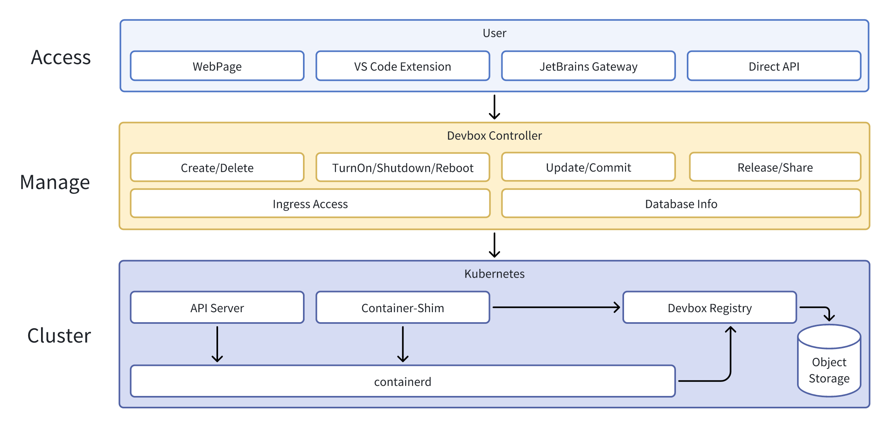
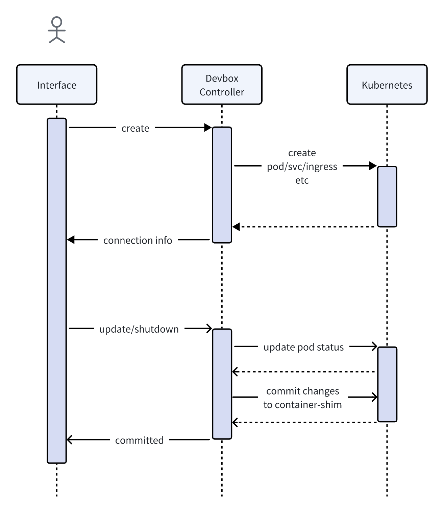
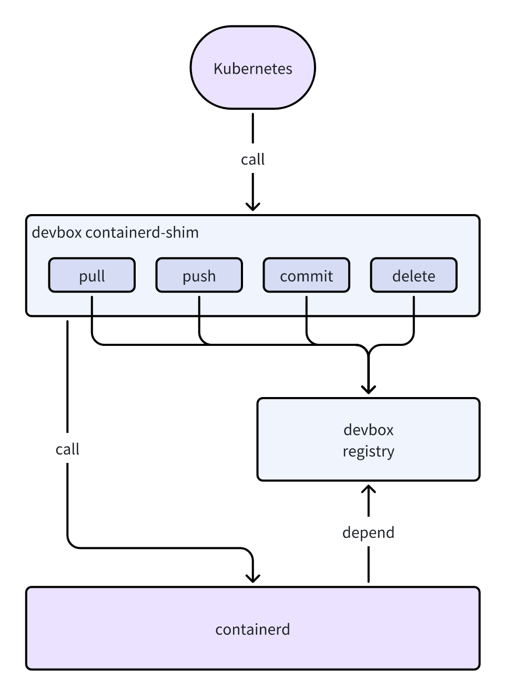

Sailos Devbox is an advanced development environment solution that leverages cloud-native Container and Kubernetes technologies to offer a unified and flexible development Runtime. Its key feature is simulating a traditional virtual machine experience while maintaining containerization benefits.

## Architecture

Sailos Devbox is built on a layered architecture, comprising these key components:

## Control Flow

Devbox implements a decoupled front-end and back-end design:

1. Users trigger actions via the web interface or plugins
2. Devbox Controller receives and processes these requests
3. Controller translates the processed instructions into Kubernetes API calls
4. Kubernetes executes the corresponding Container operations

## State Persistence Mechanism

Devbox employs an intelligent state preservation system to maintain user environment consistency:

### Automatic Saving

- System auto-saves user environment changes under specific conditions
- Changes are packaged as image layers
- New layers are appended to the base image as commits
- Updated images are securely stored in an isolated internal registry

### Environment Recovery

- On subsequent startups, system boots from the most recent image
- Ensures full preservation of historical changes

### Optimization

The Container-shim layer provides automated maintenance:
- Regularly merges image layers to optimize storage
- Automatically cleans up redundant data
- Optimizes image size and layer count for optimal system performance

