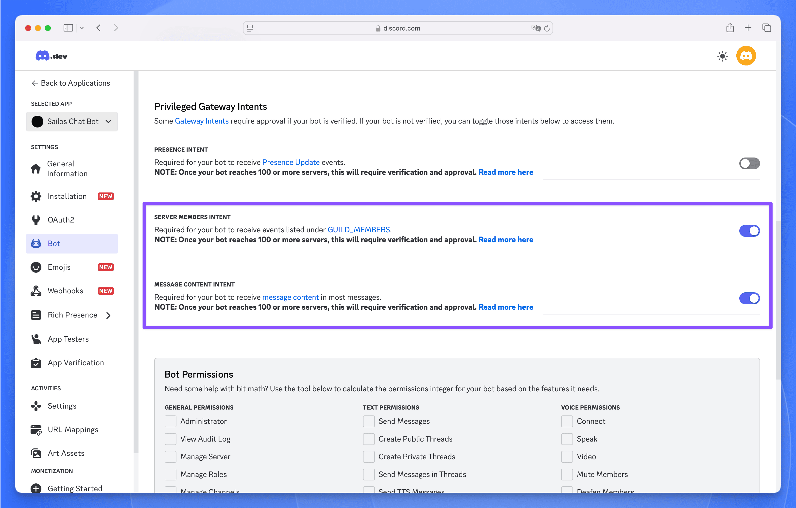
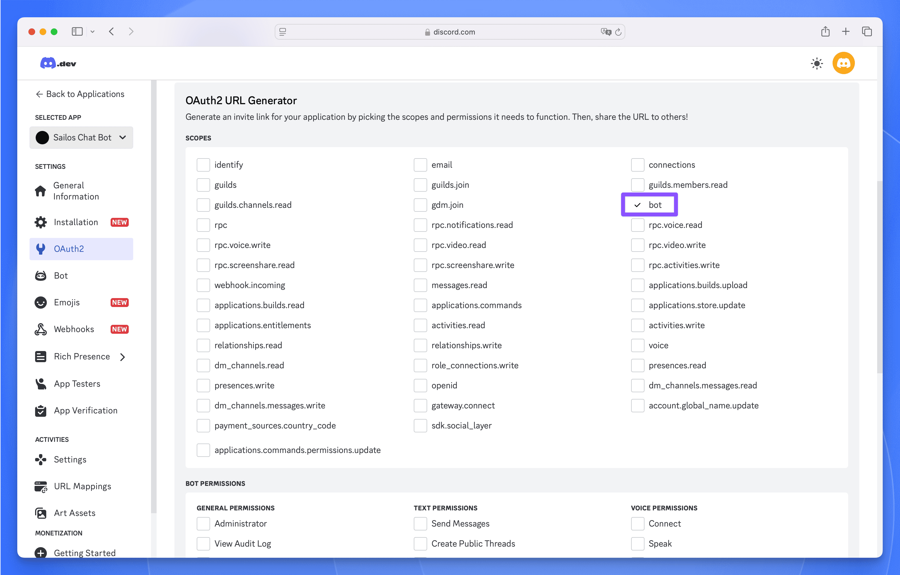
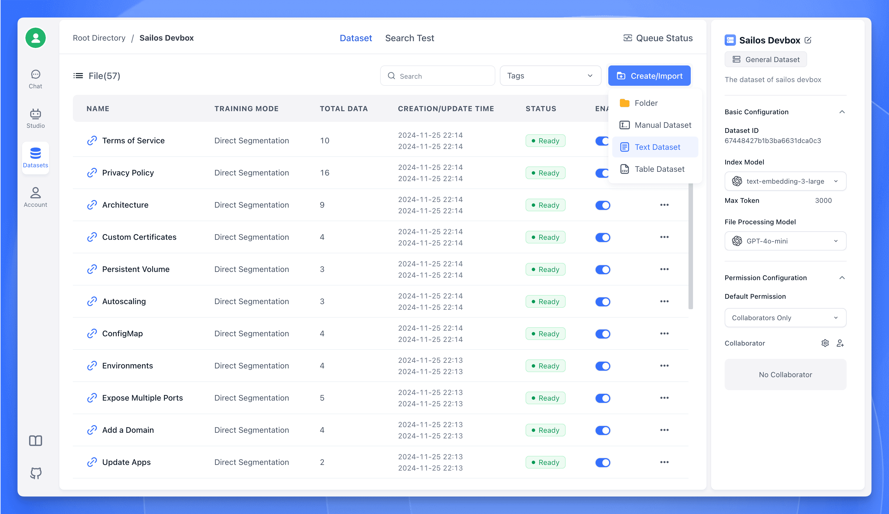
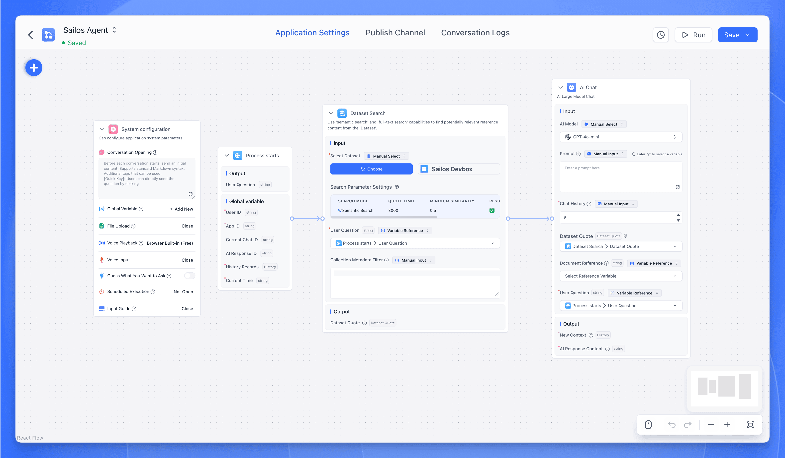

## Overview

This example demonstrates how to build an AI-powered Discord bot using DevBox. You'll create a bot that can respond to messages using AI capabilities powered by [FastGPT](https://tryfastgpt.ai), showcasing how to integrate multiple services and APIs in a DevBox environment.

**Technologies Used:**
- Node.js
- Discord.js
- FastGPT API
- DevBox development environment

**Expected Outcome:**
- A functioning Discord bot that:
  - Responds to basic commands
  - Integrates with FastGPT for AI-powered responses
  - Handles real-time message events
  - Processes natural language queries

## Prerequisites

- A Discord account with administrator privileges
- Basic knowledge of JavaScript/Node.js
- Access to [FastGPT platform](https://cloud.tryfastgpt.ai)
- The following credentials:
  - Discord Bot Token
  - FastGPT API Key
  - FastGPT Base URL

## Step-by-Step Guide

### 1. Setting Up Discord Application

<div className='steps [&_h4]:step'>

#### Create Discord Application
1. Visit the [Discord Developer Portal](https://discord.com/developers/applications)
2. Click "New Application" and choose a name for your bot. This name will be displayed in your Discord server
   

#### Configure Bot Permissions
1. Navigate to the "Bot" section
2. Enable required intents:
   - Server Members Intent
   - Message Content Intent
   
   These permissions allow the bot to:
     - Access member-related events
     - Read and process message content
3. Copy your bot token by clicking "Reset Token" and then "Copy"
   - Keep this token secure and never share it
   - You'll need this token to authenticate your bot

#### Set Up OAuth2
1. Go to OAuth2 section
2. Select "bot" scope
   
3. Choose "Administrator" permissions
   
4. Copy the generated OAuth2 URL
5. Use the URL to add the bot to your server

</div>

### 2. Creating DevBox Project

<div className='steps [&_h4]:step'>

#### Initialize Node.js Project
1. [Create a new DevBox project](/docs/guides/fundamentals/create-a-project)
2. Select Node.js as the runtime
3. Configure project resources:
   - Set appropriate CPU cores
   - Allocate required memory

#### Set Up Development Environment
1. [Connect to Your Development Environment](/docs/guides/fundamentals/develop#connect-to-your-development-environment)
2. Install required dependencies:
```bash
npm init -y
npm install discord.js axios dotenv
```
3. Update `package.json` to enable ES modules:
```json
{
  "type": "module",
  "scripts": {
    "start": "node src/index.js"
  }
}
```

#### Project Structure
Create the following file structure:
```
project/
├── src/
│   ├── index.js
│   ├── services/
│   │   └── aiService.js
├── package.json
└── README.md
```

</div>

### 3. Implementing the Bot

<div className='steps [&_h4]:step'>

#### Basic Bot Setup

Create `src/index.js`:

```javascript title="src/index.js"
import { Client, GatewayIntentBits } from 'discord.js';
import 'dotenv/config';
import aiService from './services/aiService.js';

const client = new Client({
  intents: [
    GatewayIntentBits.Guilds,
    GatewayIntentBits.GuildMessages,
    GatewayIntentBits.MessageContent
  ]
});

client.on('ready', () => {
  console.log(`${client.user.tag} is ready!`);
});

client.on('messageCreate', async message => {
  if (message.author.bot) return;
  
  if (message.content === '!ping') {
    message.reply('Pong!');
  }
  
  if (message.content.startsWith('!ask ')) {
    const question = message.content.slice(5).trim();
    if (!question) {
      message.reply('Please enter your question after !ask. For example: !ask what is Sealos?');
      return;
    }
    
    try {
      message.channel.sendTyping();
      const response = await aiService.getChatGPTResponse(question);
      message.reply(response);
    } catch (error) {
      console.error('Error getting AI response:', error);
      message.reply('Sorry, I cannot answer right now. Please try again later.');
    }
  }
});

client.login(process.env.DISCORD_TOKEN);
```

#### AI Service Integration

Create `src/services/aiService.js`:

```javascript title="src/services/aiService.js"
import axios from 'axios';
 
class AiService {
  constructor() {
    this.openaiAxios = axios.create({
      baseURL: process.env.FASTGPT_BASE_URL,
      headers: {
        'Authorization': `Bearer ${process.env.FASTGPT_API_KEY}`,
        'Content-Type': 'application/json'
      }
    });
  }
 
  async getChatGPTResponse(message) {
    try {
      const response = await this.openaiAxios.post('/v1/chat/completions', {
        chatId: "session_" + Date.now(),
        stream: false,
        detail: false,
        messages: [{
          role: "user",
          content: message
        }]
      });
      return response.data.choices[0].message.content.trim();
    } catch (error) {
      console.error('AI API call failed:', error);
      return 'Sorry, I cannot answer right now. Please try again later.';
    }
  }
}
 
export default new AiService();
```

#### Configuration Setup
Create `.env` file in the project root with your credentials:
```env
DISCORD_TOKEN=your_discord_bot_token
FASTGPT_API_KEY=your_fastgpt_api_key
FASTGPT_BASE_URL=your_fastgpt_base_url
```

Update `src/index.js` to include dotenv configuration:
```javascript
import 'dotenv/config';
import { Client, GatewayIntentBits } from 'discord.js';
// ... rest of the existing code ...
```

Start the bot with:
```bash
npm start
```

</div>

### 4. FastGPT Integration

FastGPT is an open-source LLM application development platform that allows you to build AI applications with knowledge base capabilities. In this section, we'll walk through the process of setting up FastGPT to power our Discord bot with custom knowledge.

<div className='steps [&_h4]:step'>

#### Dataset Creation
1. Log into your FastGPT account at [FastGPT](https://tryfastgpt.ai)
2. Navigate to the "Datasets" section and click "Create Dataset"
3. Choose "General Dataset" as the dataset type
   
4. Select "Text Dataset" for document processing
5. Upload your documentation files (supports PDF, TXT, Word, etc.)
   
6. Configure chunking settings if needed (default settings work well for most cases)
7. Wait for the training process to complete - this may take several minutes depending on the size of your documentation

#### Application Setup
1. Go to the "Applications" section and create a new FastGPT application
2. In the Flow Editor, add a "Dataset Search" module
3. Connect your trained dataset to the search module
4. Add an "AI Chat" module and connect it to the search module
5. Configure the AI Chat module settings:
   - Set temperature (0.7 recommended for balanced responses)
   - Adjust max tokens as needed
   - Customize the system prompt



#### API Publication
1. Once satisfied with the configuration, click "Publish Channel" to make your application live
2. Go to the "API Request" section of your application
   
3. Generate new API credentials if you haven't already
4. Save these important details for the next steps:
   - API Base URL: The endpoint for your FastGPT API
   - API Key: Your authentication token

These credentials will be used in the `.env` file we created earlier to connect our Discord bot to the FastGPT backend.

</div>