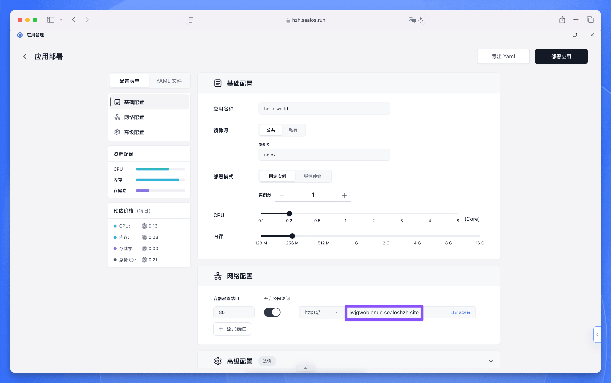
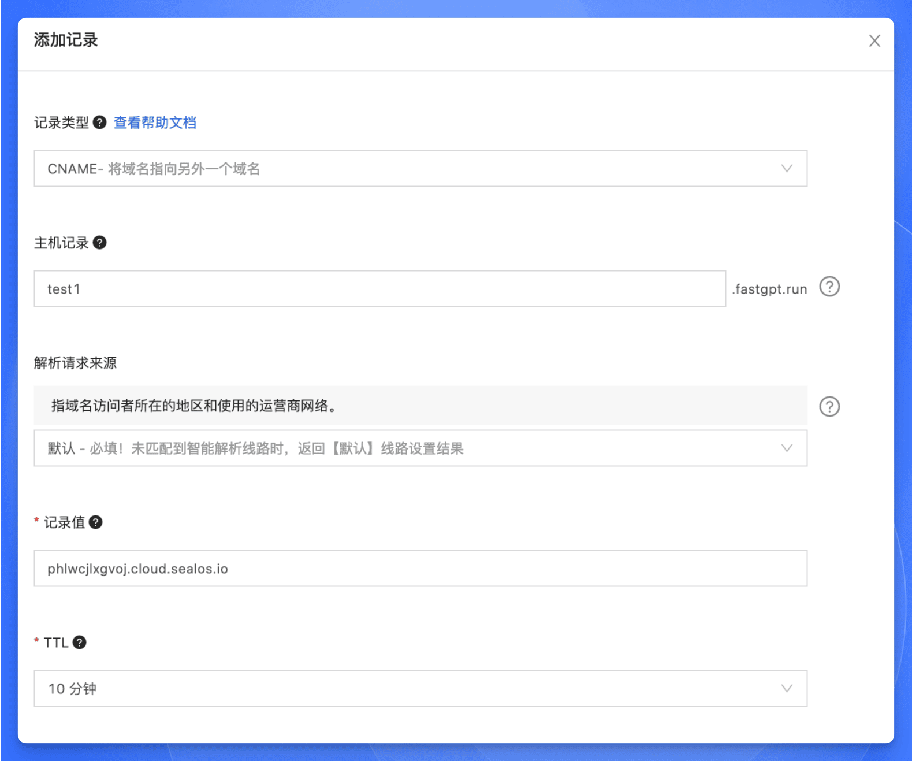
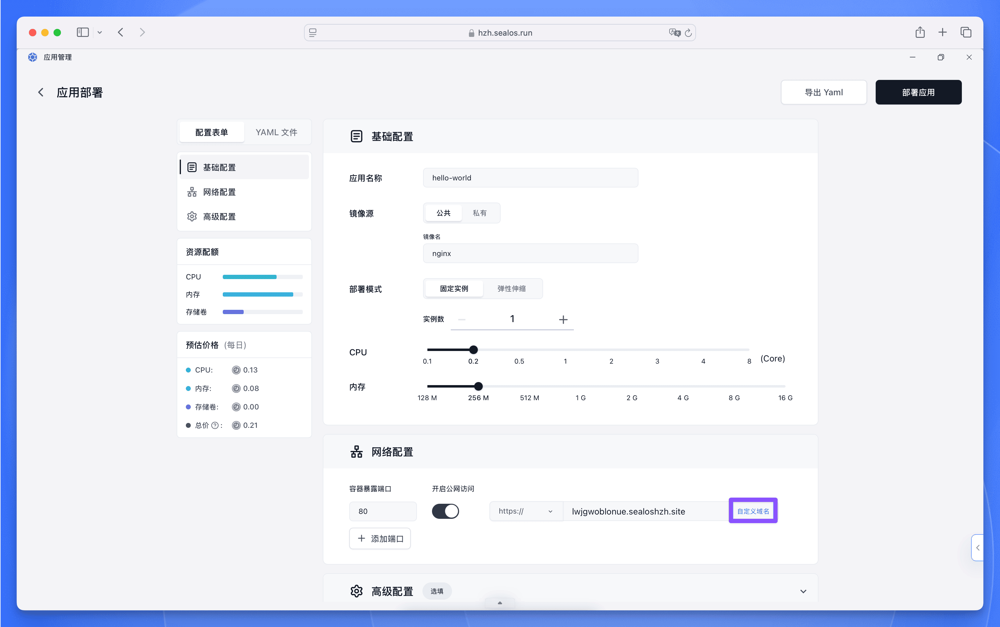
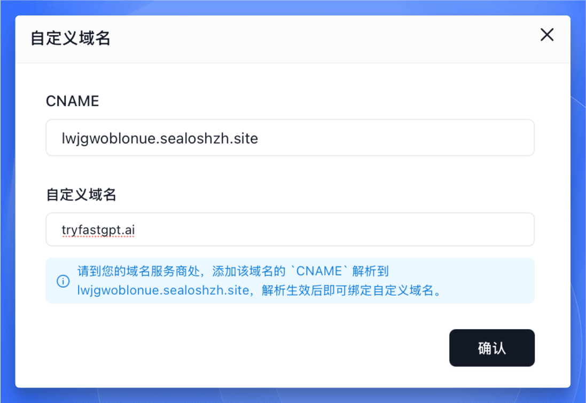

在 Sealos 云平台上，您可以通过【应用管理】为应用配置自定义域名，让用户通过您的品牌域名访问应用，提供更专业的服务体验。本文将介绍如何为应用添加和配置自定义域名。

## 备案要求说明

在 Sealos 中配置自定义域名前，请注意以下备案要求：

1. **域名备案要求**：所有在中国大陆地区使用的自定义域名必须完成工信部备案
2. **跨云备案限制**：当应用部署在特定可用区时，域名必须在对应云服务商处完成备案：
   - **[北京可用区](https://bja.sealos.run)** (火山云)：需在[火山引擎](https://www.volcengine.com/)完成备案
   - **[杭州可用区](https://hzh.sealos.run)** (阿里云)：需在[阿里云](https://www.aliyun.com/)完成备案
   - **[广州可用区](https://gzg.sealos.run)** (腾讯云)：需在[腾讯云](https://cloud.tencent.com/)完成备案

不同云服务商之间的备案信息不互通，请确保域名备案的云服务商与您选择的 Sealos 可用区保持一致。例如：当应用部署在北京可用区 (火山云) 时，使用阿里云备案的域名将无法正常访问。

## 部署时接入

如果您在部署应用时接入自定义域名，只需要在部署应用时打开“外网访问”，Sealos 会给您的应用自动分配一个外网域名。

然后需要到您的域名服务商处，添加该域名的 `CNAME` 解析到上面分配的外网域名。以阿里云为例：

等待解析生效后即可回到 Sealos 中绑定自定义域名，直接点击右侧的“自定义域名”：

在弹出的界面中输入您的自定义域名，然后点击确认即可。

最终点击右上角的【部署】开始部署应用，部署完成后点击外网地址即可通过自定义域名访问应用。

## 部署完成后接入

已经部署完成的应用可以在应用详情页面的右上角点击【变更】，然后参考之前的步骤接入自定义域名即可。