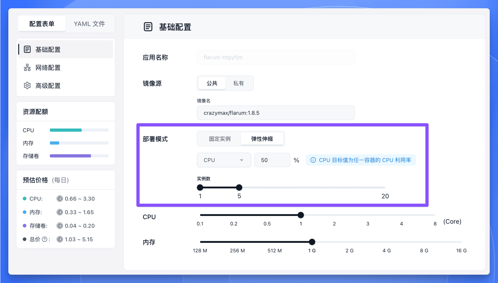

在 Sealos 的【[应用管理](./)】中，我们提供智能的**弹性伸缩**功能 (Horizontal Pod Autoscaler，简称 HPA)。这个功能就像给应用装上了“自动调节器”，能够根据实时负载情况自动增减应用实例数量，既避免资源浪费又确保服务稳定。

## 功能原理

想象弹性伸缩系统是一个全天候值守的运维专家，它的工作流程分为三个关键环节：

1. **持续检测**  
   持续监测应用实例的 CPU 和内存等核心指标

2. **智能分析**  
   根据预设的阈值 (例如 CPU 平均使用率不超过 50%)，自动计算出需要增加或减少的实例数量

3. **自动调节**  
   通过 Sealos 控制器实时调整实例数量，始终保持资源利用率在健康区间

<Callout type="info">
**使用率计算说明**

当应用有多个实例时，系统会取所有实例的平均值作为判断依据。例如：

- 2 个实例的 CPU 使用率分别为 60% 和 40% → 平均 50%
- 3 个实例的内存使用率分别为 70%、50%、30% → 平均 50%

</Callout>

## 典型场景示例

假设为电商应用设置以下弹性伸缩规则：
```
实例数量范围：1-5 个
CPU 使用率目标值：50%
```

核心计算公式为：

```
期望副本数 = ceil[当前副本数 × (当前指标值 / 目标值)]
```

当遇到促销活动时：

🔼 **流量高峰时段**  

假设当前有 3 个实例，CPU 使用率分别为 75%、80%、70% → 平均 75%，目标为 50%。计算为 `3 × (75/50) = 4.5`，向上取整至 5 个实例。所以将会扩容到 5 个实例。

🌙 **日常低峰时段**  

当 CPU 平均使用率持续 5 分钟低于目标值 (50%) 时 (例如 30%)，计算为 `5 × (30/50) = 3`，所以将会缩容到 3 个实例。

通过这种动态调节机制，既能保障高峰期的服务可用性，又能在低负载时节约资源成本。所有调整过程完全自动化，无需人工干预。

