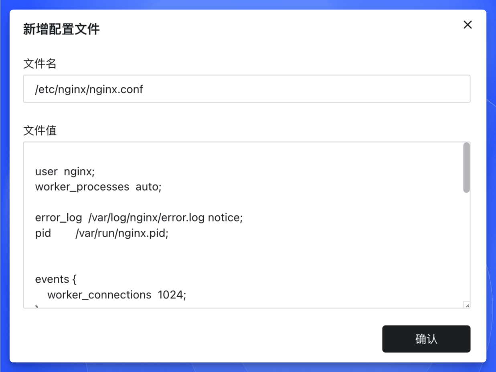

在 [Sealos](https://cloud.sealos.run) 应用管理中，配置文件发挥着不可替代的作用，特别是在处理复杂应用配置场景时。当需要管理包含多层级配置、格式敏感或大体积的配置数据时，配置文件相比环境变量具有更灵活、可维护性更强的优势。

## 配置文件的核心价值

1. **结构化存储**：支持 YAML/JSON/XML 等格式的配置文件，便于管理各类服务配置、运行时参数等结构化数据
2. **动态注入**：在容器启动时自动将配置注入指定路径，实现应用配置与容器镜像的解耦
3. **热更新支持**：部分应用支持运行时动态加载配置，无需重启应用即可生效

## Nginx 配置实践指南

以下通过 Nginx 容器演示配置文件的典型使用场景：

1. **文件定位**  
   - 确定容器内配置路径 (参考镜像文档，通常为 `/etc/nginx/nginx.conf`)
   - 在 Sealos 控制台输入完整文件路径

2. **内容编辑**  
   - 建议先在本地使用专业编辑器 (如 VS Code) 编写配置文件
   - 完成语法校验后，将内容完整复制到配置值区域

<Callout type="warn">
配置文件是挂载单个文件，而不是挂载目录。你需要明确指定要挂载的具体文件，而非仅仅指定一个目录路径(例如：`/etc/nginx/nginx.conf`)。
</Callout>

