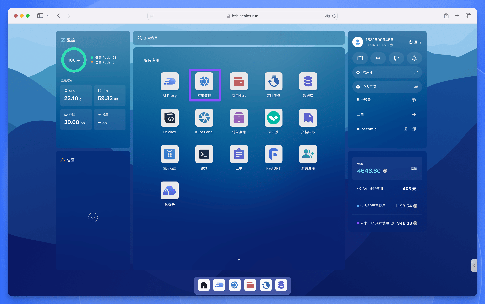
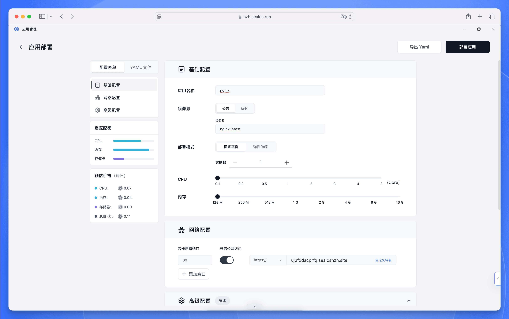
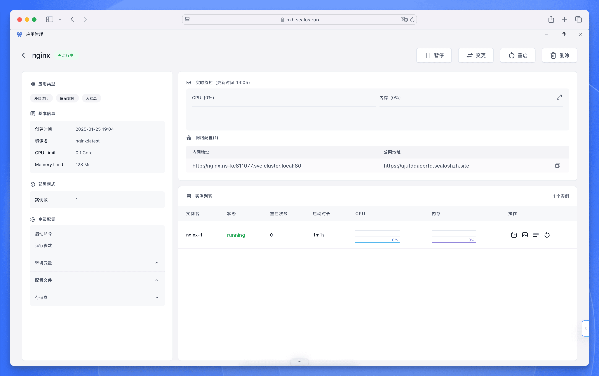
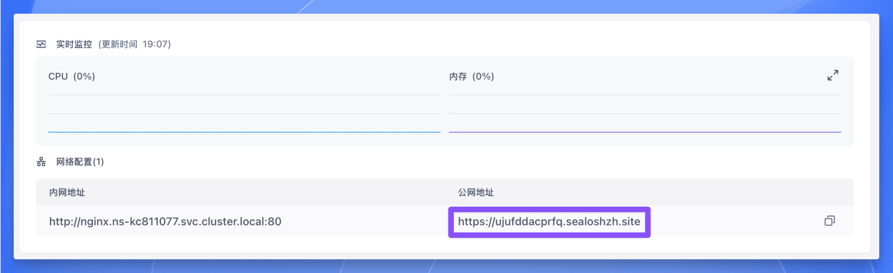
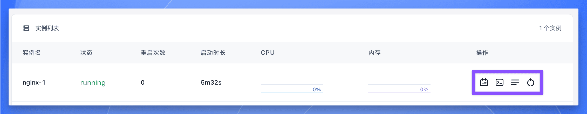
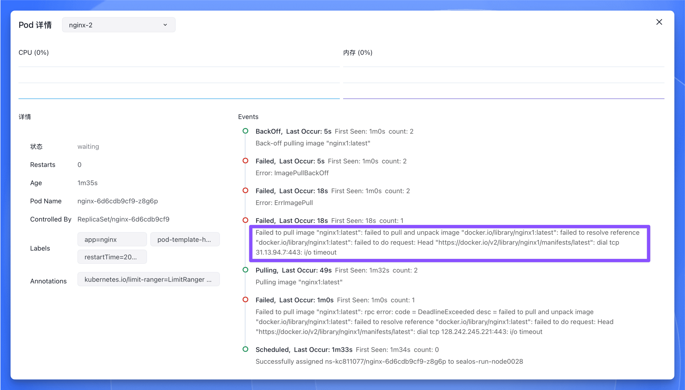

本文将介绍如何在 Sealos 云操作系统中使用【应用管理】功能快速安装应用。

## 安装 Nginx

打开 [Sealos 控制台](https://cloud.sealos.run)，找到并点击【应用管理】应用图标。

在【应用管理】界面中，点击【新建应用】按钮，然后在部署表单中填写以下信息：

- 应用名称：输入应用名称
- 镜像名称：输入镜像名称
- 部署模式：选择固定实例的数量或者弹性伸缩
- 计算资源：通过滑块调整 CPU 和内存配置
- 网络配置：输入容器端口，选择是否开启外网访问
- 启动命令：这里可以自定义启动命令和参数
- 环境变量：这里可以自定义环境变量
- 配置文件：挂载配置文件到容器中
- 存储容量：如果容器需要持久化存储，可以设置需要挂载的存储容量

以安装 Nginx 为例，填写以下信息：

- 应用名称：nginx
- 镜像名称：`nginx:latest`
- 部署模式：固定实例，实例数量为 1
- 计算资源：0.1 核 128M 即可
- 网络配置：80 端口，开启外网访问

其他啥都不用填，直接点击右上角的【部署应用】按钮，等待部署完成。

部署完成后会直接进入应用详情页面，可以看到应用的访问地址、状态、日志等信息。

等待应用实例状态变成 `running` 后，点击【公网地址】即可访问 Nginx 服务。

实例列表右边有几个按钮，分别是：

- 日志：查看应用实例的日志
- 终端：进入应用实例的终端
- 详情：查看应用实例的启动详情
- 重启：重启应用实例

这几个按钮的用法如下：

- 如果应用实例一直没启动 (比如状态是 `waiting`)，可以点击【详情】按钮查看详情，找到启动失败的原因。比如镜像名称填错了：

  

- 如果应用实例在启动过程中或者运行过程中出现错误，可以点击【日志】按钮查看日志，找到错误的原因。

- 如果需要进入应用实例的终端，可以点击【终端】按钮，进入终端后可以执行命令。

- 如果需要重启应用实例，可以点击【重启】按钮，重启后应用实例会重新启动。

