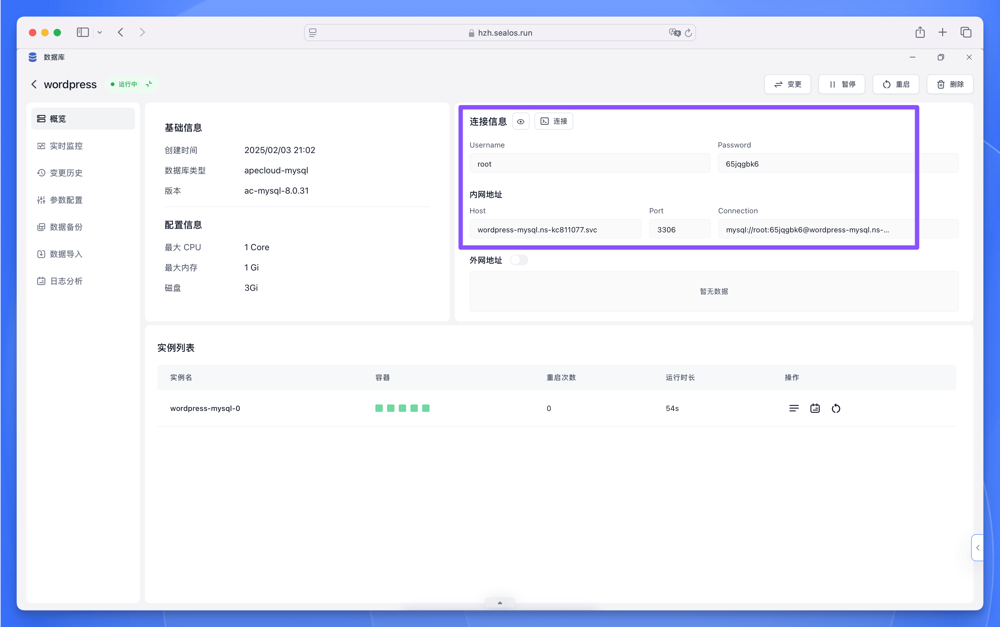
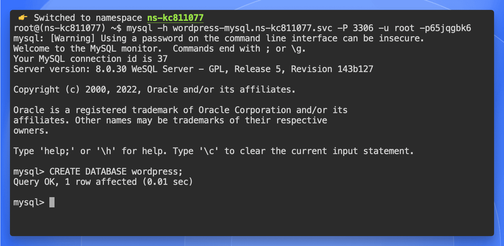
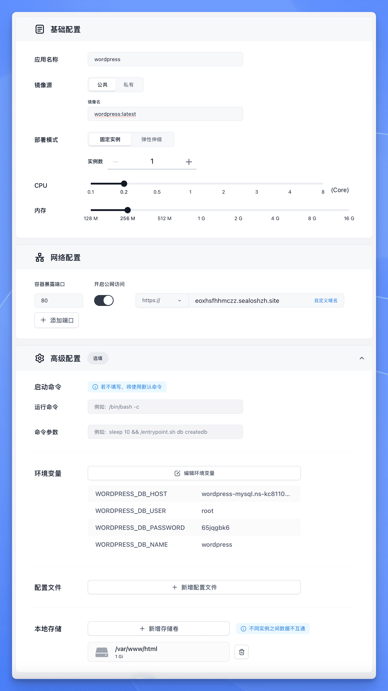

本文提供从 Docker Compose 到 Sealos 的完整迁移方案，帮助您将本地开发环境快速转换为 Sealos 应用。以下是帮助您理解概念映射的对照表：

| Docker Compose 概念       | Sealos 【应用管理】对应功能               |
|--------------------------|------------------------------|
| `services`               | 应用管理中的独立应用部署       |
| `ports`                  | 网络配置中的容器暴露端口           |
| `volumes`                | 本地存储配置                 |
| `environment`            | 环境变量配置                   |
| `depends_on`             | 通过应用启动顺序控制           |
| `image`                  | 镜像名直接对应               |
| `command`                | 运行命令                   |

在开始手动迁移之前，建议您先检查 [Sealos 应用商店](/docs/guides/app-store)中是否已经有预制的应用模板。使用应用商店可以大大简化迁移过程。而且 Sealos 应用商店中的应用模板已经过优化和测试，包含了最佳实践配置，强烈推荐优先使用这种方式部署。

如果应用商店中没有找到所需的应用模板，您可以按照以下步骤手动迁移您的 Docker Compose 应用。

以 Wordpress 为例，我们来看下如何将 Wordpress 从 Docker Compose 迁移到 Sealos 中。

原始的 docker-compose.yml 文件如下：

```yaml title="docker-compose.yml"
services:
  db:
    # We use a mariadb image which supports both amd64 & arm64 architecture
    image: mariadb:10.6.4-focal
    # If you really want to use MySQL, uncomment the following line
    #image: mysql:8.0.27
    command: '--default-authentication-plugin=mysql_native_password'
    volumes:
      - db_data:/var/lib/mysql
    restart: always
    environment:
      - MYSQL_ROOT_PASSWORD=somewordpress
      - MYSQL_DATABASE=wordpress
      - MYSQL_USER=wordpress
      - MYSQL_PASSWORD=wordpress
    expose:
      - 3306
      - 33060
  wordpress:
    image: wordpress:latest
    volumes:
      - wp_data:/var/www/html
    ports:
      - 80:80
    restart: always
    environment:
      - WORDPRESS_DB_HOST=db
      - WORDPRESS_DB_USER=wordpress
      - WORDPRESS_DB_PASSWORD=wordpress
      - WORDPRESS_DB_NAME=wordpress
volumes:
  db_data:
  wp_data:
```

## 分步迁移指南

<div className='fd-steps [&_h3]:fd-step'>

### 数据库服务迁移

对于数据库服务，我们只需要在 Sealos 中创建一个数据库应用即可。这里我们需要创建 MySQL 类型的数据库，具体步骤可参考以下文档：[创建 MySQL 数据库](/docs/guides/databases/mysql)

### 获取数据库连接信息

数据库的连接信息 (地址、用户名、密码) 可以在数据库应用详情中查看：



除此之外，还需要手动连接数据库然后创建一个数据库。点击【连接信息】右边的【连接】按钮进入数据库终端：


然后执行以下命令：

```bash
CREATE DATABASE wordpress;
```



### Web 应用迁移

部署前端应用并连接数据库：

```markdown
1. 应用名称：wordpress
2. 镜像名称：wordpress:latest
3. 网络配置：
   - 容器暴露端口：80
   - 外网访问：开启（自动分配域名）
4. 本地存储：
   - 路径：/var/www/html
   - 容量：1GB
5. 环境变量：
   - WORDPRESS_DB_HOST：数据库应用详情中的 `Host`
   - WORDPRESS_DB_USER：数据库应用详情中的 `Username`
   - WORDPRESS_DB_PASSWORD：数据库应用详情中的 `Password`
   - WORDPRESS_DB_NAME：wordpress
7. 点击【部署应用】
```



</div>