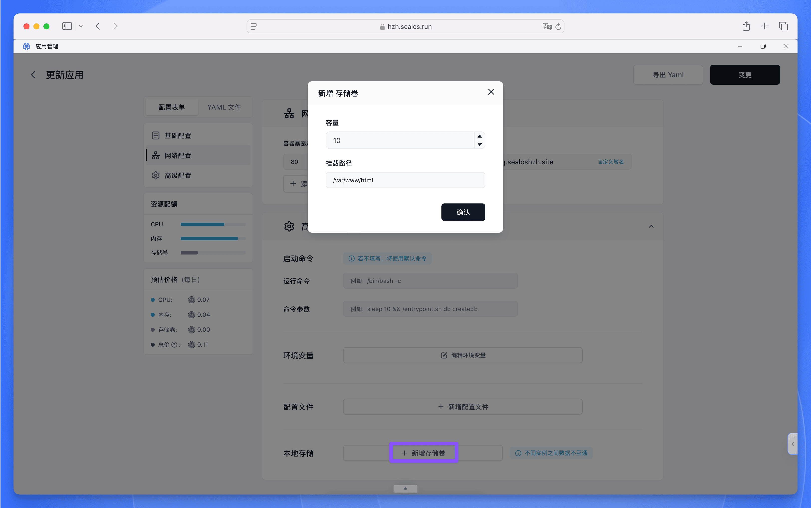

在 [Sealos](https://cloud.sealos.run) 中，应用实例可以像乐高积木一样快速搭建和拆卸。这种特性虽然带来了极致的灵活性，但也意味着**容器内部存储的数据会随着容器的销毁而消失**。

持久化存储就像给容器数据装上“保险箱”，通过将数据存储在容器外部的专用存储设备中，实现：

✅ **数据安全保障** - 即使容器重启、迁移或重建    
✅ **灵活扩展** - 存储空间可随业务需求动态调整

<Callout type="warn">
**必须使用持久化存储的场景**   
- 文件存储服务（Nextcloud/ownCloud 等）  
- 用户会话数据存储  
- 日志文件长期保存  
- 任何需要保留业务数据的应用
</Callout>

## Nextcloud 实战演示

以部署 Nextcloud 云盘服务为例，其核心数据存储在容器内的 `/var/www/html` 目录，包含：

- 用户配置文件 `config/`
- 数据库文件 `data/`
- 用户上传文件 `files/`
- 应用扩展插件 `apps/`

通过持久化存储配置，我们可以将这个“数据心脏”外接到安全的外部存储：

**配置关键点**：

1. 在存储配置界面准确输入容器内数据目录路径
2. 根据业务需求设置存储空间大小

正确配置后，即使 Nextcloud 容器实例发生故障重建，所有用户数据和配置信息都能完好无损地挂载到新实例，实现业务零中断。