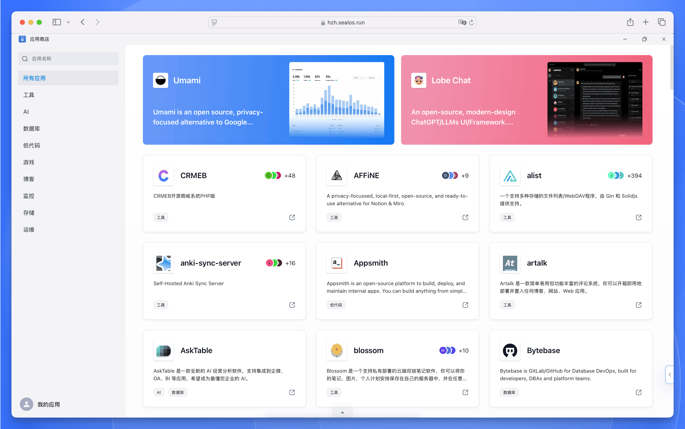

[【应用商店】](https://template.hzh.sealos.run)提供了一系列预制的应用模板，支持快速创建和部署各种网站及应用程序。这些模板包括博客、AI 应用、低代码应用、网盘、即时通讯应用、中间件等，旨在简化开发过程，让开发者无需从零开始构建项目或处理应用之间的依赖关系。

## 提交应用

Sealos 应用商店的所有应用都是实时从下面这个 GitHub 仓库同步过来的：

<Cards>
  <Card
    href="https://github.com/labring-actions/templates"
    title="Sealos 应用仓库"
  >
    Sealos 应用商店所有应用都来源于此仓库
  </Card>
</Cards>

如果您想向 Sealos 应用商店提交应用，可以直接在 [Sealos 应用仓库](https://github.com/labring-actions/templates)中提交 PR (Pull Request) 即可。

要提交一个新应用，您可以参考这里的 [template.yaml 文件](https://github.com/labring-actions/templates/blob/main/template.yaml)。系统已经内置了许多通用的环境变量和函数，这些都可以在编写模板时使用。这些内置的功能允许您使用类似于 `GitHub Actions` 的语法来编写模板，例如，您可以使用 `${{SEALOS_NAMESPACE}}` 这样的环境变量来设置模板参数。关于这些内置环境变量的具体信息，可以参阅[模板说明文档](https://github.com/labring-actions/templates/blob/main/example_zh.md)。

如果您不熟悉如何编写应用的 YAML 模板，也可以直接在 [Issues 区](https://github.com/labring-actions/templates/issues)提交一个新的 Issue，描述您想要添加的应用。我们的维护团队会协助您完成应用模板的编写和提交。在提交 Issue 时，请尽可能详细地说明：

- 应用的名称和简介
- 应用的官方网站或 GitHub 仓库地址
- 应用的部署要求 (如：所需的环境变量、存储需求等)
- 其他相关信息

这样可以帮助我们更好地理解您的需求，加快应用模板的制作过程。

