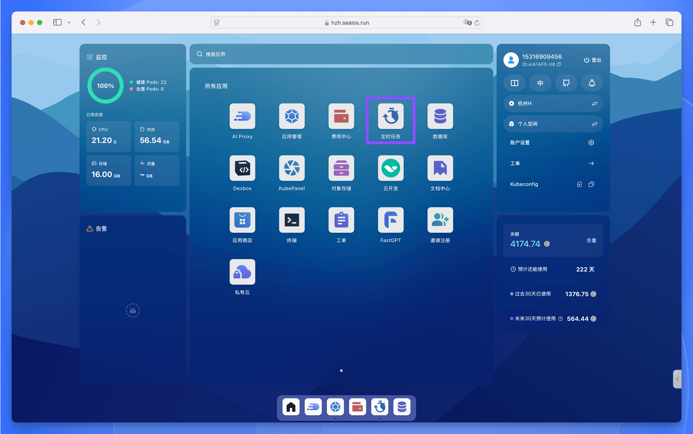
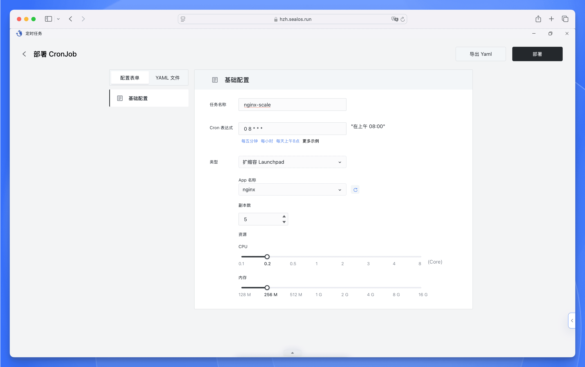
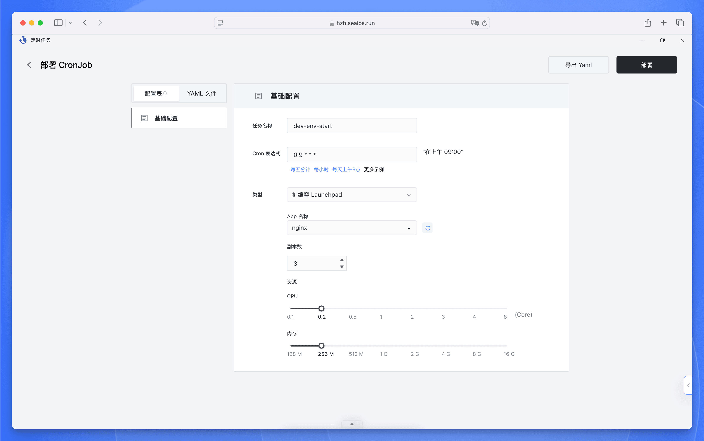

在 Sealos 中，【定时任务】用于创建定期重复执行的定时任务。与常规应用不同，【定时任务】会按照预定的时间表自动触发任务执行，非常适合需要定期维护、数据处理的场景。



## 典型使用场景

1. **数据备份与同步**：每天凌晨执行数据备份
2. **定时通知**：每天固定时间发送日报邮件
3. **批量处理**：每小时执行一次数据批处理任务
4. **定时扩缩容**：每天固定时间执行扩缩容操作

下面我们以定时扩缩容为例，详细说明如何在 Sealos 中配置定时任务。

## 定时扩缩容配置

对于需要应对可预测流量波动的应用 (如电商促销、游戏活动、办公系统等)，可以通过定时扩缩容功能实现资源使用的精细化管理。

### 使用场景示例

- **电商促销**：大促期间每天 09:00-23:00 扩容到 10 个实例，其他时间保持 3 个实例
- **办公系统**：工作日 08:00-20:00 维持 5 个实例，非工作时间缩减到 1 个实例
- **游戏活动**：周末全天扩容到 15 个实例，平日保持 5 个实例

### 配置步骤

<div className='fd-steps [&_h4]:fd-step'>

<h4>创建定时任务</h4>

1. 在 Sealos 控制台打开【定时任务】
2. 点击【添加定时任务】按钮新建定时任务

<h4>配置基本参数</h4>

- **任务名称**：输入易识别的名称，如“nginx-scale”
- **类型**：选择任务类型
  - `扩缩容 Launchpad`：对应用实例进行扩缩容
  - `访问 URL`：访问指定 URL 地址
  - `执行命令`：执行自定义命令
- **Cron 表达式**：使用 Cron 表达式设置执行时间 (基于北京时间)
- **App 名称**：当类型为 `扩缩容 Launchpad` 时，指定需要扩缩容的目标应用
- **副本数**：当类型为 `扩缩容 Launchpad` 时，指定需要扩缩容的目标实例数量

示例配置：

```
任务名称：nginx-scale
调度时间：0 8 * * * 
副本数：5
```

该配置表示：
- **Cron 表达式**：`0 8 * * *` 表示每天北京时间 8:00 执行
- **副本数**：将应用实例数调整为 5 个



</div>

## 定时开关机

对于需要周期性暂停服务的应用 (如开发测试环境、定时数据处理任务等)，可以通过组合两个定时任务实现智能开关机：

<Callout type="info">
**典型用例**  

- 开发测试环境：工作日 09:00-18:00 保持运行，其他时间关闭
- 数据处理任务：每天凌晨 02:00-04:00 启动计算任务
- 演示系统：仅在客户访问时段保持运行
</Callout>

<div className='fd-steps [&_h4]:fd-step'>

<h4>创建关机任务</h4>


- 点击【添加定时任务】新建第一个任务
- 配置参数：
   ```
   任务名称：dev-env-stop
   类型：扩缩容 Launchpad
   Cron 表达式：0 0 * * *  # 每天北京时间 0:00
   App 名称：your-app-name
   副本数：0
   ```
- 点击【部署】保存配置

<h4>创建开机任务</h4>



- 再次点击【添加定时任务】新建第二个任务
- 配置参数：
   ```
   任务名称：dev-env-start
   类型：扩缩容 Launchpad  
   Cron 表达式：0 9 * * *  # 每天北京时间 9:00
   App 名称：your-app-name
   副本数：3  # 恢复为正常实例数
   ```
- 点击【部署】完成配置

</div>

通过这种配置方式，系统将：

- 每天凌晨自动关闭实例，节省资源消耗
- 每天上午自动恢复服务，保证工作时间可用性
- 全年无休自动执行，无需人工干预


