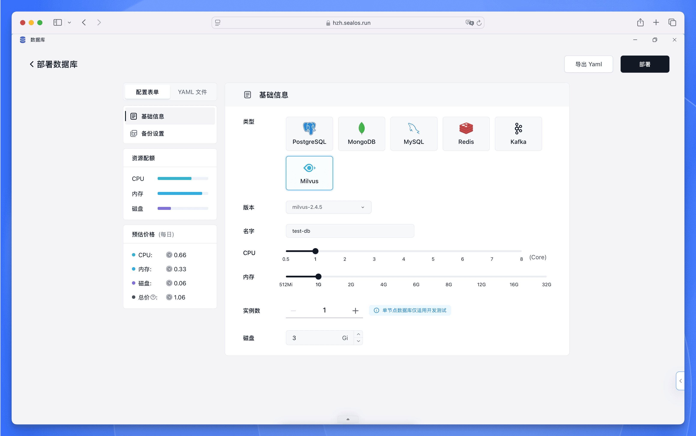
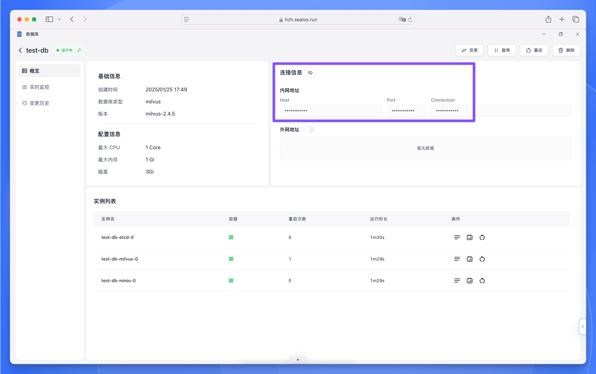

Milvus 是一个开源的分布式向量数据库，用于大规模数据集的相似性搜索和分析。在 Sealos DevBox 中，您可以轻松地为您的开发项目设置和连接 Milvus 数据库。

## 在 Sealos 中部署 Milvus

Sealos 提供了简单直观的操作界面，只需几步即可完成 Milvus 集群的部署。具体步骤如下：

<h5>打开 [Sealos 控制台](https://cloud.sealos.run)，找到并点击"数据库"应用图标。</h5>

<h5>在数据库应用界面中，点击"新建"按钮，然后在部署表单中填写以下信息：</h5>

   - 数据库类型：选择 ”Milvus”
   - 版本：选择所需的 Milvus 版本 (如 milvus-2.4.5)
   - 集群名称：输入名称 (仅使用小写字母和数字)
   - 计算资源：通过滑块调整 CPU 和内存配置
   - 副本数量：开发测试环境建议设置为 1
   - 存储容量：设置所需的存储空间 (如：3 Gi)

<h5>确认配置无误后，您可以在左侧边栏查看预估成本，然后点击右上角的"部署"按钮开始创建数据库。</h5>

部署完成后，系统将提供 Milvus 集群的连接参数，您可以使用这些信息连接到 Milvus 集群。

## 在 Sealos DevBox 中连接 Milvus

我们为不同的编程语言提供了连接 Milvus 集群的示例代码，请选择您需要的开发语言：

<Cards>
  <Card title="使用 Go 连接 Milvus" href="./milvus/go" />
  <Card title="使用 Node.js 连接 Milvus" href="./milvus/nodejs" />
</Cards>
