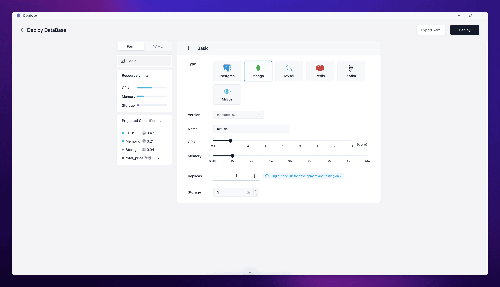
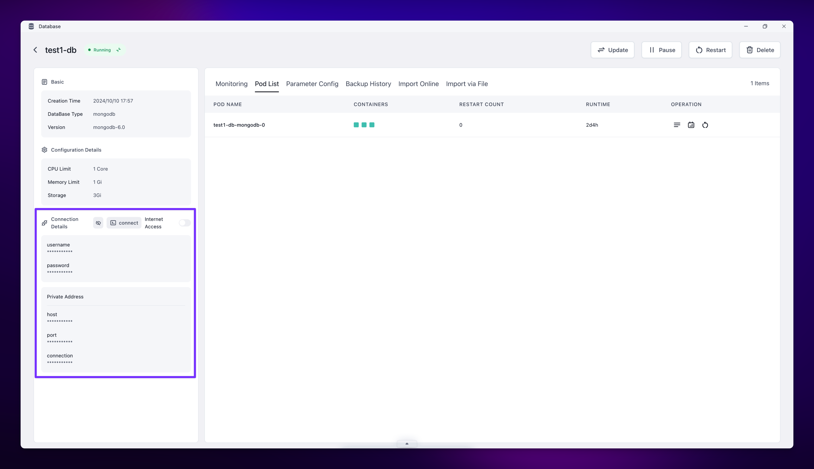

MongoDB is a popular, open-source document-oriented database system. In Sealos DevBox, you can easily set up and connect to MongoDB databases for your development projects.

## Deploy MongoDB in Sealos

Sealos makes it easy to deploy a MongoDB database with just a few clicks. Follow these steps:

<h5>From the Sealos desktop, click on the "Database" icon to open the Database app.</h5>

<h5>Click on the "Create New Database" button. In the deployment form:</h5>
   - Select "MongoDB" as the database type.
   - Choose the desired MongoDB version (e.g., mongodb-6.0).
   - Enter a name for your database (use lowercase letters and numbers only).
   - Adjust the CPU and Memory sliders to set the resources for your database.
   - Set the number of replicas (1 for single-node development and testing).
   - Specify the storage size (e.g., 3 Gi).

<h5>Review the projected cost on the left sidebar. Click the "Deploy" button in the top right corner to create your MongoDB database.</h5>

Once deployed, Sealos will provide you with the necessary connection details.

## Connect to MongoDB in DevBox

Here are examples of how to connect to your MongoDB database using different programming languages and frameworks within your DevBox environment:

<Cards>
  <Card title="Connect to MongoDB with Go in Sealos DevBox" href="./mongodb/go" />
  <Card title="Connect to MongoDB with Java in Sealos DevBox" href="./mongodb/java" />
  <Card title="Connect to MongoDB with Node.js in Sealos DevBox" href="./mongodb/nodejs" />
  <Card title="Connect to MongoDB with PHP in Sealos DevBox" href="./mongodb/php" />
  <Card title="Connect to MongoDB with Python in Sealos DevBox" href="./mongodb/python" />
  <Card title="Connect to MongoDB with Rust in Sealos DevBox" href="./mongodb/rust" />
</Cards>