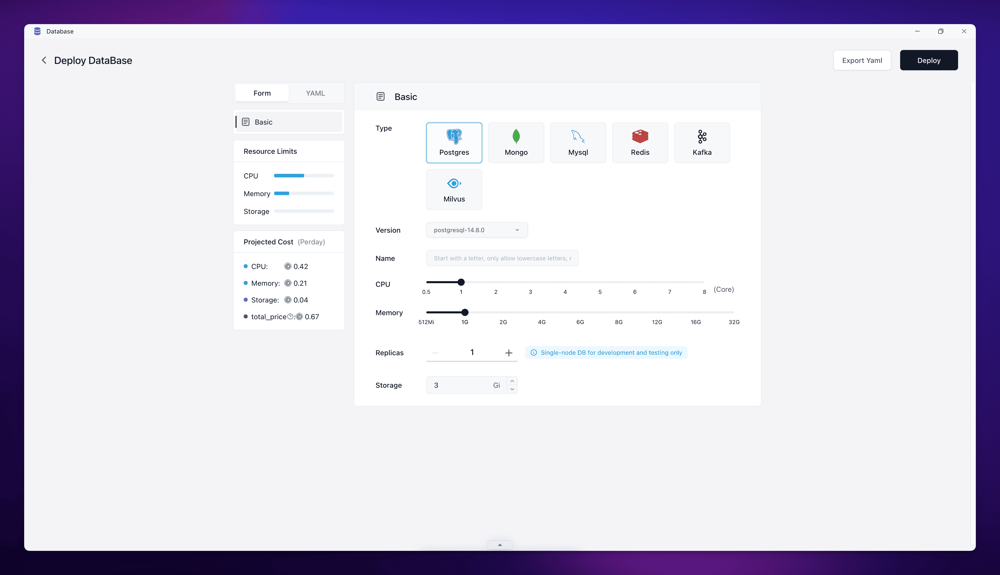
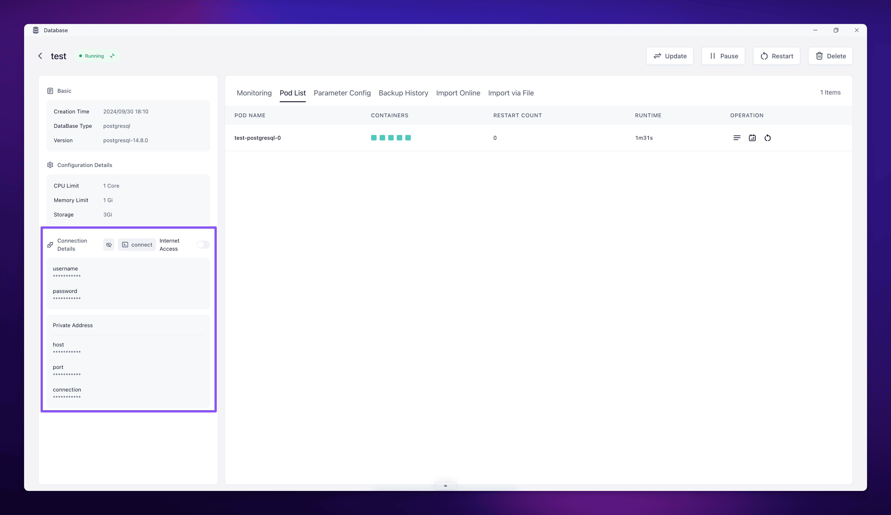

PostgreSQL is a powerful, open-source object-relational database system. In Sailos DevBox, you can easily set up and connect to PostgreSQL databases for your development projects.

## Deploy PostgreSQL in Sailos

Sailos makes it easy to deploy a PostgreSQL database with just a few clicks. follow these steps:

<h5>From the Sailos desktop, click on the "Database" icon to open the Database app.</h5>

<h5>Click on the "Create New Database" button. In the deployment form:</h5>
   - Select "Postgres" as the database type.
   - Choose the desired PostgreSQL version (e.g., postgresql-14.8.0).
   - Enter a name for your database (use lowercase letters and numbers only).
   - Adjust the CPU and Memory sliders to set the resources for your database.
   - Set the number of replicas (1 for single-node development and testing).
   - Specify the storage size (e.g., 3 Gi).

<h5>Review the projected cost on the left sidebar. Click the "Deploy" button in the top right corner to create your PostgreSQL database.</h5>

Once deployed, Sailos will provide you with the necessary connection details.

## Connect to PostgreSQL in DevBox

Here are examples of how to connect to your PostgreSQL database using different programming languages and frameworks within your DevBox environment:

<Cards>
  <Card title="Connect to PostgreSQL with Go in Sailos Devbox" href="./postgresql/go" />
  <Card title="Connect to PostgreSQL with Java in Sailos Devbox" href="./postgresql/java" />
  <Card title="Connect to PostgreSQL with Node.js in Sailos Devbox" href="./postgresql/nodejs" />
  <Card title="Connect to PostgreSQL with PHP in Sailos Devbox" href="./postgresql/php" />
  <Card title="Connect to PostgreSQL with Python in Sailos Devbox" href="./postgresql/python" />
  <Card title="Connect to PostgreSQL with Rust in Sailos Devbox" href="./postgresql/rust" />
</Cards>

