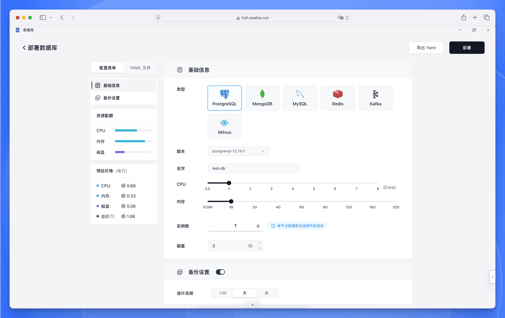
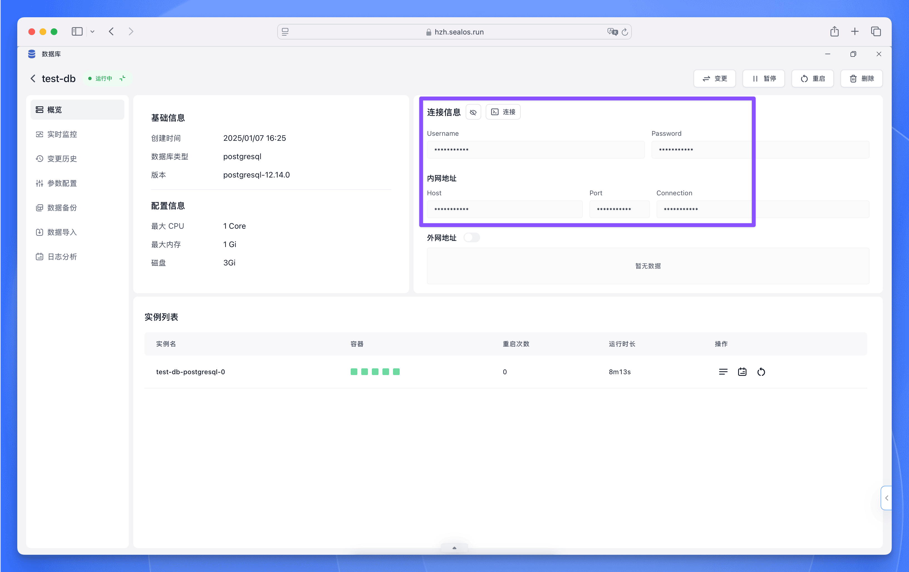

PostgreSQL 是一款功能强大的开源对象关系型数据库系统。通过 Sealos DevBox，您可以快速部署并使用 PostgreSQL 数据库来支持您的开发项目。

## 在 Sealos 中部署 PostgreSQL

Sealos 提供了简单直观的操作界面，只需几步即可完成 PostgreSQL 数据库的部署。具体步骤如下：

<h5>打开 [Sealos 控制台](https://cloud.sealos.run)，找到并点击"数据库"应用图标。</h5>

<h5>在数据库应用界面中，点击"新建"按钮，然后在部署表单中填写以下信息：</h5>

   - 数据库类型：选择 ”Postgres”
   - 版本：选择所需的 PostgreSQL 版本 (如：postgresql-14.8.0)
   - 数据库名称：输入名称 (仅支持小写字母和数字的组合)
   - 计算资源：通过滑块调整 CPU 和内存配置
   - 副本数量：开发测试环境建议设置为 1
   - 存储容量：设置所需的存储空间 (如：3 Gi)

<h5>确认配置无误后，您可以在左侧边栏查看预估成本，然后点击右上角的"部署"按钮开始创建数据库。</h5>

部署完成后，系统会自动为您生成并显示数据库的连接信息。

## 在 Sealos DevBox 中连接 PostgreSQL

我们为不同的编程语言和框架提供了详细的 PostgreSQL 数据库连接指南，请点击下方相应的卡片查看：

<Cards>
<Card title="使用 Go 连接 PostgreSQL" href="./postgresql/go" />
<Card title="使用 Java 连接 PostgreSQL" href="./postgresql/java" />
<Card title="使用 Node.js 连接 PostgreSQL" href="./postgresql/nodejs" />
<Card title="使用 PHP 连接 PostgreSQL" href="./postgresql/php" />
<Card title="使用 Python 连接 PostgreSQL" href="./postgresql/python" />
<Card title="使用 Rust 连接 PostgreSQL" href="./postgresql/rust" />
</Cards>