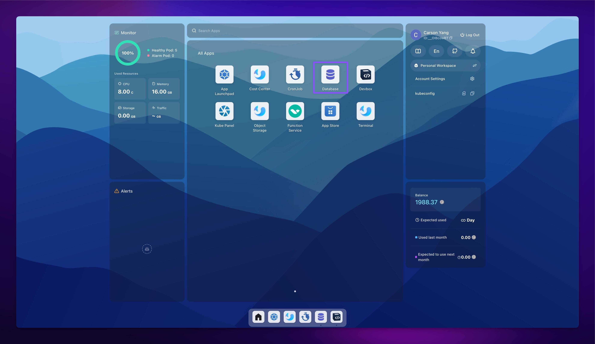

Redis is a popular, open-source in-memory data structure store that can be used as a database, cache, message broker, and queue. In Sealos DevBox, you can easily set up and connect to Redis databases for your development projects.

## Deploy Redis in Sealos

Sealos makes it easy to deploy a Redis database with just a few clicks. Follow these steps:

<h5>From the Sealos desktop, click on the "Database" icon to open the Database app.</h5>

<h5>Click on the "Create New Database" button. In the deployment form:</h5>
   - Select "Redis" as the database type.
   - Choose the desired Redis version (e.g., redis-7.0.6).
   - Enter a name for your database (use lowercase letters and numbers only).
   - Adjust the CPU and Memory sliders to set the resources for your database.
   - Set the number of replicas (1 for single-node development and testing).
   - Specify the storage size (e.g., 1 Gi).

<h5>Review the projected cost on the left sidebar. Click the "Deploy" button in the top right corner to create your Redis database.</h5>

Once deployed, Sealos will provide you with the necessary connection details.

## Connect to Redis in DevBox

Here are examples of how to connect to your Redis database using different programming languages and frameworks within your DevBox environment:

<Cards>
  <Card title="Connect to Redis with Go in Sealos DevBox" href="./redis/go" />
  <Card title="Connect to Redis with Java in Sealos DevBox" href="./redis/java" />
  <Card title="Connect to Redis with Node.js in Sealos DevBox" href="./redis/nodejs" />
  <Card title="Connect to Redis with PHP in Sealos DevBox" href="./redis/php" />
  <Card title="Connect to Redis with Python in Sealos DevBox" href="./redis/python" />
  <Card title="Connect to Redis with Rust in Sealos DevBox" href="./redis/rust" />
</Cards>