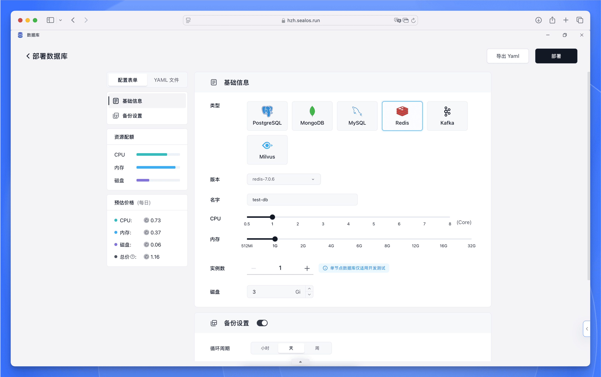
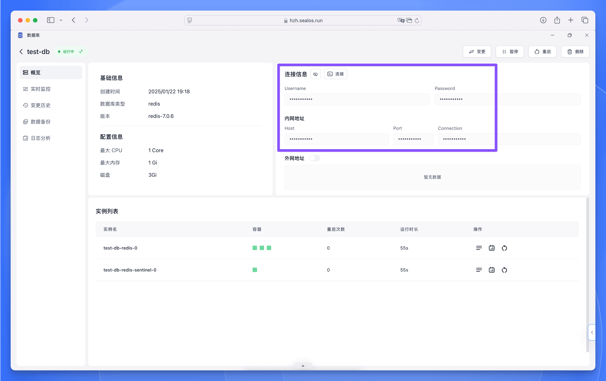

Redis 是一个开源的内存数据存储系统，可用作数据库、缓存、消息代理和队列。在 Sealos 控制台中，您可以快速部署和使用 Redis 数据库，为您的开发项目提供高性能的数据服务。

## 在 Sealos 中部署 Redis

Sealos 提供了简单直观的操作界面，只需几步即可完成 Redis 数据库的部署。具体步骤如下：

<h5>打开 [Sealos 控制台](https://cloud.sealos.run)，找到并点击"数据库"应用图标。</h5>

<h5>在数据库应用界面中，点击"新建"按钮，然后在部署表单中填写以下信息：</h5>

- 数据库类型：选择“Redis”
- 版本：选择需要的 Redis 版本 (如 redis-7.0.6)
- 数据库名称：设置数据库名称 (仅支持小写字母和数字)
- 计算资源：根据需求调整 CPU 和内存配置
- 部署模式：选择副本数量 (开发测试环境建议使用单节点)
- 存储容量：设置所需的存储空间 (如 1 Gi)

<h5>确认配置无误后，您可以在左侧边栏查看预估成本，然后点击右上角的"部署"按钮开始创建数据库。</h5>

部署完成后，系统将提供数据库的连接参数，您可以使用这些信息连接到 Redis 数据库。

## 在 Sealos DevBox 中连接 Redis

我们为不同的编程语言提供了连接 Redis 数据库的示例代码，请选择您需要的开发语言：

<Cards>
<Card title="使用 Go 连接 Redis" href="./redis/go" />
<Card title="使用 Java 连接 Redis" href="./redis/java" />
<Card title="使用 Node.js 连接 Redis" href="./redis/nodejs" />
<Card title="使用 PHP 连接 Redis" href="./redis/php" />
<Card title="使用 Python 连接 Redis" href="./redis/python" />
<Card title="使用 Rust 连接 Redis" href="./redis/rust" />
</Cards>