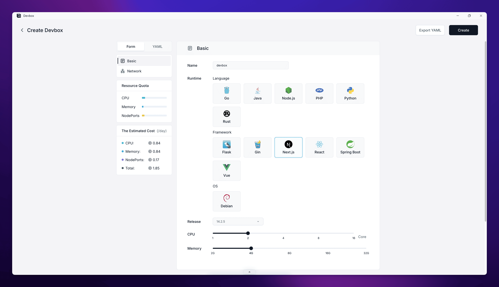
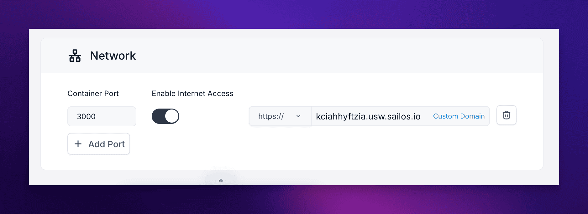

This guide will walk you through the steps to create a new project using Sealos DevBox.

## Access Sealos DevBox

1. Navigate to [Sealos Desktop](https://usw.sealos.io) in your web browser.
2. Locate and click on the "DevBox" icon.

## Create a New Project

<h4>Click on the "Create New Project" button</h4>

This will open the project creation interface where you can configure your new project.

<h4>Configure the Runtime</h4>

In the "Runtime" section:
- Choose the development framework or language for your project.
- Use the sliders to set the CPU cores and memory for your project. Adjust these based on your project's requirements.

<h4>Configure Network Settings</h4>

Scroll down to the "Network" section to set up your project's network configuration:

- **Container Port**: 
  - Enter the main port your application will use.
  - If you need additional ports, click the "Add Port" button and specify them.

- **Enable Internet Access**:
  - Toggle the switch to enable internet access for your DevBox. This allows external users to access your application through the public internet using the provided domain.

- **Domain**:
  - By default, Sealos provides a subdomain for your application.
  - If you want to use a custom domain, click on "Custom Domain" and follow the instructions to set it up.

<h4>Create Your Project</h4>

After configuring all the settings, click on the "Create" button to create your project.

## What Happens Next?

After creating your project, Sealos DevBox will set up the development environment based on your configurations. This process includes:

1. Provisioning the necessary resources (CPU, memory) for your project.
2. Setting up the chosen framework or language environment.
3. Configuring the network settings and domain.

Once the setup is complete, your project will appear in the DevBox List, where you can manage and access it.

## Next Steps

After creating your project, you're ready to start developing. The next step is to connect to your project using an IDE and begin building your application. Refer to the "Develop" guide for detailed instructions on how to connect and start coding.