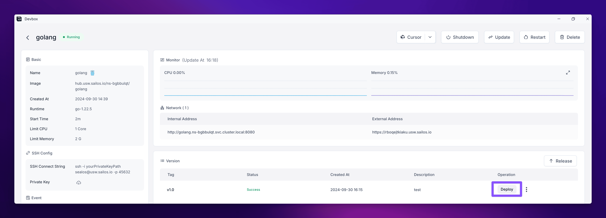
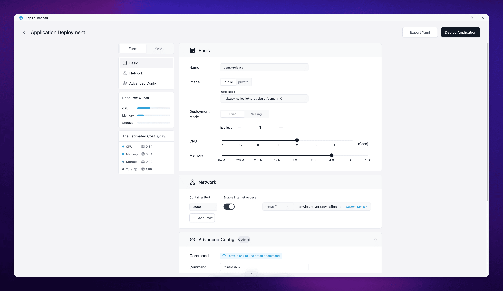

After releasing your application as an OCI image, the next step is to deploy it to [Sealos Cloud](https://usw.sealos.io) for production use. This guide will walk you through the deployment process using App Launchpad.

## Initiate Deployment

<h4>Access Project Details</h4>

- Go to the Sealos DevBox List in your [Sealos Desktop](https://usw.sealos.io).
- Find your project and click on the "Detail" button on the right side of your project's row.

<h4>Select Release Version</h4>

In your project's details page:
- Locate the "Version" section.
- Find the release you want to deploy.
- Click the "Deploy" button in the "Operation" column next to your chosen release.

<h4>Navigate to App Launchpad</h4>

Clicking "Deploy" will redirect you to the App Launchpad application within Sealos.

## Configure Deployment Settings

In the App Launchpad application, you'll need to configure your application settings:

<h4>Set Resource Limits</h4>

Configure the resources for your application:
- CPU allocation
- Memory allocation
- Storage requirements

<h4>Configure Environment Variables</h4>

If your application requires specific environment variables:
- Add each variable with its corresponding value.
- Ensure sensitive information is properly secured.

<h4>Set Up Volumes (if needed)</h4>

If your application requires persistent storage:
- Configure any necessary volumes.
- Specify mount paths for these volumes.

<h4>Network Configuration</h4>

Set up your application's network configuration:
- Specify the container port your application listens on.
- Configure any additional ports if required.

<h4>Review Settings</h4>

Carefully review all the settings you've configured to ensure they match your application's requirements.

## Deploy Your Application

<h4>Initiate Deployment</h4>

Once you've configured all necessary settings, click the "Deploy Application" button in the top right corner to start the deployment process.

<h4>Monitor Deployment Progress</h4>

You'll be taken to the application details view within App Launchpad. Here, you can monitor the deployment progress.

<h4>Verify Deployment</h4>

Once the status changes to "Running", your application is successfully deployed.

<h4>Access Your Deployed Application</h4>

- Look for the "Public Address" in the application details.
- Click on this address to open your deployed application in a new browser tab.

<Callout type="info">
  Remember that you can always update your application by creating a new release in DevBox and repeating this deployment process with the new version using App Launchpad.
</Callout>

## Conclusion

Congratulations! You've now completed the fundamental workflow of developing and deploying an application using Sealos DevBox. Let's recap the key steps we've covered:

1. **Create a Project**: We started by setting up a new project in Sealos DevBox, configuring the runtime and network settings.

2. **Develop**: We connected to our development environment using Cursor IDE and wrote our application code.

3. **Release**: We prepared our application for release, created an OCI image, and versioned our project.

4. **Deploy**: Finally, we deployed our application to Sealos Cloud using App Launchpad, making it accessible to users.

This workflow demonstrates the power and flexibility of Sealos DevBox in streamlining the entire development process, from initial setup to final deployment. By leveraging cloud-based development environments and containerization, Sealos DevBox enables developers to create, test, and deploy applications more efficiently than ever before.

As you continue to use Sealos DevBox, you'll discover more advanced features and optimizations that can further enhance your development workflow.

Happy coding, and may your deployments always be smooth and successful!