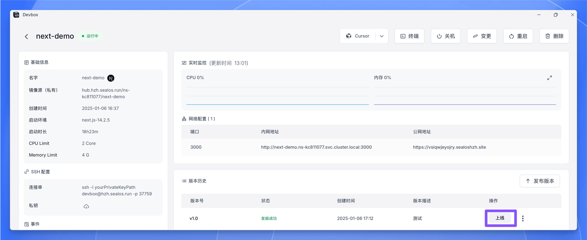
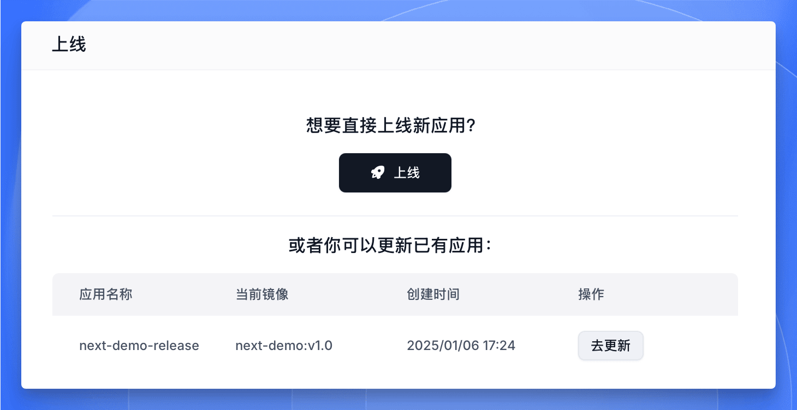

在完成应用程序的开发并将其发布为 OCI (Open Container Initiative) 镜像后，下一步就是将其部署到 [Sealos Cloud](https://cloud.sealos.run) 生产环境中。本指南将介绍如何使用[【应用管理】](/docs/guides/deployments)功能轻松完成部署流程。

## 开始部署

<h4>查看项目详情</h4>

- 登录 [Sealos 控制台](https://cloud.sealos.run)，进入 Sealos DevBox 项目列表
- 找到你要部署的项目，点击右侧的“详情”按钮

<h4>选择发布版本</h4>

在项目详情页面中：
- 找到“版本列表”区域
- 从版本列表中选择要部署的版本
- 在该版本的“操作”列中点击“上线”按钮

<h4>进入应用管理</h4>

点击“上线”后，系统会自动跳转到 Sealos 的【应用管理】界面，在这里你可以完成具体的部署配置。

## 配置部署参数

在【应用管理】界面中，你需要为应用配置以下运行参数：

<h4>设置资源配额</h4>

为确保应用稳定运行，需要合理分配计算资源：
- CPU 使用限制
- 内存分配大小
- 存储空间配额

<h4>配置环境变量</h4>

如果你的应用依赖特定的环境变量：
- 添加所需的环境变量及其对应值
- 确保敏感信息得到妥善保护

<h4>配置持久化存储</h4>

如果应用需要持久化数据：
- 创建所需的存储卷
- 设置存储卷的挂载路径

<h4>设置网络配置</h4>

配置应用的网络访问：
- 设置容器对外暴露的端口
- 根据需要添加其他端口映射

<h4>检查配置</h4>

在启动部署前，仔细检查所有配置项，确保它们符合应用的运行需求。

## 部署你的应用

<h4>开始部署</h4>

完成所有配置后，点击右上角的“部署应用”按钮，系统将开始执行部署流程。

<h4>查看部署状态</h4>

系统会自动跳转到应用详情页面，你可以在这里实时监控部署进度。

<h4>确认部署成功</h4>

当应用状态显示为“running”时，表示部署已经成功完成。

<h4>访问应用</h4>

- 在应用详情页面找到“公网地址”
- 点击该地址，即可在浏览器中访问已部署的应用

<Callout type="info">
需要更新应用时，你可以随时在 DevBox 中发布新版本，在弹出的窗口中，你可以选择更新已部署的应用，也可以选择创建新应用。

</Callout>

## 总结

至此，你已经完成了使用 Sealos DevBox 进行应用开发和部署的完整工作流程。让我们回顾一下关键步骤：

1. **[创建项目](./create-a-project)**：在 Sealos DevBox 中创建项目，配置开发环境。
2. **[开发调试](./develop)**：使用 Cursor IDE 进行代码开发和测试。
3. **[发布版本](./release)**：将应用打包为 OCI 镜像，实现版本管理。
4. **[部署上线](./deploy)**：通过应用管理功能，将应用部署到生产环境。

这套工作流程展示了 Sealos DevBox 在简化开发部署流程方面的强大能力。通过云端开发环境和容器化技术，开发者可以更高效地完成从开发到部署的全过程。

随着你对 Sealos DevBox 的深入使用，还可以探索更多高级功能，进一步优化你的开发工作流程。

祝你开发顺利，部署成功！