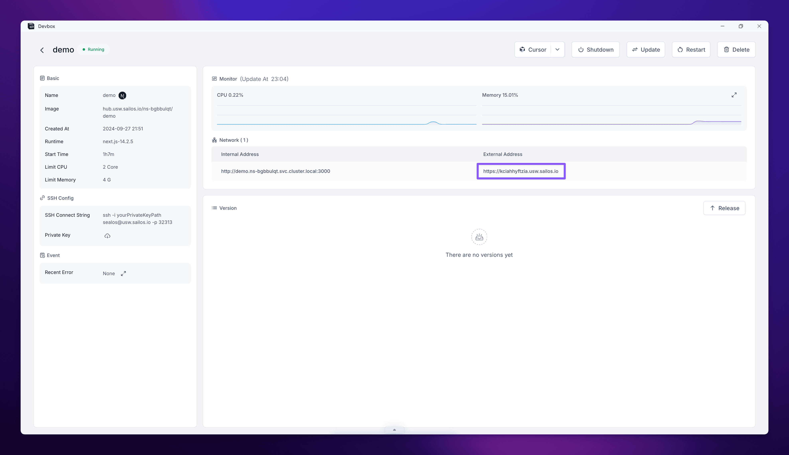
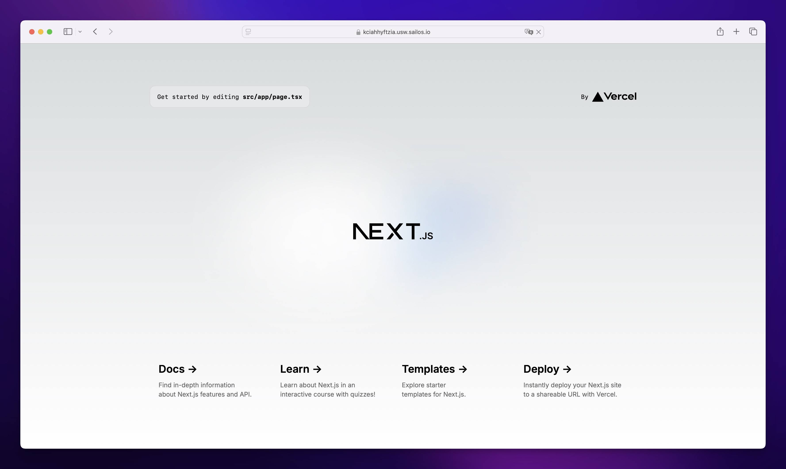

After creating your project in Sealos DevBox, you're ready to start development. This guide will walk you through the process of connecting to your development environment using Cursor IDE and running your application.

## Connect to Your Development Environment

<div className='steps [&_h4]:step'>

<h4>Access the DevBox List</h4>

Navigate to the Sealos DevBox List in your [Sealos Desktop](https://usw.sealos.io).

<h4>Connect with Cursor IDE</h4>

- Find your project in the DevBox List.
- In the "Operation" column, click on the dropdown arrow next to the VSCode icon.
- From the dropdown menu, select "Cursor".
- Click on the "Cursor" option that appears.

<h4>Install the DevBox Plugin</h4>

- When you click on "Cursor", it will launch the Cursor IDE application on your local machine.
- A popup window will appear in Cursor, prompting you to install the DevBox plugin.
- Follow the instructions in the Cursor popup to install the DevBox plugin.
- Once installed, Cursor will establish a remote connection to your DevBox runtime.

</div>

<Callout type="info">
  You can switch between different IDE options (VSCode, Cursor, or VSCode Insiders) at any time by using the dropdown menu in the "Operation" column.
</Callout>

## Develop

Once connected, you'll be able to access and edit your project files directly within the Cursor IDE environment.


This remote connection offers several benefits:
- Your code runs in the DevBox runtime, ensuring consistency across development and production environments.
- You can access your project from anywhere, on any device with Cursor installed.
- Collaboration becomes easier as team members can connect to the same DevBox runtime.

## Run Your Application

<div className='steps [&_h4]:step'>

<h4>Open the Terminal</h4>

Open the terminal within Cursor IDE.

<h4>Navigate to Your Project Directory</h4>

If you're not already there, navigate to your project directory.

<h4>Start Your Development Server</h4>

Run the appropriate command to start your development server. For example, if you're using Next.js:

```bash
npm run dev
```

This command will start your application in development mode.

</div>

## Access Your Running Application

<div className='steps [&_h4]:step'>

<h4>Return to the Sealos DevBox List</h4>

Go back to the Sealos DevBox List in your browser.

<h4>Access Project Details</h4>

Find the project you just created and click on the "Detail" button on the right side of your project's row.

<h4>Find the External Address</h4>

In the project details page:
- Look for the "Network" section.
- You'll see an "External Address" field.
- Click on this external address.



<h4>View Your Application</h4>

This will open your application in a new browser tab, allowing you to view and interact with your running service.



</div>

## Next Steps

As you develop your project, you'll eventually want to release and deploy it. Check out the "Release" and "Deploy" guides for information on these next steps in your project's lifecycle.