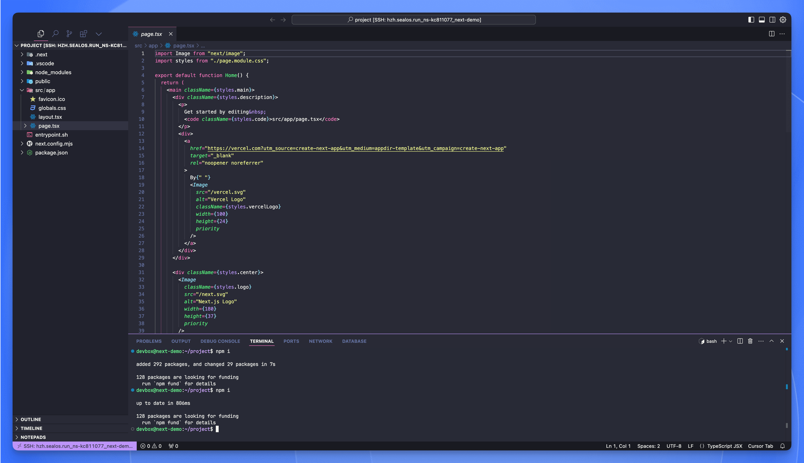
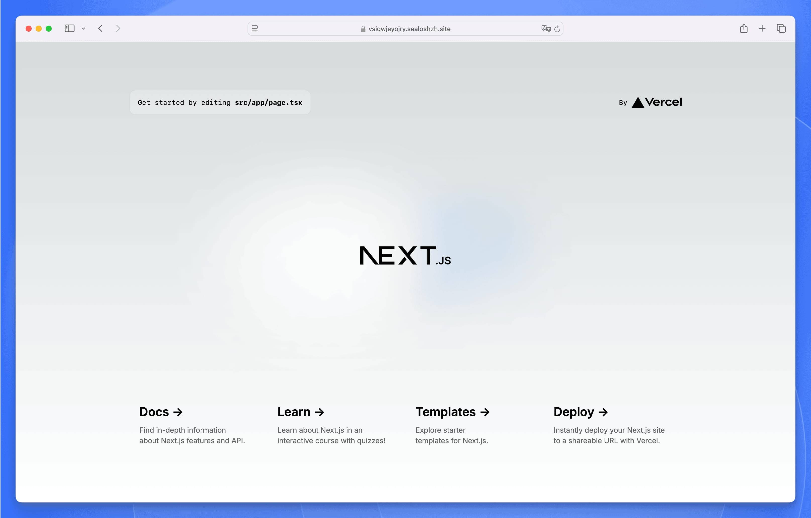

[在 Sealos DevBox 中创建项目](./create-a-project)后，您就可以开始进行开发工作了。本指南将介绍如何使用 Cursor IDE 连接开发环境并运行应用程序。

## 连接开发环境

<div className='steps [&_h4]:step'>

<h4>访问 DevBox 列表</h4>

在 [Sealos 控制台](https://cloud.sealos.run) 中导航至 DevBox 项目列表。

<h4>使用 Cursor IDE 连接</h4>

- 在项目列表中找到您的项目。
- 在"操作"列中，点击 VSCode 图标旁边的下拉箭头。
- 从下拉菜单中选择"Cursor"选项。
- 点击出现的"Cursor"选项。

<h4>安装 DevBox 插件</h4>

- 点击"Cursor"后，系统会自动在您的本地计算机上启动 Cursor IDE。
- Cursor 会弹出提示窗口，引导您安装 DevBox 插件。
- 按照提示完成插件安装。
- 安装完成后，Cursor 将自动与您的 DevBox 开发环境建立远程连接。

</div>

<Callout type="info">
您可以随时通过"操作"列中的下拉菜单切换不同的 IDE（VSCode、Cursor 或 VSCode Insiders）。
</Callout>

## 开发

成功建立连接后，您就可以直接在 Cursor IDE 中访问和编辑项目文件了。



这种远程开发模式具有以下优势：

- 代码在 DevBox 环境中运行，确保开发环境与生产环境的一致性。
- 只需安装 Cursor，即可在任何设备上随时随地进行开发。
- 团队成员可以连接到同一个开发环境，实现便捷的协作开发。

## 运行应用程序

<div className='steps [&_h4]:step'>

<h4>打开终端</h4>

在 Cursor IDE 中打开终端窗口。

<h4>进入项目目录</h4>

如果尚未在项目目录下，请先切换到项目目录。

<h4>启动开发服务器</h4>

运行相应的命令来启动开发服务器。例如，如果您使用的是 Next.js：

```bash
npm run dev
```

此命令将以开发模式启动您的应用程序。

</div>

## 访问运行中的应用

- 切换到 Cursor 面板的 "Network" 标签页。
- 点击地址栏右侧的 🌐 按钮。
   
- 在弹窗中选择 "Open"，即可在浏览器中打开并测试运行中的应用。
   

## 下一步操作

完成项目开发后，您需要将其发布并部署。请查看"[发版](./release)"和"[部署](./deploy)"章节，了解项目生命周期中这些重要环节的详细信息。
