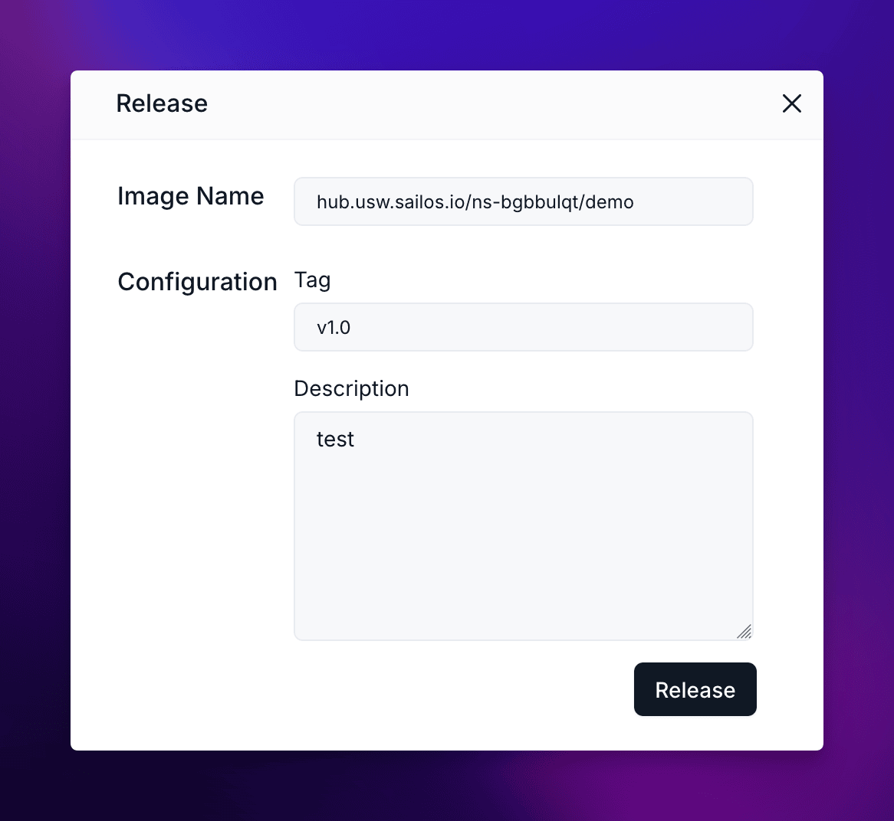

After you've developed and tested your application, the next step is to release it as an OCI (Open Container Initiative) image. This process allows you to version your application and prepare it for deployment.

## Prepare Your Application for Release

<div className='steps [&_h4]:step'>

<h4>Open the Terminal in Cursor IDE</h4>

In the Cursor IDE terminal, navigate to your project directory if you're not already there.

<h4>Prepare Your Application (if necessary)</h4>

Depending on your project's language or framework, you may need to prepare your application for release. This step varies widely between different technologies:

- For compiled languages (e.g., Java, Go):
  Run your build command (e.g., `mvn package`, `go build`)
- For interpreted languages with build steps (e.g., TypeScript, some JavaScript frameworks):
  Run your build or transpilation command (e.g., `npm run build`, `tsc`)
- For interpreted languages without build steps (e.g., Python, Ruby):
  Ensure all dependencies are listed in your requirements file (e.g., `requirements.txt`, `Gemfile`)

If your project doesn't require any preparation, you can skip this step.

<h4>Review and Update entrypoint.sh</h4>

Each Devbox project has an `entrypoint.sh` file that contains the startup command for your OCI image. It's crucial to review and, if necessary, update this file:

1. Open the `entrypoint.sh` file in your project directory.
2. Review the startup command. It should correctly start your application.
3. If needed, modify the command to match your application's requirements.

For example, a Java application might have:

```bash
#!/bin/bash
java -jar your-application.jar
```

While a Python application might have:

```bash
#!/bin/bash
python your_main_script.py
```

Ensure this file is executable by running:

```bash
chmod +x entrypoint.sh
```

<Callout type="info">
  The `entrypoint.sh` file is crucial for your application's startup in the OCI image. Make sure it correctly launches your application before proceeding with the release.
</Callout>

</div>

## Release as OCI Image

<div className='steps [&_h4]:step'>

<h4>Access Project Details</h4>

- Go to the Sailos Devbox List in your browser.
- Find your project and click on the "Detail" button on the right side of your project's row.

<h4>Initiate Release Process</h4>

On the project details page:
- Look for the "Version" section.
- Click on the "Release" button located in the top right corner of the "Version" section.

<h4>Configure Release Details</h4>

In the "Release" dialog box that appears, provide the following information:
- **Image Name**: This field is pre-filled with your project's image name.
- **Tag**: Enter a version tag for your release (e.g., v1.0).
- **Description**: Provide a brief description of this release (e.g., "Initial release" or "Feature update: user authentication").



<h4>Complete the Release</h4>

After filling in the required information, click the "Release" button at the bottom of the dialog box.

<h4>Verify the Release</h4>

Once the release process is complete, you'll see a new entry in the "Version" section of your project details page. This entry will show:
- The tag you assigned
- The status of the release
- The creation time
- The description you provided


</div>

## Best Practices for Releasing

1. **Semantic Versioning**: Consider using semantic versioning (e.g., v1.0.0) for your tags. This helps in tracking major, minor, and patch releases.

2. **Descriptive Releases**: Provide clear and concise descriptions for each release. This helps team members understand what changes or features are included in each version.

3. **Regular Releases**: Create new releases whenever you make significant changes or reach important milestones in your project. This practice helps in maintaining a clear history of your application's development.

4. **Pre-release Testing**: Always thoroughly test your application before creating a release. This ensures that the released version is stable and ready for deployment.

5. **Consistent Build Process**: Ensure your build process is consistent and reproducible. Consider using build scripts or Makefiles to standardize the build process across your team.

## Next Steps

After successfully releasing your application as an OCI image, you're ready to move on to the deployment phase. The OCI image you've created can be used for deployment or shared with other team members. 

Check out the "Deploy" guide for information on how to deploy your released application to a production environment.
