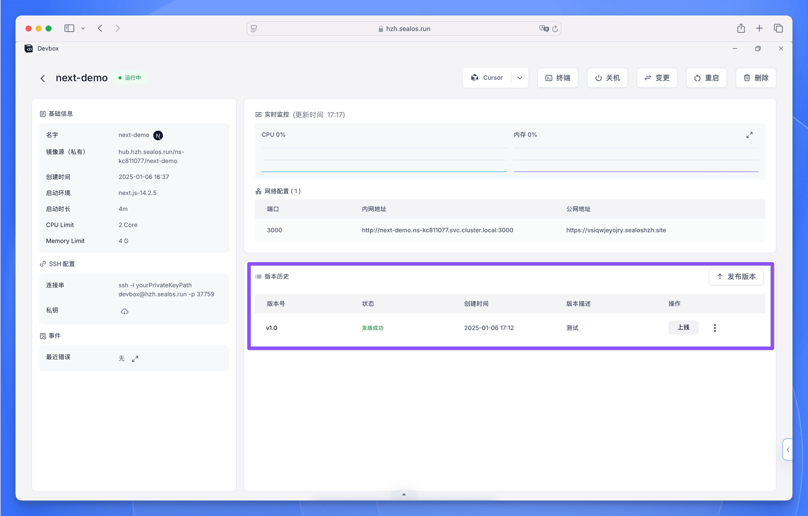

完成应用程序的开发和测试后，接下来需要将其发布为 OCI (Open Container Initiative) 镜像。通过这个过程，你可以对应用程序进行版本管理，为后续部署做好准备。

## 准备应用程序发布

<div className='steps [&_h4]:step'>

<h4>打开 Cursor IDE 终端</h4>

在 Cursor IDE 终端中，如果还没有进入项目目录，请先切换到相应目录。

<h4>准备应用程序（如需要）</h4>

根据项目所用的编程语言或框架，你可能需要准备应用程序以进行发布。这个步骤会因技术选型的不同而存在较大差异：

- 编译型语言 (如 Java、Go)：
执行构建命令 (如 `mvn package`、`go build`)
- 需要构建步骤的解释型语言 (如 TypeScript、部分 JavaScript 框架)：
执行构建或转译命令 (如 `npm run build`、`tsc`)
- 无需构建步骤的解释型语言 (如 Python、Ruby)：
确保所有依赖都已列在依赖文件中 (如 `requirements.txt`、`Gemfile`)

如果你的项目不需要特别的准备工作，可以跳过这一步。

<h4>检查和更新 entrypoint.sh</h4>

每个 DevBox 项目都有一个 `entrypoint.sh` 文件，其中包含了 OCI 镜像的启动命令。在发布前，请务必检查并在必要时更新此文件：

1. 在项目目录中打开 `entrypoint.sh` 文件
2. 检查启动命令是否正确
3. 如有需要，根据应用程序的要求修改命令

以下是一些示例：

Java 应用程序的示例：

```bash
#!/bin/bash
java -jar your-application.jar
```

Python 应用程序的示例：

```bash
#!/bin/bash
python your_main_script.py
```

确保此文件具有执行权限，可以运行以下命令：

```bash
chmod +x entrypoint.sh
```

<Callout type="info">
`entrypoint.sh` 文件是应用程序在 OCI 镜像中启动的核心。发布前，请确保它能正确启动你的应用。
</Callout>

</div>

## 发布 OCI 镜像

<div className='steps [&_h4]:step'>

<h4>查看项目详情</h4>

- 用浏览器打开 Sealos DevBox 列表
- 找到你的项目，点击右侧的“详情”按钮

<h4>开始发版</h4>

在项目详情页面：
- 找到“版本历史”栏目
- 点击“版本历史”栏目右上角的“发布版本”按钮

<h4>填写发版信息</h4>

在弹出的“发布版本”窗口中，填写以下信息：
- **镜像名称**：这里已自动填入你的项目镜像名称
- **版本号**：输入发布版本号 (如：`v1.0`)
- **说明**：简要描述本次发布内容 (如：“首次发布”或“新增用户认证功能”)


<h4>完成发版</h4>

填写完必要信息后，点击对话框底部的“发版”按钮即可。

<h4>验证发版</h4>

发版完成后，你可以在项目详情页的“版本历史”区域看到一条新的记录。该记录将显示以下内容：
- 你设定的版本标签
- 当前发版状态
- 发版创建时间
- 你填写的版本说明



</div>

## 发版最佳实践

1. **语义化版本控制**：建议使用语义化的版本号 (如 `v1.0.0`) 来标记版本。这有助于清晰区分主版本、次版本和修复版本。

2. **版本说明规范**：为每次发版提供清晰简明的说明文档，帮助团队成员快速了解版本变更内容和新功能。

3. **定期发布**：在项目有重大变更或达到重要里程碑时创建新的发布版本。这有助于清晰记录应用程序的开发历程。

4. **预发布测试**：创建发布版本前，务必对应用程序进行全面测试。这样可以确保发布版本的稳定性和可部署性。

5. **构建流程标准化**：确保构建流程具有一致性和可重复性。建议使用构建脚本或 Makefiles 来规范团队的构建流程。

## 下一步操作

成功将应用程序发布为 OCI 镜像后，即可进入部署阶段。你可以将创建的 OCI 镜像用于部署或与团队成员共享。

若要了解如何将已发布的应用程序部署到生产环境，请参阅[部署](./deploy)指南。