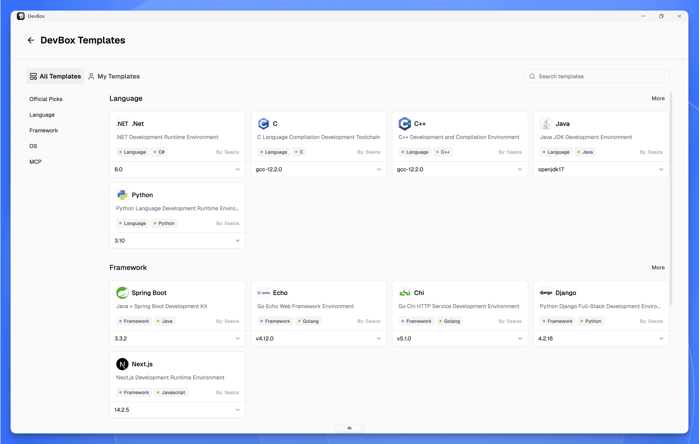
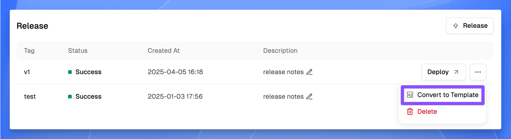
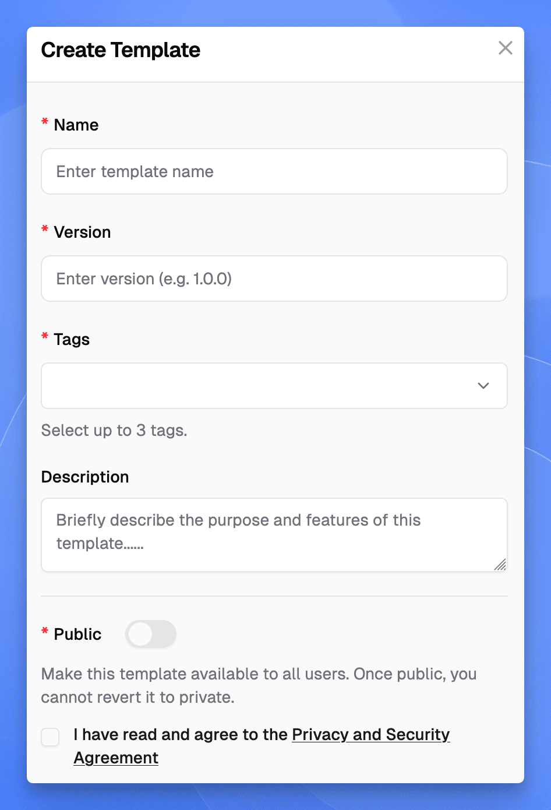
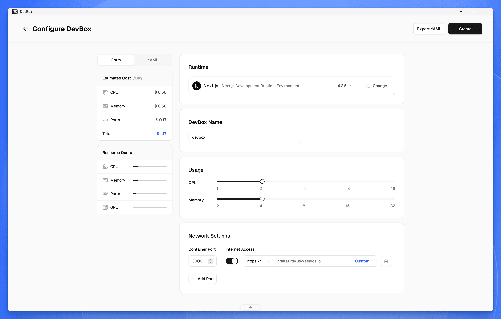
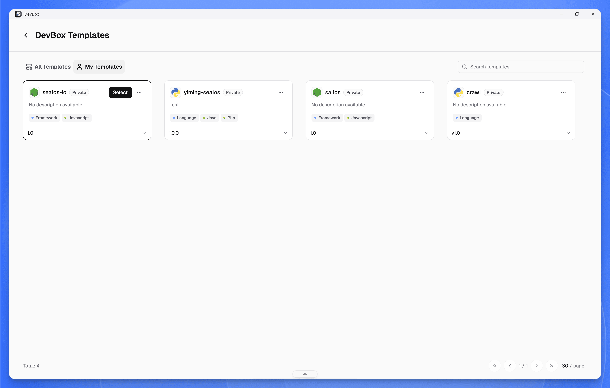

This guide walks you through the Sealos DevBox Template Market—your hub for creating, managing, and deploying DevBox runtime templates.

## What is the DevBox Template Market?

The Template Market transforms how you set up DevBox runtimes. Instead of configuring from scratch every time, you can save your perfectly tuned setups as templates and deploy them instantly whenever needed.

With the Template Market, you can:

- **Launch projects in minutes**: Skip the setup and dive straight into coding with pre-configured runtime templates.
- **Standardize team workflows**: Give your entire team the same optimized runtime, eliminating "works on my machine" issues.
- **Share proven setups**: Turn your battle-tested configurations into templates that benefit other developers.
- **Version your runtimes**: Create different template versions for various project phases or requirements.

Whether you're flying solo or leading a team, the Template Market eliminates repetitive setup tasks and accelerates your development workflow.

The DevBox Template Market offers two template types:

- **Public templates**: Community-shared templates accessible to all users for creating common DevBox runtimes.
- **Private templates**: Your personal templates, visible only to you.

## Creating Templates

<h4>Select a Version</h4>

1. Navigate to your project details page and click "Version History"
2. Locate the version you want to convert into a template
3. Click the "More" button (three dots) next to that version
4. Select "Convert to Template"

<h4>Configure Template Details</h4>

Fill out the template creation form:

- **Name**: Choose a descriptive name for your template
- **Version**: Set the template version (e.g., v1.0.0)
- **Public**: Decide who can use your template
  - Enable: Available to all users
  - Disable: Only you can access it
- **Tags**: Select 1-3 tags to categorize your template
  - Use cases (e.g., Blog, Operating System, Tools)
  - Programming languages (e.g., Python, Java, Go)
- **Description**: Briefly explain what your template does and when to use it

<h4>Finalize Creation</h4>

Review your settings and click "Create" to publish your template.

## Creating Environments from Templates

<h4>Choose a Template</h4>

When creating a new project, browse and select the template that fits your needs
   - "All Templates": Browse public community templates
   - "My Templates": Access your private templates

<h4>Apply the Template</h4>

After selecting a template:

1. The template appears under the "Runtime" tab
2. Configure additional project parameters (resources, networking, etc.)
3. Complete the standard project creation flow

## Managing Private Templates

The "My Templates" page lets you:
- View all your private templates
- Launch new runtimes from templates
- Manage existing templates

Note: Once you make a template public, you cannot make it private again.

## Next Steps

With your templates ready, you can:
- Spin up new DevBox runtimes in seconds
- Share public templates with your team
- Create multiple template versions for different use cases

Check out the "[Develop](./develop)" section to learn how to start coding in your newly created runtimes.