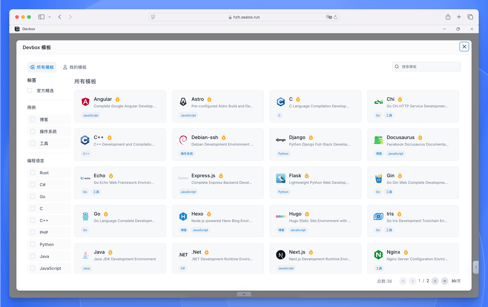
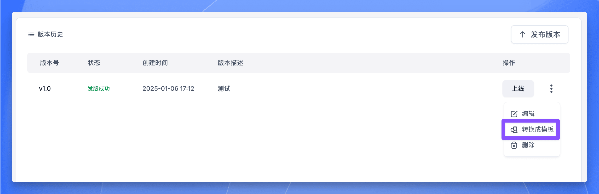
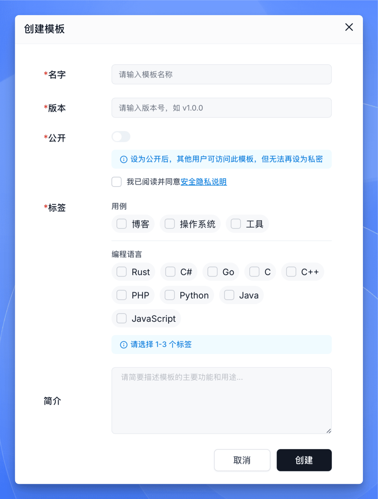
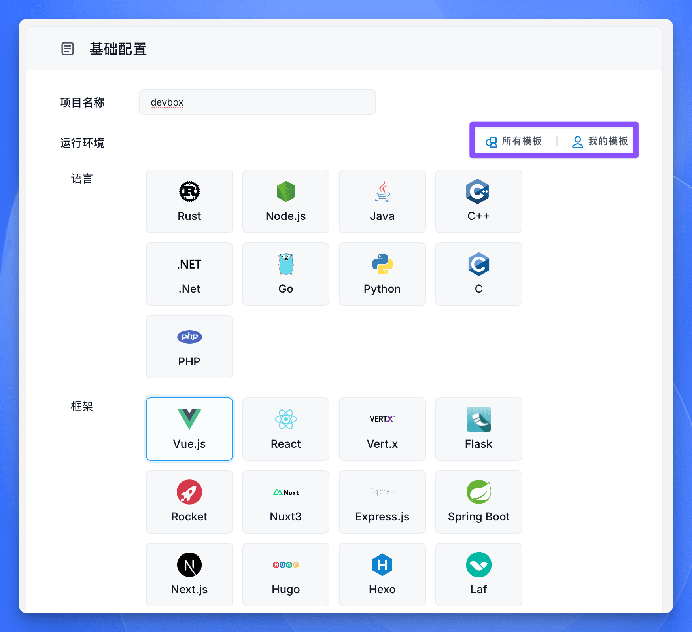
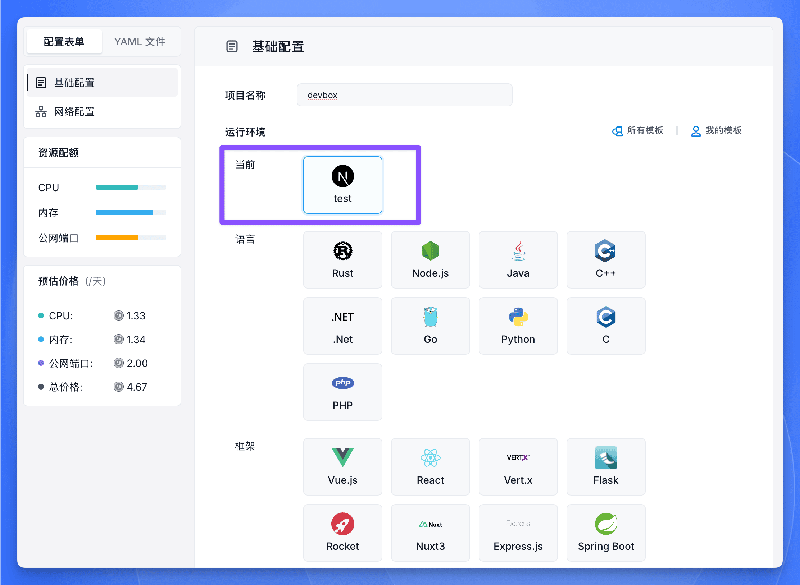
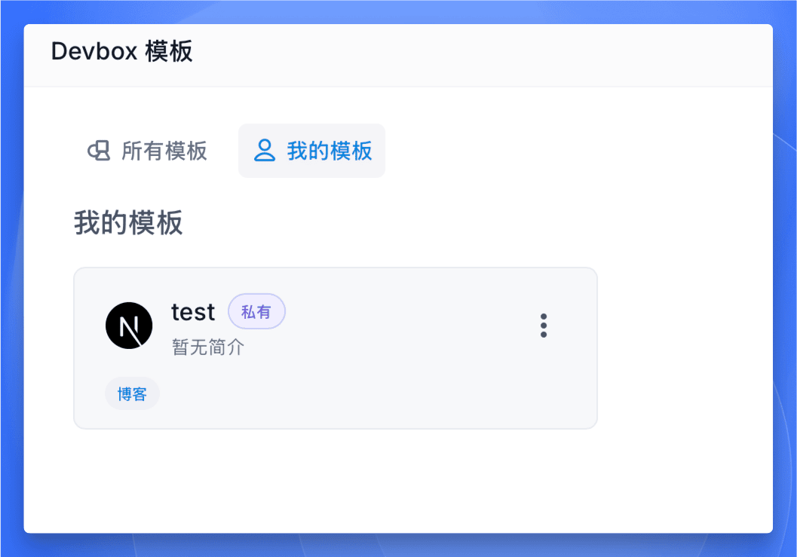

本指南将为您介绍如何使用 Sealos DevBox 模板市场来创建、管理和使用开发环境模板。

## 什么是 DevBox 模板市场？

模板市场是 Sealos DevBox 提供的一个强大功能，它允许您将配置好的开发环境保存为模板，并在需要时快速复用。通过模板市场，您可以：

- **快速启动项目**：使用预配置的开发环境模板，几分钟内即可开始编码。
- **统一团队环境**：为团队提供标准化的开发环境，确保所有成员使用相同的配置。
- **分享最佳实践**：将优化过的开发环境配置分享给其他开发者。
- **版本化管理**：为不同的项目阶段或需求创建不同版本的环境模板。

无论是个人开发还是团队协作，模板市场都能帮助您省去重复配置环境的时间，提高开发效率。

DevBox 模板市场提供两种类型的模板：

- **公共模板**：所有用户可见的模板，可用于快速创建常用开发环境。
- **私有模板**：用户自己创建的私有模板，仅创建者可见。

## 创建模板

<h4>选择版本</h4>

1. 在项目详情页面，点击“版本历史”
2. 找到想要转换为模板的版本
3. 点击该版本右侧的“更多”按钮 (三个点)
4. 选择“转换为模板”选项

<h4>配置模板信息</h4>

在模板创建表单中填写以下信息：

- **名字**：为模板取一个描述性的名称
- **版本**：设置模板版本号 (如 v1.0.0)
- **公开性**：选择是否将模板公开
  - 公开：所有用户可见
  - 私有：仅自己可见
- **标签**：选择 1-3 个标签来分类您的模板
  - 用例 (如：博客、操作系统、工具等)
  - 编程语言 (如：Python、Java、Go 等)
- **简介**：简要描述模板的主要功能和用途

<h4>完成创建</h4>

确认信息无误后，点击“创建”按钮完成模板创建。

## 使用模板创建环境

<h4>选择模板</h4>

在创建新项目时：

1. 点击“运行环境”区域的“所有模板”或“我的模板”
2. 浏览并选择合适的模板
   - “所有模板”：查看公共模板
   - “我的模板”：查看您的私有模板

<h4>应用模板</h4>

选择模板后：

1. 模板将显示在“当前”选项下
2. 继续配置其他项目参数 (如资源配置、网络设置等)
3. 按照常规项目创建流程完成环境创建

## 管理私有模板

您可以在“我的模板”页面：
- 查看所有私有模板
- 使用模板创建新环境
- 管理现有模板

注意：将模板设置为公开后，将无法再改为私有。

## 下一步操作

模板创建完成后，您可以：
- 使用模板快速创建新的开发环境
- 与团队分享公共模板
- 基于不同版本创建更多模板

建议您查看“[开发](./develop)”章节，了解如何在新创建的环境中开始开发工作。