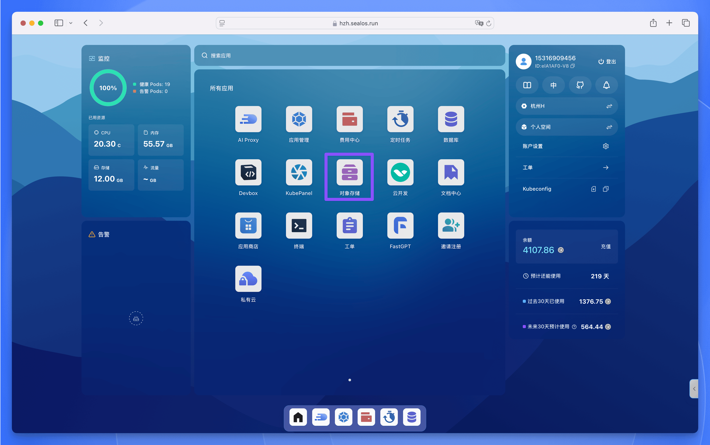
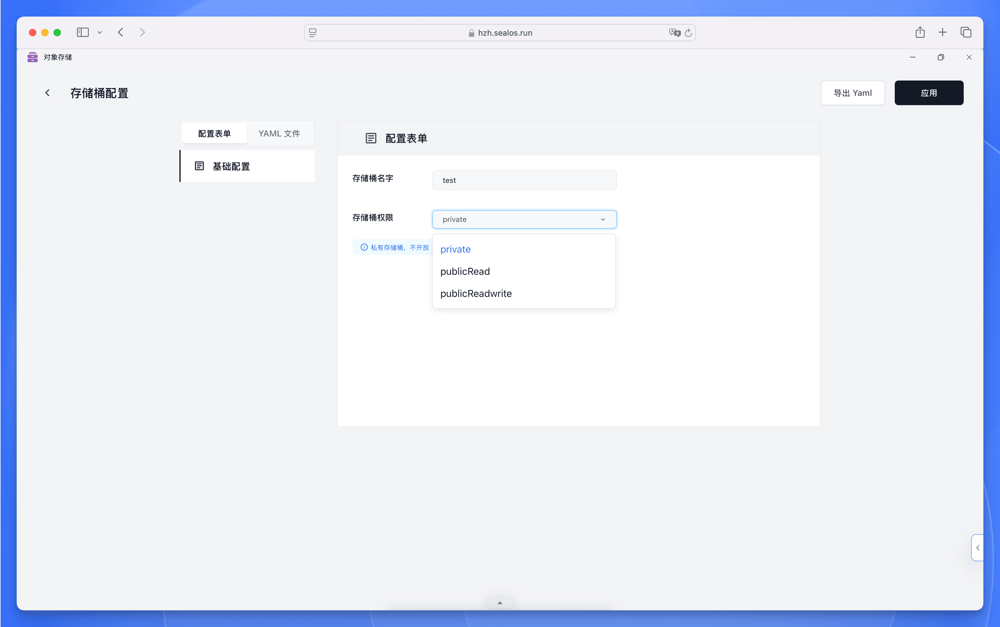
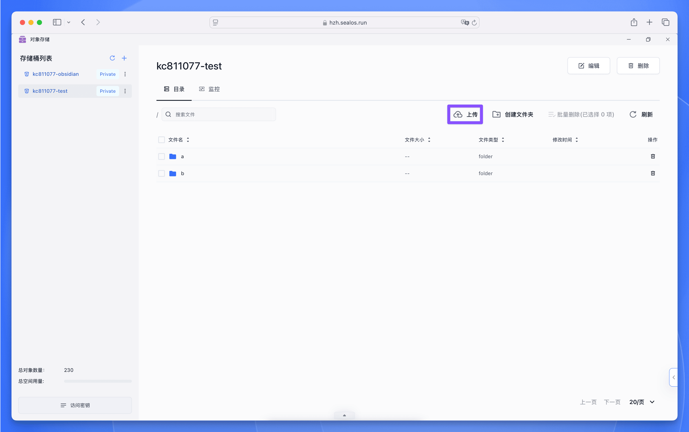
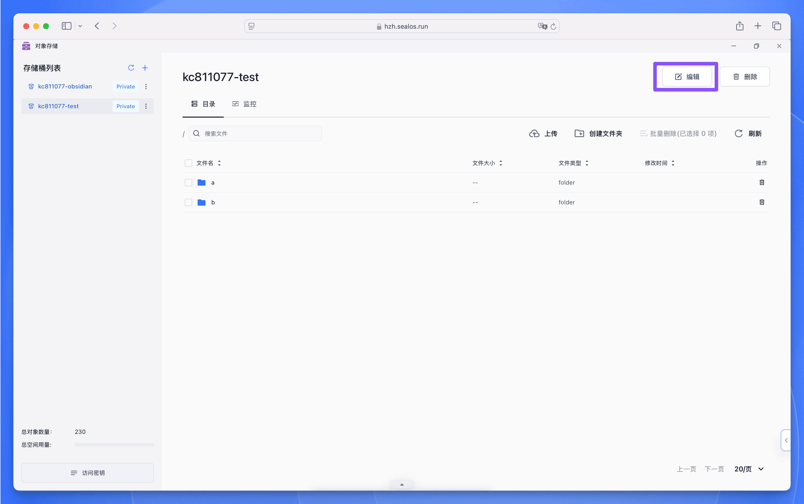
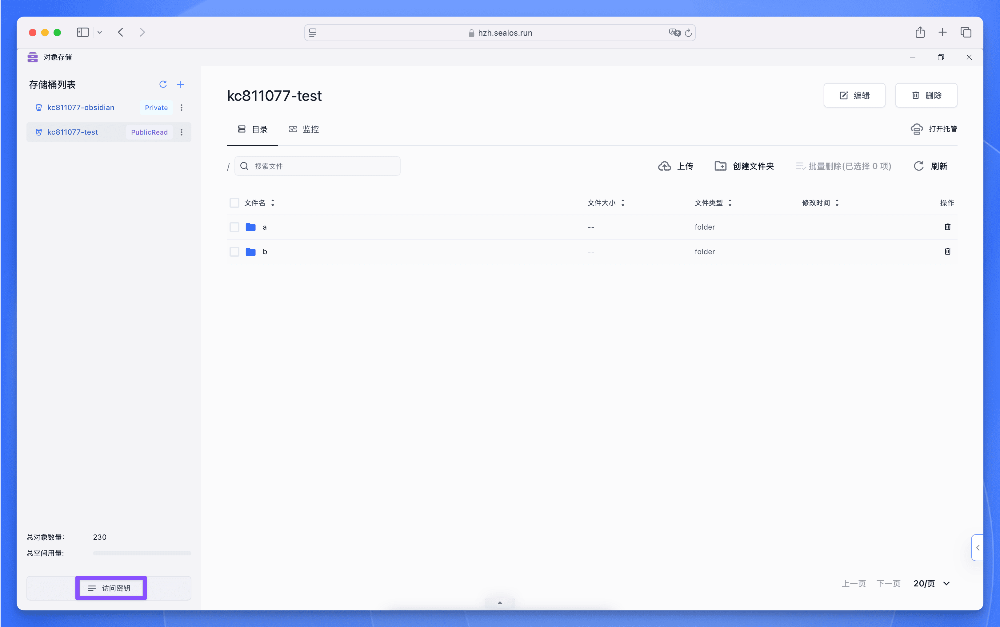
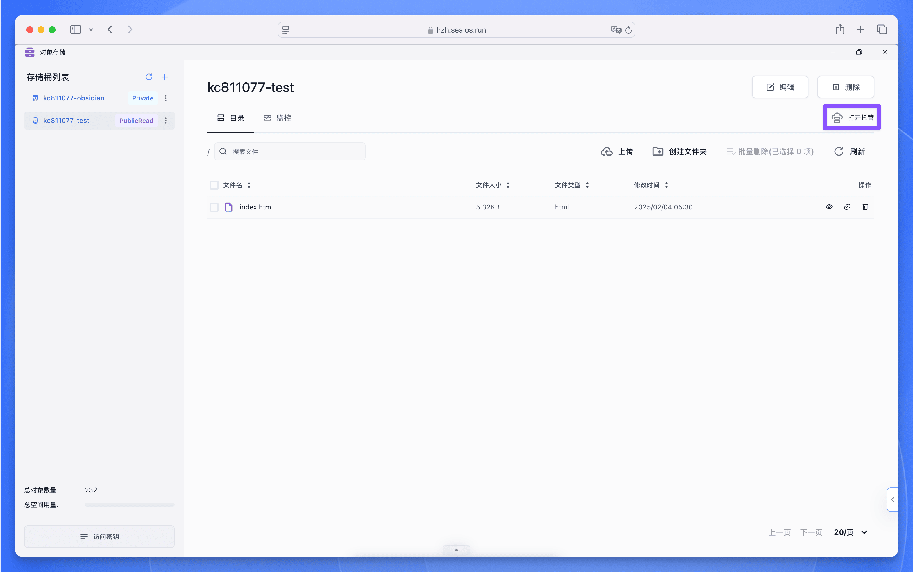
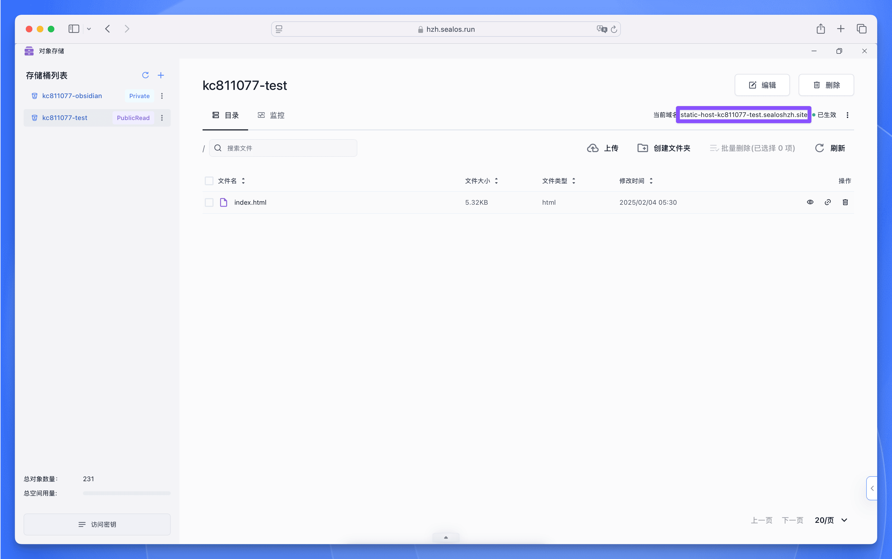
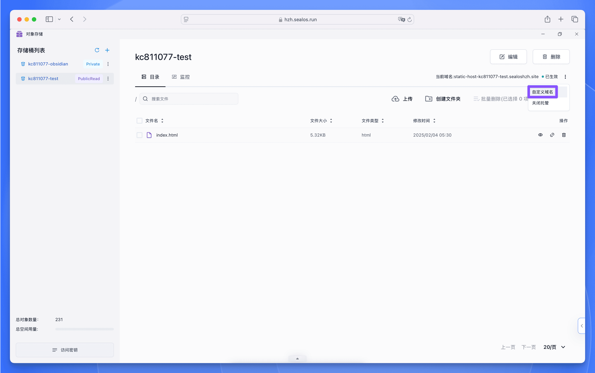

【对象存储】是 Sealos 内置的对象存储服务，主要用于存储和管理非结构化数据。它提供了安全、可靠、高性能的云存储解决方案，支持从小型应用到大规模分布式系统的各类存储需求。

目前对象存储具备以下功能：

- 上传文件到存储桶；
- 从存储桶下载文件；
- 公开存储桶的访问权限；
- 使用 SDK 访问存储桶；
- 监控存储桶资源指标；
- 静态托管。

## 基本使用

### 创建存储桶

打开 [Sealos 控制台](https://cloud.sealos.run/)，找到并点击【对象存储】应用图标。



在对象存储应用界面中，点击【创建存储桶】按钮，输入存储桶名称，设置存储桶的访问权限，然后点击右上角的【应用】按钮。



<Callout type="info">
存储桶权限说明：

- **private (私有访问)**：仅允许经过身份验证的用户访问存储桶内容，适用于存储敏感数据或内部使用
- **publicRead (公共读)**：允许所有人读取存储桶内对象 (无需身份验证)，但写入操作仍需认证，适用于内容分发、静态网站托管等场景
- **publicReadWrite (公共读写)**：开放完整的读写权限 (需谨慎使用)，适用于需要临时文件共享或协作的场景，生产环境不建议开启
</Callout>

### 上传文件

Sealos 对象存储支持灵活的文件管理操作，以下是详细的上传指南：

<div className='steps [&_h4]:step'>

<h4>进入目标存储桶</h4>

1. 进入【对象存储】应用界面
2. 在存储桶列表中选择目标存储桶
3. 导航至需要上传文件的目录 (默认为根目录)

<h4>执行上传操作</h4>

1. 点击顶部工具栏的【上传】按钮
2. 在文件 (夹) 选择器中：
   - 选择【文件】，会打开系统的文件浏览器，选择单个或多个文件进行批量上传
   - 选择【文件夹】，也会打开系统的文件浏览器，选择整个文件夹进行目录结构保持式上传
3. 点击【上传】按钮启动传输

</div>



### 修改访问权限

<div className='steps [&_h4]:step'>

<h4>进入存储桶设置</h4>

1. 进入【对象存储】应用
2. 在存储桶列表中找到并点击目标存储桶
3. 点击存储桶名称右上角的【编辑】按钮



<h4>选择权限类型</h4>

在存储桶权限设置面板中选择新的访问级别：

- **private**：仅允许通过访问密钥认证的用户访问
- **publicRead**：允许匿名用户读取对象 (推荐用于静态网站托管)
- **publicReadWrite**：允许匿名用户读写操作 (开发测试环境慎用)

确认当前存储桶中无敏感数据 (当改为公共权限时)，然后点击【应用】按钮即可生效。

</div>

### 获取访问密钥

访问密钥是访问对象存储服务的数字凭证，包含 AccessKeyID 和 SecretAccessKey。以下是获取访问密钥的完整步骤：

在存储桶列表中选择目标存储桶，点击左下角的【访问密钥】按钮。



在弹出的窗口中，可以看到当前存储桶的 Access Key、Secret Key、Internal 和 External 的值。其中 Access Key 和 Secret Key 是访问对象存储服务的凭证，Internal 是对象存储的内部访问地址，External 是对象存储的外部访问地址。


## 静态网站托管

Sealos 对象存储提供完整的静态网站托管解决方案，支持自动生成访问地址、自定义域名配置等功能。以下是配置静态网站托管的完整指南：

<div className='steps [&_h4]:step'>

<h4>创建可访问存储桶</h4>

1. 新建或选择现有存储桶，确保其访问权限设置为 **publicRead** 或 **publicReadWrite**
2. 在存储桶详情页，点击顶部工具栏的【打开托管】按钮



<h4>访问托管网站</h4>

1. 启用静态托管后，系统会自动生成访问地址
2. 点击访问地址，在新标签页打开网站
3. 确保存储桶内已上传 `index.html` 作为默认首页



<h4>配置自定义域名</h4>

1. 在存储桶右上角点击三个点，选择【自定义域名】，会直接跳转到【应用管理】的应用变更界面
2. 接下来的操作和【应用管理】的自定义域名配置一致，请参考应用管理的[自定义域名配置](/docs/guides/app-launchpad/add-a-domain)



</div>

## 使用 SDK 访问对象存储

Sealos 对象存储支持多种语言的 SDK，接下来介绍如何在 Sealos DevBox 中使用 SDK 访问对象存储。

### 准备工作

在开始之前，请确保：

- [已创建并配置好特定语言环境的 Sealos DevBox 项目](/docs/guides/fundamentals/create-a-project)
- [已在 Sealos【对象存储】应用中创建好存储桶](#创建存储桶)

### 安装 SDK

在 IDE 终端中，使用以下命令安装特定语言的 SDK：

<Tabs items={['Go', 'Java', 'Node.js', 'Python']}>
    ```bash tab="Go"
    go get github.com/minio/minio-go/v7
    ```

  <Tab value="Java">
    以 Maven 为例，在 `pom.xml` 文件中添加以下依赖：

    ```xml
    <dependency>
        <groupId>io.minio</groupId>
        <artifactId>minio</artifactId>
        <version>8.5.17</version>
    </dependency>
    ```

    如果使用 Gradle，可以在 `build.gradle` 文件中添加以下依赖：

    ```groovy
    dependencies {
        implementation 'io.minio:minio:8.5.17'
    }
    ```

    如果您没有使用任何构建工具，可以直接下载 [MinIO Java SDK 的 JAR 文件](https://repo1.maven.org/maven2/io/minio/minio/8.5.17/)，并将其添加到您的项目中。
  </Tab>

    ```bash tab="Node.js"
    npm install minio
    ```

    ```bash tab="Python"
    pip3 install minio
    ```
</Tabs>

