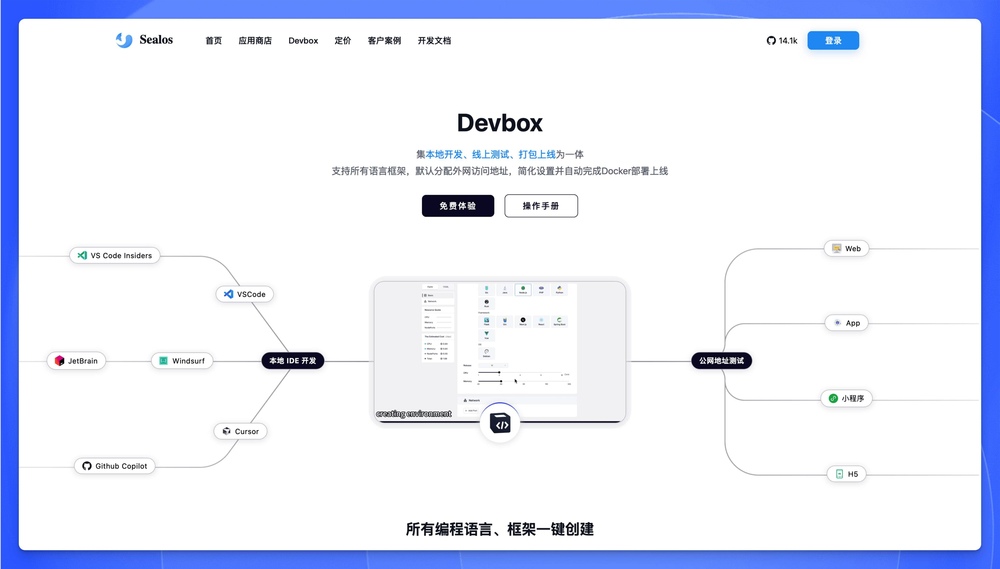
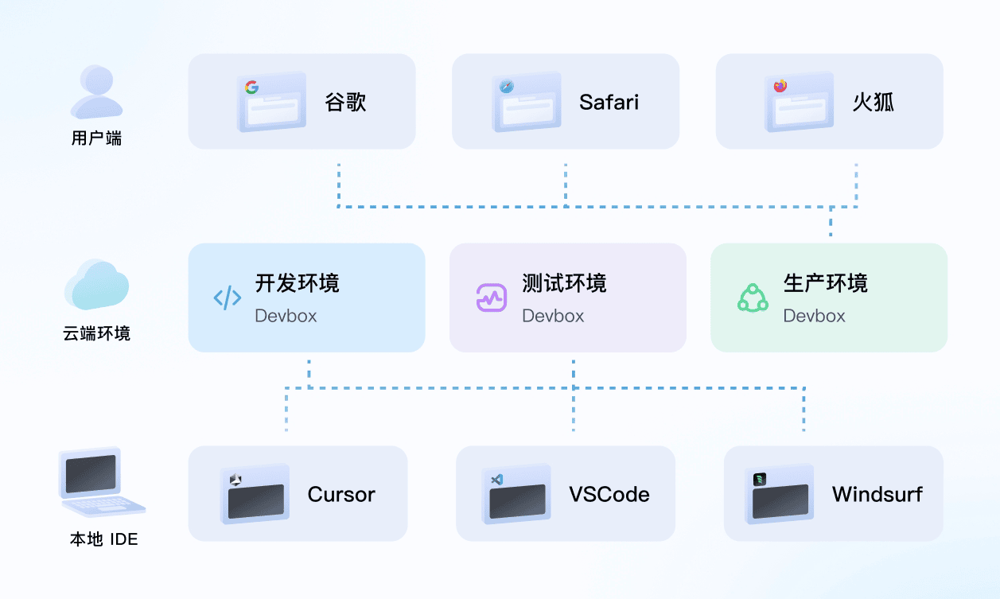

[Sealos DevBox](https://sealos.run/devbox) 是一个一站式云开发平台，将在线开发、测试和生产环境完美集成。只需一键点击，即可快速创建所需的开发环境和数据库依赖。开发者可以使用熟悉的本地 IDE（如 VSCode、Cursor、JetBrains 等）进行开发，同时享受简化的环境配置和自动化的应用部署体验。平台支持所有主流编程语言和框架，包括 Node.js、Python、Java、Go、PHP、Ruby 等，以及各类前端框架如 React、Vue、Angular 等。

## 全面的开发堆栈支持

### 统一的云开发环境

秒级创建可共享的云开发环境，减少繁琐的安装和配置过程，统一的开发、测试和生产环境，更快地进入开发状态。通过统一的团队空间，成员可以实时协作、共同编辑代码，并进行即时预览。

#### 环境一致性
所有开发者使用相同的环境配置，消除了因本地环境差异而导致的问题，确保代码在所有开发机器上都能一致运行。

#### 生产环境模拟
DevBox 提供与生产环境高度相似的测试环境配置，包括服务端、数据库、依赖项等，确保在测试阶段就能暴露潜在问题。

#### 安全稳定性
主流云厂商提供支持，具备应用级和租户级网络隔离能力，自研轻量级负载均衡器，支持数万节点集群运行。

### 在线协作开发

通过 DevBox 远程连接，项目代码线上存储，本地 AI 编码，同时支持实时协作和即时预览功能。

#### 实时预览
自动分配公网 URL，无需正式部署即可暴露给外部访问，本地代码更改可实时同步更新到公网地址。

#### 同步开发
线上代码保存，支持分布式团队开发，无需克隆项目或手动拉取更新，快速参与开发工作。

#### 团队空间
所有项目集中管理，团队成员可以便捷地查看、切换和维护多个项目，提供权限分配，隔离不同项目和团队。

### 容器化部署与运维

DevBox 深度结合现代容器技术，提供完整的部署和运维解决方案。

#### 快速迭代与容器化上线
通过一键打包 Docker 镜像与自动化的容器编排，实现从开发到生产的快速迭代和高效上线流程。

#### 完全隔离的环境
每个项目独立运行在不同环境中，支持动态资源调整，满足不同阶段（如测试、性能压力测试、生产发布）的需求，且互不干扰。

#### 弹性伸缩与快速回滚
- CPU、内存资源支持弹性伸缩，按需分配。
- 通过 Docker 镜像和版本管理，支持快速回滚到稳定版本。
- 确保生产环境的快速恢复与服务连续性。
