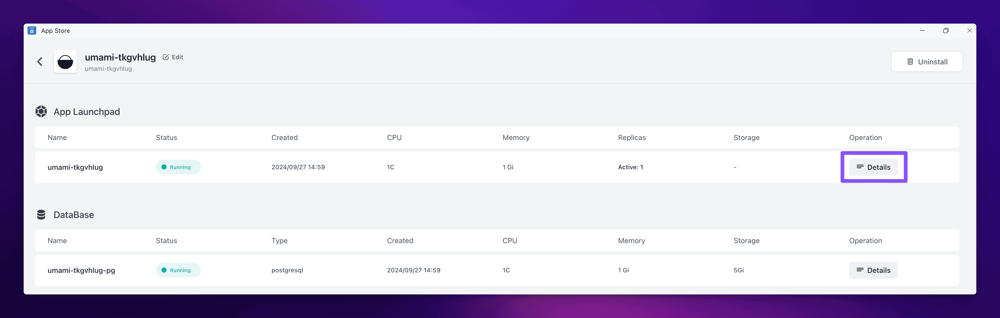
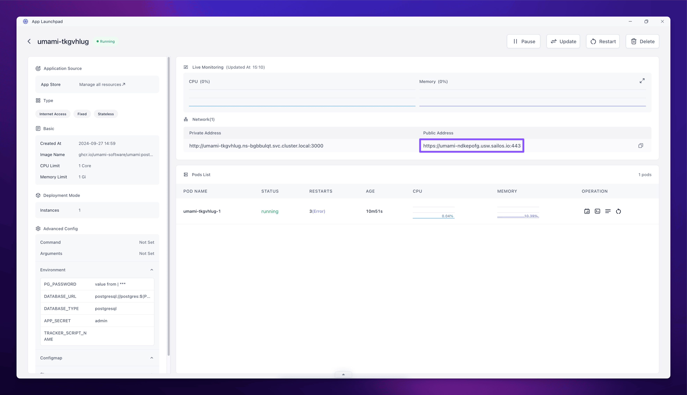

Sailos is the cloud OS for deploying, managing and scaling your applications in seconds, not minutes, not hours. By embracing a cloud-native approach, it abandons traditional cloud architectures in favor of a new Kubernetes-based model, allowing businesses to use the cloud **as easily as they use their own PCs**.

**In this guide we will get you quickly started with the platform -**

1. **Deploying an app** - Ideal for deploying pre-configured software with minimal effort.
2. **Deploying from a Docker Image** - Bring your docker image and let Sailos handle the rest.

For the app deployment, we'll use the [Umami app](https://template.usw.sailos.io/deploy?templateName=umami) from our [App Store](https://template.usw.sailos.io).

To demonstrate deploying directly from a docker image through Sailos's App Launchpad, we'll be using a basic nginx image.

## Deploying an app

Sailos's [app store](https://template.usw.sailos.io/) offers over 80+ unique apps that have been created both by the community and Sailos!

Deploying an app is very simple:

- Navigate to the [app store](https://template.usw.sailos.io/) 
- Click on the app you want to deploy.
  
- Fill out any needed environment variables that the app may require.
  
  In the case of our Umami app, we need fill out two environment variables:
  - `SECRET`: A random string. **This is required**.
  - `TRACKER_SCRIPT_NAME`: Allows you to assign a custom name to the tracker script different from the default script.js. This is to help you avoid some ad-blockers. **This is optional**.
  
- Click on the **Deploy on Sailos** button.
  > If you're new to Sailos, you'll need to register and log in to the [Sailos Cloud](https://usw.sailos.io). Once logged in, you'll be immediately redirected to the application deployment page.
- Click on the **Deploy** button.

Sailos will now deploy a new app with all services and configurations that were defined in the app.

After the application is deployed, click on the "Details" button of the application to access its details page. 

When the application status becomes "running", you can simply click on the public URL to open the Umami dashboard.

> The default username and password for the Umami dashboard is `admin` and `umami`.

That's it, deploying app couldn't be simpler - just a couple of taps and you're ready to go!

## Deploying from a Docker Image

Sailos supports deploying pre-built Docker images from the following registries:

- [Docker Hub](https://hub.docker.com/)
- [GitHub Packages](https://ghcr.io)
- [GitLab Registry](https://docs.gitlab.com/ee/user/packages/container_registry/)
- [Quay.io](https://quay.io/)
- [Amazon ECR](https://aws.amazon.com/ecr/)
- [Google Container Registry](https://cloud.google.com/container-registry)
- [Microsoft Azure Container Registry](https://learn.microsoft.com/en-us/azure/container-registry/)

To get started - 

- Click "App Launchpad" on Sailos desktop.
- Click the "Create App" button.
  Fill out the required fields:
  - **Name**: The name of the app.
  - **Image Name**: The Docker image to deploy.
  - **Replicas**: The number of replicas of the app to deploy.
  - **CPU**: The number of CPU cores to allocate to the app.
  - **Memory**: The amount of memory to allocate to the app.
  - **Container Port**: The port to expose the app on.
  - **Enable Internet Access**: Whether to enable external access to the app.
- Click the "Create" button.

Sailos will now deploy a new app with all services and configurations that were defined in the app.

After the application is deployed, click on the "Details" button of the application to access its details page. 

When the application status becomes "running", you can simply click on the public URL to open the Umami dashboard.

