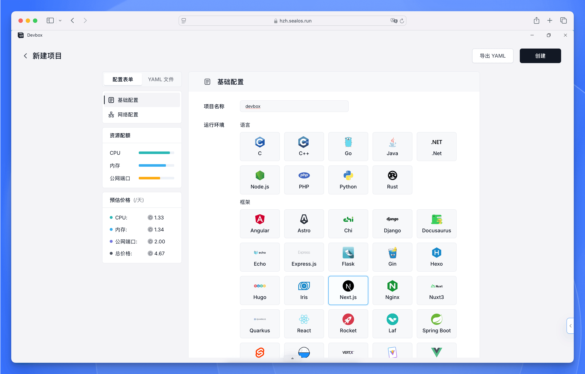
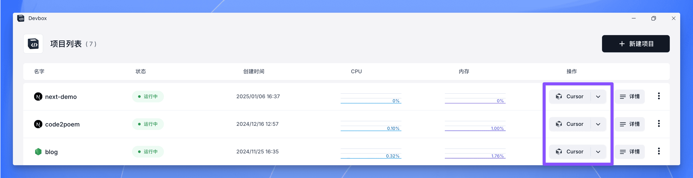
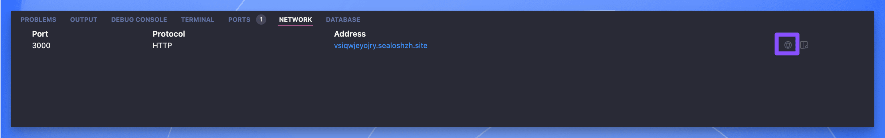
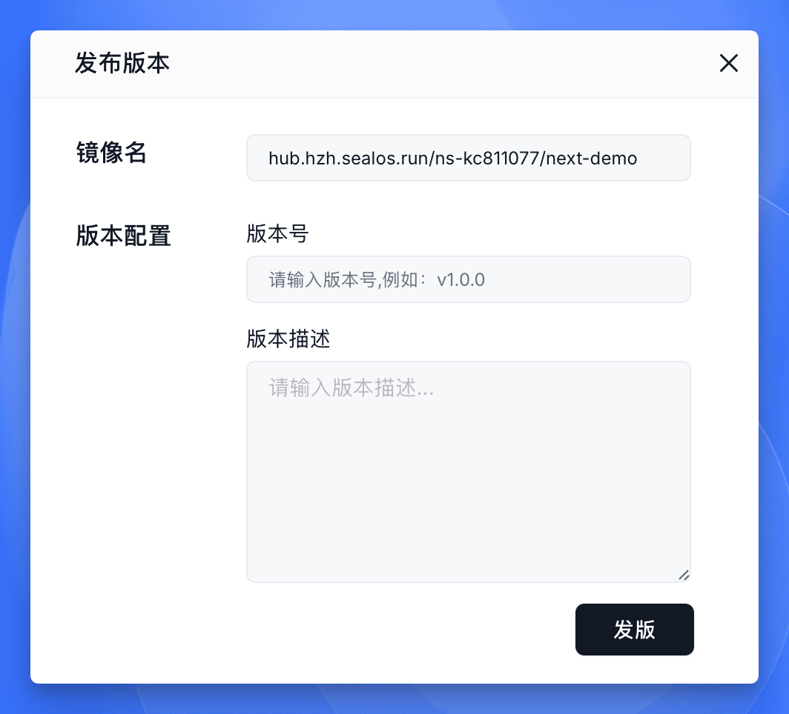
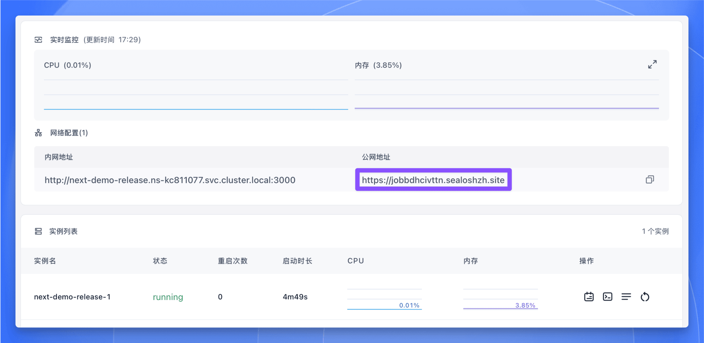

[Sealos DevBox](https://sealos.run/devbox) 是一个一站式云开发平台，集**本地开发、线上测试、打包上线**为一体。通过简单的点击操作，即可快速创建所需的环境和数据库依赖。开发者可以使用熟悉的本地 IDE 进行开发，同时享受简化的环境配置流程和自动化的应用部署体验。

**本指南将带你使用 Sealos DevBox 创建一个基础的 Next.js 示例项目。**

## 创建 DevBox 项目

<div className='steps [&_h4]:step'>

<h4>选择开发框架</h4>

访问 [Sealos Cloud](https://cloud.sealos.run)，点击 `DevBox` 图标，然后点击 "新建项目" 按钮。在 "运行环境" 配置中，选择 `Next.js` 作为开发框架，并通过滑块调整项目所需的 CPU 核心数和内存大小。



<h4>配置网络设置</h4>


- 滚动到配置页面的 "网络配置" 部分。

- 配置容器端口：
  - 输入 `3000` (Next.js 的默认开发端口)
  - 如需添加其他端口，可点击 "添加端口" 按钮

- 配置外部访问：
  - 开启公网访问开关，允许外部用户通过域名访问应用。

- 域名配置：
  - 系统会自动为应用分配一个子域名。
  - 如需使用自定义域名，可点击 "自定义域名" 并按提示设置。

注意：请确保容器端口 (3000) 与 Next.js 应用的运行端口一致。如果在 Next.js 配置中修改了端口，这里也需要相应更新。

<h4>创建项目</h4>

点击 "创建" 按钮完成项目创建。

</div>

## 连接开发环境

项目创建完成后，你可以在项目列表中看到新建的项目。每个项目的 "操作" 栏都提供了多个便捷选项。



<div className='steps [&_h4]:step'>

<h4>连接 Cursor IDE</h4>

- 在项目列表中找到你的项目。
- 在 "操作" 列中，点击 VSCode 图标旁的下拉箭头。
- 从下拉菜单中选择 `Cursor`。
- 点击出现的 `Cursor` 选项。

<h4>安装插件</h4>

- 选择 `Cursor` 后，系统会自动启动本地的 Cursor IDE。
- Cursor 会弹出提示窗口，引导你安装 DevBox 插件。
- 该插件能让你通过 SSH 安全地连接到 DevBox 开发环境。
- 按照提示完成插件安装，Cursor 将自动建立远程连接。

</div>

<Callout type="info">
你可以随时通过"操作"列的下拉菜单切换使用不同的开发工具（VSCode、Cursor 或 VSCode Insiders）。
</Callout>

## 开发调试

<div className='steps [&_h4]:step'>

<h4>访问项目文件</h4>


通过远程连接，你可以在 Cursor IDE 中开发 Next.js 应用，同时获得以下优势：
- 代码在 DevBox 环境中运行，确保开发和生产环境的一致性。
- 只需安装 Cursor，即可在任何设备上访问你的项目。
- 团队成员可以连接到同一个开发环境，实现便捷协作。

<h4>启动开发服务器</h4>

- 在 Cursor IDE 中打开终端。
- 确保当前位于项目目录下。
- 运行以下命令启动 Next.js 开发服务器：
 ```bash
 npm run dev
 ```
- 该命令会在开发模式下启动应用。

<h4>访问应用</h4>

- 切换到 Cursor 面板的 "Network" 标签页。
- 点击地址栏右侧的 🌐 按钮。
   
- 在弹窗中选择 "Open"，即可在浏览器中打开并测试运行中的应用。

  

</div>

## 发布应用

完成 Next.js 应用的开发和测试后，你可以将其打包为 [OCI (Open Container Initiative)](https://opencontainers.org/) 镜像。这样不仅可以为应用添加版本控制，还能为后续部署做好准备。

<div className='steps [&_h4]:step'>

<h4>构建应用</h4>

- 在 Cursor IDE 终端中，确保位于项目目录下。
- 运行构建命令：
```bash
npm run build
```
该命令会在 `.next` 目录下生成可用于生产环境的应用版本。

<h4>开始发布</h4>

- 打开 Sealos DevBox 项目列表。
- 找到你的项目并点击 "详情" 按钮。
- 在项目详情页面，找到 "版本历史" 区域。
- 点击右上角的 "发布版本" 按钮。

<h4>填写发布信息</h4>

在弹出的 "发布版本" 对话框中填写：
- 镜像名称：系统已预填入项目镜像名称。
- 版本号：输入版本号 (如：`v1.0`)。
- 版本描述：简要说明本次发布内容 (如："首次发布" 或 "修复登录功能")。



<h4>完成发布</h4>

- 检查填写的信息无误后，点击 "发版" 按钮。
- 系统会开始处理发布请求。
- 完成后，新版本将出现在 "版本历史" 列表中，显示版本号、状态、创建时间和描述。


</div>

至此，你已经成功将 Next.js 应用打包为 OCI 镜像。这个镜像可用于部署或与团队成员共享。每次发布都会创建当前代码的快照，方便你管理不同版本，必要时还可以快速回退。

<Callout type="info">
建议在项目有重要更新或达到里程碑时创建新版本。这样可以清晰记录应用开发历程，也能让部署和协作更加便捷。
</Callout>

## 部署应用

将应用打包为 OCI 镜像后，你可以通过 Sealos Cloud 部署到生产环境。具体步骤如下：

<div className='steps [&_h4]:step'>

<h4>进入部署流程</h4>

- 在项目详情页面的 "版本历史" 区域中。
- 找到要部署的版本。
- 点击 "操作" 栏中的 "上线" 按钮。
- 系统会自动跳转到 Sealos 的【应用管理】。

<h4>设置部署参数</h4>

在【应用管理】中，按照部署向导设置：
- 选择合适的运行环境。
- 设置 CPU、内存等资源限制。
- 配置必要的环境变量。
- 根据需要设置存储卷。


<h4>部署应用</h4>

- 点击右上角的 "部署应用" 按钮。
- 页面将跳转至应用详情页面。
- 当状态显示为 "running" 时，表示部署成功。
- 点击 "公网地址" 下的访问地址，即可在浏览器中打开已部署的应用。



</div>

完成以上步骤后，你的 Next.js 应用就已经成功部署到 Sealos Cloud 平台，可以通过公网访问了。

<Callout type="info">
需要更新应用时，你可以随时在 DevBox 中发布新版本，在弹出的窗口中，你可以选择更新已部署的应用，也可以选择创建新应用。


</Callout>

通过这套完整的工作流程，你可以在云环境中便捷地开发和调试 Next.js 应用，同时继续使用习惯的本地开发工具。借助外部访问地址，你可以轻松地向团队成员或客户展示项目进展。只要能连接互联网，他们就能随时访问你的应用。